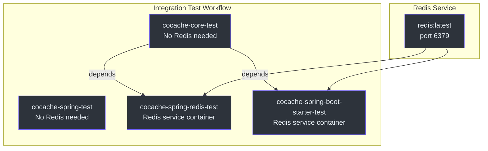
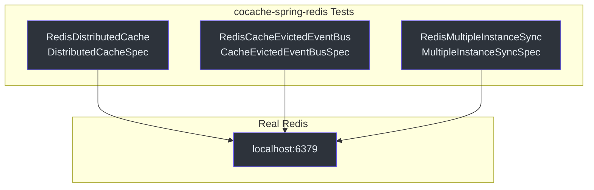
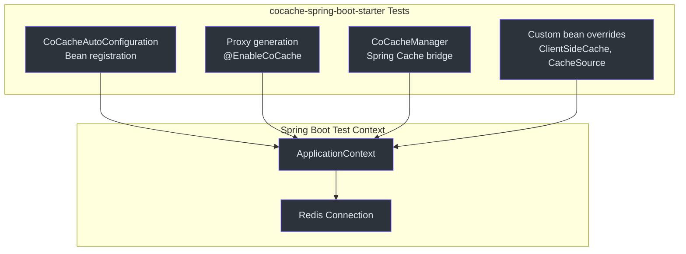
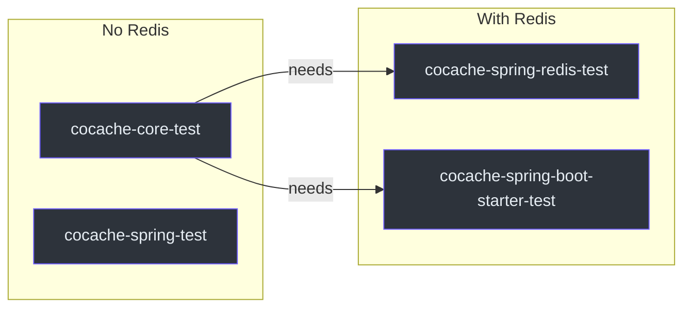

# Integration Testing

CoCache runs integration tests that verify the full stack against a real Redis instance. These tests validate distributed cache operations, pub/sub event propagation, and Spring Boot auto-configuration end-to-end.

## CI Pipeline Architecture

The integration tests run in GitHub Actions with separate jobs for unit and integration tests. Redis-dependent modules use a Redis service container.



## GitHub Actions Workflow

The integration test workflow is defined in `.github/workflows/integration-test.yml` and runs on every pull request.

### Job 1: cocache-core-test

Runs core unit tests without Redis:

```yaml
cocache-core-test:
  name: CoCache Core Test
  runs-on: ubuntu-latest
  steps:
    - uses: actions/checkout@master
    - uses: actions/setup-java@v5
      with:
        java-version: '17'
        distribution: 'temurin'
    - run: ./gradlew cocache-core:clean cocache-core:check
```

### Job 2: cocache-spring-test

Runs Spring integration tests without Redis:

```yaml
cocache-spring-test:
  name: CoCache Spring Test
  runs-on: ubuntu-latest
  steps:
    - uses: actions/checkout@master
    - uses: actions/setup-java@v5
      with:
        java-version: '17'
        distribution: 'temurin'
    - run: ./gradlew cocache-spring:clean cocache-spring:check
```

### Job 3: cocache-spring-redis-test

Runs Redis integration tests with a service container:

```yaml
cocache-spring-redis-test:
  name: CoCache Spring Redis Test
  needs: [cocache-core-test]
  runs-on: ubuntu-latest
  services:
    redis:
      image: redis
      options: >-
        --health-cmd "redis-cli ping"
        --health-interval 10s
        --health-timeout 5s
        --health-retries 5
      ports:
        - 6379:6379
  steps:
    - uses: actions/checkout@master
    - uses: actions/setup-java@v5
      with:
        java-version: '17'
        distribution: 'temurin'
    - run: ./gradlew cocache-spring-redis:clean cocache-spring-redis:check
```

### Job 4: cocache-spring-boot-starter-test

Runs Spring Boot auto-configuration integration tests:

```yaml
cocache-spring-boot-starter-test:
  name: CoCache Spring Boot Starter Test
  needs: [cocache-core-test]
  runs-on: ubuntu-latest
  services:
    redis:
      image: redis
      options: >-
        --health-cmd "redis-cli ping"
        --health-interval 10s
        --health-timeout 5s
        --health-retries 5
      ports:
        - 6379:6379
  steps:
    - uses: actions/checkout@master
    - uses: actions/setup-java@v5
      with:
        java-version: '17'
        distribution: 'temurin'
    - run: ./gradlew cocache-spring-boot-starter:clean cocache-spring-boot-starter:check
```

Source: [.github/workflows/integration-test.yml](https://github.com/Ahoo-Wang/CoCache/blob/main/.github/workflows/integration-test.yml)

## Redis Service Container

The Redis service container configuration includes health checks to ensure Redis is ready before tests run:

```mermaid
sequenceDiagram
autonumber
    autonumber
    participant GH as GitHub Actions
    participant Redis as Redis Container
    participant Health as Health Check
    participant Test as Gradle Test

    GH->>Redis: Start redis:latest image
    GH->>Redis: Expose port 6379
    loop Health check
        Health->>Redis: redis-cli ping
        Redis-->>Health: PONG
    end
    Note over Redis: Health check passes<br>(5 retries, 10s interval)
    GH->>Test: Run ./gradlew check
    Test->>Redis: Connect to localhost:6379
    Test->>Test: Execute integration tests

    style GH fill:#2d333b,stroke:#6d5dfc,color:#e6edf3
    style Redis fill:#2d333b,stroke:#6d5dfc,color:#e6edf3
    style Health fill:#2d333b,stroke:#6d5dfc,color:#e6edf3
    style Test fill:#2d333b,stroke:#6d5dfc,color:#e6edf3
```

Key health check parameters:

| Parameter | Value | Purpose |
|-----------|-------|---------|
| `--health-cmd` | `redis-cli ping` | Command to verify Redis is responsive |
| `--health-interval` | `10s` | Time between health check attempts |
| `--health-timeout` | `5s` | Maximum wait for a single health check |
| `--health-retries` | `5` | Number of failures before marking unhealthy |

## Integration Test Modules

### cocache-spring-redis

Tests the Redis distributed cache implementation, including:

- `RedisDistributedCache` operations (get, set, evict, TTL)
- `RedisCacheEvictedEventBus` pub/sub functionality
- Multi-instance synchronization via Redis pub/sub



### cocache-spring-boot-starter

Tests the auto-configuration end-to-end:

- `CoCacheAutoConfiguration` bean creation
- `@EnableCoCache` proxy generation
- Spring Cache integration via `CoCacheManager`
- Custom bean override behavior
- CosID integration (when available)



## Running Integration Tests Locally

### Prerequisites

A running Redis instance is required. The simplest approach:

```bash
# Using Docker
docker run -d --name cocache-redis -p 6379:6379 redis:latest

# Verify
redis-cli ping
# Expected: PONG
```

### Run Integration Tests

```bash
# Redis integration tests
./gradlew :cocache-spring-redis:check

# Spring Boot starter integration tests
./gradlew :cocache-spring-boot-starter:check

# All integration tests
./gradlew :cocache-spring-redis:check :cocache-spring-boot-starter:check
```

### Cleanup

```bash
docker stop cocache-redis && docker rm cocache-redis
```

## CI Job Dependency Graph



Note that `cocache-spring-test` runs independently (no Redis dependency and no downstream dependents). The `cocache-spring-redis-test` and `cocache-spring-boot-starter-test` both depend on `cocache-core-test` passing first.

## Example Application Integration

The `cocache-example` module demonstrates a complete Spring Boot application with CoCache:

```kotlin
@EnableCoCache(caches = [
    UserCache::class,
    UserExtendInfoCache::class,
    UserExtendInfoJoinCache::class
])
@EnableCaching
@SpringBootApplication
class AppServer
```

Source: [cocache-example/.../AppServer.kt](https://github.com/Ahoo-Wang/CoCache/blob/main/cocache-example/src/main/kotlin/me/ahoo/cache/example/AppServer.kt)

The example includes:

| Component | Description | Source |
|-----------|-------------|--------|
| `UserCache` | Basic cache with `@CoCache` + `@GuavaCache` | [UserCache.kt](https://github.com/Ahoo-Wang/CoCache/blob/main/cocache-example/src/main/kotlin/me/ahoo/cache/example/cache/UserCache.kt) |
| `UserExtendInfoCache` | Extended user info cache | [UserExtendInfoCache.kt](https://github.com/Ahoo-Wang/CoCache/blob/main/cocache-example/src/main/kotlin/me/ahoo/cache/example/cache/UserExtendInfoCache.kt) |
| `UserExtendInfoJoinCache` | JoinCache composing two caches | [UserExtendInfoJoinCache.kt](https://github.com/Ahoo-Wang/CoCache/blob/main/cocache-example/src/main/kotlin/me/ahoo/cache/example/cache/UserExtendInfoJoinCache.kt) |
| `TestController` | REST API using cache | [TestController.kt](https://github.com/Ahoo-Wang/CoCache/blob/main/cocache-example/src/main/kotlin/me/ahoo/cache/example/controller/TestController.kt) |
| `UserCacheConfiguration` | Custom ClientSideCache and CacheSource beans | [UserCacheConfiguration.kt](https://github.com/Ahoo-Wang/CoCache/blob/main/cocache-example/src/main/kotlin/me/ahoo/cache/example/config/UserCacheConfiguration.kt) |
| `ClassDefinedCacheConfiguration` | Programmatic CoherentCache creation | [ClassDefinedCacheConfiguration.kt](https://github.com/Ahoo-Wang/CoCache/blob/main/cocache-example/src/main/kotlin/me/ahoo/cache/example/config/ClassDefinedCacheConfiguration.kt) |

## Related Pages

- [Testing Overview](./index.md) -- TCK test specifications and architecture
- [Unit Testing](./unit-testing.md) -- Using TCK base classes for unit tests
- [Performance Patterns](./performance-patterns.md) -- Concurrency and cache protection patterns
- [Quick Start Guide](../guide/quick-start.md) -- Setting up a CoCache application
