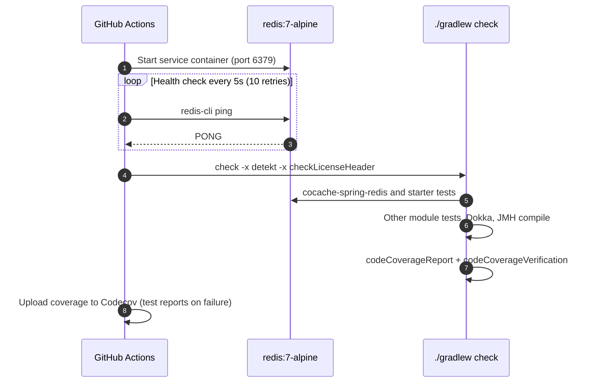
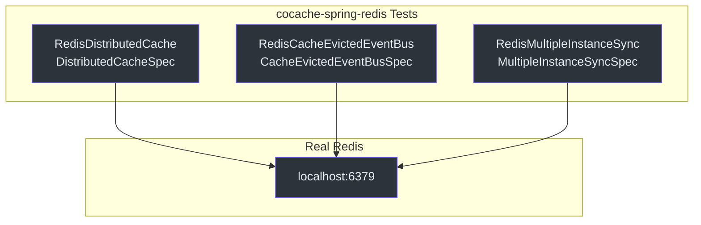
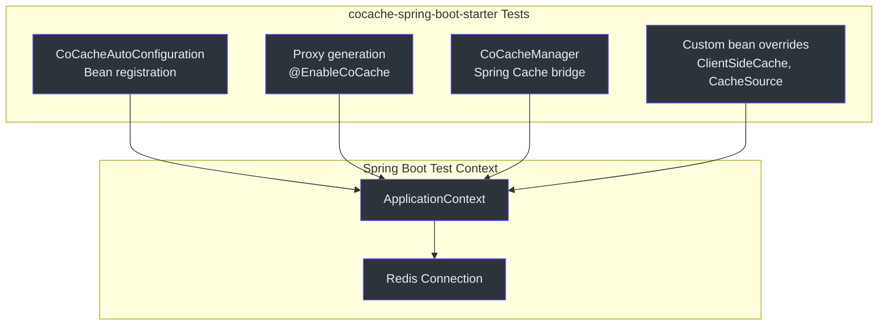

# Integration Testing

CoCache runs integration tests that verify the full stack against a real Redis instance. These tests validate distributed cache operations, pub/sub event propagation, and Spring Boot auto-configuration end-to-end.

## CI Pipeline

Integration tests run in the **Test & Coverage** job of [`ci.yml`](https://github.com/Ahoo-Wang/CoCache/blob/main/.github/workflows/ci.yml) on every pull request and every push to `main`. A single `./gradlew check` runs all modules against one Redis service container. Unit and integration tests then feed the same aggregated JaCoCo report and coverage gate, and nothing runs twice.


```mermaid
sequenceDiagram
autonumber
    participant GH as GitHub Actions
    participant Redis as redis:7-alpine
    participant Gradle as ./gradlew check

    GH->>Redis: Start service container (port 6379)
    loop Health check every 5s (10 retries)
        GH->>Redis: redis-cli ping
        Redis-->>GH: PONG
    end
    GH->>Gradle: check -x detekt -x checkLicenseHeader
    Gradle->>Redis: cocache-spring-redis and starter tests
    Gradle->>Gradle: Other module tests, Dokka, JMH compile
    Gradle->>Gradle: codeCoverageReport + codeCoverageVerification
    GH->>GH: Upload coverage to Codecov (test reports on failure)
```

```yaml
services:
  redis:
    image: redis:7-alpine
    options: >-
      --health-cmd "redis-cli ping"
      --health-interval 5s
      --health-timeout 5s
      --health-retries 10
    ports:
      - 6379:6379
```

Redis tests use `RedisTestSupport`, whose listener container runs on a `SyncTaskExecutor`, so subscription resets complete inside `register()` and tests stay deterministic.

## Integration Test Modules

### cocache-spring-redis

Tests the Redis distributed cache implementation, including:

- `RedisDistributedCache` operations (get, set, evict, TTL)
- `RedisCacheEvictedEventBus` pub/sub functionality
- Multi-instance synchronization via Redis pub/sub


```mermaid
graph TB
    subgraph sg_87 ["cocache-spring-redis Tests"]
        direction TB
        RedisDC["RedisDistributedCache<br>DistributedCacheSpec"]
        RedisEB["RedisCacheEvictedEventBus<br>CacheEvictedEventBusSpec"]
        RedisSync["RedisMultipleInstanceSync<br>MultipleInstanceSyncSpec"]
    end

    subgraph sg_88 ["Real Redis"]
        direction TB
        Redis["localhost:6379"]
    end

    RedisDC --> Redis
    RedisEB --> Redis
    RedisSync --> Redis

    style RedisDC fill:#2d333b,stroke:#6d5dfc,color:#e6edf3
    style RedisEB fill:#2d333b,stroke:#6d5dfc,color:#e6edf3
    style RedisSync fill:#2d333b,stroke:#6d5dfc,color:#e6edf3
    style Redis fill:#2d333b,stroke:#6d5dfc,color:#e6edf3
```

### cocache-spring-boot-starter

Tests the auto-configuration end-to-end:

- `CoCacheAutoConfiguration` bean creation
- `@EnableCoCache` proxy generation
- Spring Cache integration via `CoCacheManager`
- Custom bean override behavior
- CosID integration (when available)


```mermaid
graph TB
    subgraph sg_89 ["cocache-spring-boot-starter Tests"]
        direction TB
        AutoConf["CoCacheAutoConfiguration<br>Bean registration"]
        ProxyTest["Proxy generation<br>@EnableCoCache"]
        CacheMgr["CoCacheManager<br>Spring Cache bridge"]
        BeanOverride["Custom bean overrides<br>ClientSideCache, CacheSource"]
    end

    subgraph sg_90 ["Spring Boot Test Context"]
        direction TB
        Context["ApplicationContext"]
        Redis["Redis Connection"]
    end

    AutoConf --> Context
    ProxyTest --> Context
    CacheMgr --> Context
    BeanOverride --> Context
    Context --> Redis

    style AutoConf fill:#2d333b,stroke:#6d5dfc,color:#e6edf3
    style ProxyTest fill:#2d333b,stroke:#6d5dfc,color:#e6edf3
    style CacheMgr fill:#2d333b,stroke:#6d5dfc,color:#e6edf3
    style BeanOverride fill:#2d333b,stroke:#6d5dfc,color:#e6edf3
    style Context fill:#2d333b,stroke:#6d5dfc,color:#e6edf3
    style Redis fill:#2d333b,stroke:#6d5dfc,color:#e6edf3
```

## Running Integration Tests Locally

### Prerequisites

A running Redis instance is required. The simplest approach:

```bash
# Using Docker
docker run -d --name cocache-redis -p 6379:6379 redis:7-alpine

# Verify
redis-cli ping
# Expected: PONG
```

### Run Integration Tests

```bash
# Redis integration tests
./gradlew :cocache-spring-redis:check

# Spring Boot starter integration tests
./gradlew :cocache-spring-boot-starter:check

# All integration tests
./gradlew :cocache-spring-redis:check :cocache-spring-boot-starter:check
```

### Cleanup

```bash
docker stop cocache-redis && docker rm cocache-redis
```

## Example Application Integration

The `cocache-example` module demonstrates a complete Spring Boot application with CoCache:

```kotlin
@EnableCoCache(caches = [
    UserCache::class,
    UserExtendInfoCache::class,
    UserExtendInfoJoinCache::class
])
@EnableCaching
@SpringBootApplication
class AppServer
```

Source: [cocache-example/.../AppServer.kt](https://github.com/Ahoo-Wang/CoCache/blob/main/cocache-example/src/main/kotlin/me/ahoo/cache/example/AppServer.kt)

The example includes:

| Component | Description | Source |
|-----------|-------------|--------|
| `UserCache` | Basic cache with `@CoCache` + `@CaffeineCache` | [UserCache.kt](https://github.com/Ahoo-Wang/CoCache/blob/main/cocache-example/src/main/kotlin/me/ahoo/cache/example/cache/UserCache.kt) |
| `UserExtendInfoCache` | Extended user info cache | [UserExtendInfoCache.kt](https://github.com/Ahoo-Wang/CoCache/blob/main/cocache-example/src/main/kotlin/me/ahoo/cache/example/cache/UserExtendInfoCache.kt) |
| `UserExtendInfoJoinCache` | JoinCache composing two caches | [UserExtendInfoJoinCache.kt](https://github.com/Ahoo-Wang/CoCache/blob/main/cocache-example/src/main/kotlin/me/ahoo/cache/example/cache/UserExtendInfoJoinCache.kt) |
| `TestController` | REST API using cache | [TestController.kt](https://github.com/Ahoo-Wang/CoCache/blob/main/cocache-example/src/main/kotlin/me/ahoo/cache/example/controller/TestController.kt) |
| `UserCacheConfiguration` | Custom ClientSideCache and CacheSource beans | [UserCacheConfiguration.kt](https://github.com/Ahoo-Wang/CoCache/blob/main/cocache-example/src/main/kotlin/me/ahoo/cache/example/config/UserCacheConfiguration.kt) |
| `ClassDefinedCacheConfiguration` | Programmatic CoherentCache creation | [ClassDefinedCacheConfiguration.kt](https://github.com/Ahoo-Wang/CoCache/blob/main/cocache-example/src/main/kotlin/me/ahoo/cache/example/config/ClassDefinedCacheConfiguration.kt) |

## Related Pages

- [Testing Overview](./index.md) -- TCK test specifications and architecture
- [Unit Testing](./unit-testing.md) -- Using TCK base classes for unit tests
- [Performance Patterns](./performance-patterns.md) -- Concurrency and cache protection patterns
- [Quick Start Guide](../guide/quick-start.md) -- Setting up a CoCache application
