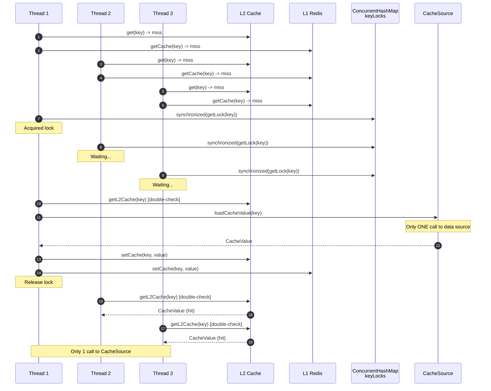
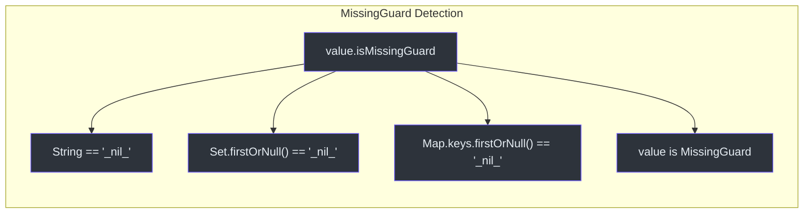
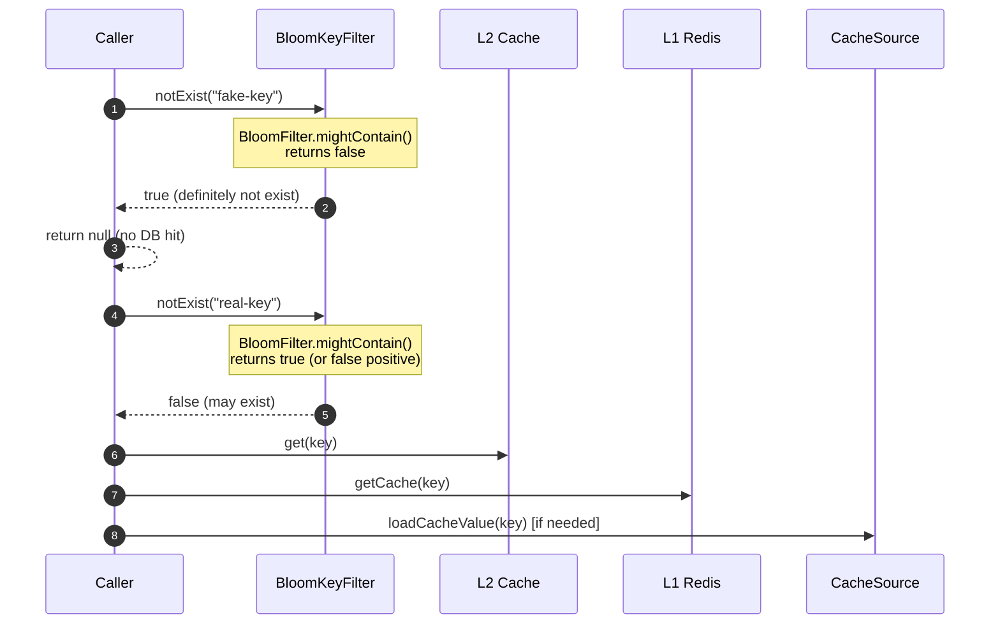
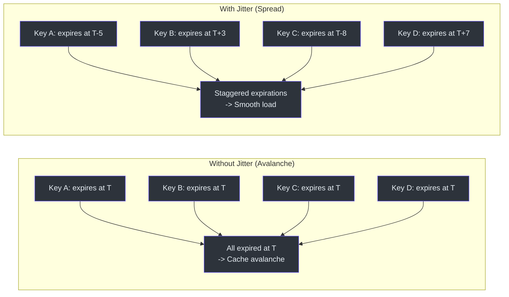
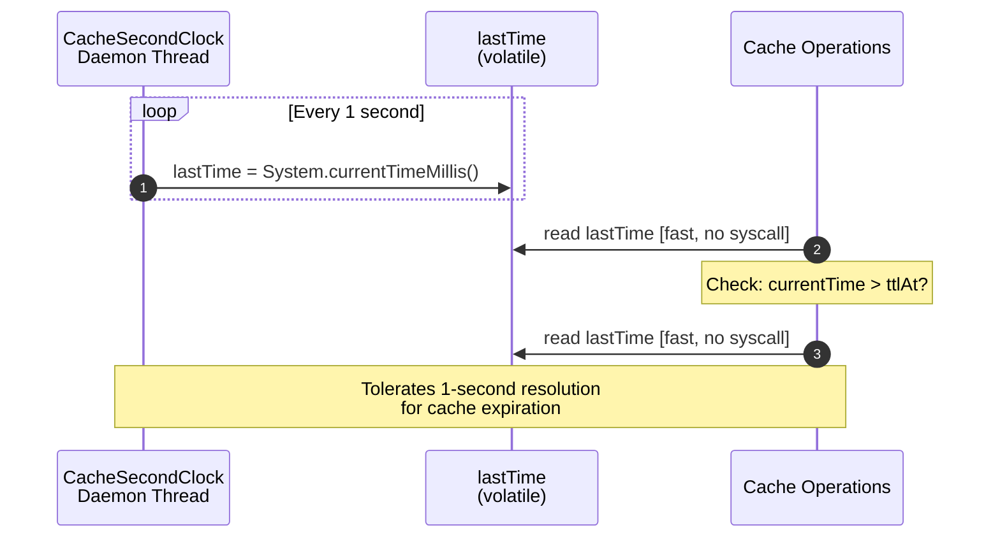
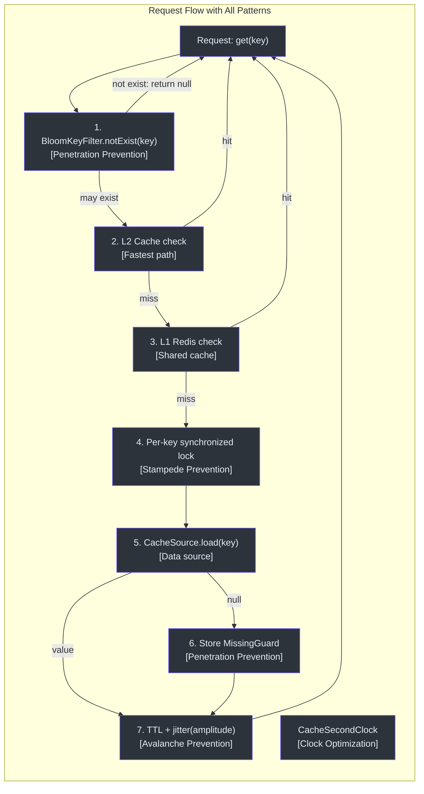

# Performance Patterns

CoCache implements several critical performance patterns to protect against common distributed caching pitfalls: cache stampede (thundering herd), cache penetration, cache avalanche, and excessive clock system calls.

## Cache Stampede Prevention (Per-Key Locking)

Cache stampede occurs when many concurrent requests hit a cache miss simultaneously, all causing expensive calls to the data source. CoCache prevents this with **fine-grained per-key synchronized locking**.

### How It Works

When a cache miss occurs and the key passes the `KeyFilter` check, CoCache acquires a lock on the specific cache key. Only the first thread to acquire the lock calls the data source; all other threads for the same key block and then read from the populated cache.



### Implementation

The per-key locking uses a `ConcurrentHashMap<String, Any>` where each key gets its own lock object:

```kotlin
private val keyLocks = ConcurrentHashMap<String, Any>()

private fun getLock(cacheKey: String): Any {
    return keyLocks.computeIfAbsent(cacheKey) {
        Any()
    }
}

private fun releaseLock(cacheKey: String) {
    keyLocks.remove(cacheKey)
}
```

Source: [DefaultCoherentCache.kt:47](https://github.com/Ahoo-Wang/CoCache/blob/main/cocache-core/src/main/kotlin/me/ahoo/cache/consistency/DefaultCoherentCache.kt#L47), [DefaultCoherentCache.kt:78-86](https://github.com/Ahoo-Wang/CoCache/blob/main/cocache-core/src/main/kotlin/me/ahoo/cache/consistency/DefaultCoherentCache.kt#L78-L86)

The `getCache` method performs a **double-check** pattern inside the synchronized block:

```kotlin
override fun getCache(key: K): CacheValue<V>? {
    val cacheKey = keyConverter.toStringKey(key)
    // First check (no lock)
    getL2Cache(cacheKey)?.let { return it }

    val lock = getLock(cacheKey)
    synchronized(lock) {
        try {
            // Second check (with lock) - another thread may have populated it
            getL2Cache(cacheKey)?.let { return it }

            // Only if still missing: call CacheSource
            cacheSource.loadCacheValue(key)?.let {
                setCache(cacheKey, it)
                cacheEvictedEventBus.publish(CacheEvictedEvent(cacheName, cacheKey, clientId))
                return it
            }

            // Cache the missing result (null guard)
            setCache(cacheKey, DefaultCacheValue.missingGuard(ttl, ttlAmplitude))
            return null
        } finally {
            releaseLock(cacheKey)
        }
    }
}
```

Source: [DefaultCoherentCache.kt:88-135](https://github.com/Ahoo-Wang/CoCache/blob/main/cocache-core/src/main/kotlin/me/ahoo/cache/consistency/DefaultCoherentCache.kt#L88-L135)

### Concurrency Verification

The TCK includes a parameterized concurrency test that proves the locking works:

| Thread Count | Expected CacheSource Calls | Result |
|-------------|---------------------------|--------|
| 10 | 1 | Pass |
| 100 | 1 | Pass |
| 1000 | 1 | Pass |

```kotlin
@ParameterizedTest
@ValueSource(ints = [10, 100, 1000])
fun `should prevent cache breakdown under high concurrency`(threadCount: Int) {
    // ... setup with CountDownLatch and AtomicInteger for callCount ...
    results.all { it == value }.assert().isTrue()
    callCount.get().assert().isOne() // Only 1 call to CacheSource
}
```

Source: [DefaultCoherentCacheSpec.kt:138-179](https://github.com/Ahoo-Wang/CoCache/blob/main/cocache-test/src/main/kotlin/me/ahoo/cache/test/DefaultCoherentCacheSpec.kt#L138-L179)

## Cache Penetration Prevention

Cache penetration occurs when requests for non-existent keys bypass the cache entirely, hitting the data source every time. CoCache addresses this at two levels.

### MissingGuard (Cache Null Values)

When the `CacheSource` returns `null` (key does not exist in the database), CoCache stores a **MissingGuard sentinel value** instead of leaving the cache empty:

```kotlin
// In DefaultCoherentCache.getCache():
setCache(cacheKey, DefaultCacheValue.missingGuard(ttl, ttlAmplitude))
return null
```

Source: [DefaultCoherentCache.kt:129](https://github.com/Ahoo-Wang/CoCache/blob/main/cocache-core/src/main/kotlin/me/ahoo/cache/consistency/DefaultCoherentCache.kt#L129)

The `MissingGuard` interface detects sentinel values across different types:



| Type | Sentinel Value | Detection | Source |
|------|---------------|-----------|--------|
| `String` | `"_nil_"` | Direct string comparison | [MissingGuard.kt:40-42](https://github.com/Ahoo-Wang/CoCache/blob/main/cocache-core/src/main/kotlin/me/ahoo/cache/MissingGuard.kt#L40-L42) |
| `Set<*>` | `{"_nil_"}` | First element check | [MissingGuard.kt:44-46](https://github.com/Ahoo-Wang/CoCache/blob/main/cocache-core/src/main/kotlin/me/ahoo/cache/MissingGuard.kt#L44-L46) |
| `Map<*, *>` | `{"_nil_": ...}` | First key check | [MissingGuard.kt:48-50](https://github.com/Ahoo-Wang/CoCache/blob/main/cocache-core/src/main/kotlin/me/ahoo/cache/MissingGuard.kt#L48-L50) |
| Object | implements `MissingGuard` | `is` check | [MissingGuard.kt:36](https://github.com/Ahoo-Wang/CoCache/blob/main/cocache-core/src/main/kotlin/me/ahoo/cache/MissingGuard.kt#L36) |

Source: [MissingGuard.kt](https://github.com/Ahoo-Wang/CoCache/blob/main/cocache-core/src/main/kotlin/me/ahoo/cache/MissingGuard.kt)

### BloomKeyFilter (Pre-filter Non-Existent Keys)

For high-traffic scenarios, a Bloom filter can be used as a pre-check before querying the distributed cache. If the key is not in the Bloom filter, it is guaranteed to not exist in the data source, so the expensive cache lookup is skipped entirely.



The `BloomKeyFilter` wraps a Guava `BloomFilter<String>`:

```kotlin
class BloomKeyFilter(
    private val bloomFilter: BloomFilter<String>
) : KeyFilter {
    override fun notExist(key: String): Boolean {
        return !bloomFilter.mightContain(key)
    }
}
```

Source: [BloomKeyFilter.kt](https://github.com/Ahoo-Wang/CoCache/blob/main/cocache-core/src/main/kotlin/me/ahoo/cache/filter/BloomKeyFilter.kt)

The `KeyFilter` is checked in `getL2Cache` before querying the distributed cache:

```kotlin
private fun getL2Cache(cacheKey: String): CacheValue<V>? {
    // L2 check
    clientSideCache.getCache(cacheKey)?.let {
        if (it.isExpired.not()) return it
        else clientSideCache.evict(cacheKey)
    }

    // KeyFilter check (Bloom filter)
    if (keyFilter.notExist(cacheKey)) {
        return DefaultCacheValue.missingGuard(ttl, ttlAmplitude)
    }

    // L1 check
    distributedCache.getCache(cacheKey)?.let {
        if (it.isExpired.not()) {
            clientSideCache.setCache(cacheKey, it)
            return it
        }
    }
    return null
}
```

Source: [DefaultCoherentCache.kt:49-76](https://github.com/Ahoo-Wang/CoCache/blob/main/cocache-core/src/main/kotlin/me/ahoo/cache/consistency/DefaultCoherentCache.kt#L49-L76)

## TTL Jitter (Cache Avalanche Prevention)

Cache avalanche occurs when a large number of cache entries expire at the same time, causing a sudden surge of requests to the data source. CoCache prevents this by adding **random jitter** to TTL values.

### Mechanism

```kotlin
fun jitter(ttl: Long, amplitude: Long): Long {
    if (amplitude == 0L) return ttl
    val low = ttl - amplitude
    val high = ttl + amplitude
    return (low..high).random()
}

fun at(ttl: Long, amplitude: Long = 0): Long {
    val jitteredTtl = jitter(ttl, amplitude)
    return CacheSecondClock.INSTANCE.currentTime() + jitteredTtl
}
```

Source: [ComputedTtlAt.kt:49-61](https://github.com/Ahoo-Wang/CoCache/blob/main/cocache-core/src/main/kotlin/me/ahoo/cache/ComputedTtlAt.kt#L49-L61)

### Effect Visualization



### Configuration

TTL and amplitude are configured via the `@CoCache` annotation:

| Parameter | Effect | Example |
|-----------|--------|---------|
| `ttl = 120` | Base TTL of 120 seconds | Entry expires around 120s |
| `ttlAmplitude = 10` | Jitter of +/- 10 seconds | Actual TTL: 110-130s (random) |
| `ttlAmplitude = 0` | No jitter | All entries expire at exactly 120s |

Source: [CoCache.kt:35-36](https://github.com/Ahoo-Wang/CoCache/blob/main/cocache-api/src/main/kotlin/me/ahoo/cache/api/annotation/CoCache.kt#L35-L36)

## CacheSecondClock Optimization

Every cache value needs to check whether it has expired by comparing `ttlAt` against the current time. A naive implementation calls `System.currentTimeMillis()` on every check, which is a system call that can be expensive under high throughput.

CoCache solves this with `CacheSecondClock`, a daemon thread that updates a volatile `lastTime` field once per second. All cache expiration checks read the volatile field instead of calling the system clock.



### Implementation

```kotlin
enum class CacheSecondClock(private val actual: SecondClock) : SecondClock, Runnable {
    INSTANCE(SystemSecondClock);

    private val secondTimer: Thread
    @Volatile
    private var lastTime: Long = actual.currentTime()

    init {
        secondTimer = startTimer()
    }

    private fun startTimer(): Thread {
        val timer = Thread(this)
        timer.name = "CacheSecondClock"
        timer.isDaemon = true
        timer.start()
        return timer
    }

    override fun currentTime(): Long {
        return lastTime  // No system call, just volatile read
    }

    override fun run() {
        while (!secondTimer.isInterrupted) {
            lastTime = actual.currentTime()  // System call, once per second
            LockSupport.parkNanos(this, ONE_SECOND_PERIOD)
        }
    }

    companion object {
        val ONE_SECOND_PERIOD = Duration.ofSeconds(1).toNanos()
    }
}
```

Source: [CacheSecondClock.kt](https://github.com/Ahoo-Wang/CoCache/blob/main/cocache-core/src/main/kotlin/me/ahoo/cache/util/CacheSecondClock.kt)

### Used in ComputedTtlAt

The `isExpired` check in `ComputedTtlAt` uses `CacheSecondClock` instead of `System.currentTimeMillis()`:

```kotlin
override val isExpired: Boolean
    get() = if (isForever) {
        false
    } else {
        CacheSecondClock.INSTANCE.currentTime() > ttlAt
    }
```

Source: [ComputedTtlAt.kt:24-29](https://github.com/Ahoo-Wang/CoCache/blob/main/cocache-core/src/main/kotlin/me/ahoo/cache/ComputedTtlAt.kt#L24-L29)

## Performance Pattern Summary



| Pattern | Problem Solved | Mechanism | Source |
|---------|---------------|-----------|--------|
| Per-key locking | Cache stampede (thundering herd) | `ConcurrentHashMap<String, Any>` + `synchronized(lock)` with double-check | [DefaultCoherentCache.kt:78-135](https://github.com/Ahoo-Wang/CoCache/blob/main/cocache-core/src/main/kotlin/me/ahoo/cache/consistency/DefaultCoherentCache.kt#L78-L135) |
| MissingGuard | Cache penetration (non-existent keys) | Cache `"_nil_"` sentinel with TTL | [MissingGuard.kt](https://github.com/Ahoo-Wang/CoCache/blob/main/cocache-core/src/main/kotlin/me/ahoo/cache/MissingGuard.kt) |
| BloomKeyFilter | Cache penetration (high-traffic) | Pre-filter with Bloom filter before distributed cache query | [BloomKeyFilter.kt](https://github.com/Ahoo-Wang/CoCache/blob/main/cocache-core/src/main/kotlin/me/ahoo/cache/filter/BloomKeyFilter.kt) |
| TTL jitter | Cache avalanche (mass expiry) | `ttl +/- random(ttlAmplitude)` | [ComputedTtlAt.kt:49-56](https://github.com/Ahoo-Wang/CoCache/blob/main/cocache-core/src/main/kotlin/me/ahoo/cache/ComputedTtlAt.kt#L49-L56) |
| CacheSecondClock | System call overhead | Daemon thread + volatile field, 1s resolution | [CacheSecondClock.kt](https://github.com/Ahoo-Wang/CoCache/blob/main/cocache-core/src/main/kotlin/me/ahoo/cache/util/CacheSecondClock.kt) |

## Related Pages

- [Testing Overview](./index.md) -- TCK specs that verify these patterns
- [Unit Testing](./unit-testing.md) -- Concurrency test details
- [Configuration Reference](../guide/configuration.md) -- TTL and amplitude configuration
- [Introduction](../guide/index.md) -- Architecture overview
