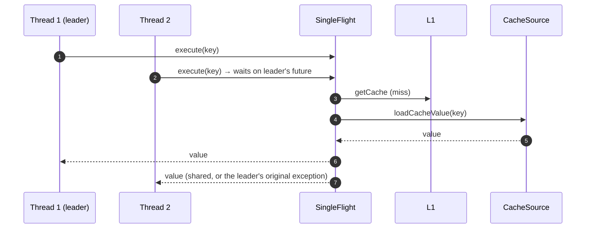
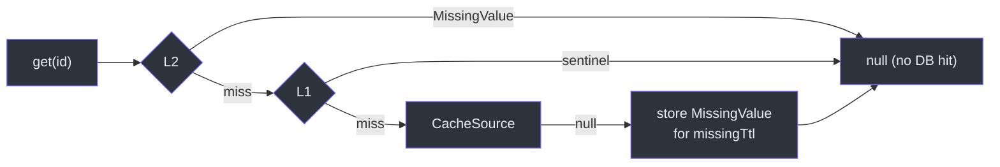

# Performance Patterns

## Cache Stampede Prevention -- SingleFlight

When many threads miss the same key at once, only one of them, the **leader**, reads L1 and loads the source. The others wait for the leader and share its result.


```mermaid
sequenceDiagram
autonumber
    participant T1 as Thread 1 (leader)
    participant T2 as Thread 2
    participant SF as SingleFlight
    participant L1 as L1
    participant L0 as CacheSource

    T1->>SF: execute(key)
    T2->>SF: execute(key) → waits on leader's future
    SF->>L1: getCache (miss)
    SF->>L0: loadCacheValue(key)
    L0-->>SF: value
    SF-->>T1: value
    SF-->>T2: value (shared, or the leader's original exception)
```

| Property | Detail |
|----------|--------|
| Granularity | Exact key; unrelated keys never block each other (unlike striped locks) |
| Failure | Followers receive the leader's **original** exception |
| Reentrancy | Re-entering the same key from the same thread fails fast instead of deadlocking |
| Scope | Per instance; across instances, L1 absorbs duplicate loads |

Verified by `DefaultCoherentCacheSpec."concurrent misses load the source once"` (10 and 100 threads) and `SingleFlightTest`.

## Cache Penetration Prevention

### Negative Cache

When `CacheSource` returns `null`, CoCache stores `MissingValue(now + missingTtl)` in L1 and L2. Later lookups return "not found" without touching the database until `missingTtl` (default 60 s) elapses or the key is evicted.


```mermaid
flowchart LR
    Q["get(id)"] --> L2{"L2"}
    L2 -->|"MissingValue"| N["null (no DB hit)"]
    L2 -->|miss| L1{"L1"}
    L1 -->|"sentinel"| N
    L1 -->|miss| DB["CacheSource"]
    DB -->|null| W["store MissingValue<br>for missingTtl"] --> N

    style Q fill:#2d333b,stroke:#6d5dfc,color:#e6edf3
    style L2 fill:#2d333b,stroke:#6d5dfc,color:#e6edf3
    style N fill:#2d333b,stroke:#6d5dfc,color:#e6edf3
    style L1 fill:#2d333b,stroke:#6d5dfc,color:#e6edf3
    style DB fill:#2d333b,stroke:#6d5dfc,color:#e6edf3
    style W fill:#2d333b,stroke:#6d5dfc,color:#e6edf3
```

`missingTtl` is independent of `ttl`. It stays short because it also bounds how long a newly created row remains invisible.

### BloomKeyFilter

For key spaces with heavy probing, add a `KeyFilter`. Keys the filter rejects return a `MissingValue` immediately, without L1, source access, or a write:

```kotlin
val bloom = BloomFilter.create(Funnels.stringFunnel(UTF_8), 1_000_000, 0.01).apply { /* put known keys */ }
CoherentCacheConfiguration(..., keyFilter = BloomKeyFilter(bloom))
```

## Cache Avalanche Prevention -- TTL Jitter

```
actualTtl = random(ttl - ttlAmplitude .. ttl + ttlAmplitude), clamped to > 0
```

Defaults: `ttl = 3600`, `ttlAmplitude = 60`. Entries written together expire spread over a 2-minute window instead of at the same second.

## Cheap Hit Path

| Tier | Cost | Why |
|------|------|-----|
| L2 hit | One Caffeine lookup + an `isExpired` check | Bounded Caffeine without per-entry `Expiry` (which writes metadata on every read and stops a hot key from scaling); `isExpired` reads the cached `CacheClock` |
| L1 hit | One Redis round trip | An atomic Lua script returns TTL + value on the shared connection (a Lettuce pipeline would need a dedicated connection) |
| Key conversion | Compiled SpEL | `ExpKeyConverter` uses `SpelCompilerMode.MIXED` |
| Proxy dispatch | Reflection on the delegate | No per-call allocation beyond the argument array |
| Successful load | No broadcast | When L1 is empty, peers hold no valid copy, so no event is needed |

Time is read from `CacheClock`, a volatile epoch second refreshed every 100 ms. `System.currentTimeMillis()` did not scale across threads in our JMH runs on macOS.

### Benchmark

`RedisCacheBenchmark` (`cocache-spring-redis/src/jmh`) measures `l2Hit`, `l1Read`, `missLoad` and `set` against Redis at `localhost:6379`. `check` compiles it but never runs it:

```bash
./gradlew :cocache-spring-redis:jmh                                  # all, 1 thread
./gradlew :cocache-spring-redis:jmh -PjmhThreads=8 -PjmhIncludes=l2Hit
```

Results go to `cocache-spring-redis/build/results/jmh/results.json`. Compare against the previous version on the same machine and in the same session. Absolute L1 numbers depend heavily on the Redis setup.

## Pattern Summary

| Problem | Pattern | Config |
|---------|---------|--------|
| Stampede | `SingleFlight` per key | -- |
| Penetration | `MissingValue` + optional `BloomKeyFilter` | `missingTtl`, `keyFilter` |
| Avalanche | TTL jitter | `ttlAmplitude` |
| Unbounded memory | Bounded L2 | `@CaffeineCache(maximumSize)` |
| Stale copies | Finite TTL, stamp-guarded write-backs, reset on resubscribe | `ttl` |

## Related Pages

- [Testing Overview](./index.md)
- [Cache Layers](../architecture/cache-layers.md)
- [Configuration](../guide/configuration.md)
