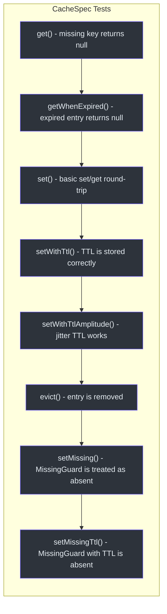
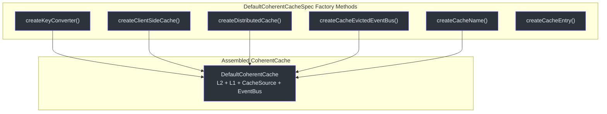
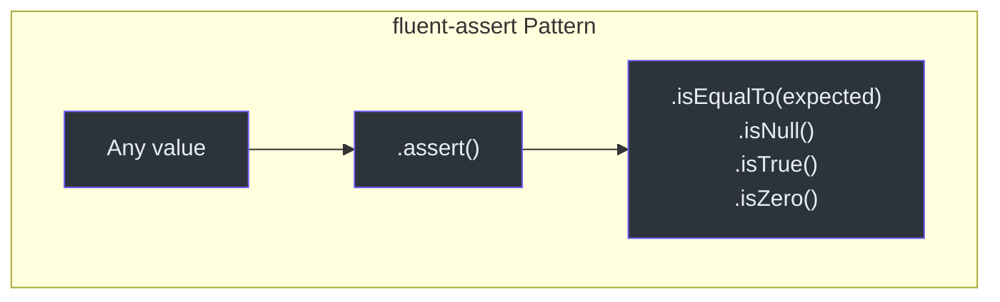
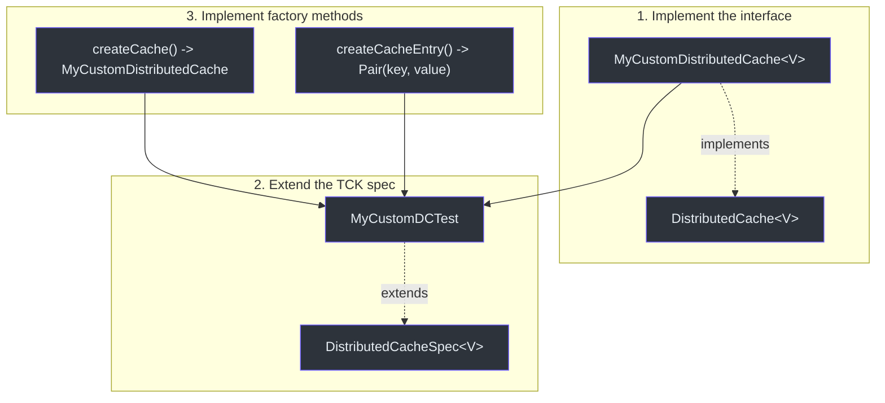

# Unit Testing Guide

CoCache provides abstract test specification classes (TCK) that validate cache behavior. This guide shows how to use them to test custom cache implementations.

## Setting Up Test Dependencies

Add the `cocache-test` module as a test dependency:

```kotlin
// build.gradle.kts
dependencies {
    testImplementation("me.ahoo.cocache:cocache-test:4.0.2")
    testImplementation("me.ahoo.test:fluent-assert-core")
    testImplementation("io.mockk:mockk")
}
```

## Using CacheSpec (Base Cache Tests)

To test any `Cache<K, V>` implementation, extend `CacheSpec` and implement two factory methods:

```kotlin
class MyCacheTest : CacheSpec<String, String>() {
    override fun createCache(): Cache<String, String> {
        return MyCustomCache()
    }

    override fun createCacheEntry(): Pair<String, String> {
        return "test-key" to "test-value"
    }
}
```

This automatically runs 8 tests covering get, set, evict, TTL, and missing guard behavior.



Source: [cocache-test/.../CacheSpec.kt](https://github.com/Ahoo-Wang/CoCache/blob/main/cocache-test/src/main/kotlin/me/ahoo/cache/test/CacheSpec.kt)

## Testing ClientSideCache (L2)

Extend `ClientSideCacheSpec<V>` for local cache implementations. It adds a `clear()` test on top of `CacheSpec`:

```kotlin
class MapClientSideCacheTest : ClientSideCacheSpec<String>() {
    override fun createCache(): ClientSideCache<String> {
        return MapClientSideCache()
    }

    override fun createCacheEntry(): Pair<String, String> {
        return "key-${UUID.randomUUID()}" to "value-${UUID.randomUUID()}"
    }
}
```

Source: [cocache-test/.../ClientSideCacheSpec.kt](https://github.com/Ahoo-Wang/CoCache/blob/main/cocache-test/src/main/kotlin/me/ahoo/cache/test/ClientSideCacheSpec.kt)

## Testing DistributedCache (L1)

Extend `DistributedCacheSpec<V>` for distributed cache implementations:

```kotlin
class MockDistributedCacheTest : DistributedCacheSpec<String>() {
    override fun createCache(): DistributedCache<String> {
        return MockDistributedCache()
    }

    override fun createCacheEntry(): Pair<String, String> {
        return "dist-key-${UUID.randomUUID()}" to "dist-value-${UUID.randomUUID()}"
    }
}
```

Source: [cocache-test/.../DistributedCacheSpec.kt](https://github.com/Ahoo-Wang/CoCache/blob/main/cocache-test/src/main/kotlin/me/ahoo/cache/test/DistributedCacheSpec.kt)

## Testing DefaultCoherentCache

Extend `DefaultCoherentCacheSpec<K, V>` for the full coherent cache. This spec requires implementing factory methods for all dependencies:

```kotlin
class DefaultCoherentCacheTest : DefaultCoherentCacheSpec<String, String>() {
    override fun createKeyConverter(): KeyConverter<String> {
        return ToStringKeyConverter("test:")
    }

    override fun createClientSideCache(): ClientSideCache<String> {
        return MapClientSideCache()
    }

    override fun createDistributedCache(): DistributedCache<String> {
        return MockDistributedCache()
    }

    override fun createCacheEvictedEventBus(): CacheEvictedEventBus {
        return GuavaCacheEvictedEventBus()
    }

    override fun createCacheName(): String = "test-cache"

    override fun createCacheEntry(): Pair<String, String> {
        return "coherent-key" to "coherent-value"
    }
}
```



Source: [cocache-test/.../DefaultCoherentCacheSpec.kt](https://github.com/Ahoo-Wang/CoCache/blob/main/cocache-test/src/main/kotlin/me/ahoo/cache/test/DefaultCoherentCacheSpec.kt)

## Testing CacheEvictedEventBus

Extend `CacheEvictedEventBusSpec` for event bus implementations:

```kotlin
class GuavaCacheEvictedEventBusTest : CacheEvictedEventBusSpec() {
    override fun createCacheEvictedEventBus(): CacheEvictedEventBus {
        return GuavaCacheEvictedEventBus()
    }
}
```

Source: [cocache-test/.../consistency/CacheEvictedEventBusSpec.kt](https://github.com/Ahoo-Wang/CoCache/blob/main/cocache-test/src/main/kotlin/me/ahoo/cache/test/consistency/CacheEvictedEventBusSpec.kt)

## Testing Multi-Instance Synchronization

Extend `MultipleInstanceSyncSpec<K, V>` to verify that two cache instances stay coherent through the event bus:

```kotlin
class MultipleInstanceSyncTest : MultipleInstanceSyncSpec<String, String>() {
    override fun createKeyConverter(): KeyConverter<String> {
        return ToStringKeyConverter("sync:")
    }

    override fun createClientSideCache(): ClientSideCache<String> {
        return MapClientSideCache()
    }

    override fun createDistributedCache(): DistributedCache<String> {
        return MockDistributedCache()
    }

    override fun createCacheEvictedEventBus(): CacheEvictedEventBus {
        return GuavaCacheEvictedEventBus()
    }

    override fun createCacheName(): String = "sync-cache"

    override fun createCacheEntry(): Pair<String, String> {
        return "sync-key" to "sync-value"
    }
}
```

```mermaid
sequenceDiagram
autonumber
    autonumber
    participant Current as Current Instance
    participant EB as Event Bus
    participant Other as Other Instance

    Current->>Current: set(key, value)
    Current->>Current: L2[key] = value
    Current->>EB: publish(CacheEvictedEvent)
    EB->>Other: onEvicted(event)
    Other->>Other: L2.evict(key) [invalidate local]
    Note over Other: Next get() fetches from L1

    Current->>Current: set(key, newValue)
    Current->>EB: publish(CacheEvictedEvent)
    EB->>Other: onEvicted(event)
    Other->>Other: L2.evict(key)

    Current->>Current: evict(key)
    Current->>EB: publish(CacheEvictedEvent)
    EB->>Other: onEvicted(event)
    Other->>Other: L2.evict(key)
    Note over Other: L1 also evicted, so get() returns null

    style Current fill:#2d333b,stroke:#6d5dfc,color:#e6edf3
    style EB fill:#2d333b,stroke:#6d5dfc,color:#e6edf3
    style Other fill:#2d333b,stroke:#6d5dfc,color:#e6edf3
```

Source: [cocache-test/.../MultipleInstanceSyncSpec.kt](https://github.com/Ahoo-Wang/CoCache/blob/main/cocache-test/src/main/kotlin/me/ahoo/cache/test/MultipleInstanceSyncSpec.kt)

## Fluent Assert Pattern

CoCache uses the `fluent-assert` library for idiomatic Kotlin assertions. The pattern is:

```kotlin
import me.ahoo.test.asserts.assert

// Instead of AssertJ's assertThat(value).isEqualTo(expected):
value.assert().isEqualTo(expected)

// Null checks:
value.assert().isNull()
value.assert().isNotNull()

// Boolean:
result.assert().isTrue()

// Numeric:
count.assert().isZero()
count.assert().isOne()
```

**Important**: Always use `import me.ahoo.test.asserts.assert` -- never use AssertJ's `assertThat()`.



## Using mockk

For tests that need to mock dependencies:

```kotlin
import io.mockk.every
import io.mockk.mockk
import io.mockk.verify

// Create a mock CacheSource
val cacheSource = mockk<CacheSource<String, String>>()
every { cacheSource.loadCacheValue("key") } returns DefaultCacheValue.forever("value")

// Verify it was called
verify { cacheSource.loadCacheValue("key") }
```

## Writing a Custom Cache Implementation with TCK

When creating a new cache implementation (e.g., for a different distributed store), follow this pattern:



## Test Run Commands

```bash
# Run all tests for cocache-core
./gradlew :cocache-core:test

# Run a specific test class
./gradlew :cocache-core:test --tests "me.ahoo.cache.proxy.ProxyCacheTest"

# Run all TCK tests for a specific module
./gradlew :cocache-spring-redis:test
```

## Specification Matrix

| Spec | Tests | For | Requires |
|------|-------|-----|----------|
| `CacheSpec<K, V>` | 8 | Any `Cache` implementation | Nothing external |
| `ClientSideCacheSpec<V>` | 9 (8 + clear) | Any `ClientSideCache` | Nothing external |
| `DistributedCacheSpec<V>` | 8 | Any `DistributedCache` | Nothing external |
| `DefaultCoherentCacheSpec<K, V>` | 12+ (8 + coherence + concurrency) | Full coherent cache | All sub-components |
| `MultipleInstanceSyncSpec<K, V>` | 1 (comprehensive) | Multi-instance sync | EventBus + DistributedCache |
| `CacheEvictedEventBusSpec` | 2 | Event bus | Nothing external |

## Related Pages

- [Testing Overview](./index.md) -- TCK architecture and specification details
- [Integration Testing](./integration-testing.md) -- Redis-based integration tests in CI
- [Performance Patterns](./performance-patterns.md) -- Concurrency test details
- [Configuration Reference](../guide/configuration.md) -- Annotation parameters
