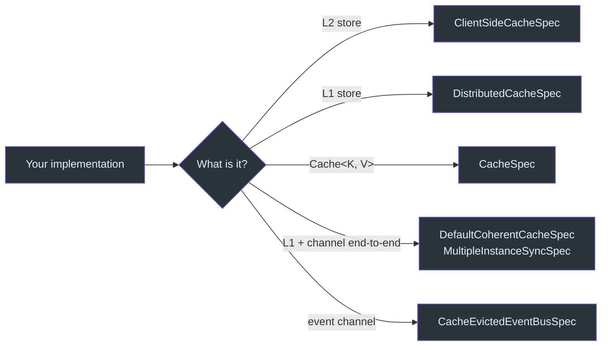
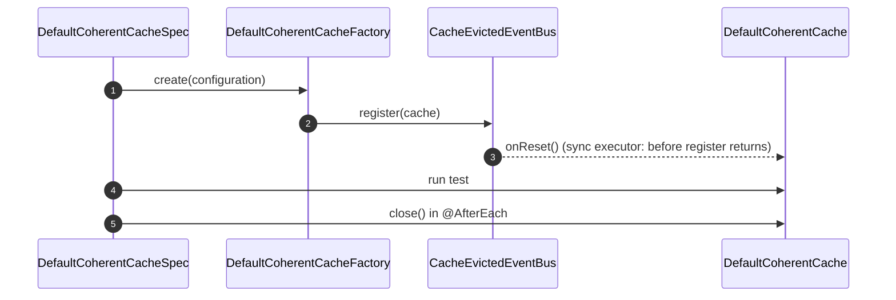

# Unit Testing Guide

## Setting Up Test Dependencies

```kotlin
dependencies {
    testImplementation("me.ahoo.cocache:cocache-test:5.0.1")
}
```

`cocache-test` brings JUnit 5, fluent-assert, and `cocache-core`. Every spec is an abstract JUnit class: extend it and implement its factory methods.


```mermaid
flowchart LR
    Impl["Your implementation"] --> Pick{"What is it?"}
    Pick -->|"L2 store"| CSC["ClientSideCacheSpec"]
    Pick -->|"L1 store"| DC["DistributedCacheSpec"]
    Pick -->|"Cache&lt;K, V&gt;"| C["CacheSpec"]
    Pick -->|"L1 + channel end-to-end"| CO["DefaultCoherentCacheSpec<br>MultipleInstanceSyncSpec"]
    Pick -->|"event channel"| EB["CacheEvictedEventBusSpec"]

    style Impl fill:#2d333b,stroke:#6d5dfc,color:#e6edf3
    style Pick fill:#2d333b,stroke:#6d5dfc,color:#e6edf3
    style CSC fill:#2d333b,stroke:#6d5dfc,color:#e6edf3
    style DC fill:#2d333b,stroke:#6d5dfc,color:#e6edf3
    style C fill:#2d333b,stroke:#6d5dfc,color:#e6edf3
    style CO fill:#2d333b,stroke:#6d5dfc,color:#e6edf3
    style EB fill:#2d333b,stroke:#6d5dfc,color:#e6edf3
```

## Testing a Store (L2 / L1)

```kotlin
internal class CaffeineClientSideCacheTest : ClientSideCacheSpec<String>() {
    override fun createCacheStore(): ClientSideCache<String> = CaffeineClientSideCache.build()
    override fun createCacheEntry(): Pair<String, String> =
        UUID.randomUUID().toString() to UUID.randomUUID().toString()
}
```

For stores that rebuild `ttlAt` from a server-side expiry (Redis), override the `open` tests `setWithTtlAt` / `setMissingWithTtlAt` to allow ±1 s drift:

```kotlin
@Test
override fun setWithTtlAt() {
    val (key, value) = createCacheEntry()
    val cacheValue = CacheValue.of(value, TtlAt.at(10))
    cacheStore.setCache(key, cacheValue)
    requireNotNull(cacheStore.getCache(key)).ttlAt.assert().isCloseTo(cacheValue.ttlAt, Offset.offset(1))
}
```

## Testing a Cache

```kotlin
class ProxyCacheTest : CacheSpec<String, String>() {
    override fun createCache(): Cache<String, String> = createProxyCache<MockCache>()
    override fun createCacheEntry() = UUID.randomUUID().toString() to UUID.randomUUID().toString()
}
```

## Testing Coherence

`DefaultCoherentCacheSpec` builds a `DefaultCoherentCache` from your components. Its default `CacheSource` is driven by the protected `loader` and counts calls in `sourceCalls`.

```kotlin
internal class RedisDefaultCoherentCacheTest : DefaultCoherentCacheSpec<String, String>() {
    private lateinit var redis: RedisTestSupport

    @BeforeEach
    override fun setup() { redis = RedisTestSupport(); super.setup() }

    @AfterEach
    override fun tearDown() { super.tearDown(); redis.close() }

    override fun createKeyConverter(): KeyConverter<String> = ToStringKeyConverter("coherent-test:")
    override fun createClientSideCache(): ClientSideCache<String> = MapClientSideCache()
    override fun createDistributedCache(): DistributedCache<String> =
        RedisDistributedCache(redis.redisTemplate, StringToStringCodecExecutor(redis.redisTemplate))
    override fun createCacheEvictedEventBus(): CacheEvictedEventBus = redis.newEventBus()
    override fun createCacheName(): String = "RedisDefaultCoherentCacheTest-" + UUID.randomUUID()
    override fun createCacheEntry() = UUID.randomUUID().toString() to UUID.randomUUID().toString()
}
```

> An override of a JUnit lifecycle method must repeat `@BeforeEach` / `@AfterEach`. Without the annotation, JUnit does not run the override.

Asynchronous channels deliver their (re)subscription `onReset` asynchronously, and a late reset clears L2 mid-test. With Spring Data Redis, give the `RedisMessageListenerContainer` a `SyncTaskExecutor` in tests; `register()` then returns only after the reset ran.


```mermaid
sequenceDiagram
autonumber
    participant Spec as DefaultCoherentCacheSpec
    participant F as DefaultCoherentCacheFactory
    participant Bus as CacheEvictedEventBus
    participant C as DefaultCoherentCache

    Spec->>F: create(configuration)
    F->>Bus: register(cache)
    Bus-->>C: onReset() (sync executor: before register returns)
    Spec->>C: run test
    Spec->>C: close() in @AfterEach
```

## Testing an Event Channel

```kotlin
class LocalCacheEvictedEventBusTest : CacheEvictedEventBusSpec() {
    override fun createCacheEvictedEventBus(): CacheEvictedEventBus = LocalCacheEvictedEventBus()
}
```

## Fluent Assert and mockk

```kotlin
import me.ahoo.test.asserts.assert

cache[key].assert().isEqualTo(value)
requireNotNull(cache.getCache(key)).isMissing.assert().isTrue()
runCatching { cache[key] }.exceptionOrNull().assert().isSameAs(failure)
```

- Never use AssertJ `assertThat()`; `Offset.offset(n)` as an argument is fine.
- `assert()` accepts nullable receivers. Prefer `requireNotNull(...)` over `!!`.
- mockk is on every module's test classpath, e.g. `mockk<DistributedCache<String>>(relaxUnitFun = true)`.

## Test Run Commands

```bash
./gradlew :cocache-core:test
./gradlew :cocache-core:test --tests "me.ahoo.cache.consistency.DefaultCoherentCacheTest"
./gradlew :cocache-spring-redis:test   # requires Redis at localhost:6379
```

## Related Pages

- [Testing Overview](./index.md)
- [Integration Testing](./integration-testing.md)
