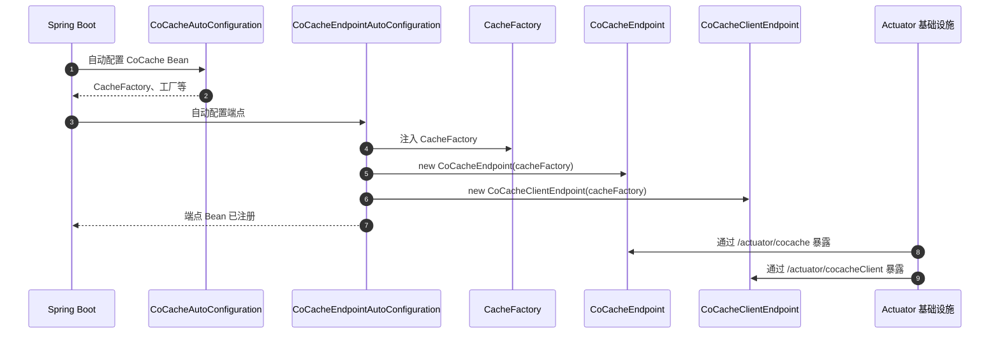
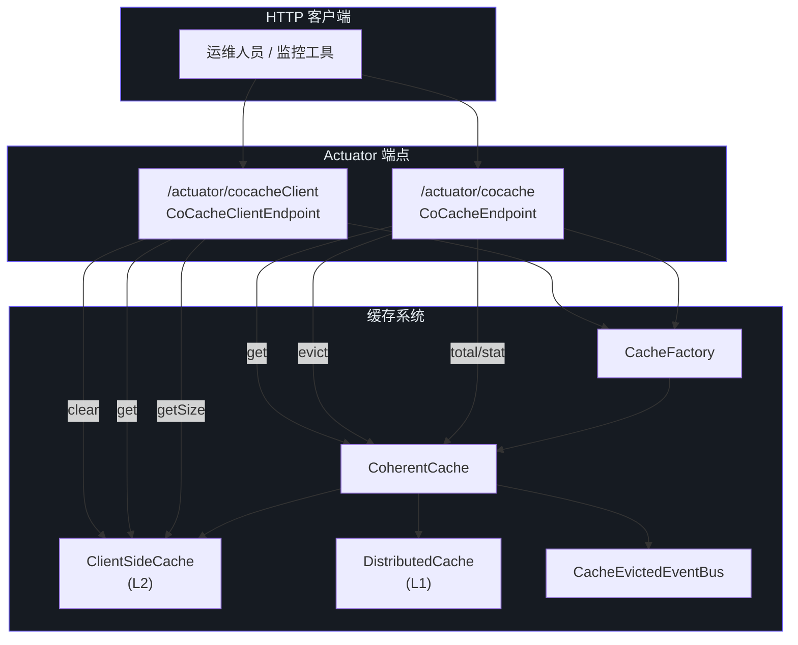
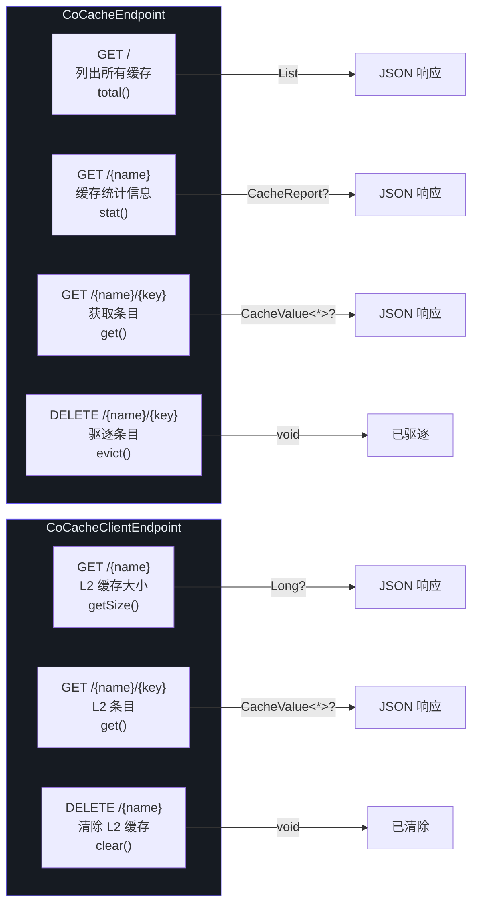

# Actuator 端点

CoCache 暴露了两个 Spring Boot Actuator 端点，用于运行时监控和管理缓存。当 Spring Boot Actuator 在类路径上时，这些端点由 `CoCacheEndpointAutoConfiguration` 自动配置。

## 端点概览

| 端点 ID | 类 | URL | 用途 | 源码 |
|------------|-------|-----|---------|--------|
| `cocache` | `CoCacheEndpoint` | `/actuator/cocache` | 一致性缓存管理（total、stat、evict、get） | [CoCacheEndpoint.kt:27](https://github.com/Ahoo-Wang/CoCache/blob/main/cocache-spring-boot-starter/src/main/kotlin/me/ahoo/cache/spring/boot/starter/CoCacheEndpoint.kt#L27) |
| `cocacheClient` | `CoCacheClientEndpoint` | `/actuator/cocacheClient` | 客户端（L2）缓存管理（size、get、clear） | [CoCacheClientEndpoint.kt:24](https://github.com/Ahoo-Wang/CoCache/blob/main/cocache-spring-boot-starter/src/main/kotlin/me/ahoo/cache/spring/boot/starter/CoCacheClientEndpoint.kt#L24) |

两个端点都继承自 `AbstractCoCacheEndpoint`，该基类提供了从 `CacheFactory` 解析 `CoherentCache` 实例的辅助方法。

## AbstractCoCacheEndpoint

两个端点实现共享的基类。

| 方面 | 详情 | 源码 |
|--------|--------|--------|
| **抽象属性** | `cacheFactory: CacheFactory` | -- |
| **辅助方法** | `String.coherentCache(): CoherentCache<String, Any>?` | `String` 上的扩展函数，按名称查找 `CoherentCache` |
| **源文件** | -- | [AbstractCoCacheEndpoint.kt:19](https://github.com/Ahoo-Wang/CoCache/blob/main/cocache-spring-boot-starter/src/main/kotlin/me/ahoo/cache/spring/boot/starter/AbstractCoCacheEndpoint.kt#L19) |

## CoCacheEndpoint

一致性缓存的主要管理端点。暴露了列出所有缓存、检查单个缓存、驱逐条目和获取值的操作。

### 操作

#### total() -- 列出所有缓存

| 方面 | 详情 |
|--------|--------|
| **HTTP 方法** | `GET` |
| **URL** | `/actuator/cocache` |
| **注解** | `@ReadOperation` |
| **返回值** | `List<CacheReport>` -- 所有已注册的 `CoherentCache` 实例 |
| **源码** | [CoCacheEndpoint.kt:30](https://github.com/Ahoo-Wang/CoCache/blob/main/cocache-spring-boot-starter/src/main/kotlin/me/ahoo/cache/spring/boot/starter/CoCacheEndpoint.kt#L30) |

过滤 `CacheFactory.caches` 映射，仅包含值为 `CoherentCache` 的条目，然后将每个映射为 `CacheReport`。

#### stat(name) -- 缓存统计信息

| 方面 | 详情 |
|--------|--------|
| **HTTP 方法** | `GET` |
| **URL** | `/actuator/cocache/{name}` |
| **注解** | `@ReadOperation` |
| **参数** | `@Selector name: String` |
| **返回值** | `CacheReport?` -- 缓存详情，未找到时返回 `null` |
| **源码** | [CoCacheEndpoint.kt:40](https://github.com/Ahoo-Wang/CoCache/blob/main/cocache-spring-boot-starter/src/main/kotlin/me/ahoo/cache/spring/boot/starter/CoCacheEndpoint.kt#L40) |

#### evict(name, key) -- 驱逐缓存条目

| 方面 | 详情 |
|--------|--------|
| **HTTP 方法** | `DELETE` |
| **URL** | `/actuator/cocache/{name}/{key}` |
| **注解** | `@DeleteOperation` |
| **参数** | `@Selector name: String`、`@Selector key: String` |
| **返回值** | `void` |
| **源码** | [CoCacheEndpoint.kt:45](https://github.com/Ahoo-Wang/CoCache/blob/main/cocache-spring-boot-starter/src/main/kotlin/me/ahoo/cache/spring/boot/starter/CoCacheEndpoint.kt#L45) |

从 L2（客户端缓存）和 L1（分布式缓存）中驱逐条目，并发布 `CacheEvictedEvent` 以在所有实例间使该条目失效。

#### get(name, key) -- 获取缓存条目

| 方面 | 详情 |
|--------|--------|
| **HTTP 方法** | `GET` |
| **URL** | `/actuator/cocache/{name}/{key}` |
| **注解** | `@ReadOperation` |
| **参数** | `@Selector name: String`、`@Selector key: String` |
| **返回值** | `CacheValue<*>?` -- 包含 TTL 元数据的完整缓存值，或 `null` |
| **源码** | [CoCacheEndpoint.kt:50](https://github.com/Ahoo-Wang/CoCache/blob/main/cocache-spring-boot-starter/src/main/kotlin/me/ahoo/cache/spring/boot/starter/CoCacheEndpoint.kt#L50) |

### CacheReport 数据类

一致性缓存配置和运行时状态的详细报告。

| 字段 | 类型 | 说明 | 源码 |
|-------|------|-------------|--------|
| `name` | `String` | 缓存名称 | [CoCacheEndpoint.kt:55](https://github.com/Ahoo-Wang/CoCache/blob/main/cocache-spring-boot-starter/src/main/kotlin/me/ahoo/cache/spring/boot/starter/CoCacheEndpoint.kt#L55) |
| `clientId` | `String` | 当前实例的分布式客户端 ID | [CoCacheEndpoint.kt:56](https://github.com/Ahoo-Wang/CoCache/blob/main/cocache-spring-boot-starter/src/main/kotlin/me/ahoo/cache/spring/boot/starter/CoCacheEndpoint.kt#L56) |
| `clientSize` | `Long` | L2 客户端缓存中的条目数 | [CoCacheEndpoint.kt:57](https://github.com/Ahoo-Wang/CoCache/blob/main/cocache-spring-boot-starter/src/main/kotlin/me/ahoo/cache/spring/boot/starter/CoCacheEndpoint.kt#L57) |
| `keyConverter` | `String` | 键转换器的字符串表示 | [CoCacheEndpoint.kt:58](https://github.com/Ahoo-Wang/CoCache/blob/main/cocache-spring-boot-starter/src/main/kotlin/me/ahoo/cache/spring/boot/starter/CoCacheEndpoint.kt#L58) |
| `distributedCaching` | `String` | 分布式缓存实现的全限定类名 | [CoCacheEndpoint.kt:59](https://github.com/Ahoo-Wang/CoCache/blob/main/cocache-spring-boot-starter/src/main/kotlin/me/ahoo/cache/spring/boot/starter/CoCacheEndpoint.kt#L59) |
| `clientSideCaching` | `String` | 客户端缓存实现的全限定类名 | [CoCacheEndpoint.kt:60](https://github.com/Ahoo-Wang/CoCache/blob/main/cocache-spring-boot-starter/src/main/kotlin/me/ahoo/cache/spring/boot/starter/CoCacheEndpoint.kt#L60) |
| `cacheEvictedEventBus` | `String` | 事件总线实现的全限定类名 | [CoCacheEndpoint.kt:61](https://github.com/Ahoo-Wang/CoCache/blob/main/cocache-spring-boot-starter/src/main/kotlin/me/ahoo/cache/spring/boot/starter/CoCacheEndpoint.kt#L61) |
| `cacheSource` | `String` | 数据源实现的全限定类名 | [CoCacheEndpoint.kt:62](https://github.com/Ahoo-Wang/CoCache/blob/main/cocache-spring-boot-starter/src/main/kotlin/me/ahoo/cache/spring/boot/starter/CoCacheEndpoint.kt#L62) |
| `keyFilter` | `String` | 键过滤器实现的全限定类名 | [CoCacheEndpoint.kt:63](https://github.com/Ahoo-Wang/CoCache/blob/main/cocache-spring-boot-starter/src/main/kotlin/me/ahoo/cache/spring/boot/starter/CoCacheEndpoint.kt#L63) |

### 响应示例

`GET /actuator/cocache`

```json
[
  {
    "name": "user-cache",
    "clientId": "192.168.1.10",
    "clientSize": 1523,
    "keyConverter": "ToStringKeyConverter(keyPrefix='cocache:user-cache:')",
    "distributedCaching": "me.ahoo.cache.spring.redis.RedisDistributedCache",
    "clientSideCaching": "me.ahoo.cache.client.CaffeineClientSideCache",
    "cacheEvictedEventBus": "me.ahoo.cache.spring.redis.RedisCacheEvictedEventBus",
    "cacheSource": "me.ahoo.cache.api.source.NoOpCacheSource",
    "keyFilter": "me.ahoo.cache.filter.NoOpKeyFilter"
  }
]
```

## CoCacheClientEndpoint

客户端（L2）缓存管理端点。提供对当前实例本地内存缓存的可视性。

### 操作

#### getSize(name) -- 获取客户端缓存大小

| 方面 | 详情 |
|--------|--------|
| **HTTP 方法** | `GET` |
| **URL** | `/actuator/cocacheClient/{name}` |
| **注解** | `@ReadOperation` |
| **参数** | `@Selector name: String` |
| **返回值** | `Long?` -- L2 缓存中的条目数，缓存未找到时返回 `null` |
| **源码** | [CoCacheClientEndpoint.kt:32](https://github.com/Ahoo-Wang/CoCache/blob/main/cocache-spring-boot-starter/src/main/kotlin/me/ahoo/cache/spring/boot/starter/CoCacheClientEndpoint.kt#L32) |

#### get(name, key) -- 获取客户端缓存条目

| 方面 | 详情 |
|--------|--------|
| **HTTP 方法** | `GET` |
| **URL** | `/actuator/cocacheClient/{name}/{key}` |
| **注解** | `@ReadOperation` |
| **参数** | `@Selector name: String`、`@Selector key: String` |
| **返回值** | `CacheValue<*>?` -- 包含 TTL 元数据的 L2 缓存条目，或 `null` |
| **源码** | [CoCacheClientEndpoint.kt:37](https://github.com/Ahoo-Wang/CoCache/blob/main/cocache-spring-boot-starter/src/main/kotlin/me/ahoo/cache/spring/boot/starter/CoCacheClientEndpoint.kt#L37) |

`key` 参数在客户端缓存中查找之前，会使用缓存的 `KeyConverter` 转换为字符串缓存键。

#### clear(name) -- 清除客户端缓存

| 方面 | 详情 |
|--------|--------|
| **HTTP 方法** | `DELETE` |
| **URL** | `/actuator/cocacheClient/{name}` |
| **注解** | `@DeleteOperation` |
| **参数** | `@Selector name: String` |
| **返回值** | `void` |
| **源码** | [CoCacheClientEndpoint.kt:43](https://github.com/Ahoo-Wang/CoCache/blob/main/cocache-spring-boot-starter/src/main/kotlin/me/ahoo/cache/spring/boot/starter/CoCacheClientEndpoint.kt#L43) |

仅清除当前实例上的 L2 客户端缓存中的所有条目。**不会**影响 L1 分布式缓存或其他实例。

## 端点自动配置

### CoCacheEndpointAutoConfiguration

当 Spring Boot Actuator 可用时，注册两个端点 Bean。

| 方面 | 详情 | 源码 |
|--------|--------|--------|
| **条件** | `@AutoConfiguration(after = [CoCacheAutoConfiguration::class])`、`@ConditionalOnClass(Endpoint::class)`、`@ConditionalOnCoCacheEnabled` | -- |
| **源文件** | -- | [CoCacheEndpointAutoConfiguration.kt:30](https://github.com/Ahoo-Wang/CoCache/blob/main/cocache-spring-boot-starter/src/main/kotlin/me/ahoo/cache/spring/boot/starter/CoCacheEndpointAutoConfiguration.kt#L30) |

| Bean | 类型 | 条件 |
|------|------|-----------|
| `cocacheEndpoint` | `CoCacheEndpoint` | `@ConditionalOnMissingBean` |
| `coCacheClientEndpoint` | `CoCacheClientEndpoint` | `@ConditionalOnMissingBean` |

### 端点注册流程



## 端点架构

下图展示了两个端点与缓存层之间的关系：



## 端点操作汇总

下图汇总了两个端点上所有可用的操作：



## CoherentCache 与客户端端点使用场景

| 场景 | 端点 | 操作 | URL |
|----------|----------|-----------|-----|
| 监控所有缓存 | CoCacheEndpoint | `total()` | `GET /actuator/cocache` |
| 检查单个缓存配置 | CoCacheEndpoint | `stat(name)` | `GET /actuator/cocache/{name}` |
| 调试特定缓存条目 | CoCacheEndpoint | `get(name, key)` | `GET /actuator/cocache/{name}/{key}` |
| 跨所有实例强制驱逐 | CoCacheEndpoint | `evict(name, key)` | `DELETE /actuator/cocache/{name}/{key}` |
| 检查 L2 内存使用量 | CoCacheClientEndpoint | `getSize(name)` | `GET /actuator/cocacheClient/{name}` |
| 检查本地 L2 条目 | CoCacheClientEndpoint | `get(name, key)` | `GET /actuator/cocacheClient/{name}/{key}` |
| 仅刷新本地 L2 | CoCacheClientEndpoint | `clear(name)` | `DELETE /actuator/cocacheClient/{name}` |

## 启用端点

默认情况下，Spring Boot Actuator 端点不会通过 HTTP 暴露。请在 `application.yml` 中添加以下配置：

```yaml
management:
  endpoints:
    web:
      exposure:
        include: cocache, cocacheClient
```

或者暴露所有端点：

```yaml
management:
  endpoints:
    web:
      exposure:
        include: "*"
```

## 配置属性

| 属性 | 类型 | 默认值 | 说明 | 源码 |
|----------|------|---------|-------------|--------|
| `cocache.enabled` | `Boolean` | `true` | CoCache 自动配置（包括端点）的主开关 | [CoCacheProperties.kt:24](https://github.com/Ahoo-Wang/CoCache/blob/main/cocache-spring-boot-starter/src/main/kotlin/me/ahoo/cache/spring/boot/starter/CoCacheProperties.kt#L24) |

要禁用 CoCache（及其端点）：

```yaml
cocache:
  enabled: false
```

## 自定义端点

要自定义端点 Bean，只需在配置类中声明自己的 `@Bean` 方法。默认 Bean 上的 `@ConditionalOnMissingBean` 注解确保您的自定义实现优先：

```kotlin
@Configuration
class CustomEndpointConfig {

    @Bean
    fun cocacheEndpoint(cacheFactory: CacheFactory): CoCacheEndpoint {
        // 自定义前/后逻辑
        return CoCacheEndpoint(cacheFactory)
    }
}
```

## 相关页面

- [API 概览](./index.md) -- 架构概览和模块组织
- [核心接口](./core-interfaces.md) -- 所有核心接口的详细参考
- [注解](./annotations.md) -- 完整的注解参考
- [Spring 集成](./spring-integration.md) -- Spring 和 Spring Boot 集成 API
