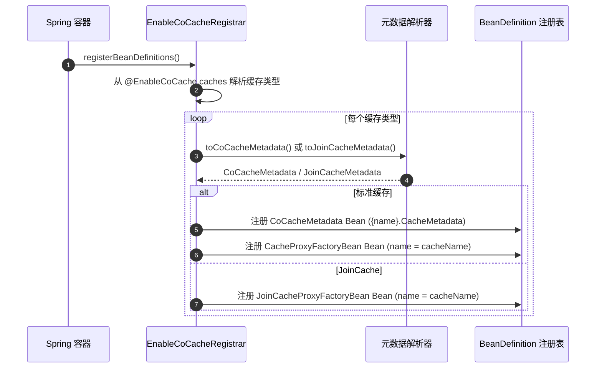
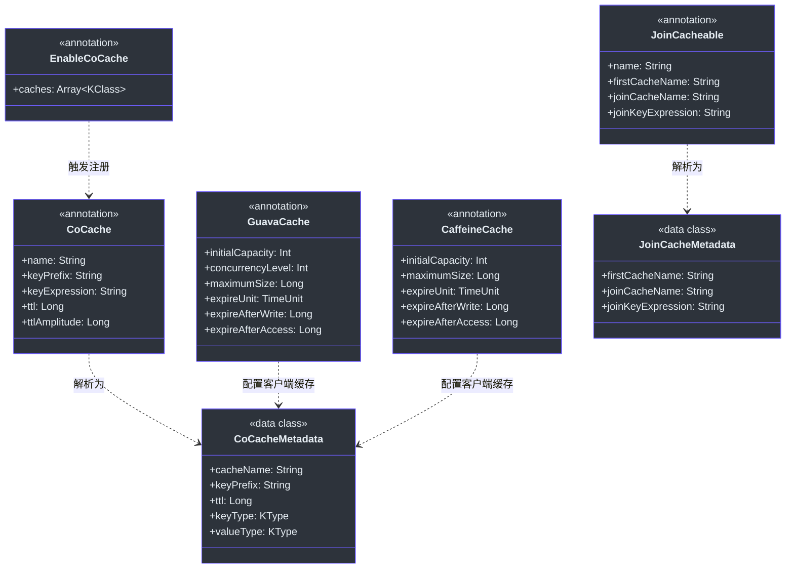
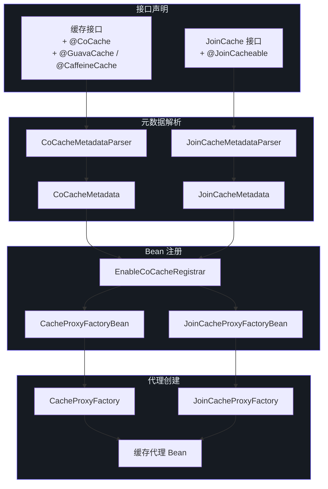

# 注解参考

CoCache 使用注解进行声明式缓存配置。注解定义在 `cocache-api` 模块（用于缓存级别的配置）和 `cocache-spring`/`cocache-spring-boot-starter` 模块（用于框架集成）中。

## @CoCache

标记缓存接口用于基于代理的缓存创建。这是定义标准一致性缓存的主要注解。

| 参数 | 类型 | 默认值 | 说明 | 源码 |
|-----------|------|---------|-------------|--------|
| `name` | `String` | `""`（使用接口简单类名） | 缓存逻辑名称，用于 Bean 注册和事件路由 | [CoCache.kt:30](https://github.com/Ahoo-Wang/CoCache/blob/main/cocache-api/src/main/kotlin/me/ahoo/cache/api/annotation/CoCache.kt#L30) |
| `keyPrefix` | `String` | `""`（自动生成为 `cocache:{cacheName}:`） | 在分布式存储中所有缓存键前添加的前缀 | [CoCache.kt:31](https://github.com/Ahoo-Wang/CoCache/blob/main/cocache-api/src/main/kotlin/me/ahoo/cache/api/annotation/CoCache.kt#L31) |
| `keyExpression` | `String` | `""` | 用于键生成的 SpEL 模板表达式（例如 `"#{id}"`） | [CoCache.kt:35](https://github.com/Ahoo-Wang/CoCache/blob/main/cocache-api/src/main/kotlin/me/ahoo/cache/api/annotation/CoCache.kt#L35) |
| `ttl` | `Long` | `Long.MAX_VALUE`（永不过期） | 默认生存时间，单位为秒 | [CoCache.kt:36](https://github.com/Ahoo-Wang/CoCache/blob/main/cocache-api/src/main/kotlin/me/ahoo/cache/api/annotation/CoCache.kt#L36) |
| `ttlAmplitude` | `Long` | `10` | 添加到 TTL 的随机抖动范围（秒），用于防止缓存雪崩 | [CoCache.kt:37](https://github.com/Ahoo-Wang/CoCache/blob/main/cocache-api/src/main/kotlin/me/ahoo/cache/api/annotation/CoCache.kt#L37) |

**伴生常量**：

| 常量 | 值 | 说明 |
|----------|-------|-------------|
| `COCACHE` | `"cocache"` | 配置的基础属性前缀 |
| `DEFAULT_TTL` | `Long.MAX_VALUE` | 默认 TTL（永不过期） |
| `DEFAULT_TTL_AMPLITUDE` | `10L` | 默认 TTL 抖动范围 |

### 使用示例

```kotlin
@CoCache(
    name = "user-cache",
    keyPrefix = "app:user:",
    ttl = 3600,        // 1 小时
    ttlAmplitude = 30  // +/- 30 秒抖动
)
interface UserCache : Cache<String, User>
```

使用 SpEL 键表达式处理非字符串键：

```kotlin
@CoCache(
    name = "order-cache",
    keyPrefix = "app:order:",
    keyExpression = "#{orderId}",
    ttl = 1800
)
interface OrderCache : Cache<OrderId, Order>
```

## @GuavaCache

配置基于 Guava 的 `ClientSideCache` 实现。当缓存接口上存在此注解时，`DefaultClientSideCacheFactory` 会创建 `GuavaClientSideCache` 而非默认的 `MapClientSideCache`。

| 参数 | 类型 | 默认值 | 说明 | 源码 |
|-----------|------|---------|-------------|--------|
| `initialCapacity` | `Int` | `-1`（未设置） | Guava 缓存的初始容量 | [GuavaCache.kt:29](https://github.com/Ahoo-Wang/CoCache/blob/main/cocache-api/src/main/kotlin/me/ahoo/cache/api/annotation/GuavaCache.kt#L29) |
| `concurrencyLevel` | `Int` | `-1`（未设置） | 并发访问的段数 | [GuavaCache.kt:30](https://github.com/Ahoo-Wang/CoCache/blob/main/cocache-api/src/main/kotlin/me/ahoo/cache/api/annotation/GuavaCache.kt#L30) |
| `maximumSize` | `Long` | `-1`（未设置） | 驱逐前的最大条目数 | [GuavaCache.kt:31](https://github.com/Ahoo-Wang/CoCache/blob/main/cocache-api/src/main/kotlin/me/ahoo/cache/api/annotation/GuavaCache.kt#L31) |
| `expireUnit` | `TimeUnit` | `TimeUnit.SECONDS` | 过期时间的时间单位 | [GuavaCache.kt:32](https://github.com/Ahoo-Wang/CoCache/blob/main/cocache-api/src/main/kotlin/me/ahoo/cache/api/annotation/GuavaCache.kt#L32) |
| `expireAfterWrite` | `Long` | `-1`（未设置） | 写入后条目过期的时间 | [GuavaCache.kt:33](https://github.com/Ahoo-Wang/CoCache/blob/main/cocache-api/src/main/kotlin/me/ahoo/cache/api/annotation/GuavaCache.kt#L33) |
| `expireAfterAccess` | `Long` | `-1`（未设置） | 最后一次访问后条目过期的时间 | [GuavaCache.kt:34](https://github.com/Ahoo-Wang/CoCache/blob/main/cocache-api/src/main/kotlin/me/ahoo/cache/api/annotation/GuavaCache.kt#L34) |

### 使用示例

```kotlin
@CoCache(name = "user-cache", ttl = 3600)
@GuavaCache(
    maximumSize = 10_000,
    expireAfterAccess = 300,
    expireUnit = TimeUnit.SECONDS
)
interface UserCache : Cache<String, User>
```

## @CaffeineCache

配置基于 Caffeine 的 `ClientSideCache` 实现。当缓存接口上存在此注解时，`DefaultClientSideCacheFactory` 会创建 `CaffeineClientSideCache`。

| 参数 | 类型 | 默认值 | 说明 | 源码 |
|-----------|------|---------|-------------|--------|
| `initialCapacity` | `Int` | `-1`（未设置） | Caffeine 缓存的初始容量 | [CaffeineCache.kt:30](https://github.com/Ahoo-Wang/CoCache/blob/main/cocache-api/src/main/kotlin/me/ahoo/cache/api/annotation/CaffeineCache.kt#L30) |
| `maximumSize` | `Long` | `-1`（未设置） | 驱逐前的最大条目数 | [CaffeineCache.kt:31](https://github.com/Ahoo-Wang/CoCache/blob/main/cocache-api/src/main/kotlin/me/ahoo/cache/api/annotation/CaffeineCache.kt#L31) |
| `expireUnit` | `TimeUnit` | `TimeUnit.SECONDS` | 过期时间的时间单位 | [CaffeineCache.kt:32](https://github.com/Ahoo-Wang/CoCache/blob/main/cocache-api/src/main/kotlin/me/ahoo/cache/api/annotation/CaffeineCache.kt#L32) |
| `expireAfterWrite` | `Long` | `-1`（未设置） | 写入后条目过期的时间 | [CaffeineCache.kt:33](https://github.com/Ahoo-Wang/CoCache/blob/main/cocache-api/src/main/kotlin/me/ahoo/cache/api/annotation/CaffeineCache.kt#L33) |
| `expireAfterAccess` | `Long` | `-1`（未设置） | 最后一次访问后条目过期的时间 | [CaffeineCache.kt:34](https://github.com/Ahoo-Wang/CoCache/blob/main/cocache-api/src/main/kotlin/me/ahoo/cache/api/annotation/CaffeineCache.kt#L34) |

### 使用示例

```kotlin
@CoCache(name = "product-cache", ttl = 7200)
@CaffeineCache(
    maximumSize = 50_000,
    expireAfterWrite = 600,
    expireUnit = TimeUnit.SECONDS
)
interface ProductCache : Cache<String, Product>
```

## @GuavaCache 与 @CaffeineCache 对比

| 特性 | @GuavaCache | @CaffeineCache |
|---------|-------------|----------------|
| `concurrencyLevel` | 支持 | 不支持 |
| `initialCapacity` | 支持 | 支持 |
| `maximumSize` | 支持 | 支持 |
| `expireAfterWrite` | 支持 | 支持 |
| `expireAfterAccess` | 支持 | 支持 |
| `expireUnit` | 支持 | 支持 |
| 底层库 | Google Guava | Caffeine |
| 异步刷新 | 否 | 原生支持（尚未暴露） |

## @JoinCacheable

将缓存接口标记为 JoinCache，组合两个缓存值。

| 参数 | 类型 | 默认值 | 说明 | 源码 |
|-----------|------|---------|-------------|--------|
| `name` | `String` | `""`（使用接口简单类名） | 缓存逻辑名称 | [JoinCacheable.kt:24](https://github.com/Ahoo-Wang/CoCache/blob/main/cocache-api/src/main/kotlin/me/ahoo/cache/api/annotation/JoinCacheable.kt#L24) |
| `firstCacheName` | `String` | `""` | 要读取的主缓存名称 | [JoinCacheable.kt:25](https://github.com/Ahoo-Wang/CoCache/blob/main/cocache-api/src/main/kotlin/me/ahoo/cache/api/annotation/JoinCacheable.kt#L25) |
| `joinCacheName` | `String` | `""` | 关联值所在的次要缓存名称 | [JoinCacheable.kt:26](https://github.com/Ahoo-Wang/CoCache/blob/main/cocache-api/src/main/kotlin/me/ahoo/cache/api/annotation/JoinCacheable.kt#L26) |
| `joinKeyExpression` | `String` | `""` | 从第一个值中提取关联键的 SpEL 表达式 | [JoinCacheable.kt:27](https://github.com/Ahoo-Wang/CoCache/blob/main/cocache-api/src/main/kotlin/me/ahoo/cache/api/annotation/JoinCacheable.kt#L27) |

### 使用示例

```kotlin
@JoinCacheable(
    name = "user-order-cache",
    firstCacheName = "user-cache",
    joinCacheName = "order-cache",
    joinKeyExpression = "#{orderId}"
)
interface UserOrderCache : JoinCache<String, User, String, Order>
```

## @EnableCoCache

特定于 Spring 的注解，触发缓存代理 Bean 定义的注册。应用于 `@Configuration` 类。

| 参数 | 类型 | 默认值 | 说明 | 源码 |
|-----------|------|---------|-------------|--------|
| `caches` | `Array<KClass<out Cache<*, *>>>` | `[]` | 要注册为 Spring Bean 的缓存接口 | [EnableCoCache.kt:22](https://github.com/Ahoo-Wang/CoCache/blob/main/cocache-spring/src/main/kotlin/me/ahoo/cache/spring/EnableCoCache.kt#L22) |

### 使用示例

```kotlin
@EnableCoCache(caches = [UserCache::class, ProductCache::class])
@Configuration
class CacheConfiguration
```

### 注册流程

当 `@EnableCoCache` 被处理时，`EnableCoCacheRegistrar` 执行以下步骤：



## @ConditionalOnCoCacheEnabled

Spring Boot 自动配置条件注解，根据 `cocache.enabled` 属性启用或禁用 CoCache。

| 属性 | 值 | 源码 |
|-----------|-------|--------|
| **属性键** | `cocache.enabled` | [ConditionalOnCoCacheEnabled.kt:23](https://github.com/Ahoo-Wang/CoCache/blob/main/cocache-spring-boot-starter/src/main/kotlin/me/ahoo/cache/spring/boot/starter/ConditionalOnCoCacheEnabled.kt#L23) |
| **默认值** | `true`（属性不存在时启用） | [ConditionalOnCoCacheEnabled.kt:23](https://github.com/Ahoo-Wang/CoCache/blob/main/cocache-spring-boot-starter/src/main/kotlin/me/ahoo/cache/spring/boot/starter/ConditionalOnCoCacheEnabled.kt#L23) |

### 配置

```yaml
# application.yml
cocache:
  enabled: true  # 设置为 false 可完全禁用 CoCache
```

## 注解继承与组合

CoCache 中的注解遵循继承模型，缓存接口注解与客户端缓存配置注解组合使用：



## 注解处理管道

下图展示了注解从接口声明到可工作的缓存代理的系统流转过程：



## 完整示例

使用所有可用注解的完整配置：

```kotlin
// 定义使用 Guava 客户端缓存的标准缓存
@CoCache(
    name = "user-cache",
    keyPrefix = "myapp:user:",
    ttl = 3600,
    ttlAmplitude = 30
)
@GuavaCache(
    maximumSize = 10_000,
    expireAfterWrite = 600
)
interface UserCache : Cache<String, User> {
    // 从 Cache<K, V> 继承的方法：
    // - get(key): User?
    // - set(key, value)
    // - evict(key)
    // - getCache(key): CacheValue<User>?
}

// 定义使用 Caffeine 客户端缓存的缓存
@CoCache(
    name = "order-cache",
    keyPrefix = "myapp:order:",
    keyExpression = "#{orderId}",
    ttl = 1800
)
@CaffeineCache(maximumSize = 50_000)
interface OrderCache : Cache<OrderId, Order>

// 定义组合用户和订单数据的 Join 缓存
@JoinCacheable(
    name = "user-order-cache",
    firstCacheName = "user-cache",
    joinCacheName = "order-cache",
    joinKeyExpression = "#{orderId}"
)
interface UserOrderCache : JoinCache<String, User, String, Order>

// Spring 配置
@EnableCoCache(caches = [UserCache::class, OrderCache::class, UserOrderCache::class])
@Configuration
class CacheConfiguration
```

## 相关页面

- [API 概览](./index.md) -- 架构概览和模块组织
- [核心接口](./core-interfaces.md) -- 所有核心接口的详细参考
- [Spring 集成](./spring-integration.md) -- Spring 和 Spring Boot 集成 API
- [Actuator 端点](./actuator.md) -- 监控和管理端点
