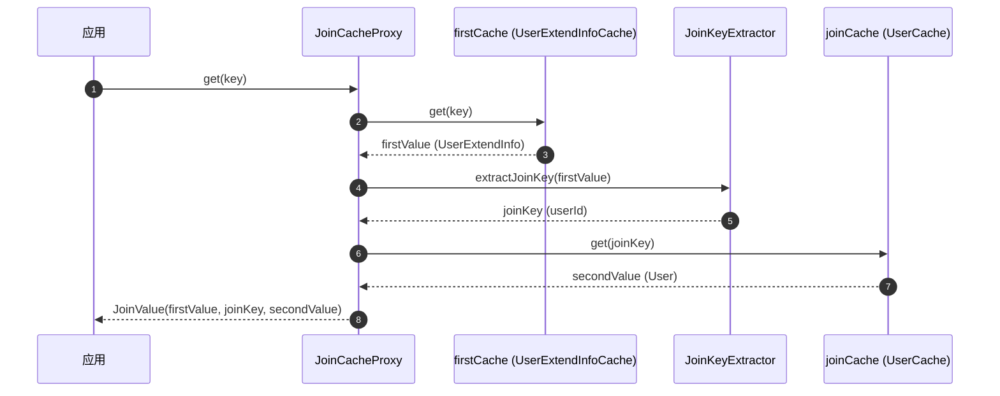

# 注解参考

CoCache 提供了一组注解用于声明式配置缓存行为。本页面详细介绍每个注解的用途和参数。

## @CoCache

标记缓存接口的核心注解。定义缓存名称、键前缀、TTL 等基本属性。

```kotlin
@CoCache(keyPrefix = "user:", ttl = 120, ttlAmplitude = 10)
interface UserCache : Cache<String, User>
```

**参数：**

| 参数 | 类型 | 说明 | 默认值 |
|------|------|------|--------|
| `name` | `String` | 缓存名称，默认取接口简单类名 | `""` |
| `keyPrefix` | `String` | 缓存键前缀 | `""` |
| `keyExpression` | `String` | SpEL 表达式，用于动态生成缓存键 | `""` |
| `ttl` | `Long` | 生存时间（秒） | `Long.MAX_VALUE` |
| `ttlAmplitude` | `Long` | TTL 抖动幅度（秒） | `10` |

**使用规则：**
- 缓存接口必须是 Kotlin `interface` 或 Java `interface`
- 缓存接口必须继承 `Cache<K, V>`
- `keyExpression` 为 SpEL 表达式，支持 `#root` 访问方法参数

**源码参考**：[`cocache-api/.../annotation/CoCache.kt`](https://github.com/Ahoo-Wang/CoCache/blob/main/cocache-api/src/main/kotlin/me/ahoo/cache/api/annotation/CoCache.kt)

## @GuavaCache

配置 Guava 作为 L2 客户端缓存的参数。

```kotlin
@GuavaCache(
    maximumSize = 1_000_000,
    expireAfterAccess = 120,
    expireUnit = TimeUnit.SECONDS
)
```

**参数：**

| 参数 | 类型 | 说明 | 默认值 |
|------|------|------|--------|
| `initialCapacity` | `Int` | 初始容量 | `-1`（未设置） |
| `concurrencyLevel` | `Int` | 并发级别 | `-1`（未设置） |
| `maximumSize` | `Long` | 最大条目数 | `-1`（未设置） |
| `expireAfterWrite` | `Long` | 写入后过期时间 | `-1`（未设置） |
| `expireAfterAccess` | `Long` | 访问后过期时间 | `-1`（未设置） |
| `expireUnit` | `TimeUnit` | 时间单位 | `TimeUnit.SECONDS` |

**源码参考**：[`cocache-api/.../annotation/GuavaCache.kt`](https://github.com/Ahoo-Wang/CoCache/blob/main/cocache-api/src/main/kotlin/me/ahoo/cache/api/annotation/GuavaCache.kt)

## @CaffeineCache

配置 Caffeine 作为 L2 客户端缓存的参数。

```kotlin
@CaffeineCache(
    maximumSize = 1_000_000,
    expireAfterWrite = 300,
    expireUnit = TimeUnit.SECONDS
)
```

**参数：**

| 参数 | 类型 | 说明 | 默认值 |
|------|------|------|--------|
| `initialCapacity` | `Int` | 初始容量 | `-1`（未设置） |
| `maximumSize` | `Long` | 最大条目数 | `-1`（未设置） |
| `expireAfterWrite` | `Long` | 写入后过期时间 | `-1`（未设置） |
| `expireAfterAccess` | `Long` | 访问后过期时间 | `-1`（未设置） |
| `expireUnit` | `TimeUnit` | 时间单位 | `TimeUnit.SECONDS` |

**源码参考**：[`cocache-api/.../annotation/CaffeineCache.kt`](https://github.com/Ahoo-Wang/CoCache/blob/main/cocache-api/src/main/kotlin/me/ahoo/cache/api/annotation/CaffeineCache.kt)

## @JoinCacheable

标记 JoinCache 接口，配置关联缓存的参数。

```kotlin
@JoinCacheable(
    firstCacheName = "UserExtendInfoCache",
    joinCacheName = "UserCache",
    joinKeyExpression = "#{#root.userId}"
)
interface UserExtendInfoJoinCache : JoinCache<String, UserExtendInfo, String, User>
```

**参数：**

| 参数 | 类型 | 说明 | 默认值 |
|------|------|------|--------|
| `name` | `String` | JoinCache 名称 | `""` |
| `firstCacheName` | `String` | 主缓存名称（第一个缓存） | `""` |
| `joinCacheName` | `String` | 关联缓存名称（第二个缓存） | `""` |
| `joinKeyExpression` | `String` | SpEL 表达式，从主值中提取关联键 | `""` |

**工作流程：**



**源码参考**：[`cocache-api/.../annotation/JoinCacheable.kt`](https://github.com/Ahoo-Wang/CoCache/blob/main/cocache-api/src/main/kotlin/me/ahoo/cache/api/annotation/JoinCacheable.kt)

## @EnableCoCache

Spring 配置注解，启用 CoCache 并注册缓存代理 Bean。

```kotlin
@EnableCoCache(caches = [UserCache::class, OrderCache::class, JoinCache::class])
@SpringBootApplication
class AppServer
```

**参数：**

| 参数 | 类型 | 说明 |
|------|------|------|
| `caches` | `Array<KClass<out Cache<*, *>>>` | 需要注册的缓存接口列表 |

**工作原理：**
1. 通过 `@Import(EnableCoCacheRegistrar::class)` 引入注册器
2. `EnableCoCacheRegistrar` 解析 `caches` 属性中的接口
3. 为每个缓存接口注册 `CacheProxyFactoryBean`（或 `JoinCacheProxyFactoryBean`）
4. Spring 容器启动时通过 FactoryBean 创建缓存代理实例

**源码参考**：[`cocache-spring/.../EnableCoCache.kt`](https://github.com/Ahoo-Wang/CoCache/blob/main/cocache-spring/src/main/kotlin/me/ahoo/cache/spring/EnableCoCache.kt)

## @ConditionalOnCoCacheEnabled

条件注解，当 `cocache.enabled=true` 时（默认）自动配置类生效。

```kotlin
@ConditionalOnCoCacheEnabled
class CoCacheAutoConfiguration {
    // ... Bean 定义
}
```

配合 `application.yaml` 使用：

```yaml
cocache:
  enabled: true  # 设置为 false 可禁用 CoCache
```

**源码参考**：[`cocache-spring-boot-starter/.../ConditionalOnCoCacheEnabled.kt`](https://github.com/Ahoo-Wang/CoCache/blob/main/cocache-spring-boot-starter/src/main/kotlin/me/ahoo/cache/spring/boot/starter/ConditionalOnCoCacheEnabled.kt)

## 注解组合示例

### 基础缓存

```kotlin
@CoCache(keyPrefix = "user:", ttl = 120, ttlAmplitude = 10)
@GuavaCache(maximumSize = 1_000_000, expireAfterAccess = 120, expireUnit = TimeUnit.SECONDS)
interface UserCache : Cache<String, User>
```

### Caffeine 缓存

```kotlin
@CoCache(keyPrefix = "order:", ttl = 300, ttlAmplitude = 20)
@CaffeineCache(maximumSize = 500_000, expireAfterWrite = 300, expireUnit = TimeUnit.SECONDS)
interface OrderCache : Cache<String, Order>
```

### JoinCache

```kotlin
@JoinCacheable(
    firstCacheName = "UserExtendInfoCache",
    joinCacheName = "UserCache",
    joinKeyExpression = "#{#root.userId}"
)
interface UserExtendInfoJoinCache : JoinCache<String, UserExtendInfo, String, User>
```

### SpEL 键表达式

```kotlin
@CoCache(keyExpression = "#{#root.id}")
interface UserProfileCache : Cache<UserProfile, ProfileData>
```

## 相关页面

- [核心接口](./core-interfaces.md) - 接口详解
- [配置指南](../guide/configuration.md) - 配置参数详解
- [代理与注解](../architecture/proxy.md) - 代理创建流程
- [Spring 集成](./spring-integration.md) - Spring 集成说明
