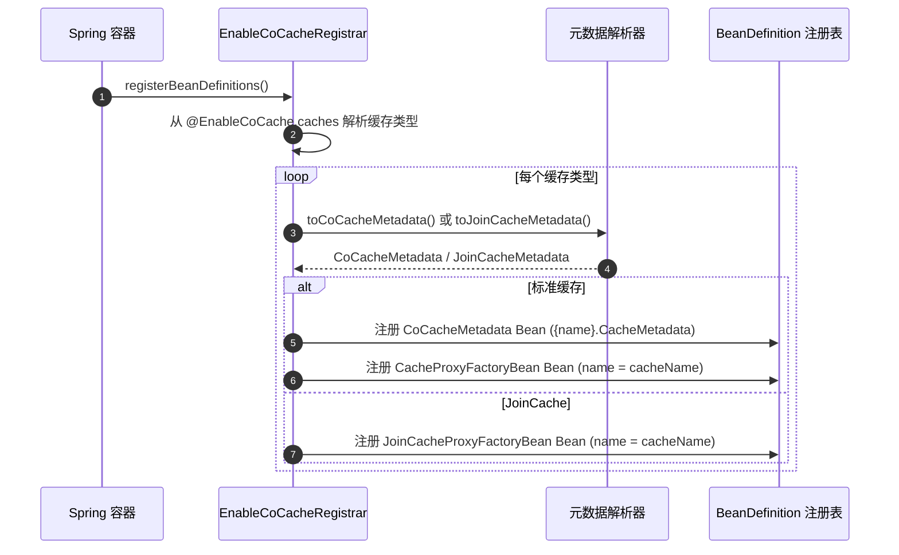
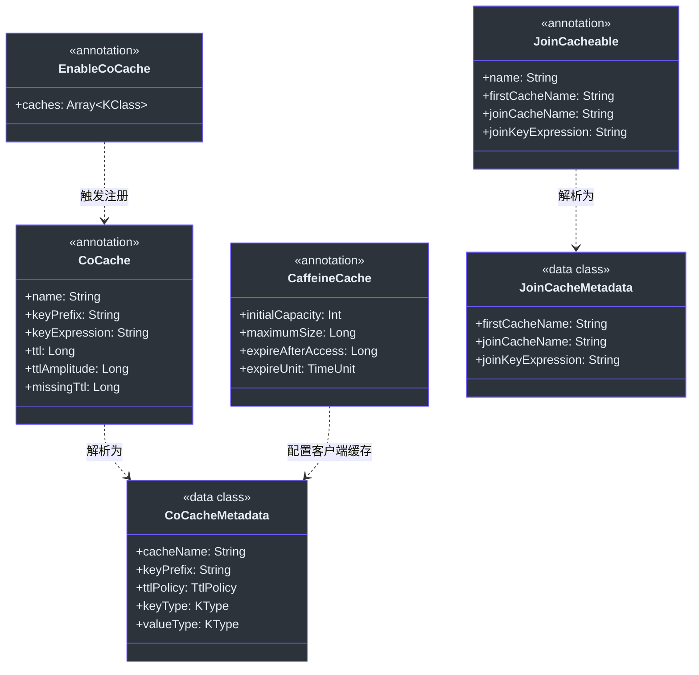
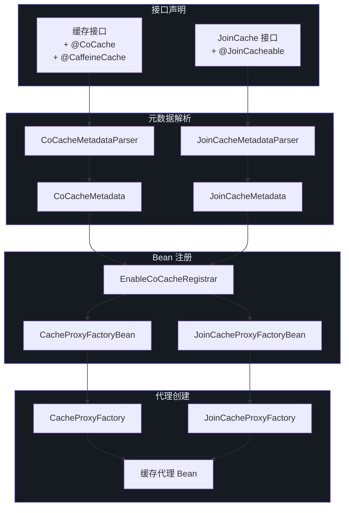

# 注解参考

CoCache 使用注解进行声明式缓存配置。注解定义在 `cocache-api` 模块（用于缓存级别的配置）和 `cocache-spring`/`cocache-spring-boot-starter` 模块（用于框架集成）中。

## @CoCache

标记缓存接口用于基于代理的缓存创建。这是定义标准一致性缓存的主要注解。

| 参数 | 类型 | 默认值 | 说明 | 源码 |
|------|------|--------|------|------|
| `name` | `String` | `""`（接口简单类名） | 缓存逻辑名称：bean 名、事件频道、组件 bean 前缀 | [CoCache.kt](https://github.com/Ahoo-Wang/CoCache/blob/main/cocache-api/src/main/kotlin/me/ahoo/cache/api/annotation/CoCache.kt) |
| `keyPrefix` | `String` | `""`（→ `cocache:{cacheName}:`） | 存储 key 前缀；解析 Spring 占位符 | [CoCache.kt](https://github.com/Ahoo-Wang/CoCache/blob/main/cocache-api/src/main/kotlin/me/ahoo/cache/api/annotation/CoCache.kt) |
| `keyExpression` | `String` | `""` | key 的 SpEL 模板（如 `"#{id}"`）；为空时使用 `key.toString()` | [CoCache.kt](https://github.com/Ahoo-Wang/CoCache/blob/main/cocache-api/src/main/kotlin/me/ahoo/cache/api/annotation/CoCache.kt) |
| `ttl` | `Long` | `3600` | 命中值 TTL（秒）。默认有限，任何不一致都能自愈；`TtlAt.FOREVER` 表示永不过期 | [CoCache.kt](https://github.com/Ahoo-Wang/CoCache/blob/main/cocache-api/src/main/kotlin/me/ahoo/cache/api/annotation/CoCache.kt) |
| `ttlAmplitude` | `Long` | `60` | 命中值 TTL 的随机抖动（± 秒），防止缓存雪崩 | [CoCache.kt](https://github.com/Ahoo-Wang/CoCache/blob/main/cocache-api/src/main/kotlin/me/ahoo/cache/api/annotation/CoCache.kt) |
| `missingTtl` | `Long` | `60` | 负缓存 TTL（秒，不抖动）；新建数据最多在该时长内不可见 | [CoCache.kt](https://github.com/Ahoo-Wang/CoCache/blob/main/cocache-api/src/main/kotlin/me/ahoo/cache/api/annotation/CoCache.kt) |

**伴生常量**：

| 常量 | 值 | 说明 |
|------|----|------|
| `COCACHE` | `"cocache"` | 配置的基础属性前缀 |
| `DEFAULT_TTL` | `3600` | 默认命中值 TTL |
| `DEFAULT_TTL_AMPLITUDE` | `60` | 默认 TTL 抖动 |
| `DEFAULT_MISSING_TTL` | `60` | 默认负缓存 TTL |

### 使用示例

```kotlin
@CoCache(
    name = "user-cache",
    keyPrefix = "app:user:",
    ttl = 3600,        // 1 小时
    ttlAmplitude = 30  // +/- 30 秒抖动
)
interface UserCache : Cache<String, User>
```

使用 SpEL 键表达式处理非字符串键：

```kotlin
@CoCache(
    name = "order-cache",
    keyPrefix = "app:order:",
    keyExpression = "#{orderId}",
    ttl = 1800
)
interface OrderCache : Cache<OrderId, Order>
```

## @CaffeineCache

配置默认 L2（`CaffeineClientSideCache`）。不标注时使用全部默认值。条目总是在自身 `ttlAt` 到期，无需配置写后过期。

| 参数 | 类型 | 默认值 | 说明 | 源码 |
|------|------|--------|------|------|
| `initialCapacity` | `Int` | `-1`（未设置） | 初始容量 | [CaffeineCache.kt](https://github.com/Ahoo-Wang/CoCache/blob/main/cocache-api/src/main/kotlin/me/ahoo/cache/api/annotation/CaffeineCache.kt) |
| `maximumSize` | `Long` | `10000` | 最大条目数；L2 始终有界 | [CaffeineCache.kt](https://github.com/Ahoo-Wang/CoCache/blob/main/cocache-api/src/main/kotlin/me/ahoo/cache/api/annotation/CaffeineCache.kt) |
| `expireAfterAccess` | `Long` | `0`（不启用） | 自最近一次访问起的空闲淘汰（不晚于 `ttlAt`） | [CaffeineCache.kt](https://github.com/Ahoo-Wang/CoCache/blob/main/cocache-api/src/main/kotlin/me/ahoo/cache/api/annotation/CaffeineCache.kt) |
| `expireUnit` | `TimeUnit` | `SECONDS` | `expireAfterAccess` 的单位 | [CaffeineCache.kt](https://github.com/Ahoo-Wang/CoCache/blob/main/cocache-api/src/main/kotlin/me/ahoo/cache/api/annotation/CaffeineCache.kt) |

### 使用示例

```kotlin
@CoCache(name = "product-cache", ttl = 7200)
@CaffeineCache(maximumSize = 50_000, expireAfterAccess = 600)
interface ProductCache : Cache<String, Product>
```

如需完全替换 L2，声明名为 `{cacheName}.ClientSideCache` 的 bean。

## @JoinCacheable

将缓存接口标记为 JoinCache，组合两个缓存值。

| 参数 | 类型 | 默认值 | 说明 | 源码 |
|-----------|------|---------|-------------|--------|
| `name` | `String` | `""`（使用接口简单类名） | 缓存逻辑名称 | [JoinCacheable.kt:24](https://github.com/Ahoo-Wang/CoCache/blob/main/cocache-api/src/main/kotlin/me/ahoo/cache/api/annotation/JoinCacheable.kt#L24) |
| `firstCacheName` | `String` | `""` | 要读取的主缓存名称 | [JoinCacheable.kt:25](https://github.com/Ahoo-Wang/CoCache/blob/main/cocache-api/src/main/kotlin/me/ahoo/cache/api/annotation/JoinCacheable.kt#L25) |
| `joinCacheName` | `String` | `""` | 关联值所在的次要缓存名称 | [JoinCacheable.kt:26](https://github.com/Ahoo-Wang/CoCache/blob/main/cocache-api/src/main/kotlin/me/ahoo/cache/api/annotation/JoinCacheable.kt#L26) |
| `joinKeyExpression` | `String` | `""` | 从第一个值中提取关联键的 SpEL 表达式 | [JoinCacheable.kt:27](https://github.com/Ahoo-Wang/CoCache/blob/main/cocache-api/src/main/kotlin/me/ahoo/cache/api/annotation/JoinCacheable.kt#L27) |

### 使用示例

```kotlin
@JoinCacheable(
    name = "user-order-cache",
    firstCacheName = "user-cache",
    joinCacheName = "order-cache",
    joinKeyExpression = "#{orderId}"
)
interface UserOrderCache : JoinCache<String, User, String, Order>
```

## @EnableCoCache

特定于 Spring 的注解，触发缓存代理 Bean 定义的注册。应用于 `@Configuration` 类。

| 参数 | 类型 | 默认值 | 说明 | 源码 |
|-----------|------|---------|-------------|--------|
| `caches` | `Array<KClass<out Cache<*, *>>>` | `[]` | 要注册为 Spring Bean 的缓存接口 | [EnableCoCache.kt:22](https://github.com/Ahoo-Wang/CoCache/blob/main/cocache-spring/src/main/kotlin/me/ahoo/cache/spring/EnableCoCache.kt#L22) |

### 使用示例

```kotlin
@EnableCoCache(caches = [UserCache::class, ProductCache::class])
@Configuration
class CacheConfiguration
```

### 注册流程

当 `@EnableCoCache` 被处理时，`EnableCoCacheRegistrar` 执行以下步骤：


```mermaid
sequenceDiagram
autonumber
    participant SC as Spring 容器
    participant R as EnableCoCacheRegistrar
    participant MD as 元数据解析器
    participant BD as BeanDefinition 注册表

    SC->>R: registerBeanDefinitions()
    R->>R: 从 @EnableCoCache.caches 解析缓存类型
    loop 每个缓存类型
        R->>MD: toCoCacheMetadata() 或 toJoinCacheMetadata()
        MD-->>R: CoCacheMetadata / JoinCacheMetadata
        alt 标准缓存
            R->>BD: 注册 CoCacheMetadata Bean ({name}.CacheMetadata)
            R->>BD: 注册 CacheProxyFactoryBean Bean (name = cacheName)
        else JoinCache
            R->>BD: 注册 JoinCacheProxyFactoryBean Bean (name = cacheName)
        end
    end
```

## @ConditionalOnCoCacheEnabled

Spring Boot 自动配置条件注解，根据 `cocache.enabled` 属性启用或禁用 CoCache。

| 属性 | 值 | 源码 |
|-----------|-------|--------|
| **属性键** | `cocache.enabled` | [ConditionalOnCoCacheEnabled.kt:23](https://github.com/Ahoo-Wang/CoCache/blob/main/cocache-spring-boot-starter/src/main/kotlin/me/ahoo/cache/spring/boot/starter/ConditionalOnCoCacheEnabled.kt#L23) |
| **默认值** | `true`（属性不存在时启用） | [ConditionalOnCoCacheEnabled.kt:23](https://github.com/Ahoo-Wang/CoCache/blob/main/cocache-spring-boot-starter/src/main/kotlin/me/ahoo/cache/spring/boot/starter/ConditionalOnCoCacheEnabled.kt#L23) |

### 配置

```yaml
# application.yml
cocache:
  enabled: true  # 设置为 false 可完全禁用 CoCache
```

## 注解继承与组合

CoCache 中的注解遵循继承模型，缓存接口注解与客户端缓存配置注解组合使用：


```mermaid
classDiagram
    direction TB

    class CoCache {
        <<annotation>>
        +name: String
        +keyPrefix: String
        +keyExpression: String
        +ttl: Long
        +ttlAmplitude: Long
        +missingTtl: Long
    }
    class CaffeineCache {
        <<annotation>>
        +initialCapacity: Int
        +maximumSize: Long
        +expireAfterAccess: Long
        +expireUnit: TimeUnit
    }
    class JoinCacheable {
        <<annotation>>
        +name: String
        +firstCacheName: String
        +joinCacheName: String
        +joinKeyExpression: String
    }
    class EnableCoCache {
        <<annotation>>
        +caches: Array~KClass~
    }
    class CoCacheMetadata {
        <<data class>>
        +cacheName: String
        +keyPrefix: String
        +ttlPolicy: TtlPolicy
        +keyType: KType
        +valueType: KType
    }
    class JoinCacheMetadata {
        <<data class>>
        +firstCacheName: String
        +joinCacheName: String
        +joinKeyExpression: String
    }

    CoCache ..> CoCacheMetadata : 解析为
    CaffeineCache ..> CoCacheMetadata : 配置客户端缓存
    JoinCacheable ..> JoinCacheMetadata : 解析为
    EnableCoCache ..> CoCache : 触发注册

    style CoCache fill:#2d333b,stroke:#6d5dfc,color:#e6edf3
    style CaffeineCache fill:#2d333b,stroke:#6d5dfc,color:#e6edf3
    style JoinCacheable fill:#2d333b,stroke:#6d5dfc,color:#e6edf3
    style EnableCoCache fill:#2d333b,stroke:#6d5dfc,color:#e6edf3
    style CoCacheMetadata fill:#2d333b,stroke:#6d5dfc,color:#e6edf3
    style JoinCacheMetadata fill:#2d333b,stroke:#6d5dfc,color:#e6edf3
```

## 注解处理管道

下图展示了注解从接口声明到可工作的缓存代理的系统流转过程：


```mermaid
graph TB
    subgraph Declaration["接口声明"]
        style Declaration fill:#161b22,stroke:#6d5dfc,color:#e6edf3
        CI["缓存接口<br>+ @CoCache<br>+ @CaffeineCache"]
        JCI["JoinCache 接口<br>+ @JoinCacheable"]
    end

    subgraph Parsing["元数据解析"]
        style Parsing fill:#161b22,stroke:#6d5dfc,color:#e6edf3
        CMP["CoCacheMetadataParser"]
        JCMP["JoinCacheMetadataParser"]
        CMD["CoCacheMetadata"]
        JCMD["JoinCacheMetadata"]
    end

    subgraph Registration["Bean 注册"]
        style Registration fill:#161b22,stroke:#6d5dfc,color:#e6edf3
        REG["EnableCoCacheRegistrar"]
        CPFB["CacheProxyFactoryBean"]
        JCPFB["JoinCacheProxyFactoryBean"]
    end

    subgraph Factory["代理创建"]
        style Factory fill:#161b22,stroke:#6d5dfc,color:#e6edf3
        CPF["CacheProxyFactory"]
        JCPF["JoinCacheProxyFactory"]
        PROXY["缓存代理 Bean"]
    end

    CI --> CMP
    JCI --> JCMP
    CMP --> CMD
    JCMP --> JCMD
    CMD --> REG
    JCMD --> REG
    REG --> CPFB
    REG --> JCPFB
    CPFB --> CPF
    JCPFB --> JCPF
    CPF --> PROXY
    JCPF --> PROXY

```

## 完整示例

使用所有可用注解的完整配置：

```kotlin
// 定义一个指定 L2 容量的标准缓存
@CoCache(
    name = "user-cache",
    keyPrefix = "myapp:user:",
    ttl = 3600,
    ttlAmplitude = 30,
    missingTtl = 30
)
@CaffeineCache(maximumSize = 10_000, expireAfterAccess = 600)
interface UserCache : Cache<String, User> {
    // 从 Cache<K, V> 继承的方法：
    // - get(key): User?
    // - set(key, value)
    // - evict(key)
    // - getCache(key): CacheValue<User>?
}

// 定义使用 Caffeine 客户端缓存的缓存
@CoCache(
    name = "order-cache",
    keyPrefix = "myapp:order:",
    keyExpression = "#{orderId}",
    ttl = 1800
)
@CaffeineCache(maximumSize = 50_000)
interface OrderCache : Cache<OrderId, Order>

// 定义组合用户和订单数据的 Join 缓存
@JoinCacheable(
    name = "user-order-cache",
    firstCacheName = "user-cache",
    joinCacheName = "order-cache",
    joinKeyExpression = "#{orderId}"
)
interface UserOrderCache : JoinCache<String, User, String, Order>

// Spring 配置
@EnableCoCache(caches = [UserCache::class, OrderCache::class, UserOrderCache::class])
@Configuration
class CacheConfiguration
```

## 相关页面

- [API 概览](./index.md) -- 架构概览和模块组织
- [核心接口](./core-interfaces.md) -- 所有核心接口的详细参考
- [Spring 集成](./spring-integration.md) -- Spring 和 Spring Boot 集成 API
- [Actuator 端点](./actuator.md) -- 监控和管理端点
