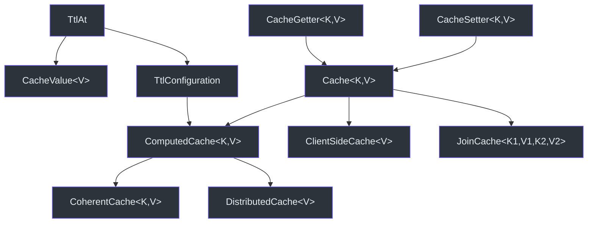

# 核心接口

本页面详细介绍 CoCache 的所有核心接口，它们定义在 `cocache-api` 和 `cocache-core` 模块中。

## 接口层次结构



## Cache&lt;K, V&gt;

基础缓存接口，组合了 `CacheGetter` 和 `CacheSetter`。

```kotlin
interface Cache<K, V> : CacheGetter<K, V>, CacheSetter<K, V>
```

- `CacheGetter<K, V>`：提供 `get(key: K): V?`、`getCache(key: K): CacheValue<V>?`、`getTtlAt(key: K): Long?`
- `CacheSetter<K, V>`：提供 `set(key: K, value: V)`、`set(key: K, ttlAt: Long, value: V)`、`setCache(key: K, value: CacheValue<V>)`、`evict(key: K)`

这是所有缓存接口的基础，开发者定义的缓存接口都应继承此接口。

**源码参考**：[`cocache-api/.../Cache.kt`](https://github.com/Ahoo-Wang/CoCache/blob/main/cocache-api/src/main/kotlin/me/ahoo/cache/api/Cache.kt)

## CacheValue&lt;V&gt;

缓存值包装接口，包含实际值、过期时间和 MissingGuard 标记。

```kotlin
interface CacheValue<V> : TtlAt {
    val value: V
    override val ttlAt: Long      // 过期时间戳（秒）
    val isMissingGuard: Boolean   // 是否为缺失守卫值
}
```

`DefaultCacheValue` 提供了常用的工厂方法：

```kotlin
// 创建永不过期的缓存值
DefaultCacheValue.forever(value)

// 创建带 TTL 的缓存值
DefaultCacheValue.ttlAt(value, ttl, ttlAmplitude)

// 创建缺失守卫值（缓存穿透防护）
DefaultCacheValue.missingGuard(ttl, ttlAmplitude)
```

**源码参考**：[`cocache-api/.../CacheValue.kt`](https://github.com/Ahoo-Wang/CoCache/blob/main/cocache-api/src/main/kotlin/me/ahoo/cache/api/CacheValue.kt)

## TtlAt

TTL 管理接口，提供过期判断能力。

```kotlin
interface TtlAt {
    val ttlAt: Long           // 过期时间戳（秒）
    val isForever: Boolean    // 是否永不过期
    val isExpired: Boolean    // 是否已过期
    val expiredDuration: Duration  // 剩余有效期
}
```

**源码参考**：[`cocache-api/.../TtlAt.kt`](https://github.com/Ahoo-Wang/CoCache/blob/main/cocache-api/src/main/kotlin/me/ahoo/cache/api/TtlAt.kt)

## NamedCache

命名缓存接口，每个缓存都有唯一的名称。

```kotlin
interface NamedCache {
    val cacheName: String
}
```

缓存名称用于：
- Bean 注册和查找
- 事件路由（`CacheEvictedEvent.cacheName`）
- Actuator 端点展示

**源码参考**：[`cocache-api/.../NamedCache.kt`](https://github.com/Ahoo-Wang/CoCache/blob/main/cocache-api/src/main/kotlin/me/ahoo/cache/api/NamedCache.kt)

## ClientSideCache&lt;V&gt;

L2 客户端缓存接口，代表本地内存缓存。

```kotlin
interface ClientSideCache<V> : Cache<String, V> {
    val size: Long    // 当前缓存条目数
    fun clear()       // 清除所有缓存
}
```

键类型固定为 `String`（经 `KeyConverter` 转换后的字符串键）。

实现：

| 实现类 | 基础库 | 说明 |
|--------|--------|------|
| `GuavaClientSideCache` | Google Guava Cache | 成熟稳定 |
| `CaffeineClientSideCache` | Caffeine Cache | 高性能 |
| `MapClientSideCache` | ConcurrentHashMap | 轻量级 |

**源码参考**：[`cocache-api/.../client/ClientSideCache.kt`](https://github.com/Ahoo-Wang/CoCache/blob/main/cocache-api/src/main/kotlin/me/ahoo/cache/api/client/ClientSideCache.kt)

## CacheSource&lt;K, V&gt;

L0 数据源接口，代表最终数据来源。

```kotlin
interface CacheSource<K, V> {
    fun loadCacheValue(key: K): CacheValue<V>?
}
```

- 返回 `null` 表示数据源中不存在该键
- 框架会自动缓存 `MissingGuard` 值防止缓存穿透
- `CacheSource.noOp()` 提供空操作实现

**源码参考**：[`cocache-api/.../source/CacheSource.kt`](https://github.com/Ahoo-Wang/CoCache/blob/main/cocache-api/src/main/kotlin/me/ahoo/cache/api/source/CacheSource.kt)

## DistributedCache&lt;V&gt;

L1 分布式缓存接口。

```kotlin
interface DistributedCache<V> : ComputedCache<String, V>, AutoCloseable
```

- 键类型固定为 `String`
- 继承 `ComputedCache`，自动处理 `CacheValue` 包装和 TTL 管理
- 继承 `AutoCloseable`，支持资源释放

默认实现为 `RedisDistributedCache`。

**源码参考**：[`cocache-core/.../distributed/DistributedCache.kt`](https://github.com/Ahoo-Wang/CoCache/blob/main/cocache-core/src/main/kotlin/me/ahoo/cache/distributed/DistributedCache.kt)

## ComputedCache&lt;K, V&gt;

计算缓存接口，封装了 `get`/`set` 的逻辑，自动处理 `CacheValue` 解包和 TTL 管理。

```kotlin
interface ComputedCache<K, V> : Cache<K, V>, TtlConfiguration {
    override fun get(key: K): V? {
        val cacheValue = getCache(key) ?: return null
        if (cacheValue.isMissingGuard || cacheValue.isExpired) return null
        return cacheValue.value
    }
}
```

**源码参考**：[`cocache-core/.../ComputedCache.kt`](https://github.com/Ahoo-Wang/CoCache/blob/main/cocache-core/src/main/kotlin/me/ahoo/cache/ComputedCache.kt)

## CoherentCache&lt;K, V&gt;

二级一致性缓存接口，是 CoCache 的核心接口。

```kotlin
interface CoherentCache<K, V> :
    ComputedCache<K, V>,    // 计算缓存
    DistributedClientId,    // 分布式客户端 ID
    NamedCache,             // 命名缓存
    CacheEvictedSubscriber  // 缓存失效事件订阅者
{
    val cacheEvictedEventBus: CacheEvictedEventBus
    val clientSideCache: ClientSideCache<V>
    val distributedCache: DistributedCache<V>
    val keyFilter: KeyFilter
    val keyConverter: KeyConverter<K>
    val cacheSource: CacheSource<K, V>
}
```

`DefaultCoherentCache` 实现了完整的二级缓存逻辑，包括：
- L2 -> L1 -> L0 读取路径
- 双写路径
- 逐键锁防止缓存击穿
- MissingGuard 防止缓存穿透
- 事件驱动一致性

**源码参考**：[`cocache-core/.../CoherentCache.kt`](https://github.com/Ahoo-Wang/CoCache/blob/main/cocache-core/src/main/kotlin/me/ahoo/cache/consistency/CoherentCache.kt)

## JoinCache&lt;K1, V1, K2, V2&gt;

组合缓存接口，支持跨缓存的关联查询。

```kotlin
interface JoinCache<K1, V1, K2, V2> : Cache<K1, JoinValue<V1, K2, V2>> {
    val joinKeyExtractor: JoinKeyExtractor<V1, K2>
    fun evict(firstKey: K1, joinKey: K2)
}
```

工作流程：
1. 从 `firstCache` 获取主值（`V1`）
2. 通过 `JoinKeyExtractor` 从主值中提取关联键（`K2`）
3. 从 `joinCache` 获取关联值（`V2`）
4. 组合成 `JoinValue<V1, K2, V2>` 返回

**源码参考**：[`cocache-api/.../join/JoinCache.kt`](https://github.com/Ahoo-Wang/CoCache/blob/main/cocache-api/src/main/kotlin/me/ahoo/cache/api/join/JoinCache.kt)

## JoinValue&lt;V1, K2, V2&gt;

组合值类型，包含主值和关联值。

```kotlin
interface JoinValue<V1, K2, V2> {
    val firstValue: V1    // 主缓存值
    val joinKey: K2       // 关联键
    val secondValue: V2?  // 关联缓存值（可能为 null）
}
```

**源码参考**：[`cocache-api/.../join/JoinValue.kt`](https://github.com/Ahoo-Wang/CoCache/blob/main/cocache-api/src/main/kotlin/me/ahoo/cache/api/join/JoinValue.kt)

## CacheEvictedEventBus

缓存失效事件总线，负责发布和订阅缓存失效事件。

```kotlin
interface CacheEvictedEventBus {
    fun publish(event: CacheEvictedEvent)
    fun register(subscriber: CacheEvictedSubscriber)
    fun unregister(subscriber: CacheEvictedSubscriber)
}
```

实现：

| 实现类 | 说明 |
|--------|------|
| `GuavaCacheEvictedEventBus` | 进程内事件总线（基于 Guava EventBus） |
| `RedisCacheEvictedEventBus` | 分布式事件总线（基于 Redis Pub/Sub） |
| `NoOpCacheEvictedEventBus` | 空操作实现 |

**源码参考**：[`cocache-core/.../CacheEvictedEventBus.kt`](https://github.com/Ahoo-Wang/CoCache/blob/main/cocache-core/src/main/kotlin/me/ahoo/cache/consistency/CacheEvictedEventBus.kt)

## KeyFilter

键过滤器接口，用于防止缓存穿透。

```kotlin
interface KeyFilter {
    fun notExist(key: String): Boolean
}
```

| 实现类 | 说明 |
|--------|------|
| `BloomKeyFilter` | 基于 Guava 布隆过滤器 |
| `NoOpKeyFilter` | 空操作（默认） |

**源码参考**：[`cocache-core/.../KeyFilter.kt`](https://github.com/Ahoo-Wang/CoCache/blob/main/cocache-core/src/main/kotlin/me/ahoo/cache/KeyFilter.kt)

## KeyConverter&lt;K&gt;

键转换器接口，将业务键转换为缓存字符串键。

```kotlin
fun interface KeyConverter<K> {
    fun toStringKey(sourceKey: K): String
}
```

| 实现类 | 说明 |
|--------|------|
| `ToStringKeyConverter` | 拼接前缀 + `toString()` |
| `ExpKeyConverter` | SpEL 表达式支持 |

**源码参考**：[`cocache-core/.../converter/KeyConverter.kt`](https://github.com/Ahoo-Wang/CoCache/blob/main/cocache-core/src/main/kotlin/me/ahoo/cache/converter/KeyConverter.kt)

## 相关页面

- [注解](./annotations.md) - 注解参考
- [Spring 集成](./spring-integration.md) - Spring 集成
- [架构概览](../architecture/index.md) - 整体架构
- [缓存层级](../architecture/cache-layers.md) - 层级详解
