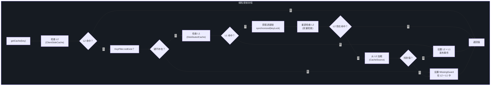
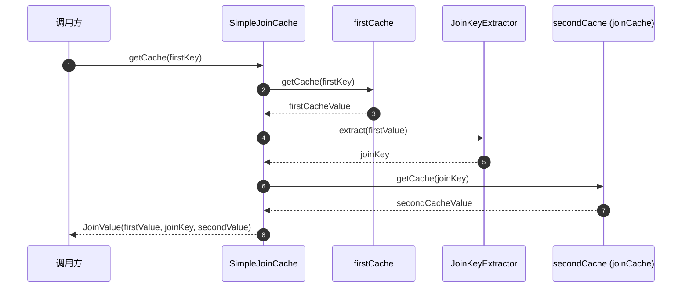
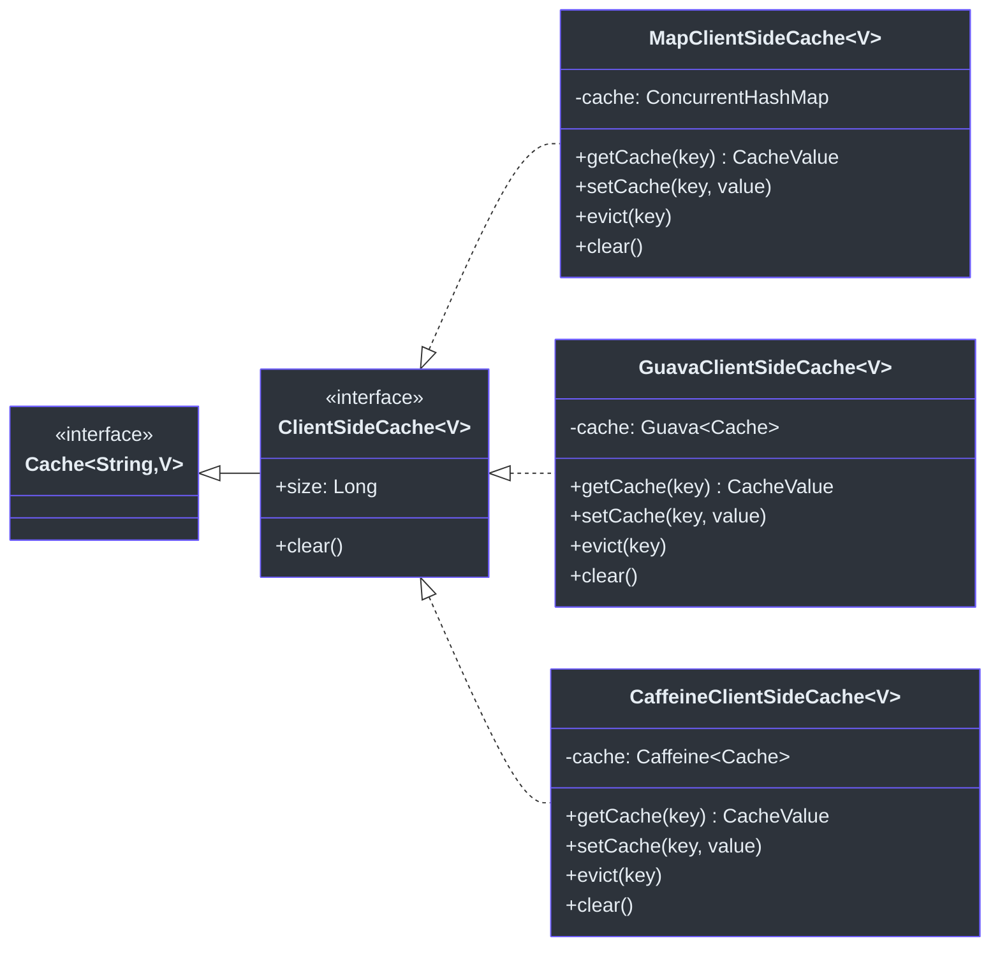
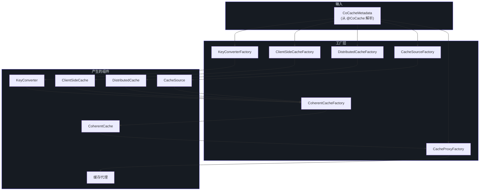

# 核心接口参考

本页面提供 CoCache 框架中每个核心接口的完整参考。接口按模块和功能区域进行组织。

## 缓存 API 接口 (cocache-api)

### Cache&lt;K, V&gt;

组合读写操作的根缓存接口。

| 方面 | 详情 | 源码 |
|--------|--------|--------|
| **包** | `me.ahoo.cache.api` | -- |
| **继承** | `CacheGetter<K, V>`、`CacheSetter<K, V>` | -- |
| **类型参数** | `K` -- 缓存键类型，`V` -- 缓存值类型 | -- |
| **源文件** | -- | [Cache.kt:21](https://github.com/Ahoo-Wang/CoCache/blob/main/cocache-api/src/main/kotlin/me/ahoo/cache/api/Cache.kt#L21) |

```kotlin
interface Cache<K, V> : CacheGetter<K, V>, CacheSetter<K, V>
```

`Cache<K, V>` 是一个纯组合接口。所有缓存层 -- `ClientSideCache`、`DistributedCache`、`CoherentCache` 和 `JoinCache` -- 最终都实现此接口。

### CacheGetter&lt;K, V&gt;

只读缓存访问接口。

| 方法 | 签名 | 说明 | 源码 |
|--------|-----------|-------------|--------|
| `getCache` | `fun getCache(key: K): CacheValue<V>?` | 返回完整的 `CacheValue` 包装（包括 TTL 元数据），不存在时返回 `null` | [CacheGetter.kt:21](https://github.com/Ahoo-Wang/CoCache/blob/main/cocache-api/src/main/kotlin/me/ahoo/cache/api/CacheGetter.kt#L21) |
| `get` | `operator fun get(key: K): V?` | 返回解包后的值或 `null`。去除 TTL 和缺失守卫信息 | [CacheGetter.kt:29](https://github.com/Ahoo-Wang/CoCache/blob/main/cocache-api/src/main/kotlin/me/ahoo/cache/api/CacheGetter.kt#L29) |
| `getTtlAt` | `fun getTtlAt(key: K): Long?` | 返回过期时间戳（秒），键不存在时返回 `null` | [CacheGetter.kt:37](https://github.com/Ahoo-Wang/CoCache/blob/main/cocache-api/src/main/kotlin/me/ahoo/cache/api/CacheGetter.kt#L37) |

### CacheSetter&lt;K, V&gt;

写入和驱逐接口。

| 方法 | 签名 | 说明 | 源码 |
|--------|-----------|-------------|--------|
| `set` | `operator fun set(key: K, ttlAt: Long, value: V)` | 使用显式过期时间戳设置值 | [CacheSetter.kt:18](https://github.com/Ahoo-Wang/CoCache/blob/main/cocache-api/src/main/kotlin/me/ahoo/cache/api/CacheSetter.kt#L18) |
| `set` | `operator fun set(key: K, value: V)` | 使用缓存的默认 TTL 配置设置值 | [CacheSetter.kt:20](https://github.com/Ahoo-Wang/CoCache/blob/main/cocache-api/src/main/kotlin/me/ahoo/cache/api/CacheSetter.kt#L20) |
| `setCache` | `fun setCache(key: K, value: CacheValue<V>)` | 设置预构造的 `CacheValue`（包含 TTL 和缺失守卫元数据） | [CacheSetter.kt:22](https://github.com/Ahoo-Wang/CoCache/blob/main/cocache-api/src/main/kotlin/me/ahoo/cache/api/CacheSetter.kt#L22) |
| `evict` | `fun evict(key: K)` | 从缓存中移除条目 | [CacheSetter.kt:29](https://github.com/Ahoo-Wang/CoCache/blob/main/cocache-api/src/main/kotlin/me/ahoo/cache/api/CacheSetter.kt#L29) |

### CacheValue&lt;V&gt;

将缓存值与 TTL 和缺失守卫元数据包装在一起。

| 属性/方法 | 类型 | 说明 | 源码 |
|-----------------|------|-------------|--------|
| `value` | `V` | 实际的缓存值 | [CacheValue.kt:21](https://github.com/Ahoo-Wang/CoCache/blob/main/cocache-api/src/main/kotlin/me/ahoo/cache/api/CacheValue.kt#L21) |
| `ttlAt` | `Long` | 过期时间戳（秒）（`ChronoUnit.SECONDS`） | [CacheValue.kt:28](https://github.com/Ahoo-Wang/CoCache/blob/main/cocache-api/src/main/kotlin/me/ahoo/cache/api/CacheValue.kt#L28) |
| `isMissingGuard` | `Boolean` | 该值是否为缺失键的占位符（防止缓存穿透） | [CacheValue.kt:30](https://github.com/Ahoo-Wang/CoCache/blob/main/cocache-api/src/main/kotlin/me/ahoo/cache/api/CacheValue.kt#L30) |

继承 `TtlAt`，获得 `isForever`、`isExpired` 和 `expiredDuration` 属性。

**默认实现**：[DefaultCacheValue](https://github.com/Ahoo-Wang/CoCache/blob/main/cocache-core/src/main/kotlin/me/ahoo/cache/DefaultCacheValue.kt) -- 伴生对象工厂方法：`forever()`、`ttlAt()`、`missingGuard()`。

### TtlAt

基于绝对时间戳的生存时间管理接口。

| 属性 | 类型 | 说明 | 源码 |
|----------|------|-------------|--------|
| `ttlAt` | `Long` | 绝对过期时间（秒） | [TtlAt.kt:23](https://github.com/Ahoo-Wang/CoCache/blob/main/cocache-api/src/main/kotlin/me/ahoo/cache/api/TtlAt.kt#L23) |
| `isForever` | `Boolean` | 此条目是否永不过期 | [TtlAt.kt:29](https://github.com/Ahoo-Wang/CoCache/blob/main/cocache-api/src/main/kotlin/me/ahoo/cache/api/TtlAt.kt#L29) |
| `isExpired` | `Boolean` | 当前时间是否已超过 `ttlAt` | [TtlAt.kt:30](https://github.com/Ahoo-Wang/CoCache/blob/main/cocache-api/src/main/kotlin/me/ahoo/cache/api/TtlAt.kt#L30) |
| `expiredDuration` | `Duration` | 距过期还有多少时间，以 `java.time.Duration` 表示 | [TtlAt.kt:31](https://github.com/Ahoo-Wang/CoCache/blob/main/cocache-api/src/main/kotlin/me/ahoo/cache/api/TtlAt.kt#L31) |

**默认实现**：[ComputedTtlAt](https://github.com/Ahoo-Wang/CoCache/blob/main/cocache-core/src/main/kotlin/me/ahoo/cache/ComputedTtlAt.kt) -- 提供静态工具方法 `at(ttl, amplitude)` 和 `isForever(ttl)`。

### NamedCache

通过逻辑名称标识缓存。

| 属性 | 类型 | 说明 | 源码 |
|----------|------|-------------|--------|
| `cacheName` | `String` | 缓存逻辑名称，用于 Bean 注册和事件路由 | [NamedCache.kt:21](https://github.com/Ahoo-Wang/CoCache/blob/main/cocache-api/src/main/kotlin/me/ahoo/cache/api/NamedCache.kt#L21) |

### ClientSideCache&lt;V&gt;

L2 客户端（进程内）缓存接口。

| 方面 | 详情 | 源码 |
|--------|--------|--------|
| **继承** | `Cache<String, V>` | -- |
| **键类型** | `String`（通过 `KeyConverter` 转换） | -- |
| **源文件** | -- | [ClientSideCache.kt:22](https://github.com/Ahoo-Wang/CoCache/blob/main/cocache-api/src/main/kotlin/me/ahoo/cache/api/client/ClientSideCache.kt#L22) |

| 属性/方法 | 类型 | 说明 |
|-----------------|------|-------------|
| `size` | `Long` | 客户端缓存中当前的条目数 |
| `clear` | `fun clear()` | 移除本地缓存中的所有条目 |

**实现**：

| 实现 | 说明 | 模块 |
|---------------|-------------|--------|
| `MapClientSideCache` | 基于 ConcurrentHashMap，无驱逐策略 | [cocache-core](https://github.com/Ahoo-Wang/CoCache/blob/main/cocache-core/src/main/kotlin/me/ahoo/cache/client/MapClientSideCache.kt) |
| `GuavaClientSideCache` | 基于 Guava `Cache`，支持可配置的大小/时间驱逐 | [cocache-core](https://github.com/Ahoo-Wang/CoCache/blob/main/cocache-core/src/main/kotlin/me/ahoo/cache/client/GuavaClientSideCache.kt) |
| `CaffeineClientSideCache` | 基于 Caffeine `Cache`，支持可配置的大小/时间驱逐 | [cocache-core](https://github.com/Ahoo-Wang/CoCache/blob/main/cocache-core/src/main/kotlin/me/ahoo/cache/client/CaffeineClientSideCache.kt) |

### CacheSource&lt;K, V&gt;

L0 数据源加载器接口。当 L2 和 L1 缓存都未命中时调用。

| 方法 | 签名 | 说明 | 源码 |
|--------|-----------|-------------|--------|
| `loadCacheValue` | `fun loadCacheValue(key: K): CacheValue<V>?` | 从底层数据源加载值。键不存在时返回 `null`。可能抛出 `TimeoutException` | [CacheSource.kt:24](https://github.com/Ahoo-Wang/CoCache/blob/main/cocache-api/src/main/kotlin/me/ahoo/cache/api/source/CacheSource.kt#L24) |

| 伴生方法 | 说明 |
|-----------------|-------------|
| `noOp()` | 返回始终返回 `null` 的单例 `NoOpCacheSource` |

**默认实现**：[NoOpCacheSource](https://github.com/Ahoo-Wang/CoCache/blob/main/cocache-api/src/main/kotlin/me/ahoo/cache/api/source/NoOpCacheSource.kt) -- 对象单例，始终返回 `null`。

## 核心模块接口 (cocache-core)

### DistributedCache&lt;V&gt;

L1 分布式（共享）缓存接口。

| 方面 | 详情 | 源码 |
|--------|--------|--------|
| **继承** | `ComputedCache<String, V>`、`AutoCloseable` | -- |
| **键类型** | `String` | -- |
| **源文件** | -- | [DistributedCache.kt:22](https://github.com/Ahoo-Wang/CoCache/blob/main/cocache-core/src/main/kotlin/me/ahoo/cache/distributed/DistributedCache.kt#L22) |

继承 `ComputedCache` 获得默认的 `get()`、`set()` 和 `getTtlAt()` 实现，继承 `AutoCloseable` 用于资源清理。

**实现**：

| 实现 | 说明 | 模块 |
|---------------|-------------|--------|
| `MockDistributedCache` | 用于测试的内存模拟 | [cocache-core](https://github.com/Ahoo-Wang/CoCache/blob/main/cocache-core/src/main/kotlin/me/ahoo/cache/distributed/mock/MockDistributedCache.kt) |
| `RedisDistributedCache` | 使用 `StringRedisTemplate` 的 Redis 分布式缓存 | [cocache-spring-redis](https://github.com/Ahoo-Wang/CoCache/blob/main/cocache-spring-redis/src/main/kotlin/me/ahoo/cache/spring/redis/RedisDistributedCache.kt) |

### DistributedClientId

在分布式系统中标识缓存客户端实例。

| 属性 | 类型 | 说明 | 源码 |
|----------|------|-------------|--------|
| `clientId` | `String` | 此缓存客户端实例的唯一标识符（用于避免处理自己发布的事件） | [DistributedClientId.kt:21](https://github.com/Ahoo-Wang/CoCache/blob/main/cocache-core/src/main/kotlin/me/ahoo/cache/distributed/DistributedClientId.kt#L21) |

默认客户端 ID 生成器：`HostClientIdGenerator`（使用主机地址）、`UUIDClientIdGenerator`（随机 UUID）。

### ComputedCache&lt;K, V&gt;

为 `Cache` 方法提供计算默认实现，桥接原始 `CacheValue` 访问与用户友好的 `get`/`set` 操作。

| 方面 | 详情 | 源码 |
|--------|--------|--------|
| **继承** | `Cache<K, V>`、`TtlConfiguration` | -- |
| **源文件** | -- | [ComputedCache.kt:20](https://github.com/Ahoo-Wang/CoCache/blob/main/cocache-core/src/main/kotlin/me/ahoo/cache/ComputedCache.kt#L20) |

关键行为：
- `get(key)` -- 调用 `getCache(key)`，如果为缺失守卫或已过期则返回 `null`
- `getTtlAt(key)` -- 调用 `getCache(key)`，如果为缺失守卫则返回 `null`
- `set(key, value)` -- 使用默认 TTL + 幅度抖动创建 `DefaultCacheValue`
- `set(key, ttlAt, value)` -- 使用显式 TTL 创建 `DefaultCacheValue`

### CoherentCache&lt;K, V&gt;

二级一致性缓存的中心接口，组合了所有缓存关注点。

| 方面 | 详情 | 源码 |
|--------|--------|--------|
| **继承** | `ComputedCache<K, V>`、`DistributedClientId`、`NamedCache`、`CacheEvictedSubscriber` | -- |
| **源文件** | -- | [CoherentCache.kt:25](https://github.com/Ahoo-Wang/CoCache/blob/main/cocache-core/src/main/kotlin/me/ahoo/cache/consistency/CoherentCache.kt#L25) |

| 属性 | 类型 | 说明 |
|----------|------|-------------|
| `cacheEvictedEventBus` | `CacheEvictedEventBus` | 用于发布/接收驱逐事件的事件总线 |
| `clientSideCache` | `ClientSideCache<V>` | L2 本地缓存 |
| `distributedCache` | `DistributedCache<V>` | L1 分布式缓存 |
| `keyFilter` | `KeyFilter` | 用于防止缓存穿透的布隆过滤器 |
| `keyConverter` | `KeyConverter<K>` | 将类型化键转换为字符串键 |
| `cacheSource` | `CacheSource<K, V>` | L0 数据源 |

**默认实现**：[DefaultCoherentCache](https://github.com/Ahoo-Wang/CoCache/blob/main/cocache-core/src/main/kotlin/me/ahoo/cache/consistency/DefaultCoherentCache.kt) -- 实现了细粒度锁以防止缓存击穿、缺失守卫缓存以防止缓存穿透，以及事件驱动的一致性。

### DefaultCoherentCache 细粒度锁

`DefaultCoherentCache.getCache()` 方法使用逐键锁，当多个线程请求相同的缺失键时防止缓存击穿：



### CoherentCacheConfiguration&lt;K, V&gt;

包含创建 `CoherentCache` 所需的所有配置的数据类。

| 属性 | 类型 | 默认值 | 源码 |
|----------|------|---------|--------|
| `cacheName` | `String` | （必需） | [CoherentCacheConfiguration.kt:27](https://github.com/Ahoo-Wang/CoCache/blob/main/cocache-core/src/main/kotlin/me/ahoo/cache/consistency/CoherentCacheConfiguration.kt#L27) |
| `clientId` | `String` | （必需） | [CoherentCacheConfiguration.kt:28](https://github.com/Ahoo-Wang/CoCache/blob/main/cocache-core/src/main/kotlin/me/ahoo/cache/consistency/CoherentCacheConfiguration.kt#L28) |
| `keyConverter` | `KeyConverter<K>` | （必需） | [CoherentCacheConfiguration.kt:29](https://github.com/Ahoo-Wang/CoCache/blob/main/cocache-core/src/main/kotlin/me/ahoo/cache/consistency/CoherentCacheConfiguration.kt#L29) |
| `distributedCache` | `DistributedCache<V>` | （必需） | [CoherentCacheConfiguration.kt:30](https://github.com/Ahoo-Wang/CoCache/blob/main/cocache-core/src/main/kotlin/me/ahoo/cache/consistency/CoherentCacheConfiguration.kt#L30) |
| `clientSideCache` | `ClientSideCache<V>` | `MapClientSideCache()` | [CoherentCacheConfiguration.kt:31](https://github.com/Ahoo-Wang/CoCache/blob/main/cocache-core/src/main/kotlin/me/ahoo/cache/consistency/CoherentCacheConfiguration.kt#L31) |
| `cacheSource` | `CacheSource<K, V>` | `CacheSource.noOp()` | [CoherentCacheConfiguration.kt:32](https://github.com/Ahoo-Wang/CoCache/blob/main/cocache-core/src/main/kotlin/me/ahoo/cache/consistency/CoherentCacheConfiguration.kt#L32) |
| `keyFilter` | `KeyFilter` | `NoOpKeyFilter` | [CoherentCacheConfiguration.kt:33](https://github.com/Ahoo-Wang/CoCache/blob/main/cocache-core/src/main/kotlin/me/ahoo/cache/consistency/CoherentCacheConfiguration.kt#L33) |

## 缓存一致性接口

### CacheEvictedEventBus

用于缓存驱逐事件的发布-订阅事件总线，确保分布式缓存一致性。

| 方法 | 签名 | 说明 | 源码 |
|--------|-----------|-------------|--------|
| `publish` | `fun publish(event: CacheEvictedEvent)` | 向所有订阅者发布驱逐事件 | [CacheEvictedEventBus.kt:20](https://github.com/Ahoo-Wang/CoCache/blob/main/cocache-core/src/main/kotlin/me/ahoo/cache/consistency/CacheEvictedEventBus.kt#L20) |
| `register` | `fun register(subscriber: CacheEvictedSubscriber)` | 注册订阅者以接收驱逐事件 | [CacheEvictedEventBus.kt:21](https://github.com/Ahoo-Wang/CoCache/blob/main/cocache-core/src/main/kotlin/me/ahoo/cache/consistency/CacheEvictedEventBus.kt#L21) |
| `unregister` | `fun unregister(subscriber: CacheEvictedSubscriber)` | 移除订阅者使其不再接收事件 | [CacheEvictedEventBus.kt:22](https://github.com/Ahoo-Wang/CoCache/blob/main/cocache-core/src/main/kotlin/me/ahoo/cache/consistency/CacheEvictedEventBus.kt#L22) |

**实现**：

| 实现 | 范围 | 说明 | 模块 |
|---------------|-------|-------------|--------|
| `GuavaCacheEvictedEventBus` | 单 JVM | 使用 Guava `EventBus` 进行进程内发布/订阅 | [cocache-core](https://github.com/Ahoo-Wang/CoCache/blob/main/cocache-core/src/main/kotlin/me/ahoo/cache/consistency/GuavaCacheEvictedEventBus.kt) |
| `NoOpCacheEvictedEventBus` | 无 | 空操作单例，事件被丢弃 | [cocache-core](https://github.com/Ahoo-Wang/CoCache/blob/main/cocache-core/src/main/kotlin/me/ahoo/cache/consistency/NoOpCacheEvictedEventBus.kt) |
| `RedisCacheEvictedEventBus` | 分布式 | 使用 Redis Pub/Sub 进行跨实例事件传播 | [cocache-spring-redis](https://github.com/Ahoo-Wang/CoCache/blob/main/cocache-spring-redis/src/main/kotlin/me/ahoo/cache/spring/redis/RedisCacheEvictedEventBus.kt) |

### CacheEvictedSubscriber

响应缓存驱逐事件的组件接口。

| 方法 | 签名 | 说明 | 源码 |
|--------|-----------|-------------|--------|
| `onEvicted` | `fun onEvicted(cacheEvictedEvent: CacheEvictedEvent)` | 收到缓存驱逐事件时调用 | [CacheEvictedSubscriber.kt:23](https://github.com/Ahoo-Wang/CoCache/blob/main/cocache-core/src/main/kotlin/me/ahoo/cache/consistency/CacheEvictedSubscriber.kt#L23) |

继承 `NamedCache`，使订阅者知道自己属于哪个缓存。

### CacheEvictedEvent

表示缓存驱逐事件的数据类。

| 属性 | 类型 | 说明 | 源码 |
|----------|------|-------------|--------|
| `cacheName` | `String` | 条目被驱逐的缓存名称 | [CacheEvictedEvent.kt:21](https://github.com/Ahoo-Wang/CoCache/blob/main/cocache-core/src/main/kotlin/me/ahoo/cache/consistency/CacheEvictedEvent.kt#L21) |
| `key` | `String` | 被驱逐的缓存键（字符串转换后） | [CacheEvictedEvent.kt:28](https://github.com/Ahoo-Wang/CoCache/blob/main/cocache-core/src/main/kotlin/me/ahoo/cache/consistency/CacheEvictedEvent.kt#L28) |
| `publisherId` | `String` | 发布事件的实例的客户端 ID | [CacheEvictedEvent.kt:34](https://github.com/Ahoo-Wang/CoCache/blob/main/cocache-core/src/main/kotlin/me/ahoo/cache/consistency/CacheEvictedEvent.kt#L34) |

## JoinCache 接口 (cocache-api)

### JoinCache&lt;K1, V1, K2, V2&gt;

将两个缓存值组合为单个 `JoinValue` 结果。

| 方面 | 详情 | 源码 |
|--------|--------|--------|
| **继承** | `Cache<K1, JoinValue<V1, K2, V2>>` | -- |
| **源文件** | -- | [JoinCache.kt:23](https://github.com/Ahoo-Wang/CoCache/blob/main/cocache-api/src/main/kotlin/me/ahoo/cache/api/join/JoinCache.kt#L23) |

| 属性/方法 | 类型 | 说明 |
|-----------------|------|-------------|
| `joinKeyExtractor` | `JoinKeyExtractor<V1, K2>` | 从第一个值中提取关联键 |
| `evict` | `fun evict(firstKey: K1, joinKey: K2)` | 同时从第一个缓存和关联缓存中驱逐条目 |

### JoinValue&lt;V1, K2, V2&gt;

将主值与关联的次要值组合的结果类型。

| 属性 | 类型 | 说明 | 源码 |
|----------|------|-------------|--------|
| `firstValue` | `V1` | 主缓存值 | [JoinValue.kt:16](https://github.com/Ahoo-Wang/CoCache/blob/main/cocache-api/src/main/kotlin/me/ahoo/cache/api/join/JoinValue.kt#L16) |
| `joinKey` | `K2` | 用于查找次要值的键 | [JoinValue.kt:17](https://github.com/Ahoo-Wang/CoCache/blob/main/cocache-api/src/main/kotlin/me/ahoo/cache/api/join/JoinValue.kt#L17) |
| `secondValue` | `V2?` | 关联的次要值（可为 null，未找到时） | [JoinValue.kt:18](https://github.com/Ahoo-Wang/CoCache/blob/main/cocache-api/src/main/kotlin/me/ahoo/cache/api/join/JoinValue.kt#L18) |

**默认实现**：[DefaultJoinValue](https://github.com/Ahoo-Wang/CoCache/blob/main/cocache-core/src/main/kotlin/me/ahoo/cache/join/DefaultJoinValue.kt)

### JoinKeyExtractor&lt;V1, K2&gt;

用于从主值中提取关联键的函数式接口。

| 方法 | 签名 | 说明 | 源码 |
|--------|-----------|-------------|--------|
| `extract` | `fun extract(firstValue: V1): K2` | 从第一个缓存值中提取关联键 | [JoinKeyExtractor.kt:8](https://github.com/Ahoo-Wang/CoCache/blob/main/cocache-api/src/main/kotlin/me/ahoo/cache/api/join/JoinKeyExtractor.kt#L8) |

**实现**：`ExpJoinKeyExtractor`（基于 SpEL 表达式，在 cocache-core 中）。

### JoinCache 流程

JoinCache 检索流程通过获取主值、提取关联键、然后获取次要值来工作：



## 键过滤器接口

### KeyFilter

缓存键过滤器接口，旨在适配布隆过滤器以防止缓存击穿。

| 方法 | 签名 | 说明 | 源码 |
|--------|-----------|-------------|--------|
| `notExist` | `fun notExist(key: String): Boolean` | 如果键确定不在数据源中，则返回 `true` | [KeyFilter.kt:22](https://github.com/Ahoo-Wang/CoCache/blob/main/cocache-core/src/main/kotlin/me/ahoo/cache/KeyFilter.kt#L22) |

**实现**：

| 实现 | 说明 | 模块 |
|---------------|-------------|--------|
| `NoOpKeyFilter` | 始终返回 `false`（无过滤） | [cocache-core](https://github.com/Ahoo-Wang/CoCache/blob/main/cocache-core/src/main/kotlin/me/ahoo/cache/filter/NoOpKeyFilter.kt) |
| `BloomKeyFilter` | 使用 Guava `BloomFilter` 进行概率性键存在性检查 | [cocache-core](https://github.com/Ahoo-Wang/CoCache/blob/main/cocache-core/src/main/kotlin/me/ahoo/cache/filter/BloomKeyFilter.kt) |

### 客户端缓存实现



## 键转换器接口

### KeyConverter&lt;K&gt;

将类型化的缓存键转换为用于存储的字符串键。

| 方法 | 签名 | 说明 | 源码 |
|--------|-----------|-------------|--------|
| `toStringKey` | `fun toStringKey(sourceKey: K): String` | 将类型化键转换为带前缀的字符串表示 | [KeyConverter.kt:8](https://github.com/Ahoo-Wang/CoCache/blob/main/cocache-core/src/main/kotlin/me/ahoo/cache/converter/KeyConverter.kt#L8) |

**实现**：

| 实现 | 说明 | 源码 |
|---------------|-------------|--------|
| `ToStringKeyConverter<K>` | 简单的 `keyPrefix + sourceKey.toString()` | [ToStringKeyConverter.kt:20](https://github.com/Ahoo-Wang/CoCache/blob/main/cocache-core/src/main/kotlin/me/ahoo/cache/converter/ToStringKeyConverter.kt#L20) |
| `ExpKeyConverter<K>` | 基于 SpEL 表达式的键生成，带前缀 | [ExpKeyConverter.kt:24](https://github.com/Ahoo-Wang/CoCache/blob/main/cocache-core/src/main/kotlin/me/ahoo/cache/converter/ExpKeyConverter.kt#L24) |

## MissingGuard

通过使用哨兵标记缓存 null/缺失值来防止缓存穿透。

| 常量/扩展 | 说明 | 源码 |
|-------------------|-------------|--------|
| `STRING_VALUE = "_nil_"` | `String`、`Set` 或 `Map` 类型缺失值的哨兵字符串 | [MissingGuard.kt:18](https://github.com/Ahoo-Wang/CoCache/blob/main/cocache-core/src/main/kotlin/me/ahoo/cache/MissingGuard.kt#L18) |
| `Any?.isMissingGuard` | 检查值是否为缺失守卫的扩展属性 | [MissingGuard.kt:19](https://github.com/Ahoo-Wang/CoCache/blob/main/cocache-core/src/main/kotlin/me/ahoo/cache/MissingGuard.kt#L19) |

## 工厂接口

所有工厂接口遵循共同的模式：接受 `CoCacheMetadata`（或 `JoinCacheMetadata`）并生成相应的缓存组件。

| 工厂接口 | 产出 | 源码 |
|-------------------|----------|--------|
| `CacheFactory` | 按名称/类型的命名 `Cache` 实例 | [CacheFactory.kt:19](https://github.com/Ahoo-Wang/CoCache/blob/main/cocache-core/src/main/kotlin/me/ahoo/cache/CacheFactory.kt#L19) |
| `CoherentCacheFactory` | 从 `CoherentCacheConfiguration` 创建 `CoherentCache` | [CoherentCacheFactory.kt:16](https://github.com/Ahoo-Wang/CoCache/blob/main/cocache-core/src/main/kotlin/me/ahoo/cache/consistency/CoherentCacheFactory.kt#L16) |
| `CacheProxyFactory` | 基于代理的 `Cache` 实现 | [CacheProxyFactory.kt:19](https://github.com/Ahoo-Wang/CoCache/blob/main/cocache-core/src/main/kotlin/me/ahoo/cache/proxy/CacheProxyFactory.kt#L19) |
| `ClientSideCacheFactory` | `ClientSideCache<V>` 实例 | [ClientSideCacheFactory.kt:19](https://github.com/Ahoo-Wang/CoCache/blob/main/cocache-core/src/main/kotlin/me/ahoo/cache/client/ClientSideCacheFactory.kt#L19) |
| `DistributedCacheFactory` | `DistributedCache<V>` 实例 | [DistributedCacheFactory.kt:18](https://github.com/Ahoo-Wang/CoCache/blob/main/cocache-core/src/main/kotlin/me/ahoo/cache/distributed/DistributedCacheFactory.kt#L18) |
| `CacheSourceFactory` | `CacheSource<K, V>` 实例 | [CacheSourceFactory.kt:19](https://github.com/Ahoo-Wang/CoCache/blob/main/cocache-core/src/main/kotlin/me/ahoo/cache/source/CacheSourceFactory.kt#L19) |
| `KeyConverterFactory` | `KeyConverter<K>` 实例 | [KeyConverterFactory.kt:18](https://github.com/Ahoo-Wang/CoCache/blob/main/cocache-core/src/main/kotlin/me/ahoo/cache/converter/KeyConverterFactory.kt#L18) |
| `JoinKeyExtractorFactory` | `JoinKeyExtractor<V1, K2>` 实例 | [JoinKeyExtractorFactory.kt:19](https://github.com/Ahoo-Wang/CoCache/blob/main/cocache-core/src/main/kotlin/me/ahoo/cache/join/JoinKeyExtractorFactory.kt#L19) |
| `JoinCacheProxyFactory` | 基于代理的 `JoinCache` 实现 | [JoinCacheProxyFactory.kt:19](https://github.com/Ahoo-Wang/CoCache/blob/main/cocache-core/src/main/kotlin/me/ahoo/cache/join/proxy/JoinCacheProxyFactory.kt#L19) |

## 接口关系图

下图展示了工厂接口如何组合以产生可工作的缓存：



## 相关页面

- [API 概览](./index.md) -- 架构概览和模块组织
- [注解](./annotations.md) -- 完整的注解参考
- [Spring 集成](./spring-integration.md) -- Spring 和 Spring Boot 集成 API
- [Actuator 端点](./actuator.md) -- 监控和管理端点
