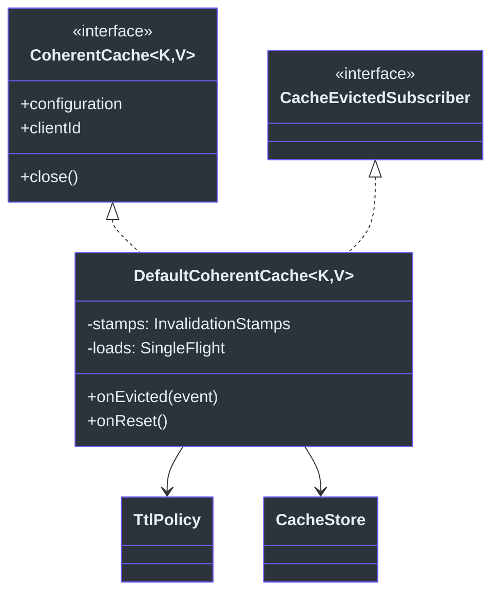
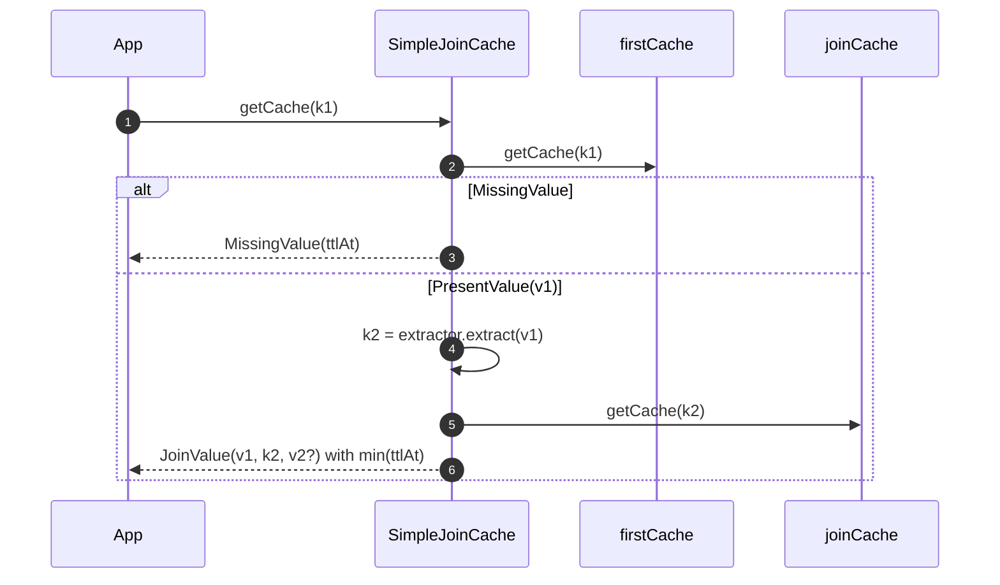

# 核心接口参考

所有面向用户的接口和 SPI 都位于 `cocache-api`，没有运行时依赖。`cocache-core` 在此基础上提供编排（`CoherentCache`、`TtlPolicy`）和默认实现。

## 缓存 API（cocache-api）

### Cache&lt;K, V&gt;

```kotlin
interface Cache<K, V> : CacheGetter<K, V>, CacheSetter<K, V>

interface CacheGetter<K, V> {
    fun getCache(key: K): CacheValue<V>?          // 可能为 MissingValue
    operator fun get(key: K): V?                  // 不存在、负缓存或已过期均为 null
    fun getTtlAt(key: K): Long?                   // 不存在、负缓存或已过期均为 null
}

interface CacheSetter<K, V> {
    fun setCache(key: K, value: CacheValue<V>)    // 已过期 == evict
    operator fun set(key: K, ttlAt: Long, value: V)
    operator fun set(key: K, value: V)            // 按缓存自身 TTL 策略；null → 负缓存
    fun evict(key: K)
}
```

`get`、`getTtlAt`、`set(key, ttlAt, value)` 都有默认实现，因此一个 `Cache` 只需实现 `getCache`、`setCache`、`set(key, value)` 和 `evict`。

### CacheValue&lt;V&gt;（密封）

```kotlin
sealed interface CacheValue<out V> : TtlAt {
    val value: V?          // MissingValue 时为 null
    val isMissing: Boolean
    companion object {
        fun <V> of(value: V?, ttlAt: Long): CacheValue<V>   // null → MissingValue
        fun <V> forever(value: V?): CacheValue<V>
        fun <V> missing(ttlAt: Long = TtlAt.FOREVER): CacheValue<V>
    }
}
data class PresentValue<out V>(override val value: V, override val ttlAt: Long) : CacheValue<V>
data class MissingValue(override val ttlAt: Long) : CacheValue<Nothing>
```

负缓存是显式状态。任何业务值都不会被解释为负缓存，包括形如 Redis 哨兵的字符串或集合。

### TtlAt

`ttlAt` 是绝对纪元秒；`TtlAt.FOREVER = Long.MAX_VALUE`。`isForever`、`isExpired`、`expiredDuration` 都由它派生。辅助方法：`TtlAt.currentTime()`，以及 `TtlAt.at(ttl, amplitude = 0)`（相对时长 → 绝对时间，抖动后钳为正数）。

### CacheSource&lt;K, V&gt;

```kotlin
fun interface CacheSource<K, V> {
    fun loadCacheValue(key: K): CacheValue<V>?    // null → 以 missingTtl 写入负缓存
    companion object { fun <K, V> noOp(): CacheSource<K, V> }
}
```

## 存储 SPI（cocache-api）

### CacheStore&lt;V&gt;、ClientSideCache&lt;V&gt;、DistributedCache&lt;V&gt;

```kotlin
interface CacheStore<V> {
    fun getCache(key: String): CacheValue<V>?     // 可能返回已过期条目
    fun setCache(key: String, value: CacheValue<V>)
    fun evict(key: String)
}
interface ClientSideCache<V> : CacheStore<V> { val size: Long; fun clear() }
interface DistributedCache<V> : CacheStore<V>, AutoCloseable
```

存储层不持有 TTL 策略。`DistributedCache.getCache` 的契约：`null` 表示**未命中**，调用方会回源；只有存储中确实有负缓存记录时才返回 `MissingValue`。

| 实现 | 层级 | 源码 |
|------|------|------|
| `CaffeineClientSideCache` | L2（默认，有界，条目级过期） | [CaffeineClientSideCache.kt](https://github.com/Ahoo-Wang/CoCache/blob/main/cocache-core/src/main/kotlin/me/ahoo/cache/client/CaffeineClientSideCache.kt) |
| `MapClientSideCache` | L2（无界，测试用） | [MapClientSideCache.kt](https://github.com/Ahoo-Wang/CoCache/blob/main/cocache-core/src/main/kotlin/me/ahoo/cache/client/MapClientSideCache.kt) |
| `RedisDistributedCache` | L1 | [RedisDistributedCache.kt](https://github.com/Ahoo-Wang/CoCache/blob/main/cocache-spring-redis/src/main/kotlin/me/ahoo/cache/spring/redis/RedisDistributedCache.kt) |
| `InMemoryDistributedCache` | L1（测试 / 单进程） | [InMemoryDistributedCache.kt](https://github.com/Ahoo-Wang/CoCache/blob/main/cocache-core/src/main/kotlin/me/ahoo/cache/distributed/InMemoryDistributedCache.kt) |

### KeyConverter&lt;K&gt; 与 KeyFilter

```kotlin
fun interface KeyConverter<K> { fun toStringKey(sourceKey: K): String }
fun interface KeyFilter { fun notExist(key: String): Boolean; companion object { val NO_OP: KeyFilter } }
```

内置实现：`ToStringKeyConverter(prefix)`、`ExpKeyConverter(prefix, "#{...}")`（编译模式的 SpEL 模板）、`BloomKeyFilter(guavaBloomFilter)`。

## 失效通道 SPI（cocache-api）

```kotlin
data class CacheEvictedEvent(val cacheName: String, val key: String, val publisherId: String)
interface CacheEvictedSubscriber : NamedCache {
    fun onEvicted(cacheEvictedEvent: CacheEvictedEvent)
    fun onReset()        // 通道（重新）订阅：放弃全部本地副本
}
interface CacheEvictedEventBus {
    fun publish(event: CacheEvictedEvent)
    fun register(subscriber: CacheEvictedSubscriber)
    fun unregister(subscriber: CacheEvictedSubscriber)
}
```

实现：`RedisCacheEvictedEventBus`、`LocalCacheEvictedEventBus`、`NoOpCacheEvictedEventBus`。见[缓存一致性](../architecture/coherence.md)。

## 编排（cocache-core）

### CoherentCache&lt;K, V&gt;

```kotlin
interface CoherentCache<K, V> : Cache<K, V>, NamedCache, AutoCloseable {
    val configuration: CoherentCacheConfiguration<K, V>
    val clientId: String
}

data class CoherentCacheConfiguration<K, V>(
    val cacheName: String,
    val clientId: String,
    val keyConverter: KeyConverter<K>,
    val distributedCache: DistributedCache<V>,
    val clientSideCache: ClientSideCache<V> = CaffeineClientSideCache.build(),
    val cacheSource: CacheSource<K, V> = CacheSource.noOp(),
    val keyFilter: KeyFilter = KeyFilter.NO_OP,
    val ttlPolicy: TtlPolicy = TtlPolicy()
)
```

实现类是 `DefaultCoherentCache`。通过 `DefaultCoherentCacheFactory(eventBus).create(configuration)` 创建，工厂会同时把它注册到总线。


```mermaid
classDiagram
    class CoherentCache~K,V~ {
        <<interface>>
        +configuration
        +clientId
        +close()
    }
    class DefaultCoherentCache~K,V~ {
        -stamps: InvalidationStamps
        -loads: SingleFlight
        +onEvicted(event)
        +onReset()
    }
    class CacheEvictedSubscriber {
        <<interface>>
    }
    CoherentCache <|.. DefaultCoherentCache
    CacheEvictedSubscriber <|.. DefaultCoherentCache
    DefaultCoherentCache --> TtlPolicy
    DefaultCoherentCache --> CacheStore

    style CoherentCache fill:#2d333b,stroke:#6d5dfc,color:#e6edf3
    style DefaultCoherentCache fill:#2d333b,stroke:#6d5dfc,color:#e6edf3
    style CacheEvictedSubscriber fill:#2d333b,stroke:#6d5dfc,color:#e6edf3
    style TtlPolicy fill:#2d333b,stroke:#6d5dfc,color:#e6edf3
    style CacheStore fill:#2d333b,stroke:#6d5dfc,color:#e6edf3
```

### TtlPolicy

```kotlin
data class TtlPolicy(val ttl: Long = 3600, val ttlAmplitude: Long = 60, val missingTtl: Long = 60) {
    fun <V> toCacheValue(value: V?): CacheValue<V>   // 值：ttl ± amplitude；null：missingTtl
    fun <V> missing(): CacheValue<V>
}
```

### SingleFlight&lt;K, R&gt;

`execute(key) { ... }` 保证同一 key 同一时刻只执行一次代码块，并发调用者共享其结果或原始异常。同一线程重入同一 key 会快速失败。

## JoinCache（cocache-api）

```kotlin
interface JoinCache<K1, V1, K2, V2> : Cache<K1, JoinValue<V1, K2, V2>> {
    val joinKeyExtractor: JoinKeyExtractor<V1, K2>
    fun evict(firstKey: K1, joinKey: K2)          // 同时淘汰两者
}
data class JoinValue<V1, K2, V2>(val firstValue: V1, val joinKey: K2, val secondValue: V2?)
fun interface JoinKeyExtractor<V1, K2> { fun extract(firstValue: V1): K2 }
```


```mermaid
sequenceDiagram
autonumber
    participant App
    participant J as SimpleJoinCache
    participant F as firstCache
    participant S as joinCache

    App->>J: getCache(k1)
    J->>F: getCache(k1)
    alt MissingValue
        J-->>App: MissingValue(ttlAt)
    else PresentValue(v1)
        J->>J: k2 = extractor.extract(v1)
        J->>S: getCache(k2)
        J-->>App: JoinValue(v1, k2, v2?) with min(ttlAt)
    end
```

`SimpleJoinCache.evict(key)` 只淘汰主缓存，因为关联缓存有自己的生命周期。`set(key, joinValue)` 让各组件按自身缓存的 TTL 策略写入。

## 工厂接口（cocache-core）

| 接口 | 创建 | Spring 实现 |
|------|------|-------------|
| `CacheProxyFactory` | `@CoCache` 代理 | `DefaultCacheProxyFactory` |
| `JoinCacheProxyFactory` | `@JoinCacheable` 代理 | `DefaultJoinCacheProxyFactory` |
| `CoherentCacheFactory` | `CoherentCache` | `DefaultCoherentCacheFactory` |
| `ClientSideCacheFactory` | L2 | `SpringClientSideCacheFactory` |
| `DistributedCacheFactory` | L1 | `RedisDistributedCacheFactory` |
| `KeyConverterFactory` | `KeyConverter` | `SpringKeyConverterFactory` |
| `CacheSourceFactory` | `CacheSource` | `SpringCacheSourceFactory` |
| `JoinKeyExtractorFactory` | `JoinKeyExtractor` | `SpringJoinKeyExtractorFactory` |

## 相关页面

- [API 概览](./index.md)
- [注解](./annotations.md)
- [缓存层级](../architecture/cache-layers.md)
