# API 概览

CoCache 的 API 设计遵循接口驱动原则，核心接口定义在 `cocache-api` 模块中，实现分布在 `cocache-core` 和其他模块中。

## API 分层

```mermaid
graph TB
    subgraph sg_104 ["cocache-api（接口层）"]
        Cache["Cache&lt;K,V&gt;"]
        CacheValue["CacheValue&lt;V&gt;"]
        CSC["ClientSideCache&lt;V&gt;"]
        CS["CacheSource&lt;K,V&gt;"]
        JC["JoinCache&lt;K1,V1,K2,V2&gt;"]
        Annotations["注解<br>@CoCache, @GuavaCache<br>@CaffeineCache, @JoinCacheable"]
    end

    subgraph sg_105 ["cocache-core（核心实现层）"]
        DCC["DefaultCoherentCache"]
        Proxy["CoCacheInvocationHandler"]
        EB["GuavaCacheEvictedEventBus"]
        KC["KeyConverter"]
        KF["KeyFilter"]
    end

    subgraph sg_106 ["cocache-spring（Spring 集成层）"]
        EnableCoCache["@EnableCoCache"]
        FBF["CacheProxyFactoryBean"]
        SCF["SpringCacheFactory"]
    end

    Cache --> DCC
    CacheValue --> DCC
    CSC --> DCC
    CS --> DCC
    Annotations --> Proxy
    EB --> DCC
    KC --> DCC
    KF --> DCC
    EnableCoCache --> FBF

    style Cache fill:#2d333b,stroke:#6d5dfc,color:#e6edf3
    style CacheValue fill:#2d333b,stroke:#6d5dfc,color:#e6edf3
    style CSC fill:#2d333b,stroke:#6d5dfc,color:#e6edf3
    style CS fill:#2d333b,stroke:#6d5dfc,color:#e6edf3
    style JC fill:#2d333b,stroke:#6d5dfc,color:#e6edf3
    style Annotations fill:#2d333b,stroke:#6d5dfc,color:#e6edf3
    style DCC fill:#2d333b,stroke:#6d5dfc,color:#e6edf3
    style Proxy fill:#2d333b,stroke:#6d5dfc,color:#e6edf3
    style EB fill:#2d333b,stroke:#6d5dfc,color:#e6edf3
    style KC fill:#2d333b,stroke:#6d5dfc,color:#e6edf3
    style KF fill:#2d333b,stroke:#6d5dfc,color:#e6edf3
    style EnableCoCache fill:#2d333b,stroke:#6d5dfc,color:#e6edf3
    style FBF fill:#2d333b,stroke:#6d5dfc,color:#e6edf3
    style SCF fill:#2d333b,stroke:#6d5dfc,color:#e6edf3
```

## 核心接口

| 接口 | 模块 | 说明 |
|------|------|------|
| `Cache<K, V>` | cocache-api | 基础缓存接口，组合 `CacheGetter` 和 `CacheSetter` |
| `CacheValue<V>` | cocache-api | 缓存值包装，包含值、TTL 和 MissingGuard 标记 |
| `TtlAt` | cocache-api | TTL 管理接口，提供过期判断 |
| `NamedCache` | cocache-api | 命名缓存接口 |
| `ClientSideCache<V>` | cocache-api | L2 客户端缓存接口 |
| `CacheSource<K, V>` | cocache-api | L0 数据源接口 |
| `DistributedCache<V>` | cocache-core | L1 分布式缓存接口 |
| `CoherentCache<K, V>` | cocache-core | 二级一致性缓存接口 |
| `ComputedCache<K, V>` | cocache-core | 计算缓存，封装 get/set 逻辑 |
| `JoinCache<K1, V1, K2, V2>` | cocache-api | 组合缓存接口 |
| `JoinValue<V1, K2, V2>` | cocache-api | 组合值类型 |
| `CacheEvictedEventBus` | cocache-core | 缓存失效事件总线 |
| `KeyFilter` | cocache-core | 键过滤器（布隆过滤器） |
| `KeyConverter<K>` | cocache-core | 键转换器 |

详细说明请参阅 [核心接口](./core-interfaces.md)。

## 注解

| 注解 | 模块 | 说明 |
|------|------|------|
| `@CoCache` | cocache-api | 标记缓存接口，配置缓存名称、前缀、TTL 等 |
| `@GuavaCache` | cocache-api | 配置 Guava 客户端缓存参数 |
| `@CaffeineCache` | cocache-api | 配置 Caffeine 客户端缓存参数 |
| `@JoinCacheable` | cocache-api | 标记 JoinCache 接口 |
| `@EnableCoCache` | cocache-spring | 启用 CoCache 并注册缓存代理 |
| `@ConditionalOnCoCacheEnabled` | cocache-spring-boot-starter | 条件化自动配置 |

详细说明请参阅 [注解](./annotations.md)。

## Spring 集成

| 组件 | 说明 |
|------|------|
| `EnableCoCacheRegistrar` | 解析 `@EnableCoCache` 并注册 Bean |
| `CacheProxyFactoryBean` | 创建缓存代理的 FactoryBean |
| `SpringCacheFactory` | 基于 BeanFactory 的缓存工厂 |
| `CoCacheManager` | Spring Cache 抽象桥接 |

详细说明请参阅 [Spring 集成](./spring-integration.md)。

## Actuator 端点

| 端点 | ID | 说明 |
|------|----|------|
| `CoCacheEndpoint` | `cocache` | 缓存统计、查询、驱逐 |
| `CoCacheClientEndpoint` | `cocacheClient` | 客户端缓存统计 |

详细说明请参阅 [Actuator 端点](./actuator.md)。

## 相关页面

- [核心接口](./core-interfaces.md) - 接口详解
- [注解](./annotations.md) - 注解参考
- [Spring 集成](./spring-integration.md) - Spring 集成说明
- [Actuator 端点](./actuator.md) - 监控端点
