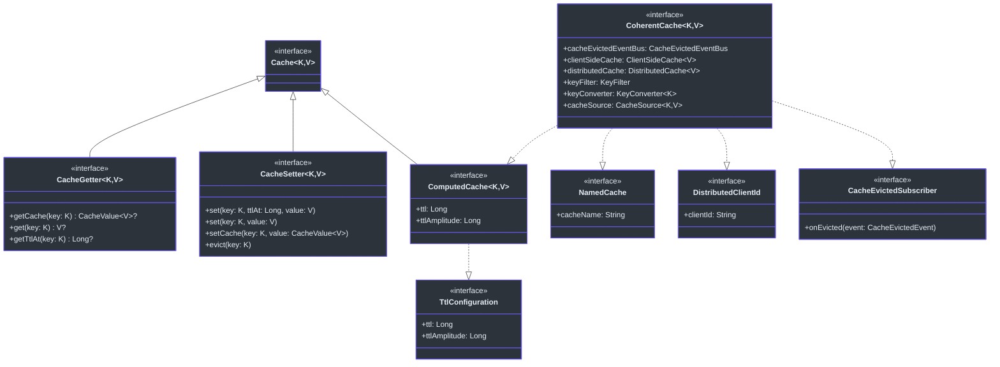
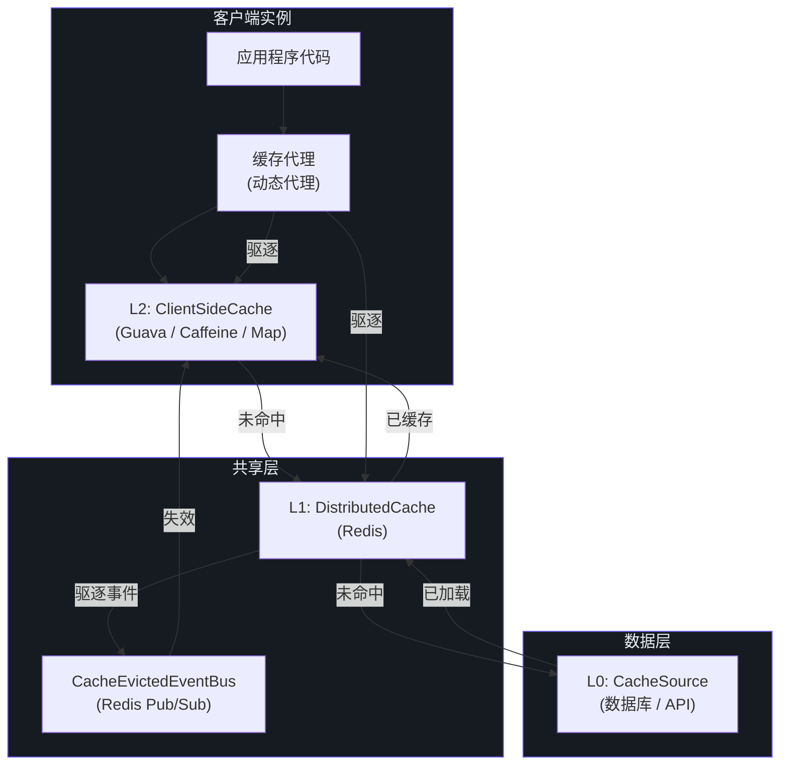
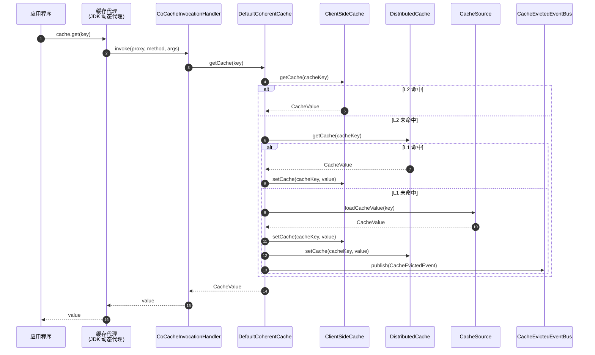
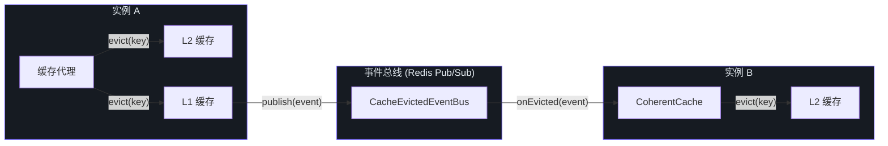
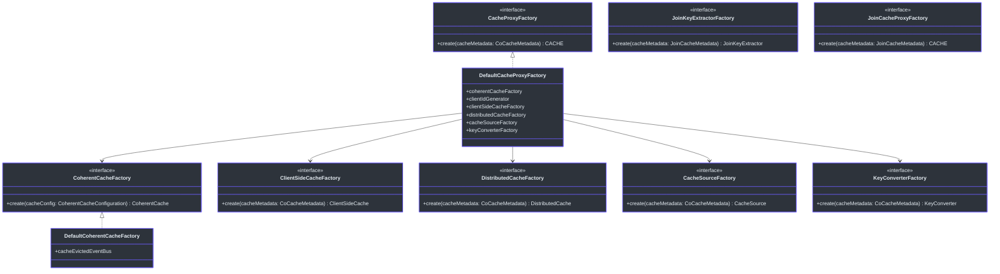

# CoCache API 概览

CoCache 为 Java/Kotlin 应用提供了**二级分布式一致性缓存框架**。API 按多个模块进行组织，每个模块负责缓存架构中的不同层次。

## 模块组织

API 表面分布在以下模块中，按从底层到高层的顺序排列：

| 模块 | 构件 | 用途 | 源码 |
|--------|----------|---------|--------|
| **cocache-api** | 核心接口和注解 | 定义 `Cache`、`CacheValue`、`ClientSideCache`、`CacheSource`、`JoinCache` 及所有缓存注解 | [cocache-api/src/main/kotlin/me/ahoo/cache/api](https://github.com/Ahoo-Wang/CoCache/blob/main/cocache-api/src/main/kotlin/me/ahoo/cache/api) |
| **cocache-core** | 默认实现 | 提供 `DefaultCoherentCache`、基于代理的缓存、键转换器、事件总线、键过滤器 | [cocache-core/src/main/kotlin/me/ahoo/cache](https://github.com/Ahoo-Wang/CoCache/blob/main/cocache-core/src/main/kotlin/me/ahoo/cache) |
| **cocache-spring** | Spring Framework 集成 | Factory Bean、`@EnableCoCache`、感知 Spring 的客户端缓存/分布式缓存工厂 | [cocache-spring/src/main/kotlin/me/ahoo/cache/spring](https://github.com/Ahoo-Wang/CoCache/blob/main/cocache-spring/src/main/kotlin/me/ahoo/cache/spring) |
| **cocache-spring-redis** | Redis 分布式缓存 | `RedisDistributedCache`、`RedisCacheEvictedEventBus`、`RedisDistributedCacheFactory` | [cocache-spring-redis/src/main/kotlin/me/ahoo/cache/spring/redis](https://github.com/Ahoo-Wang/CoCache/blob/main/cocache-spring-redis/src/main/kotlin/me/ahoo/cache/spring/redis) |
| **cocache-spring-cache** | Spring Cache 桥接 | `CoCacheManager`、`CoSpringCache` 适配器，用于 Spring 的 `CacheManager` 抽象 | [cocache-spring-cache/src/main/kotlin/me/ahoo/cache/spring/cache](https://github.com/Ahoo-Wang/CoCache/blob/main/cocache-spring-cache/src/main/kotlin/me/ahoo/cache/spring/cache) |
| **cocache-spring-boot-starter** | Spring Boot 自动配置 | `CoCacheAutoConfiguration`、Actuator 端点、属性绑定 | [cocache-spring-boot-starter/src/main/kotlin/me/ahoo/cache/spring/boot/starter](https://github.com/Ahoo-Wang/CoCache/blob/main/cocache-spring-boot-starter/src/main/kotlin/me/ahoo/cache/spring/boot/starter) |

## 接口层次结构

CoCache API 建立在分层的接口层次结构之上。下图展示了核心类型之间的关系：

## 缓存层级架构

CoCache 实现了三层缓存架构，包括 L2（客户端缓存）、L1（分布式缓存）和 L0（数据源）：

## 关键包结构

### cocache-api 包

| 包 | 说明 | 关键类型 |
|---------|-------------|-----------|
| `me.ahoo.cache.api` | 核心缓存抽象 | `Cache`、`CacheGetter`、`CacheSetter`、`CacheValue`、`TtlAt`、`NamedCache` |
| `me.ahoo.cache.api.client` | 客户端缓存接口 | `ClientSideCache` |
| `me.ahoo.cache.api.source` | 数据源接口 | `CacheSource`、`NoOpCacheSource` |
| `me.ahoo.cache.api.join` | Join 缓存抽象 | `JoinCache`、`JoinValue`、`JoinKeyExtractor` |
| `me.ahoo.cache.api.annotation` | 声明式缓存注解 | `@CoCache`、`@GuavaCache`、`@CaffeineCache`、`@JoinCacheable` |

### cocache-core 包

| 包 | 说明 | 关键类型 |
|---------|-------------|-----------|
| `me.ahoo.cache` | 核心实现和接口 | `ComputedCache`、`DefaultCacheValue`、`MissingGuard`、`KeyFilter`、`TtlConfiguration` |
| `me.ahoo.cache.consistency` | 缓存一致性引擎 | `CoherentCache`、`DefaultCoherentCache`、`CacheEvictedEventBus`、`CacheEvictedEvent`、`CoherentCacheFactory` |
| `me.ahoo.cache.proxy` | 基于动态代理的缓存 | `CacheProxyFactory`、`DefaultCacheProxyFactory`、`CoCacheInvocationHandler`、`CoCacheProxy` |
| `me.ahoo.cache.client` | 客户端缓存实现 | `MapClientSideCache`、`GuavaClientSideCache`、`CaffeineClientSideCache`、`ClientSideCacheFactory` |
| `me.ahoo.cache.distributed` | 分布式缓存抽象 | `DistributedCache`、`DistributedClientId`、`DistributedCacheFactory` |
| `me.ahoo.cache.converter` | 键转换工具 | `KeyConverter`、`ToStringKeyConverter`、`ExpKeyConverter`、`KeyConverterFactory` |
| `me.ahoo.cache.filter` | 缓存键过滤器 | `BloomKeyFilter`、`NoOpKeyFilter` |
| `me.ahoo.cache.source` | 缓存数据源工厂 | `CacheSourceFactory` |
| `me.ahoo.cache.join` | Join 缓存实现 | `SimpleJoinCache`、`DefaultJoinValue`、`ExpJoinKeyExtractor`、`JoinKeyExtractorFactory` |
| `me.ahoo.cache.annotation` | 元数据解析器 | `CoCacheMetadata`、`CoCacheMetadataParser`、`JoinCacheMetadata`、`JoinCacheMetadataParser` |

## 动态代理架构

CoCache 使用 JDK 动态代理来实现缓存接口。代理拦截所有方法调用，并委托给底层的 `CoherentCache`：

## 缓存驱逐流程

当缓存条目被驱逐时，事件通过事件总线传播到所有客户端实例：

## 工厂模式

CoCache 广泛使用**工厂模式**来创建缓存组件。所有工厂接受 `CoCacheMetadata`（从注解解析）并生成相应的缓存组件：

## 相关页面

- [核心接口](./core-interfaces.md) -- 所有核心接口的详细参考
- [注解](./annotations.md) -- 完整的注解参考
- [Spring 集成](./spring-integration.md) -- Spring 和 Spring Boot 集成 API
- [Actuator 端点](./actuator.md) -- 监控和管理端点
