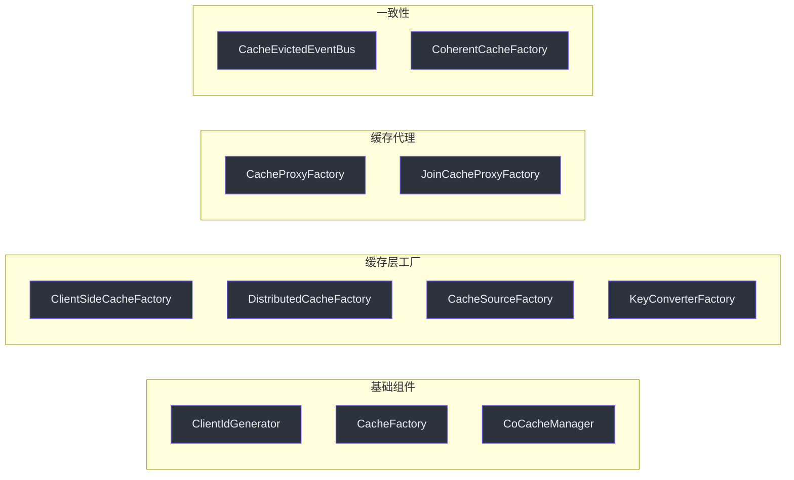

# Spring 集成

CoCache 通过 `cocache-spring` 和 `cocache-spring-boot-starter` 模块提供与 Spring 框架的深度集成。

## 集成架构

```mermaid
graph TB
    subgraph sg_107 ["Spring Boot 自动配置"]
        AutoConfig["CoCacheAutoConfiguration"]
    end

    subgraph sg_108 ["缓存注册"]
        EnableCoCache["@EnableCoCache"]
        Registrar["EnableCoCacheRegistrar"]
        FBF["CacheProxyFactoryBean"]
    end

    subgraph sg_109 ["工厂层"]
        SCF["SpringCacheFactory"]
        CSCF["SpringClientSideCacheFactory"]
        RDCF["RedisDistributedCacheFactory"]
        SCSF["SpringCacheSourceFactory"]
        SKCF["SpringKeyConverterFactory"]
        SJKEF["SpringJoinKeyExtractorFactory"]
    end

    subgraph sg_110 ["Spring Cache 桥接"]
        CCM["CoCacheManager"]
        CSC["CoSpringCache"]
    end

    EnableCoCache --> Registrar
    Registrar --> FBF
    AutoConfig --> SCF
    AutoConfig --> CSCF
    AutoConfig --> RDCF
    AutoConfig --> SCSF
    AutoConfig --> SKCF
    AutoConfig --> SJKEF
    AutoConfig --> CCM

    style AutoConfig fill:#2d333b,stroke:#6d5dfc,color:#e6edf3
    style EnableCoCache fill:#2d333b,stroke:#6d5dfc,color:#e6edf3
    style Registrar fill:#2d333b,stroke:#6d5dfc,color:#e6edf3
    style FBF fill:#2d333b,stroke:#6d5dfc,color:#e6edf3
    style SCF fill:#2d333b,stroke:#6d5dfc,color:#e6edf3
    style CSCF fill:#2d333b,stroke:#6d5dfc,color:#e6edf3
    style RDCF fill:#2d333b,stroke:#6d5dfc,color:#e6edf3
    style SCSF fill:#2d333b,stroke:#6d5dfc,color:#e6edf3
    style SKCF fill:#2d333b,stroke:#6d5dfc,color:#e6edf3
    style SJKEF fill:#2d333b,stroke:#6d5dfc,color:#e6edf3
    style CCM fill:#2d333b,stroke:#6d5dfc,color:#e6edf3
    style CSC fill:#2d333b,stroke:#6d5dfc,color:#e6edf3
```



## EnableCoCacheRegistrar

`EnableCoCacheRegistrar` 是 `ImportBeanDefinitionRegistrar` 实现，在 `@EnableCoCache` 触发时解析缓存接口并注册 Bean 定义。

### 注册流程

1. 从 `@EnableCoCache.caches` 获取所有缓存接口类
2. 过滤出普通 `Cache` 接口，解析为 `CoCacheMetadata`
3. 为每个缓存接口注册 `CacheProxyFactoryBean`
4. 过滤出 `JoinCache` 接口，解析为 `JoinCacheMetadata`
5. 为每个 JoinCache 接口注册 `JoinCacheProxyFactoryBean`

```kotlin
// 注册缓存代理 Bean
val beanDefinitionBuilder = BeanDefinitionBuilder.genericBeanDefinition(CacheProxyFactoryBean::class.java)
beanDefinitionBuilder.addConstructorArgValue(cacheMetadata)
beanDefinitionBuilder.setPrimary(true)
registry.registerBeanDefinition(cacheMetadata.cacheName, builder.beanDefinition)
```

**源码参考**：[`cocache-spring/.../EnableCoCacheRegistrar.kt`](https://github.com/Ahoo-Wang/CoCache/blob/main/cocache-spring/src/main/kotlin/me/ahoo/cache/spring/EnableCoCacheRegistrar.kt)

## CacheProxyFactoryBean

Spring `FactoryBean` 实现，负责创建缓存代理实例。

```kotlin
class CacheProxyFactoryBean(private val cacheMetadata: CoCacheMetadata) :
    FactoryBean<Cache<Any, Any>>, ApplicationContextAware {

    override fun getObject(): Cache<Any, Any> {
        val cacheProxyFactory = appContext.getBean(CacheProxyFactory::class.java)
        return cacheProxyFactory.create(cacheMetadata)
    }
}
```

通过 `ApplicationContextAware` 获取 Spring 上下文，从而能够注入其他 Bean（如 `CacheSource`、`ClientSideCache`）。

**源码参考**：[`cocache-spring/.../CacheProxyFactoryBean.kt`](https://github.com/Ahoo-Wang/CoCache/blob/main/cocache-spring/src/main/kotlin/me/ahoo/cache/spring/proxy/CacheProxyFactoryBean.kt)

## SpringCacheFactory

基于 Spring `ListableBeanFactory` 的缓存工厂实现。

```kotlin
class SpringCacheFactory(private val beanFactory: ListableBeanFactory) : CacheFactory {
    override fun getCache(name: String): Cache<*, *> {
        return beanFactory.getBean(name, Cache::class.java)
    }
}
```

**源码参考**：[`cocache-spring/.../SpringCacheFactory.kt`](https://github.com/Ahoo-Wang/CoCache/blob/main/cocache-spring/src/main/kotlin/me/ahoo/cache/spring/SpringCacheFactory.kt)

## Spring 工厂组件

### SpringClientSideCacheFactory

从 Spring 容器查找 `ClientSideCache` Bean，按名称匹配缓存接口。

### RedisDistributedCacheFactory

创建 `RedisDistributedCache` 实例，使用 `ObjectToJsonCodecExecutor` 作为默认编解码器。

### SpringCacheSourceFactory

从 Spring 容器查找 `CacheSource` Bean，按名称匹配缓存接口。

### SpringKeyConverterFactory

创建 `KeyConverter`，支持 `keyPrefix` 和 SpEL `keyExpression`。

### SpringJoinKeyExtractorFactory

从 Spring 容器查找 `JoinKeyExtractor` Bean，或通过 SpEL 表达式创建。

## CoCacheManager

Spring Cache 抽象桥接，将 CoCache 缓存接口适配为 Spring `Cache` 接口。

```kotlin
class CoCacheManager(private val cacheFactory: CacheFactory) : CacheManager {
    override fun getCache(name: String): Cache? {
        val cache = cacheFactory.getCache(name) ?: return null
        return CoSpringCache(cache)
    }
}
```

配合 `@EnableCaching` 使用时，可以通过 Spring Cache 注解（`@Cacheable`、`@CacheEvict` 等）访问 CoCache 缓存。

**源码参考**：[`cocache-spring-cache/.../CoCacheManager.kt`](https://github.com/Ahoo-Wang/CoCache/blob/main/cocache-spring-cache/src/main/kotlin/me/ahoo/cache/spring/cache/CoCacheManager.kt)

## Spring Boot 自动配置

`CoCacheAutoConfiguration` 自动注册所有必要的 Bean。

### 自动注册的 Bean 列表



所有 Bean 均使用 `@ConditionalOnMissingBean`，支持自定义覆盖。

**源码参考**：[`cocache-spring-boot-starter/.../CoCacheAutoConfiguration.kt`](https://github.com/Ahoo-Wang/CoCache/blob/main/cocache-spring-boot-starter/src/main/kotlin/me/ahoo/cache/spring/boot/starter/CoCacheAutoConfiguration.kt)

## 自定义 Bean

### 自定义客户端缓存

```kotlin
@Bean
fun myClientSideCache(@Qualifier("UserCache.CacheMetadata") metadata: CoCacheMetadata): ClientSideCache<User> {
    return CaffeineClientSideCache(
        Caffeine.newBuilder()
            .maximumSize(10_000)
            .expireAfterAccess(Duration.ofMinutes(30))
            .build()
    )
}
```

### 自定义数据源

```kotlin
@Bean
fun userCacheSource(userRepository: UserRepository): CacheSource<String, User> {
    return CacheSource { key ->
        userRepository.findById(key).orElse(null)?.let { DefaultCacheValue.forever(it) }
    }
}
```

### 自定义事件总线

```kotlin
@Bean
fun customEventBus(): CacheEvictedEventBus {
    return GuavaCacheEvictedEventBus()
}
```

## 相关页面

- [配置指南](../guide/configuration.md) - 配置参数
- [代理与注解](../architecture/proxy.md) - 代理机制
- [cocache-spring](../modules/cocache-spring.md) - Spring 集成模块
- [cocache-spring-boot-starter](../modules/cocache-spring-boot-starter.md) - 自动配置模块
