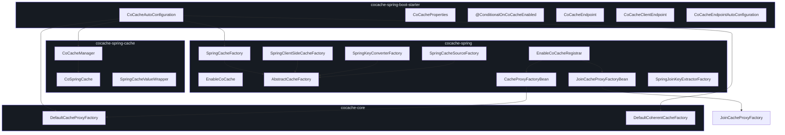
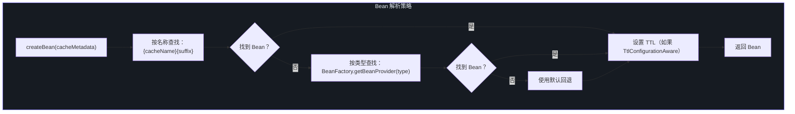
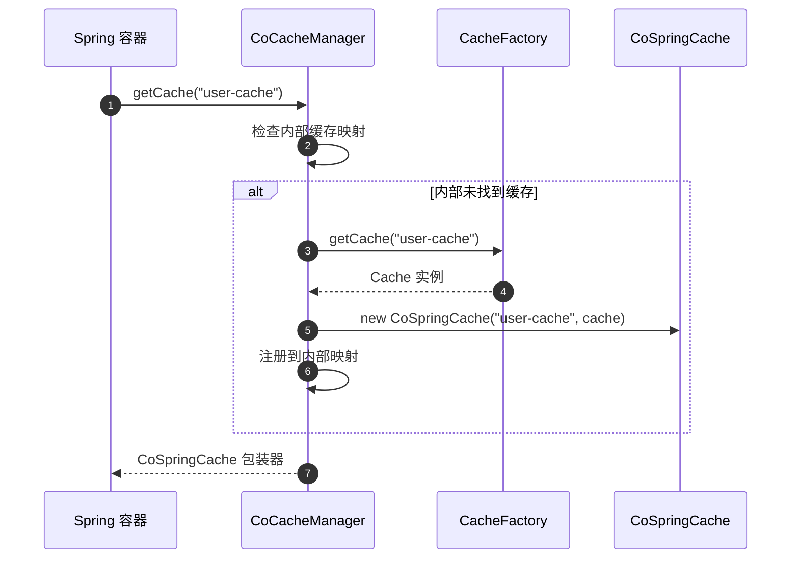
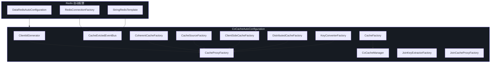

# Spring 集成 API

CoCache 通过 `cocache-spring`、`cocache-spring-cache` 和 `cocache-spring-boot-starter` 模块与 Spring Framework 提供深度集成。本页面记录所有 Spring 特定的组件。

## 模块概览



## Factory Bean

### CacheProxyFactoryBean

为 `@CoCache` 注解的接口创建基于代理的缓存实例的 Spring `FactoryBean`。

| 方面 | 详情 | 源码 |
|--------|--------|--------|
| **实现** | `FactoryBean<Cache<Any, Any>>`、`ApplicationContextAware` | -- |
| **构造函数** | `(cacheMetadata: CoCacheMetadata)` | -- |
| **源文件** | -- | [CacheProxyFactoryBean.kt:23](https://github.com/Ahoo-Wang/CoCache/blob/main/cocache-spring/src/main/kotlin/me/ahoo/cache/spring/proxy/CacheProxyFactoryBean.kt#L23) |

| 方法 | 返回值 | 说明 |
|--------|---------|-------------|
| `getObject()` | `Cache<Any, Any>` | 从应用上下文获取 `CacheProxyFactory` 并调用 `create(cacheMetadata)` |
| `getObjectType()` | `Class<*>` | 返回缓存接口类（`cacheMetadata.proxyInterface.java`） |

### JoinCacheProxyFactoryBean

为 `@JoinCacheable` 注解的接口创建基于代理的 Join 缓存实例的 Spring `FactoryBean`。

| 方面 | 详情 | 源码 |
|--------|--------|--------|
| **实现** | `FactoryBean<JoinCache<Any, Any, Any, Any>>`、`ApplicationContextAware` | -- |
| **构造函数** | `(cacheMetadata: JoinCacheMetadata)` | -- |
| **源文件** | -- | [JoinCacheProxyFactoryBean.kt:23](https://github.com/Ahoo-Wang/CoCache/blob/main/cocache-spring/src/main/kotlin/me/ahoo/cache/spring/join/JoinCacheProxyFactoryBean.kt#L23) |

| 方法 | 返回值 | 说明 |
|--------|---------|-------------|
| `getObject()` | `JoinCache<Any, Any, Any, Any>` | 从应用上下文获取 `JoinCacheProxyFactory` 并调用 `create(cacheMetadata)` |
| `getObjectType()` | `Class<*>` | 返回 Join 缓存接口类 |

## AbstractCacheFactory 模式

`AbstractCacheFactory` 提供了模板方法模式，用于从 Spring Bean 创建缓存组件，采用按名称优先查找策略和按类型回退机制。

| 方面 | 详情 | 源码 |
|--------|--------|--------|
| **包** | `me.ahoo.cache.spring` | -- |
| **源文件** | -- | [AbstractCacheFactory.kt:21](https://github.com/Ahoo-Wang/CoCache/blob/main/cocache-spring/src/main/kotlin/me/ahoo/cache/spring/AbstractCacheFactory.kt#L21) |

### Bean 解析策略



### 抽象方法

| 方法 | 签名 | 说明 |
|--------|-----------|-------------|
| `suffix` | `abstract val suffix: String` | 此工厂类型的 Bean 名称后缀 |
| `getBeanType` | `abstract fun getBeanType(cacheMetadata: CoCacheMetadata): ResolvableType` | 返回用于 Bean 查找的泛型 `ResolvableType` |
| `fallback` | `abstract fun fallback(cacheMetadata: CoCacheMetadata): Any` | 未找到 Spring Bean 时的默认组件 |
| `getBeanProvider` | `open fun getBeanProvider(...)` | 带回退提供者的按类型 Bean 查找 |

## Spring 工厂实现

所有 Spring 工厂实现都继承 `AbstractCacheFactory`，遵循相同的按名称优先解析模式。

### SpringClientSideCacheFactory

| 方面 | 详情 | 源码 |
|--------|--------|--------|
| **实现** | `ClientSideCacheFactory`、`AbstractCacheFactory` | -- |
| **Bean 名称后缀** | `.ClientSideCache` | -- |
| **回退** | `DefaultClientSideCacheFactory.create()`（使用 `@GuavaCache`/`@CaffeineCache` 注解） | -- |
| **源文件** | -- | [SpringClientSideCacheFactory.kt:25](https://github.com/Ahoo-Wang/CoCache/blob/main/cocache-spring/src/main/kotlin/me/ahoo/cache/spring/client/SpringClientSideCacheFactory.kt#L25) |

### SpringKeyConverterFactory

| 方面 | 详情 | 源码 |
|--------|--------|--------|
| **实现** | `KeyConverterFactory`、`AbstractCacheFactory` | -- |
| **Bean 名称后缀** | `.KeyConverter` | -- |
| **回退** | 设置 `keyExpression` 时使用 `ExpKeyConverter`，否则使用带计算前缀的 `ToStringKeyConverter` | -- |
| **源文件** | -- | [SpringKeyConverterFactory.kt:27](https://github.com/Ahoo-Wang/CoCache/blob/main/cocache-spring/src/main/kotlin/me/ahoo/cache/spring/converter/SpringKeyConverterFactory.kt#L27) |

特殊行为：当 `keyType` 为 `String` 时跳过 Bean 查找（无需转换）。

### SpringCacheSourceFactory

| 方面 | 详情 | 源码 |
|--------|--------|--------|
| **实现** | `CacheSourceFactory`、`AbstractCacheFactory` | -- |
| **Bean 名称后缀** | `.CacheSource` | -- |
| **回退** | `CacheSource.noOp()` | -- |
| **源文件** | -- | [SpringCacheSourceFactory.kt:24](https://github.com/Ahoo-Wang/CoCache/blob/main/cocache-spring/src/main/kotlin/me/ahoo/cache/spring/source/SpringCacheSourceFactory.kt#L24) |

### SpringJoinKeyExtractorFactory

| 方面 | 详情 | 源码 |
|--------|--------|--------|
| **实现** | `JoinKeyExtractorFactory` | -- |
| **Bean 名称后缀** | `.JoinKeyExtractor` | -- |
| **回退** | 设置 `joinKeyExpression` 时使用 SpEL，否则按类型查找 Bean | -- |
| **源文件** | -- | [SpringJoinKeyExtractorFactory.kt:24](https://github.com/Ahoo-Wang/CoCache/blob/main/cocache-spring/src/main/kotlin/me/ahoo/cache/spring/join/SpringJoinKeyExtractorFactory.kt#L24) |

### SpringCacheFactory

从 Spring `BeanFactory` 获取缓存 Bean 的 `CacheFactory` 实现。

| 方面 | 详情 | 源码 |
|--------|--------|--------|
| **实现** | `CacheFactory` | -- |
| **构造函数** | `(beanFactory: ListableBeanFactory)` | -- |
| **源文件** | -- | [SpringCacheFactory.kt:24](https://github.com/Ahoo-Wang/CoCache/blob/main/cocache-spring/src/main/kotlin/me/ahoo/cache/spring/SpringCacheFactory.kt#L24) |

| 方法 | 说明 |
|--------|-------------|
| `caches` | 通过 `getBeansOfType(Cache::class.java)` 从应用上下文返回所有 `Cache` Bean |
| `getCache(cacheName, cacheType)` | 按名称和类型获取缓存 Bean |
| `getCache(keyType, valueType)` | 使用 `ResolvableType` 按泛型键/值类型获取缓存 Bean |

## Bean 命名约定

CoCache 使用一致的 `{cacheName}.{Suffix}` 命名模式用于可选的自定义 Bean。注册具有匹配名称的 Spring Bean 即可覆盖默认行为。

| Bean 名称模式 | 工厂 | 用途 | 默认行为 |
|-------------------|---------|---------|-----------------|
| `{cacheName}.ClientSideCache` | `SpringClientSideCacheFactory` | L2 本地缓存 | `DefaultClientSideCacheFactory.create()` |
| `{cacheName}.DistributedCache` | `RedisDistributedCacheFactory` | L1 分布式缓存 | 基于 Redis 的 `RedisDistributedCache` |
| `{cacheName}.CacheSource` | `SpringCacheSourceFactory` | L0 数据源 | `CacheSource.noOp()` |
| `{cacheName}.KeyConverter` | `SpringKeyConverterFactory` | 键转换 | `ToStringKeyConverter` 或 `ExpKeyConverter` |
| `{cacheName}.JoinKeyExtractor` | `SpringJoinKeyExtractorFactory` | Join 键提取 | SpEL 表达式或按类型 Bean |
| `{cacheName}.CacheMetadata` | `EnableCoCacheRegistrar` | 解析的注解元数据 | 自动生成 |

### 自定义示例

为特定缓存提供自定义 `ClientSideCache`：

```kotlin
@Configuration
class CustomCacheConfig {

    @Bean("user-cache.ClientSideCache")
    fun userClientSideCache(): ClientSideCache<User> {
        return CaffeineClientSideCache(
            Caffeine.newBuilder()
                .maximumSize(20_000)
                .expireAfterWrite(Duration.ofMinutes(10))
                .build()
        )
    }

    @Bean("user-cache.CacheSource")
    fun userCacheSource(userRepository: UserRepository): CacheSource<String, User> {
        return object : CacheSource<String, User> {
            override fun loadCacheValue(key: String): CacheValue<User>? {
                return userRepository.findById(key).map {
                    DefaultCacheValue.ttlAt(it, 3600)
                }.orElse(null)
            }
        }
    }
}
```

## CoCacheManager

CoCache 与 Spring 的 `CacheManager` 抽象之间的桥接，支持 `@Cacheable` 和其他 Spring Cache 注解。

| 方面 | 详情 | 源码 |
|--------|--------|--------|
| **继承** | `AbstractCacheManager` | -- |
| **构造函数** | `(cacheFactory: CacheFactory)` | -- |
| **源文件** | -- | [CoCacheManager.kt:21](https://github.com/Ahoo-Wang/CoCache/blob/main/cocache-spring-cache/src/main/kotlin/me/ahoo/cache/spring/cache/CoCacheManager.kt#L21) |

| 方法 | 返回值 | 说明 |
|--------|---------|-------------|
| `loadCaches()` | `Collection<SpringCache>` | 将所有已注册的 CoCache 实例包装为 `CoSpringCache` 适配器 |
| `getMissingCache(name)` | `SpringCache?` | 按名称查找 CoCache 并在找到时包装；否则返回 `null` |

### CoCacheManager 流程



## CoSpringCache

将 CoCache 的 `Cache` 实例适配为 Spring `Cache` 实现的适配器。

| 方面 | 详情 | 源码 |
|--------|--------|--------|
| **实现** | `NamedCache`、`SpringCache`、`CacheDelegated<Cache<Any, Any?>>` | -- |
| **构造函数** | `(cacheName: String, delegate: Cache<Any, Any?>)` | -- |
| **源文件** | -- | [CoSpringCache.kt:27](https://github.com/Ahoo-Wang/CoCache/blob/main/cocache-spring-cache/src/main/kotlin/me/ahoo/cache/spring/cache/CoSpringCache.kt#L27) |

| 方法 | Spring 接口 | 说明 |
|--------|-----------------|-------------|
| `getName()` | `Cache.getName()` | 返回缓存名称 |
| `getNativeCache()` | `Cache.getNativeCache()` | 返回底层 CoCache 实例 |
| `get(key)` | `Cache.get(key)` | 返回 CoCache 值的 `SpringCacheValueWrapper` 包装 |
| `get(key, type)` | `Cache.get(key, type)` | 返回转换为指定类型的值 |
| `get(key, valueLoader)` | `Cache.get(key, valueLoader)` | 通过 `Callable` 加载未缓存的值，然后存储 |
| `put(key, value)` | `Cache.put(key, value)` | 委托给 `delegate.set(key, value)` |
| `evict(key)` | `Cache.evict(key)` | 委托给 `delegate.evict(key)` |
| `clear()` | `Cache.clear()` | 清除 `ClientSideCache`（如果是 `CoherentCache`，仅清除 L2） |
| `retrieve(key)` | `Cache.retrieve(key)` | 通过 `CompletableFuture.supplyAsync` 异步获取 |
| `retrieve(key, valueLoader)` | `Cache.retrieve(key, valueLoader)` | 使用 `CompletableFuture` 组合的异步获取 |

### 配合 @Cacheable 使用

注册 `CoCacheManager` 后，标准 Spring Cache 注解即可无缝工作：

```kotlin
@Service
class UserService(
    private val userRepository: UserRepository
) {
    @Cacheable(cacheNames = ["user-cache"], key = "#userId")
    fun getUser(userId: String): User {
        return userRepository.findById(userId).orElseThrow()
    }

    @CacheEvict(cacheNames = ["user-cache"], key = "#userId")
    fun deleteUser(userId: String) {
        userRepository.deleteById(userId)
    }
}
```

## EnableCoCacheRegistrar

处理 `@EnableCoCache` 并注册 `CacheProxyFactoryBean`/`JoinCacheProxyFactoryBean` 定义的注册器。

| 方面 | 详情 | 源码 |
|--------|--------|--------|
| **实现** | `ImportBeanDefinitionRegistrar` | -- |
| **源文件** | -- | [EnableCoCacheRegistrar.kt:31](https://github.com/Ahoo-Wang/CoCache/blob/main/cocache-spring/src/main/kotlin/me/ahoo/cache/spring/EnableCoCacheRegistrar.kt#L31) |

### 注册逻辑

| 步骤 | 操作 |
|------|--------|
| 1 | 从 `@EnableCoCache.caches` 属性解析缓存类型 |
| 2 | 拆分为标准缓存（不继承 `JoinCache`）和 Join 缓存 |
| 3 | 对于标准缓存：解析 `CoCacheMetadata`，注册元数据 Bean + `CacheProxyFactoryBean`（标记为主要） |
| 4 | 对于 Join 缓存：解析 `JoinCacheMetadata`，注册 `JoinCacheProxyFactoryBean`（标记为主要） |

## CoCacheAutoConfiguration

Spring Boot 自动配置类，负责组装所有 CoCache 组件。

| 方面 | 详情 | 源码 |
|--------|--------|--------|
| **条件** | `@ConditionalOnCoCacheEnabled`、`@AutoConfiguration(after = [DataRedisAutoConfiguration::class])` | -- |
| **源文件** | -- | [CoCacheAutoConfiguration.kt:66](https://github.com/Ahoo-Wang/CoCache/blob/main/cocache-spring-boot-starter/src/main/kotlin/me/ahoo/cache/spring/boot/starter/CoCacheAutoConfiguration.kt#L66) |

### 已注册的 Bean

| Bean 名称 | 类型 | 条件 | 说明 |
|-----------|------|-----------|-------------|
| `defaultHostClientIdGenerator` | `ClientIdGenerator` | 不存在 `ClientIdGenerator` 或 `HostAddressSupplier` Bean | 使用主机地址作为客户端 ID |
| `cacheFactory` | `CacheFactory` | 不存在现有 Bean | 由 `ListableBeanFactory` 支持的 `SpringCacheFactory` |
| `coCacheManager` | `CoCacheManager` | 始终 | Spring Cache 桥接 |
| `cocacheRedisMessageListenerContainer` | `RedisMessageListenerContainer` | `RedisConnectionFactory` 可用 | Redis pub/sub 驱逐事件监听器 |
| `cacheEvictedEventBus` | `CacheEvictedEventBus` | 不存在现有 Bean | `RedisCacheEvictedEventBus` |
| `coherentCacheFactory` | `CoherentCacheFactory` | 不存在现有 Bean | `DefaultCoherentCacheFactory` |
| `cacheSourceFactory` | `CacheSourceFactory` | 不存在现有 Bean | `SpringCacheSourceFactory` |
| `clientSideCacheFactory` | `ClientSideCacheFactory` | 不存在现有 Bean | `SpringClientSideCacheFactory` |
| `distributedCacheFactory` | `DistributedCacheFactory` | 不存在现有 Bean | `RedisDistributedCacheFactory` |
| `keyConverterFactory` | `KeyConverterFactory` | 不存在现有 Bean | `SpringKeyConverterFactory` |
| `cacheProxyFactory` | `CacheProxyFactory` | 不存在现有 Bean | `DefaultCacheProxyFactory` |
| `joinKeyExtractorFactory` | `JoinKeyExtractorFactory` | 不存在现有 Bean | `SpringJoinKeyExtractorFactory` |
| `joinCacheProxyFactory` | `JoinCacheProxyFactory` | 不存在现有 Bean | `DefaultJoinCacheProxyFactory` |

### 自动配置依赖图



## 相关页面

- [API 概览](./index.md) -- 架构概览和模块组织
- [核心接口](./core-interfaces.md) -- 所有核心接口的详细参考
- [注解](./annotations.md) -- 完整的注解参考
- [Actuator 端点](./actuator.md) -- 监控和管理端点
