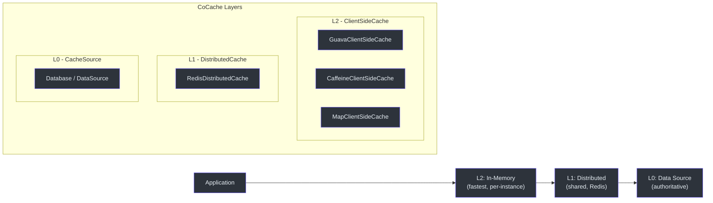
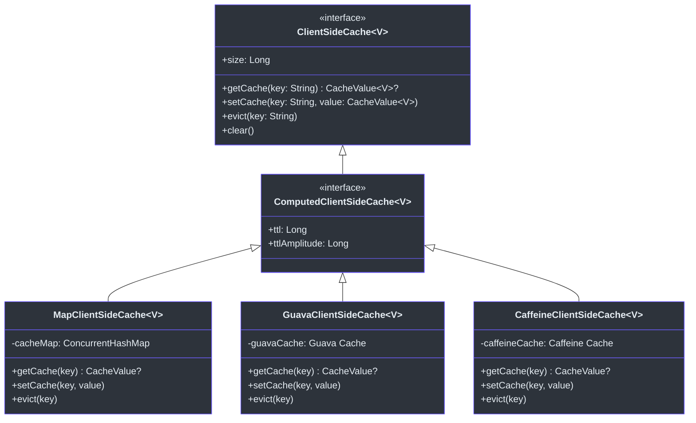
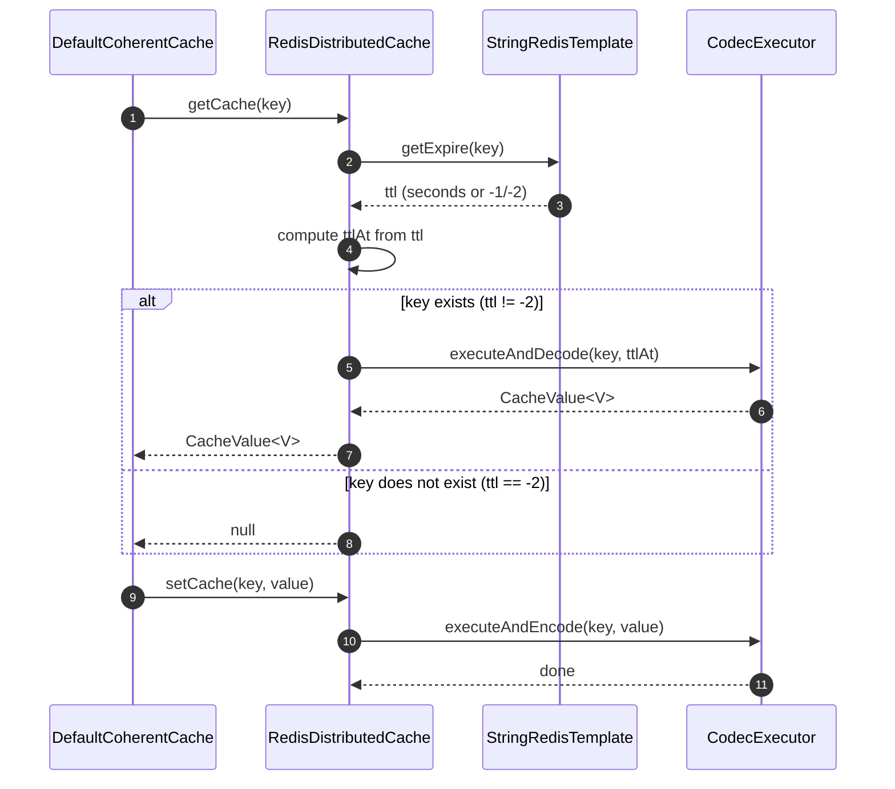
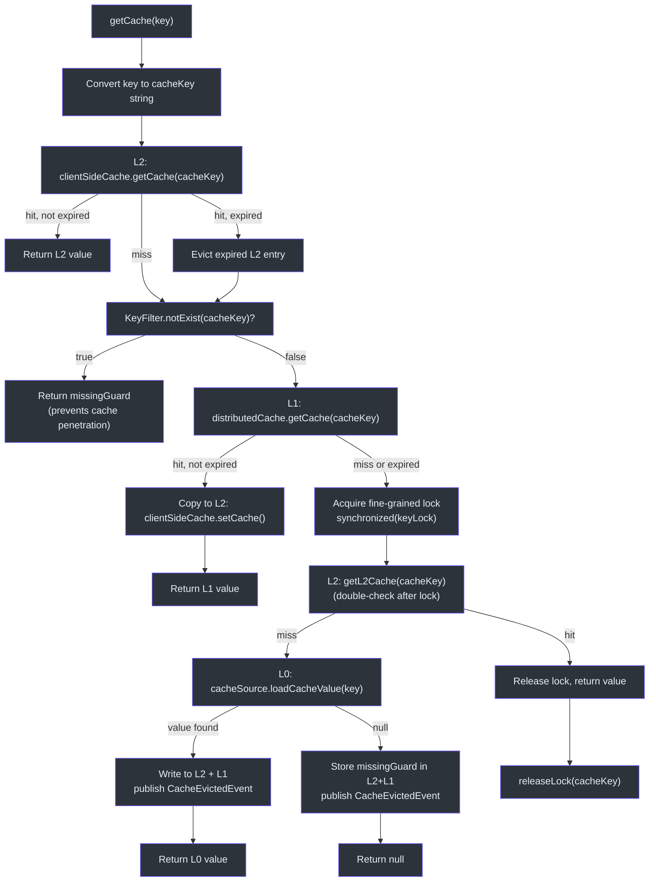

# 缓存层级详解

CoCache 将数据检索组织为三个不同的层级，每个层级在缓存层次结构中承担特定角色。`DefaultCoherentCache` 类编排所有三个层级，通过细粒度锁和缓存一致性事件发布处理读取路径、写入路径和驱逐流程。

## 层级总览



## L2 -- ClientSideCache（内存中，每实例独立）

L2 层是最快的缓存层级。它将 `CacheValue<V>` 条目直接存储在 JVM 堆中，以 `String` 为键。每个应用实例维护自己独立的 L2 缓存。

### 接口

[`ClientSideCache<V>`](https://github.com/Ahoo-Wang/CoCache/blob/main/cocache-api/src/main/kotlin/me/ahoo/cache/api/client/ClientSideCache.kt#L22) 接口继承 `Cache<String, V>` 并添加 `size` 属性和 `clear()` 方法：

```kotlin
interface ClientSideCache<V> : Cache<String, V> {
    val size: Long
    fun clear()
}
```

### 实现

| 实现 | 底层存储 | 配置注解 | 源码 |
|------|----------|----------|------|
| [`MapClientSideCache`](https://github.com/Ahoo-Wang/CoCache/blob/main/cocache-core/src/main/kotlin/me/ahoo/cache/client/MapClientSideCache.kt#L24) | `ConcurrentHashMap` | 默认（无需注解） | [MapClientSideCache.kt](https://github.com/Ahoo-Wang/CoCache/blob/main/cocache-core/src/main/kotlin/me/ahoo/cache/client/MapClientSideCache.kt#L24) |
| [`GuavaClientSideCache`](https://github.com/Ahoo-Wang/CoCache/blob/main/cocache-core/src/main/kotlin/me/ahoo/cache/client/GuavaClientSideCache.kt#L26) | Guava `Cache` | `@GuavaCache` | [GuavaClientSideCache.kt](https://github.com/Ahoo-Wang/CoCache/blob/main/cocache-core/src/main/kotlin/me/ahoo/cache/client/GuavaClientSideCache.kt#L26) |
| [`CaffeineClientSideCache`](https://github.com/Ahoo-Wang/CoCache/blob/main/cocache-core/src/main/kotlin/me/ahoo/cache/client/CaffeineClientSideCache.kt#L27) | Caffeine `Cache` | `@CaffeineCache` | [CaffeineClientSideCache.kt](https://github.com/Ahoo-Wang/CoCache/blob/main/cocache-core/src/main/kotlin/me/ahoo/cache/client/CaffeineClientSideCache.kt#L27) |

`GuavaClientSideCache` 和 `CaffeineClientSideCache` 都提供了伴生工厂方法，用于读取各自的注解来配置 `initialCapacity`、`maximumSize`、`expireAfterWrite`、`expireAfterAccess` 等缓存参数。`ClientSideCacheFactory` 抽象根据缓存接口上的注解在运行时决定使用哪个实现。



## L1 -- DistributedCache（共享，Redis）

L1 层是所有应用实例共享的缓存。目前主要实现是 `RedisDistributedCache`，基于 Spring Data Redis。

### 接口

[`DistributedCache<V>`](https://github.com/Ahoo-Wang/CoCache/blob/main/cocache-core/src/main/kotlin/me/ahoo/cache/distributed/DistributedCache.kt#L22) 接口继承 `ComputedCache<String, V>` 和 `AutoCloseable`：

```kotlin
interface DistributedCache<V> : ComputedCache<String, V>, AutoCloseable
```

### RedisDistributedCache

[`RedisDistributedCache`](https://github.com/Ahoo-Wang/CoCache/blob/main/cocache-spring-redis/src/main/kotlin/me/ahoo/cache/spring/redis/RedisDistributedCache.kt#L28) 使用 `StringRedisTemplate` 和 `CodecExecutor` 进行序列化。读取时，它首先通过 `getExpire(key)` 查询 Redis TTL 以计算本地 `ttlAt` 时间戳，然后获取并解码值。这确保本地表示携带 Redis 中正确的剩余 TTL。



| 常量 | 值 | 含义 |
|------|-----|------|
| `FOREVER` | `-1` | 键存在但没有过期时间 |
| `NOT_EXIST` | `-2` | 键在 Redis 中不存在 |

## L0 -- CacheSource（数据源）

L0 层代表权威数据源（通常是数据库）。它是 L2 和 L1 都未命中时的最后兜底。[`CacheSource<K, V>`](https://github.com/Ahoo-Wang/CoCache/blob/main/cocache-api/src/main/kotlin/me/ahoo/cache/api/source/CacheSource.kt#L24) 接口定义了一个方法：

```kotlin
interface CacheSource<K, V> {
    fun loadCacheValue(key: K): CacheValue<V>?
}
```

当 `loadCacheValue` 返回 `null` 时，`DefaultCoherentCache` 存储一个 `missingGuard` 值以防止缓存穿透。当返回一个值时，该值被写入 L1 和 L2，并发布 `CacheEvictedEvent`。

## 读取路径 -- getCache()

完整的读取路径在 [`DefaultCoherentCache.getCache()`](https://github.com/Ahoo-Wang/CoCache/blob/main/cocache-core/src/main/kotlin/me/ahoo/cache/consistency/DefaultCoherentCache.kt#L89) 和辅助方法 [`getL2Cache()`](https://github.com/Ahoo-Wang/CoCache/blob/main/cocache-core/src/main/kotlin/me/ahoo/cache/consistency/DefaultCoherentCache.kt#L50) 中实现：



### 关键实现细节

**细粒度锁** -- 位于[第 47 行](https://github.com/Ahoo-Wang/CoCache/blob/main/cocache-core/src/main/kotlin/me/ahoo/cache/consistency/DefaultCoherentCache.kt#L47)的锁映射使用 `ConcurrentHashMap<String, Any>()` 为每个缓存键存储一个锁对象。[第 78 行](https://github.com/Ahoo-Wang/CoCache/blob/main/cocache-core/src/main/kotlin/me/ahoo/cache/consistency/DefaultCoherentCache.kt#L78)的 `getLock()` 方法使用 `computeIfAbsent` 进行原子锁创建。L0 加载完成后，[第 84 行](https://github.com/Ahoo-Wang/CoCache/blob/main/cocache-core/src/main/kotlin/me/ahoo/cache/consistency/DefaultCoherentCache.kt#L84)的 `releaseLock()` 移除锁条目以防止内存泄漏。

**加锁后双重检查** -- 获取锁之后，在[第 104 行](https://github.com/Ahoo-Wang/CoCache/blob/main/cocache-core/src/main/kotlin/me/ahoo/cache/consistency/DefaultCoherentCache.kt#L104)再次调用 `getL2Cache()`，检查是否有其他线程在此线程等待锁的过程中已经加载了值。这防止了冗余的 L0 调用。

## 写入路径 -- setCache()

位于 [`setCache()`](https://github.com/Ahoo-Wang/CoCache/blob/main/cocache-core/src/main/kotlin/me/ahoo/cache/consistency/DefaultCoherentCache.kt#L142) 的写入路径同时写入两个缓存层，然后发布驱逐事件：

```kotlin
override fun setCache(key: K, value: CacheValue<V>) {
    if (value.isExpired) {
        return
    }
    val cacheKey = keyConverter.toStringKey(key)
    setCache(cacheKey, value)                    // writes to L2 + L1
    cacheEvictedEventBus.publish(CacheEvictedEvent(cacheName, cacheKey, clientId))
}
```

位于[第 137 行](https://github.com/Ahoo-Wang/CoCache/blob/main/cocache-core/src/main/kotlin/me/ahoo/cache/consistency/DefaultCoherentCache.kt#L137)的私有 `setCache(cacheKey, cacheValue)` 同时写入两个层级：

```kotlin
private fun setCache(cacheKey: String, cacheValue: CacheValue<V>) {
    clientSideCache.setCache(cacheKey, cacheValue)   // L2
    distributedCache.setCache(cacheKey, cacheValue)   // L1
}
```

## 驱逐路径 -- evict()

位于 [`evict()`](https://github.com/Ahoo-Wang/CoCache/blob/main/cocache-core/src/main/kotlin/me/ahoo/cache/consistency/DefaultCoherentCache.kt#L151) 的驱逐路径从两个层级移除条目并发布事件：

```kotlin
override fun evict(key: K) {
    val cacheKey = keyConverter.toStringKey(key)
    clientSideCache.evict(cacheKey)                    // L2
    distributedCache.evict(cacheKey)                    // L1
    cacheEvictedEventBus.publish(CacheEvictedEvent(cacheName, cacheKey, clientId))
}
```

事件发布触发远程实例驱逐自己 L2 缓存中相同键的条目。这是 CoCache 一致性机制的核心。完整的事件流程请参见[缓存一致性](./coherence.md)。

## 层级交互总结

```mermaid
graph TB
    subgraph sg_5 ["Write Path: setCache"]

        W1["Write L2"] --> W2["Write L1"]
        W2 --> W3["Publish CacheEvictedEvent"]
    end

    subgraph sg_6 ["Eviction Path: evict"]

        E1["Evict L2"] --> E2["Evict L1"]
        E2 --> E3["Publish CacheEvictedEvent"]
    end

    subgraph sg_7 ["Read Path: getCache"]

        R1["Read L2"] --> R2["KeyFilter"]
        R2 --> R3["Read L1"]
        R3 --> R4["Lock + Load L0"]
        R4 --> R5["Write L2 + L1"]
        R5 --> R6["Publish CacheEvictedEvent"]
    end

    style W1 fill:#2d333b,stroke:#6d5dfc,color:#e6edf3
    style W2 fill:#2d333b,stroke:#6d5dfc,color:#e6edf3
    style W3 fill:#2d333b,stroke:#6d5dfc,color:#e6edf3
    style E1 fill:#2d333b,stroke:#6d5dfc,color:#e6edf3
    style E2 fill:#2d333b,stroke:#6d5dfc,color:#e6edf3
    style E3 fill:#2d333b,stroke:#6d5dfc,color:#e6edf3
    style R1 fill:#2d333b,stroke:#6d5dfc,color:#e6edf3
    style R2 fill:#2d333b,stroke:#6d5dfc,color:#e6edf3
    style R3 fill:#2d333b,stroke:#6d5dfc,color:#e6edf3
    style R4 fill:#2d333b,stroke:#6d5dfc,color:#e6edf3
    style R5 fill:#2d333b,stroke:#6d5dfc,color:#e6edf3
    style R6 fill:#2d333b,stroke:#6d5dfc,color:#e6edf3

```



## 源码参考

| 文件 | 行号 | 说明 |
|------|------|------|
| [`DefaultCoherentCache.kt`](https://github.com/Ahoo-Wang/CoCache/blob/main/cocache-core/src/main/kotlin/me/ahoo/cache/consistency/DefaultCoherentCache.kt#L50) | 50-76 | `getL2Cache()` -- L2 + KeyFilter + L1 查询 |
| [`DefaultCoherentCache.kt`](https://github.com/Ahoo-Wang/CoCache/blob/main/cocache-core/src/main/kotlin/me/ahoo/cache/consistency/DefaultCoherentCache.kt#L89) | 89-135 | `getCache()` -- 带锁的完整读取路径 |
| [`DefaultCoherentCache.kt`](https://github.com/Ahoo-Wang/CoCache/blob/main/cocache-core/src/main/kotlin/me/ahoo/cache/consistency/DefaultCoherentCache.kt#L142) | 142-149 | `setCache()` -- 写入路径（L2 + L1 + event） |
| [`DefaultCoherentCache.kt`](https://github.com/Ahoo-Wang/CoCache/blob/main/cocache-core/src/main/kotlin/me/ahoo/cache/consistency/DefaultCoherentCache.kt#L151) | 151-156 | `evict()` -- 驱逐路径（L2 + L1 + event） |
| [`MapClientSideCache.kt`](https://github.com/Ahoo-Wang/CoCache/blob/main/cocache-core/src/main/kotlin/me/ahoo/cache/client/MapClientSideCache.kt#L24) | 24-50 | 基于 ConcurrentHashMap 的 L2 |
| [`GuavaClientSideCache.kt`](https://github.com/Ahoo-Wang/CoCache/blob/main/cocache-core/src/main/kotlin/me/ahoo/cache/client/GuavaClientSideCache.kt#L26) | 26-78 | 基于 Guava 的 L2，带注解工厂 |
| [`CaffeineClientSideCache.kt`](https://github.com/Ahoo-Wang/CoCache/blob/main/cocache-core/src/main/kotlin/me/ahoo/cache/client/CaffeineClientSideCache.kt#L27) | 27-76 | 基于 Caffeine 的 L2，带注解工厂 |
| [`CacheSource.kt`](https://github.com/Ahoo-Wang/CoCache/blob/main/cocache-api/src/main/kotlin/me/ahoo/cache/api/source/CacheSource.kt#L24) | 24-35 | L0 接口 |
| [`DistributedCache.kt`](https://github.com/Ahoo-Wang/CoCache/blob/main/cocache-core/src/main/kotlin/me/ahoo/cache/distributed/DistributedCache.kt#L22) | 22 | L1 接口 |
| [`RedisDistributedCache.kt`](https://github.com/Ahoo-Wang/CoCache/blob/main/cocache-spring-redis/src/main/kotlin/me/ahoo/cache/spring/redis/RedisDistributedCache.kt#L28) | 28-68 | Redis L1 实现 |
| [`ClientSideCache.kt`](https://github.com/Ahoo-Wang/CoCache/blob/main/cocache-api/src/main/kotlin/me/ahoo/cache/api/client/ClientSideCache.kt#L22) | 22-30 | L2 接口 |
| [`KeyFilter.kt`](https://github.com/Ahoo-Wang/CoCache/blob/main/cocache-core/src/main/kotlin/me/ahoo/cache/KeyFilter.kt#L21) | 21-23 | 布隆过滤器适配器接口 |
| [`CoherentCacheConfiguration.kt`](https://github.com/Ahoo-Wang/CoCache/blob/main/cocache-core/src/main/kotlin/me/ahoo/cache/consistency/CoherentCacheConfiguration.kt#L26) | 26-34 | 带默认值的配置 |

## 相关页面

- [架构概览](./index.md) -- 高层系统架构与模块图
- [缓存一致性与事件总线](./coherence.md) -- 分布式失效机制
- [代理与注解](./proxy.md) -- 声明式缓存接口创建
