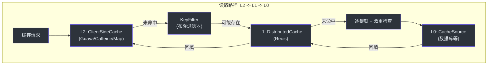
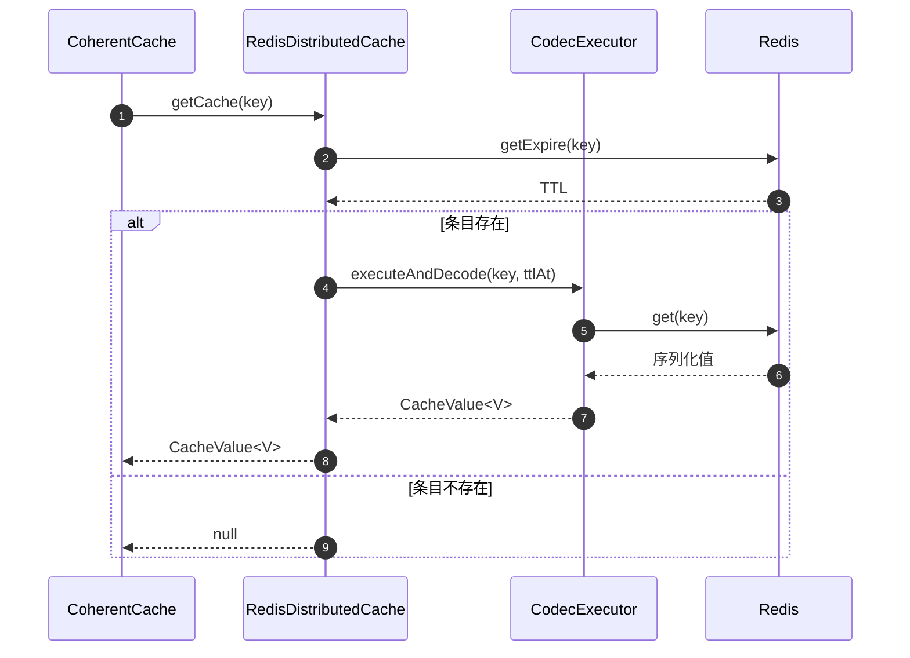
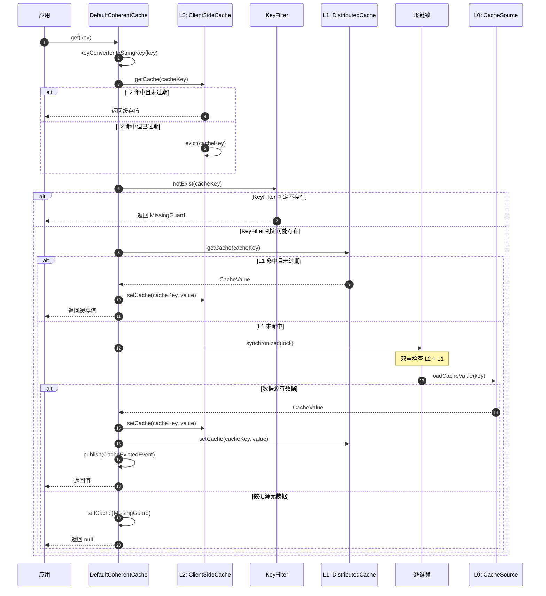

# 缓存层级

CoCache 采用三级缓存架构，数据依次经过 L2（客户端）-> L1（分布式）-> L0（数据源）的读取路径。每一层承担不同的职责，共同提供高性能、一致性的缓存服务。

## 层级总览



## L0 - 数据源（CacheSource）

`CacheSource<K, V>` 是最底层的数据来源接口，通常对接数据库或其他持久化存储。

```kotlin
interface CacheSource<K, V> {
    fun loadCacheValue(key: K): CacheValue<V>?
}
```

### 关键实现

- **自定义实现**：开发者根据业务需求实现，从数据库加载数据
- **`NoOpCacheSource`**：空操作实现，不加载任何数据（用于测试或纯缓存场景）

### 缓存穿透防护

当 L1 和 L2 均未命中时，框架通过 `CacheSource` 加载数据。如果数据源中也不存在该键，框架会：

1. 缓存一个 `MissingGuard` 值（特殊标记 `_nil_`），避免反复查询数据源
2. 返回 `null` 给调用方

```kotlin
// DefaultCoherentCache.getCache() 中的缓存穿透防护逻辑
cacheSource.loadCacheValue(key)?.let {
    setCache(cacheKey, it)
    cacheEvictedEventBus.publish(CacheEvictedEvent(cacheName, cacheKey, clientId))
    return it
}
// 数据源中不存在，缓存空值
setCache(cacheKey, DefaultCacheValue.missingGuard(ttl, ttlAmplitude))
return null
```

**源码参考**：[`cocache-api/.../source/CacheSource.kt`](https://github.com/Ahoo-Wang/CoCache/blob/main/cocache-api/src/main/kotlin/me/ahoo/cache/api/source/CacheSource.kt)

## L1 - 分布式缓存（DistributedCache）

`DistributedCache<V>` 代表跨实例共享的缓存层。所有客户端实例共享同一个 L1 缓存。

```kotlin
interface DistributedCache<V> : ComputedCache<String, V>, AutoCloseable
```

### RedisDistributedCache

默认实现为 `RedisDistributedCache`，基于 Spring Data Redis 的 `StringRedisTemplate`。



### CodecExecutor

`RedisDistributedCache` 通过 `CodecExecutor` 接口支持多种序列化格式：

| 实现 | 说明 |
|------|------|
| `ObjectToJsonCodecExecutor` | 对象 <-> JSON 序列化（默认） |
| `ObjectToHashCodecExecutor` | 对象 <-> Redis Hash |
| `StringToStringCodecExecutor` | 字符串 <-> 字符串 |
| `MapToHashCodecExecutor` | Map <-> Redis Hash |
| `SetToSetCodecExecutor` | Set <-> Redis Set |

**源码参考**：[`cocache-spring-redis/.../RedisDistributedCache.kt`](https://github.com/Ahoo-Wang/CoCache/blob/main/cocache-spring-redis/src/main/kotlin/me/ahoo/cache/spring/redis/RedisDistributedCache.kt)

## L2 - 客户端缓存（ClientSideCache）

`ClientSideCache<V>` 代表本地内存缓存，提供最低延迟的数据访问。

```kotlin
interface ClientSideCache<V> : Cache<String, V> {
    val size: Long
    fun clear()
}
```

### 实现对比

| 实现 | 基础库 | 特点 | 适用场景 |
|------|--------|------|----------|
| `GuavaClientSideCache` | Google Guava | 成熟稳定，功能丰富 | 通用场景 |
| `CaffeineClientSideCache` | Caffeine | 高性能，更优的缓存淘汰策略 | 高吞吐场景 |
| `MapClientSideCache` | ConcurrentHashMap | 轻量级，无额外依赖 | 简单场景、测试 |

**源码参考**：[`cocache-core/.../client/`](https://github.com/Ahoo-Wang/CoCache/tree/main/cocache-core/src/main/kotlin/me/ahoo/cache/client)

## KeyFilter - 键过滤器

`KeyFilter` 接口用于在查询 L1 缓存之前预判键是否存在，主要用于防止缓存穿透。

```kotlin
interface KeyFilter {
    fun notExist(key: String): Boolean
}
```

| 实现 | 说明 |
|------|------|
| `BloomKeyFilter` | 基于 Guava `BloomFilter`，可能存在误判但不会漏判 |
| `NoOpKeyFilter` | 空操作，始终返回 `false`（默认） |

**源码参考**：[`cocache-core/.../KeyFilter.kt`](https://github.com/Ahoo-Wang/CoCache/blob/main/cocache-core/src/main/kotlin/me/ahoo/cache/KeyFilter.kt)

## KeyConverter - 键转换器

`KeyConverter<K>` 接口将业务键转换为缓存字符串键，自动拼接 `keyPrefix`。

```kotlin
fun interface KeyConverter<K> {
    fun toStringKey(sourceKey: K): String
}
```

| 实现 | 说明 |
|------|------|
| `ToStringKeyConverter` | 直接拼接前缀 + `toString()` |
| `ExpKeyConverter` | 支持 SpEL 表达式 |

**源码参考**：[`cocache-core/.../converter/KeyConverter.kt`](https://github.com/Ahoo-Wang/CoCache/blob/main/cocache-core/src/main/kotlin/me/ahoo/cache/converter/KeyConverter.kt)

## 完整读取路径



## 写入路径

写入时同时更新 L2 和 L1，并通过事件总线通知其他实例：

```kotlin
// DefaultCoherentCache.setCache()
private fun setCache(cacheKey: String, cacheValue: CacheValue<V>) {
    clientSideCache.setCache(cacheKey, cacheValue)
    distributedCache.setCache(cacheKey, cacheValue)
}

// DefaultCoherentCache.setCache(key, value)
override fun setCache(key: K, value: CacheValue<V>) {
    if (value.isExpired) return
    val cacheKey = keyConverter.toStringKey(key)
    setCache(cacheKey, value)
    cacheEvictedEventBus.publish(CacheEvictedEvent(cacheName, cacheKey, clientId))
}
```

## 驱逐路径

驱逐时清除 L2 和 L1，并通过事件总线通知其他实例：

```kotlin
// DefaultCoherentCache.evict()
override fun evict(key: K) {
    val cacheKey = keyConverter.toStringKey(key)
    clientSideCache.evict(cacheKey)
    distributedCache.evict(cacheKey)
    cacheEvictedEventBus.publish(CacheEvictedEvent(cacheName, cacheKey, clientId))
}
```

## 相关页面

- [架构概览](./index.md) - 整体架构
- [一致性与事件总线](./coherence.md) - 缓存一致性机制
- [核心接口](../api/core-interfaces.md) - 接口参考
- [cocache-spring-redis](../modules/cocache-spring-redis.md) - Redis 实现模块
