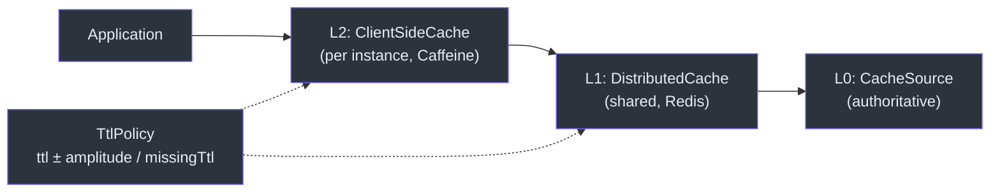
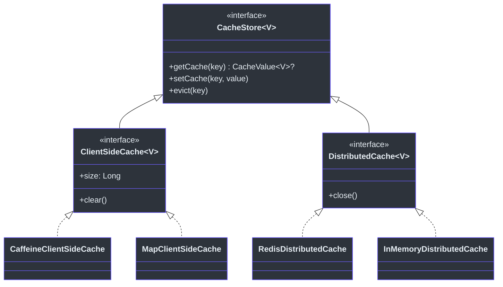
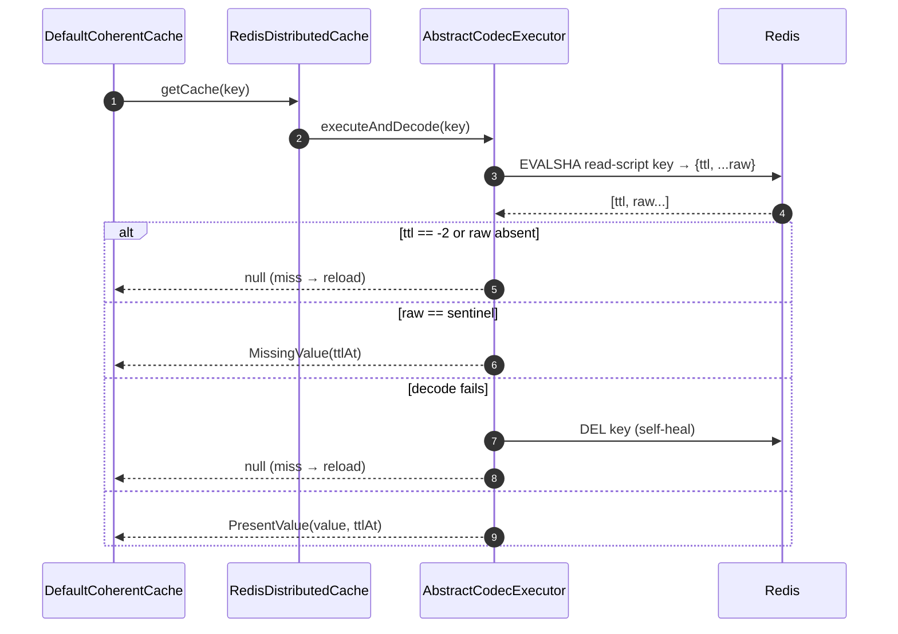
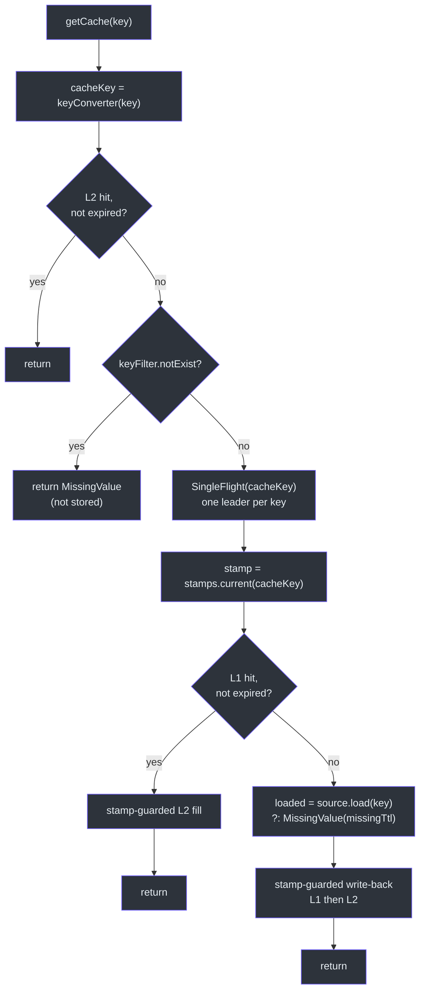

# 缓存层级详解

CoCache 把数据获取组织成三层。存储层是**纯存储**：按字符串 key 存取 `CacheValue`，不持有任何 TTL 策略。编排层 `DefaultCoherentCache` 持有策略（`TtlPolicy`），按 key 合并回源，并保护每一次写回不被并发失效覆盖。

## 层级概览


```mermaid
graph LR
    App["Application"] --> L2["L2: ClientSideCache<br>(per instance, Caffeine)"]
    L2 --> L1["L1: DistributedCache<br>(shared, Redis)"]
    L1 --> L0["L0: CacheSource<br>(authoritative)"]
    Policy["TtlPolicy<br>ttl ± amplitude / missingTtl"] -.-> L2
    Policy -.-> L1

    style App fill:#2d333b,stroke:#6d5dfc,color:#e6edf3
    style L2 fill:#2d333b,stroke:#6d5dfc,color:#e6edf3
    style L1 fill:#2d333b,stroke:#6d5dfc,color:#e6edf3
    style L0 fill:#2d333b,stroke:#6d5dfc,color:#e6edf3
    style Policy fill:#2d333b,stroke:#6d5dfc,color:#e6edf3
```

## 存储契约 -- CacheStore

两层存储都实现 [`CacheStore<V>`](https://github.com/Ahoo-Wang/CoCache/blob/main/cocache-api/src/main/kotlin/me/ahoo/cache/api/CacheStore.kt)：

```kotlin
interface CacheStore<V> {
    fun getCache(key: String): CacheValue<V>?   // 可能返回已过期条目，由调用方判断
    fun setCache(key: String, value: CacheValue<V>)  // 写入已过期条目 == 淘汰
    fun evict(key: String)
}
interface ClientSideCache<V> : CacheStore<V> { val size: Long; fun clear() }
interface DistributedCache<V> : CacheStore<V>, AutoCloseable
```

`CacheValue<V>` 是密封类型：`PresentValue(value, ttlAt)` 或 `MissingValue(ttlAt)`（负缓存）。`ttlAt` 是绝对纪元秒，产生它的策略位于存储层之上。


```mermaid
classDiagram
    class CacheStore~V~ {
        <<interface>>
        +getCache(key) CacheValue~V~?
        +setCache(key, value)
        +evict(key)
    }
    class ClientSideCache~V~ {
        <<interface>>
        +size: Long
        +clear()
    }
    class DistributedCache~V~ {
        <<interface>>
        +close()
    }
    CacheStore <|-- ClientSideCache
    CacheStore <|-- DistributedCache
    ClientSideCache <|.. CaffeineClientSideCache
    ClientSideCache <|.. MapClientSideCache
    DistributedCache <|.. RedisDistributedCache
    DistributedCache <|.. InMemoryDistributedCache

    style CacheStore fill:#2d333b,stroke:#6d5dfc,color:#e6edf3
    style ClientSideCache fill:#2d333b,stroke:#6d5dfc,color:#e6edf3
    style DistributedCache fill:#2d333b,stroke:#6d5dfc,color:#e6edf3
    style CaffeineClientSideCache fill:#2d333b,stroke:#6d5dfc,color:#e6edf3
    style MapClientSideCache fill:#2d333b,stroke:#6d5dfc,color:#e6edf3
    style RedisDistributedCache fill:#2d333b,stroke:#6d5dfc,color:#e6edf3
    style InMemoryDistributedCache fill:#2d333b,stroke:#6d5dfc,color:#e6edf3
```

## L2 -- ClientSideCache

| 实现 | 行为 | 源码 |
|------|------|------|
| `CaffeineClientSideCache`（默认） | 有界（`maximumSize`，默认 10000）；过期条目在读取时淘汰；可选 `expireAfterAccess`。不使用条目级 `Expiry`：它会让每次读取都写节点元数据，热点 key 无法随线程扩展 | [CaffeineClientSideCache.kt](https://github.com/Ahoo-Wang/CoCache/blob/main/cocache-core/src/main/kotlin/me/ahoo/cache/client/CaffeineClientSideCache.kt) |
| `MapClientSideCache` | 无界 `ConcurrentHashMap`，过期条目在读取时淘汰 -- 仅用于测试或 key 集合固定且较小的场景 | [MapClientSideCache.kt](https://github.com/Ahoo-Wang/CoCache/blob/main/cocache-core/src/main/kotlin/me/ahoo/cache/client/MapClientSideCache.kt) |

用 [`@CaffeineCache`](../api/annotations.md#caffeinecache) 配置默认 L2，或声明名为 `{cacheName}.ClientSideCache` 的 bean 替换它。

## L1 -- DistributedCache（Redis）

[`RedisDistributedCache`](https://github.com/Ahoo-Wang/CoCache/blob/main/cocache-spring-redis/src/main/kotlin/me/ahoo/cache/spring/redis/RedisDistributedCache.kt) 委托给 `CodecExecutor`。一次读取是**一次往返**：原子的 Lua 脚本（在共享连接上 EVALSHA）同时返回 TTL 与原始值。


```mermaid
sequenceDiagram
autonumber
    participant CC as DefaultCoherentCache
    participant DC as RedisDistributedCache
    participant CE as AbstractCodecExecutor
    participant R as Redis

    CC->>DC: getCache(key)
    DC->>CE: executeAndDecode(key)
    CE->>R: EVALSHA read-script key → {ttl, ...raw}
    R-->>CE: [ttl, raw...]
    alt ttl == -2 or raw absent
        CE-->>CC: null (miss → reload)
    else raw == sentinel
        CE-->>CC: MissingValue(ttlAt)
    else decode fails
        CE->>R: DEL key (self-heal)
        CE-->>CC: null (miss → reload)
    else
        CE-->>CC: PresentValue(value, ttlAt)
    end
```

规则：

- **L1 未命中绝不等于负缓存。** 只有存储中的哨兵记录才解码为 `MissingValue`；key 或值不存在都按未命中处理。
- 写入时剩余 TTL 至少钳为 1 秒；`FOREVER` 写为不过期；已过期的值直接删除 key。
- **故障降级：** 读出现 `DataAccessException` → 未命中；写/淘汰出现 → `WARN`。设置 `cocache.redis.strict-failure=true` 改为重抛（见[配置](/zh/guide/configuration#redis-故障降级)）。

| Codec | Redis 类型 | 负缓存的线格式 |
|-------|------------|----------------|
| `StringToStringCodecExecutor` | String | `_nil_` |
| `ObjectToJsonCodecExecutor`（默认） | String（JSON） | `_nil_` |
| `MapToHashCodecExecutor` / `ObjectToHashCodecExecutor` | Hash（Lua 原子写） | `{_nil_: <写入时间>}` |
| `SetToSetCodecExecutor` | Set（Lua 原子写） | `{_nil_}` |

## L0 -- CacheSource

```kotlin
fun interface CacheSource<K, V> {
    fun loadCacheValue(key: K): CacheValue<V>?   // null → 以 missingTtl 写入负缓存
}
```

## 读路径


```mermaid
flowchart TD
    Start["getCache(key)"] --> Convert["cacheKey = keyConverter(key)"]
    Convert --> L2{"L2 hit,<br>not expired?"}
    L2 -->|yes| RetL2["return"]
    L2 -->|no| Filter{"keyFilter.notExist?"}
    Filter -->|yes| RetMissing["return MissingValue<br>(not stored)"]
    Filter -->|no| Flight["SingleFlight(cacheKey)<br>one leader per key"]
    Flight --> Stamp["stamp = stamps.current(cacheKey)"]
    Stamp --> L1{"L1 hit,<br>not expired?"}
    L1 -->|yes| Fill["stamp-guarded L2 fill"] --> RetL1["return"]
    L1 -->|no| Load["loaded = source.load(key)<br>?: MissingValue(missingTtl)"]
    Load --> WB["stamp-guarded write-back<br>L1 then L2"] --> RetLoad["return"]

    style Start fill:#2d333b,stroke:#6d5dfc,color:#e6edf3
    style Convert fill:#2d333b,stroke:#6d5dfc,color:#e6edf3
    style L2 fill:#2d333b,stroke:#6d5dfc,color:#e6edf3
    style RetL2 fill:#2d333b,stroke:#6d5dfc,color:#e6edf3
    style Filter fill:#2d333b,stroke:#6d5dfc,color:#e6edf3
    style RetMissing fill:#2d333b,stroke:#6d5dfc,color:#e6edf3
    style Flight fill:#2d333b,stroke:#6d5dfc,color:#e6edf3
    style Stamp fill:#2d333b,stroke:#6d5dfc,color:#e6edf3
    style L1 fill:#2d333b,stroke:#6d5dfc,color:#e6edf3
    style Fill fill:#2d333b,stroke:#6d5dfc,color:#e6edf3
    style RetL1 fill:#2d333b,stroke:#6d5dfc,color:#e6edf3
    style Load fill:#2d333b,stroke:#6d5dfc,color:#e6edf3
    style WB fill:#2d333b,stroke:#6d5dfc,color:#e6edf3
    style RetLoad fill:#2d333b,stroke:#6d5dfc,color:#e6edf3
```

- **SingleFlight**（[SingleFlight.kt](https://github.com/Ahoo-Wang/CoCache/blob/main/cocache-core/src/main/kotlin/me/ahoo/cache/concurrent/SingleFlight.kt)）合并同一 key 的并发未命中，等待者共享 leader 的结果或其**原始异常**。不同 key 之间互不阻塞；在 `CacheSource` 内部重入同一 key 会快速失败。
- **受戳保护的写回** -- 见[缓存一致性](./coherence.md#写回保护)。回源期间若发生失效，加载到的值仍返回给调用方，但不会被缓存。
- 回源成功**不**广播事件：L1 为空时，其它实例 L2 中的副本必然已过期或已被失效。

## 写入与失效路径

```kotlin
override fun setCache(key: K, value: CacheValue<V>) {   // 已过期 → evict(key)
    stamps.invalidate(cacheKey)        // 使该 key 的在途回源失效
    distributedCache.setCache(cacheKey, value)
    clientSideCache.setCache(cacheKey, value)
    publish(cacheKey)
}

override fun evict(key: K) {           // 先更新数据源，再淘汰
    stamps.invalidate(cacheKey)
    clientSideCache.evict(cacheKey)
    distributedCache.evict(cacheKey)
    publish(cacheKey)
}
```

`set(key, value)` 按缓存自身的 `TtlPolicy` 构造条目：命中值使用 `ttl ± ttlAmplitude`，`null` 使用 `missingTtl`。

## 源码参考

| 组件 | 源码 |
|------|------|
| `DefaultCoherentCache` | [DefaultCoherentCache.kt](https://github.com/Ahoo-Wang/CoCache/blob/main/cocache-core/src/main/kotlin/me/ahoo/cache/consistency/DefaultCoherentCache.kt) |
| `TtlPolicy` | [TtlPolicy.kt](https://github.com/Ahoo-Wang/CoCache/blob/main/cocache-core/src/main/kotlin/me/ahoo/cache/TtlPolicy.kt) |
| `CacheValue` | [CacheValue.kt](https://github.com/Ahoo-Wang/CoCache/blob/main/cocache-api/src/main/kotlin/me/ahoo/cache/api/CacheValue.kt) |
| `AbstractCodecExecutor` | [AbstractCodecExecutor.kt](https://github.com/Ahoo-Wang/CoCache/blob/main/cocache-spring-redis/src/main/kotlin/me/ahoo/cache/spring/redis/codec/AbstractCodecExecutor.kt) |

## 相关页面

- [架构概览](./index.md)
- [缓存一致性与事件总线](./coherence.md)
- [代理与注解](./proxy.md)
