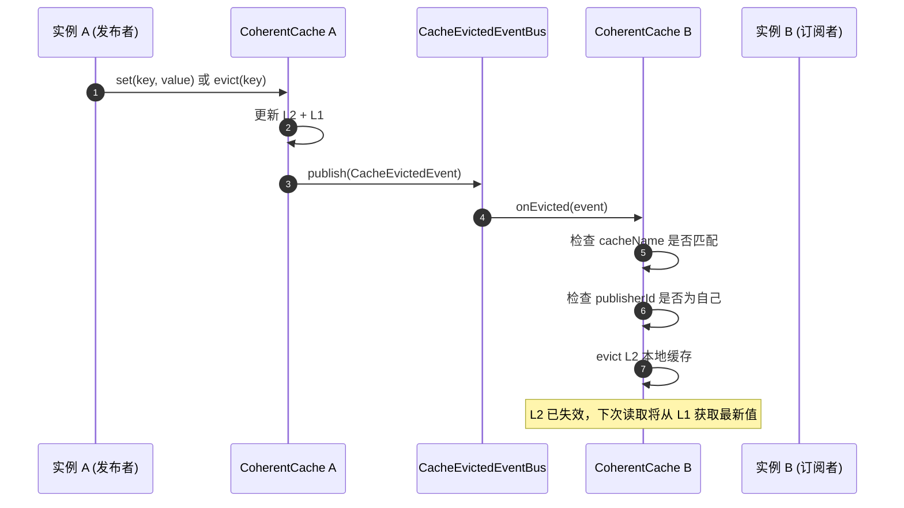
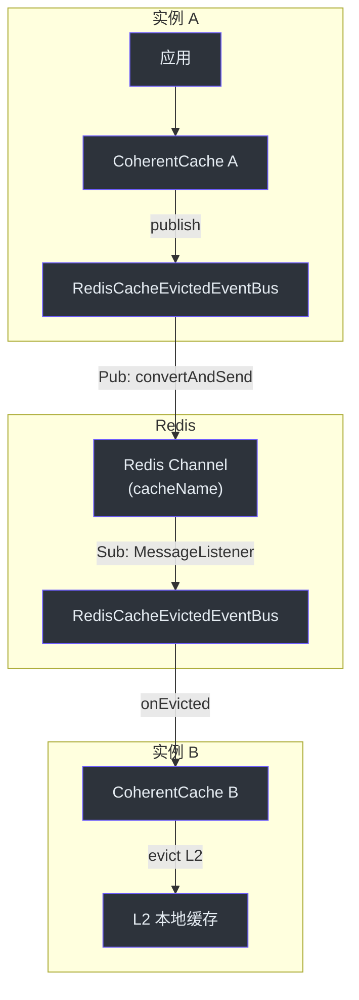

# 一致性与事件总线

CoCache 通过事件驱动机制实现分布式缓存一致性。当某个实例修改或驱逐缓存时，通过 `CacheEvictedEventBus` 发布事件，所有其他实例自动失效其本地缓存（L2）。

## 核心概念

### CacheEvictedEvent

缓存失效事件，包含以下信息：

```kotlin
data class CacheEvictedEvent(
    val cacheName: String,   // 缓存名称
    val key: String,         // 被驱逐的缓存键
    val publisherId: String  // 发布者实例 ID
)
```

- `cacheName`：用于路由事件到正确的 `CacheEvictedSubscriber`
- `publisherId`：用于避免处理自己发布的事件（防止循环失效）

**源码参考**：[`cocache-core/.../CacheEvictedEvent.kt`](https://github.com/Ahoo-Wang/CoCache/blob/main/cocache-core/src/main/kotlin/me/ahoo/cache/consistency/CacheEvictedEvent.kt)

### CacheEvictedEventBus

事件总线接口，负责事件的发布和订阅管理：

```kotlin
interface CacheEvictedEventBus {
    fun publish(event: CacheEvictedEvent)
    fun register(subscriber: CacheEvictedSubscriber)
    fun unregister(subscriber: CacheEvictedSubscriber)
}
```

### CacheEvictedSubscriber

事件订阅者接口，`CoherentCache` 实现了此接口：

```kotlin
interface CacheEvictedSubscriber : NamedCache {
    fun onEvicted(cacheEvictedEvent: CacheEvictedEvent)
}
```

## 事件驱动一致性流程



## onEvicted 处理逻辑

`DefaultCoherentCache.onEvicted()` 实现了事件处理的核心逻辑：

```kotlin
@Subscribe
override fun onEvicted(cacheEvictedEvent: CacheEvictedEvent) {
    // 1. 忽略缓存名称不匹配的事件
    if (cacheEvictedEvent.cacheName != cacheName) {
        return
    }
    // 2. 忽略自己发布的事件（避免循环）
    if (cacheEvictedEvent.publisherId == clientId) {
        return
    }
    // 3. 驱逐本地 L2 缓存
    clientSideCache.evict(cacheEvictedEvent.key)
}
```

关键设计要点：
- 只驱逐 L2（本地缓存），不驱逐 L1（分布式缓存），因为 L1 已被发布者更新
- 通过 `publisherId` 避免发布者自己处理事件，防止不必要的 L2 驱逐
- 通过 `cacheName` 实现事件路由，不同缓存的事件互不干扰

## GuavaCacheEvictedEventBus（进程内）

基于 Guava `EventBus` 的进程内事件总线实现。适用于单实例场景或测试环境。

```kotlin
class GuavaCacheEvictedEventBus(
    private val eventBus: EventBus = EventBus()
) : CacheEvictedEventBus {
    override fun publish(event: CacheEvictedEvent) {
        eventBus.post(event)
    }
    override fun register(subscriber: CacheEvictedSubscriber) {
        // 包装为 CacheEvictedSubscriberAdapter 后注册
    }
}
```

特点：
- 进程内事件分发，仅当前实例可见
- 基于 Guava EventBus 的 `@Subscribe` 注解
- 适合开发、测试和单实例部署

**源码参考**：[`cocache-core/.../GuavaCacheEvictedEventBus.kt`](https://github.com/Ahoo-Wang/CoCache/blob/main/cocache-core/src/main/kotlin/me/ahoo/cache/consistency/GuavaCacheEvictedEventBus.kt)

## RedisCacheEvictedEventBus（分布式）

基于 Redis Pub/Sub 的分布式事件总线实现。适用于多实例生产环境。



```kotlin
class RedisCacheEvictedEventBus(
    private val redisTemplate: StringRedisTemplate,
    private val listenerContainer: RedisMessageListenerContainer
) : CacheEvictedEventBus {
    override fun publish(event: CacheEvictedEvent) {
        // 使用缓存名称作为 Redis Channel
        redisTemplate.convertAndSend(event.cacheName, EvictedEvents.asMessage(event.key, event.publisherId))
    }
    override fun register(subscriber: CacheEvictedSubscriber) {
        // 为每个订阅者创建 MessageListener，监听对应的 Channel
        listenerContainer.addMessageListener(listener, ChannelTopic(subscriber.cacheName))
    }
}
```

特点：
- 通过 Redis Pub/Sub 实现跨实例事件分发
- 每个缓存名称对应一个独立的 Redis Channel
- 使用 `RedisMessageListenerContainer` 管理消息监听
- 自动序列化/反序列化事件消息

**源码参考**：[`cocache-spring-redis/.../RedisCacheEvictedEventBus.kt`](https://github.com/Ahoo-Wang/CoCache/blob/main/cocache-spring-redis/src/main/kotlin/me/ahoo/cache/spring/redis/RedisCacheEvictedEventBus.kt)

## NoOpCacheEvictedEventBus

空操作实现，不执行任何事件发布或订阅。用于不需要跨实例一致性的场景。

## 一致性保证

### 最终一致性

CoCache 提供的是**最终一致性**保证：
- 当一个实例修改缓存后，其他实例的 L2 缓存会在短暂延迟后被失效
- 在延迟窗口内，其他实例可能读取到旧值
- Redis Pub/Sub 的消息传递通常是毫秒级延迟

### 写入一致性

写入操作（`setCache`）同时更新 L1 和 L2：
1. 更新 L2（本地缓存）
2. 更新 L1（分布式缓存）
3. 发布 `CacheEvictedEvent`

### 驱逐一致性

驱逐操作（`evict`）同时清除 L1 和 L2：
1. 清除 L2（本地缓存）
2. 清除 L1（分布式缓存）
3. 发布 `CacheEvictedEvent`

## 相关页面

- [架构概览](./index.md) - 整体架构
- [缓存层级](./cache-layers.md) - L0/L1/L2 详解
- [cocache-spring-redis](../modules/cocache-spring-redis.md) - Redis 实现模块
- [集成测试](../testing/integration-testing.md) - 多实例同步测试
