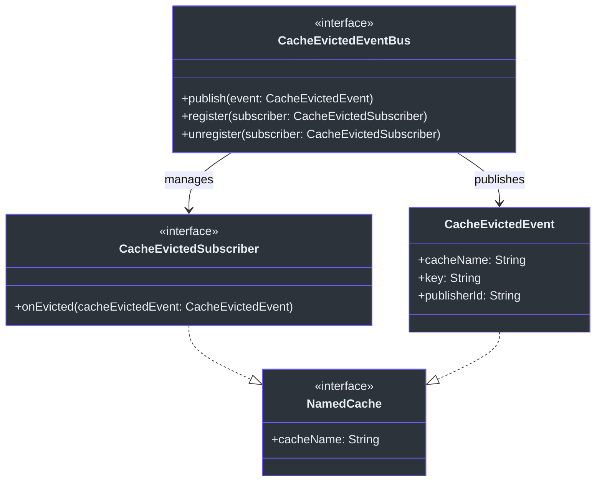
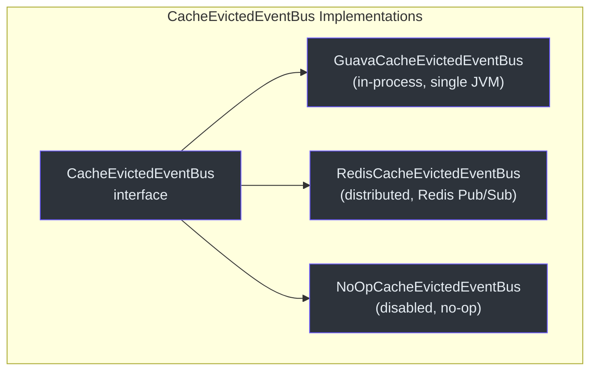
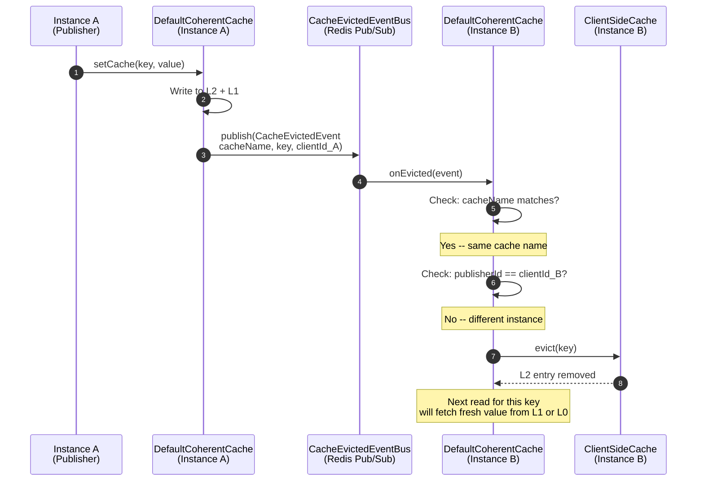
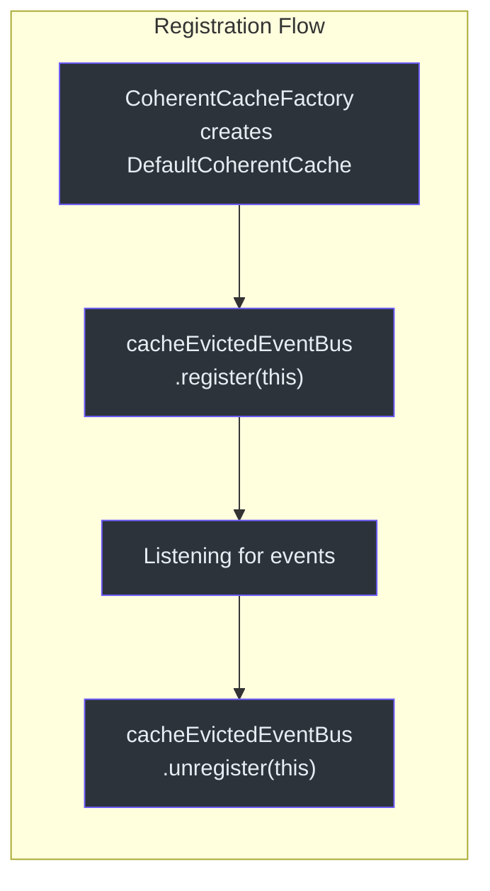

# 缓存一致性与事件总线

缓存一致性是 CoCache 的核心特性。当一个应用实例修改或驱逐缓存条目时，所有其他实例必须使其本地 L2 缓存失效，以防止读取过期数据。这通过围绕 `CacheEvictedEvent` 构建的发布-订阅事件总线模式实现。

## 核心接口

一致性系统由 `cocache-api` 模块中的三个接口定义：



| 接口 | 源码 | 职责 |
|------|------|------|
| [`CacheEvictedEventBus`](https://github.com/Ahoo-Wang/CoCache/blob/main/cocache-core/src/main/kotlin/me/ahoo/cache/consistency/CacheEvictedEventBus.kt#L20) | [CacheEvictedEventBus.kt](https://github.com/Ahoo-Wang/CoCache/blob/main/cocache-core/src/main/kotlin/me/ahoo/cache/consistency/CacheEvictedEventBus.kt#L20) | 驱逐事件的发布/订阅注册表 |
| [`CacheEvictedSubscriber`](https://github.com/Ahoo-Wang/CoCache/blob/main/cocache-core/src/main/kotlin/me/ahoo/cache/consistency/CacheEvictedSubscriber.kt#L22) | [CacheEvictedSubscriber.kt](https://github.com/Ahoo-Wang/CoCache/blob/main/cocache-core/src/main/kotlin/me/ahoo/cache/consistency/CacheEvictedSubscriber.kt#L22) | 接收驱逐通知 |
| [`CacheEvictedEvent`](https://github.com/Ahoo-Wang/CoCache/blob/main/cocache-core/src/main/kotlin/me/ahoo/cache/consistency/CacheEvictedEvent.kt#L21) | [CacheEvictedEvent.kt](https://github.com/Ahoo-Wang/CoCache/blob/main/cocache-core/src/main/kotlin/me/ahoo/cache/consistency/CacheEvictedEvent.kt#L21) | 携带 `cacheName`、`key` 和 `publisherId` |

`CacheEvictedEvent` 数据类携带三个字段：
- **`cacheName`** -- 标识受影响的缓存（使订阅者能够按缓存名称过滤）
- **`key`** -- 被修改或驱逐的具体缓存键
- **`publisherId`** -- 发布事件的实例的 `clientId`（用于自驱逐过滤）

## 实现

CoCache 提供三种 `CacheEvictedEventBus` 实现，每种适用于不同的部署场景：



### GuavaCacheEvictedEventBus（进程内）

[`GuavaCacheEvictedEventBus`](https://github.com/Ahoo-Wang/CoCache/blob/main/cocache-core/src/main/kotlin/me/ahoo/cache/consistency/GuavaCacheEvictedEventBus.kt#L25) 封装 Guava `EventBus` 实现进程内发布/订阅。当没有配置分布式事件总线时，它是默认实现。同一 JVM 内的所有 `DefaultCoherentCache` 实例共享一个 `GuavaCacheEvictedEventBus`，因此事件在单个应用内的各个缓存之间传播。

```kotlin
class GuavaCacheEvictedEventBus(
    private val eventBus: EventBus = EventBus()
) : CacheEvictedEventBus {
    private val subscribers = ConcurrentHashMap<CacheEvictedSubscriber, CacheEvictedSubscriberAdapter>()

    override fun publish(event: CacheEvictedEvent) {
        eventBus.post(event)
    }

    override fun register(subscriber: CacheEvictedSubscriber) {
        subscribers.computeIfAbsent(subscriber) {
            CacheEvictedSubscriberAdapter(it).also { adapter ->
                eventBus.register(adapter)
            }
        }
    }
}
```

适配器类 [`CacheEvictedSubscriberAdapter`](https://github.com/Ahoo-Wang/CoCache/blob/main/cocache-core/src/main/kotlin/me/ahoo/cache/consistency/GuavaCacheEvictedEventBus.kt#L61) 在 Guava 的 `@Subscribe` 注解和 `CacheEvictedSubscriber.onEvicted()` 方法之间进行桥接。订阅者映射（`ConcurrentHashMap`）防止重复注册。

### RedisCacheEvictedEventBus（分布式）

[`RedisCacheEvictedEventBus`](https://github.com/Ahoo-Wang/CoCache/blob/main/cocache-spring-redis/src/main/kotlin/me/ahoo/cache/spring/redis/RedisCacheEvictedEventBus.kt#L32) 使用 Redis Pub/Sub 实现跨实例事件传播。当调用 `publish()` 时，它将驱逐消息发送到以 `cacheName` 命名的 Redis 频道。订阅该频道的所有实例都会收到通知。

```kotlin
class RedisCacheEvictedEventBus(
    private val redisTemplate: StringRedisTemplate,
    private val listenerContainer: RedisMessageListenerContainer
) : CacheEvictedEventBus {

    override fun publish(event: CacheEvictedEvent) {
        redisTemplate.convertAndSend(event.cacheName, EvictedEvents.asMessage(event.key, event.publisherId))
    }

    override fun register(subscriber: CacheEvictedSubscriber) {
        subscribers.computeIfAbsent(subscriber) {
            MessageListenerAdapter(it).also { listener ->
                listenerContainer.addMessageListener(listener, ChannelTopic(it.cacheName))
            }
        }
    }
}
```

### NoOpCacheEvictedEventBus（禁用）

[`NoOpCacheEvictedEventBus`](https://github.com/Ahoo-Wang/CoCache/blob/main/cocache-core/src/main/kotlin/me/ahoo/cache/consistency/NoOpCacheEvictedEventBus.kt#L20) 是一个什么都不做的单例。适用于单实例部署或不需要一致性的测试场景。

## EvictedEvents 编解码器

[`EvictedEvents`](https://github.com/Ahoo-Wang/CoCache/blob/main/cocache-spring-redis/src/main/kotlin/me/ahoo/cache/spring/redis/codec/EvictedEvents.kt#L19) 对象处理 Redis Pub/Sub 消息的编码和解码。它使用 `@@` 作为分隔符，将 `key` 和 `clientId` 打包到单个消息体中：

```kotlin
object EvictedEvents {
    private const val DELIMITER = "@@"

    fun fromMessage(message: Message): CacheEvictedEvent {
        val cacheName = message.channel.decodeToString()
        val msgBody = message.body.decodeToString()
        val clientIdWithKey = msgBody.split(DELIMITER.toRegex())
        require(2 == clientIdWithKey.size)
        return CacheEvictedEvent(cacheName, clientIdWithKey[0], clientIdWithKey[1])
    }

    fun asMessage(key: String, clientId: String): String {
        return key + DELIMITER + clientId
    }
}
```

`cacheName` 被编码为 Redis 频道名称，而 `key` 和 `clientId` 被打包到消息体中。

## 跨实例失效流程

下图展示了实例 A 上的缓存修改如何传播到实例 B：



## 自驱逐过滤

`DefaultCoherentCache` 中的 [`onEvicted()`](https://github.com/Ahoo-Wang/CoCache/blob/main/cocache-core/src/main/kotlin/me/ahoo/cache/consistency/DefaultCoherentCache.kt#L158) 处理器在驱逐本地 L2 缓存之前执行两项关键检查：

```kotlin
@Subscribe
override fun onEvicted(cacheEvictedEvent: CacheEvictedEvent) {
    // Filter 1: ignore events for different caches
    if (cacheEvictedEvent.cacheName != cacheName) {
        return
    }
    // Filter 2: ignore self-published events
    if (cacheEvictedEvent.publisherId == clientId) {
        return
    }
    // Only evict L2 for events from other instances
    clientSideCache.evict(cacheEvictedEvent.key)
}
```

**为什么要过滤自发布事件？** 当实例 A 调用 `setCache()` 或 `evict()` 时，它已经直接修改了自己的 L2 缓存。如果再接收回发布的事件，会导致冗余的 L2 驱逐（或者更糟，驱逐刚刚写入的值）。[第 169 行](https://github.com/Ahoo-Wang/CoCache/blob/main/cocache-core/src/main/kotlin/me/ahoo/cache/consistency/DefaultCoherentCache.kt#L169)的 `publisherId == clientId` 检查防止了这种情况。

**为什么要按 cacheName 过滤？** 单个应用可能有多个 `DefaultCoherentCache` 实例（每个缓存接口一个）。它们都订阅同一个事件总线，因此[第 160 行](https://github.com/Ahoo-Wang/CoCache/blob/main/cocache-core/src/main/kotlin/me/ahoo/cache/consistency/DefaultCoherentCache.kt#L160)的 cacheName 检查确保每个实例只对与自己缓存相关的事件做出反应。

## 注册生命周期

当 `DefaultCoherentCache` 被构造时，它将自己注册为事件总线的订阅者。`onEvicted()` 上的 `@Subscribe` 注解被 Guava EventBus（进程内模式）识别，`MessageListenerAdapter` 处理 Redis Pub/Sub 消息（分布式模式）。



## EventBus 实现对比

| 特性 | GuavaCacheEvictedEventBus | RedisCacheEvictedEventBus | NoOpCacheEvictedEventBus |
|------|--------------------------|--------------------------|--------------------------|
| 范围 | 单 JVM（进程内） | 跨实例（分布式） | 无 |
| 传输 | Guava EventBus | Redis Pub/Sub | N/A |
| 频道 | N/A（直接方法调用） | `cacheName` 作为 Redis 频道 | N/A |
| 序列化 | 无（对象引用） | `EvictedEvents` 编解码器（`key@@clientId`） | N/A |
| 依赖 | 仅 `cocache-core` | `cocache-spring-redis` | 仅 `cocache-core` |
| 源码 | [GuavaCacheEvictedEventBus.kt:25](https://github.com/Ahoo-Wang/CoCache/blob/main/cocache-core/src/main/kotlin/me/ahoo/cache/consistency/GuavaCacheEvictedEventBus.kt#L25) | [RedisCacheEvictedEventBus.kt:32](https://github.com/Ahoo-Wang/CoCache/blob/main/cocache-spring-redis/src/main/kotlin/me/ahoo/cache/spring/redis/RedisCacheEvictedEventBus.kt#L32) | [NoOpCacheEvictedEventBus.kt:20](https://github.com/Ahoo-Wang/CoCache/blob/main/cocache-core/src/main/kotlin/me/ahoo/cache/consistency/NoOpCacheEvictedEventBus.kt#L20) |

## 源码参考

| 文件 | 行号 | 说明 |
|------|------|------|
| [`CacheEvictedEventBus.kt`](https://github.com/Ahoo-Wang/CoCache/blob/main/cocache-core/src/main/kotlin/me/ahoo/cache/consistency/CacheEvictedEventBus.kt#L20) | 20-24 | 核心事件总线接口 |
| [`CacheEvictedEvent.kt`](https://github.com/Ahoo-Wang/CoCache/blob/main/cocache-core/src/main/kotlin/me/ahoo/cache/consistency/CacheEvictedEvent.kt#L21) | 21-39 | 事件数据类，包含 cacheName、key、publisherId |
| [`CacheEvictedSubscriber.kt`](https://github.com/Ahoo-Wang/CoCache/blob/main/cocache-core/src/main/kotlin/me/ahoo/cache/consistency/CacheEvictedSubscriber.kt#L22) | 22-24 | 订阅者接口，包含 onEvicted() |
| [`GuavaCacheEvictedEventBus.kt`](https://github.com/Ahoo-Wang/CoCache/blob/main/cocache-core/src/main/kotlin/me/ahoo/cache/consistency/GuavaCacheEvictedEventBus.kt#L25) | 25-66 | 进程内 Guava EventBus 实现 |
| [`RedisCacheEvictedEventBus.kt`](https://github.com/Ahoo-Wang/CoCache/blob/main/cocache-spring-redis/src/main/kotlin/me/ahoo/cache/spring/redis/RedisCacheEvictedEventBus.kt#L32) | 32-71 | 分布式 Redis Pub/Sub 实现 |
| [`EvictedEvents.kt`](https://github.com/Ahoo-Wang/CoCache/blob/main/cocache-spring-redis/src/main/kotlin/me/ahoo/cache/spring/redis/codec/EvictedEvents.kt#L19) | 19-33 | Redis Pub/Sub 消息编解码器 |
| [`DefaultCoherentCache.kt`](https://github.com/Ahoo-Wang/CoCache/blob/main/cocache-core/src/main/kotlin/me/ahoo/cache/consistency/DefaultCoherentCache.kt#L158) | 158-181 | onEvicted 处理器，带自驱逐过滤 |
| [`NoOpCacheEvictedEventBus.kt`](https://github.com/Ahoo-Wang/CoCache/blob/main/cocache-core/src/main/kotlin/me/ahoo/cache/consistency/NoOpCacheEvictedEventBus.kt#L20) | 20-24 | 空操作实现 |

## 相关页面

- [架构概览](./index.md) -- 高层系统架构
- [缓存层级详解](./cache-layers.md) -- L0/L1/L2 读取、写入和驱逐路径
- [代理与注解](./proxy.md) -- 声明式缓存接口创建
