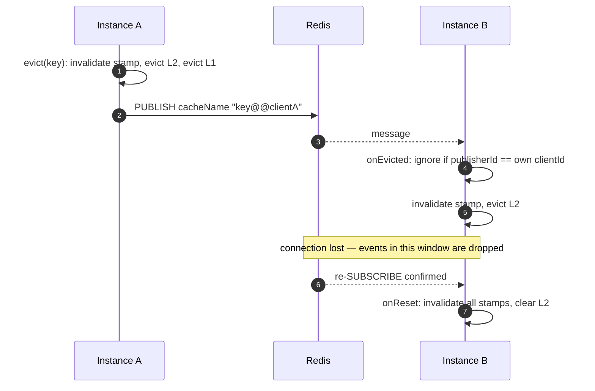
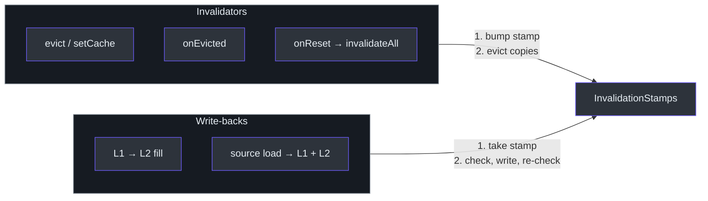

# 缓存一致性与事件总线

每个实例都有自己的 L2。CoCache 用三种机制保持这些副本一致：

1. **失效事件** -- 每次本地写入或淘汰都会广播 `CacheEvictedEvent`，其它实例据此从 L2 淘汰该 key。
2. **受戳保护的写回** -- 从 L1 读到或从数据源加载的值，只有在期间没有发生该 key 的失效时才会被缓存。
3. **（重）订阅时重置** -- 事件通道每次（重新）订阅，订阅者都清空 L2，因为断线期间发送的事件已经丢失。

结合有限的 TTL，这三点保证了任何实例提供陈旧值的时长都有上界。

## 核心接口

三者都位于 `cocache-api`（`me.ahoo.cache.api.consistency`）。

```kotlin
data class CacheEvictedEvent(override val cacheName: String, val key: String, val publisherId: String) : NamedCache

interface CacheEvictedSubscriber : NamedCache {
    fun onEvicted(cacheEvictedEvent: CacheEvictedEvent)
    fun onReset()   // 通道（重新）订阅：放弃全部本地副本
}

interface CacheEvictedEventBus {
    fun publish(event: CacheEvictedEvent)   // 尽力而为，失败不阻断调用方
    fun register(subscriber: CacheEvictedSubscriber)
    fun unregister(subscriber: CacheEvictedSubscriber)
}
```

| 接口 | 职责 | 源码 |
|------|------|------|
| `CacheEvictedEventBus` | 通道 SPI；每次（重新）订阅都必须调用 `onReset` | [CacheEvictedEventBus.kt](https://github.com/Ahoo-Wang/CoCache/blob/main/cocache-api/src/main/kotlin/me/ahoo/cache/api/consistency/CacheEvictedEventBus.kt) |
| `CacheEvictedSubscriber` | 接收所属 `cacheName` 的 `onEvicted` / `onReset` | [CacheEvictedSubscriber.kt](https://github.com/Ahoo-Wang/CoCache/blob/main/cocache-api/src/main/kotlin/me/ahoo/cache/api/consistency/CacheEvictedSubscriber.kt) |
| `CacheEvictedEvent` | `cacheName`、存储层 `key`、`publisherId`（= 发布者的 `clientId`） | [CacheEvictedEvent.kt](https://github.com/Ahoo-Wang/CoCache/blob/main/cocache-api/src/main/kotlin/me/ahoo/cache/api/consistency/CacheEvictedEvent.kt) |

## 实现

| 特性 | `RedisCacheEvictedEventBus` | `LocalCacheEvictedEventBus` | `NoOpCacheEvictedEventBus` |
|------|-----------------------------|-----------------------------|----------------------------|
| 范围 | 跨实例 | 单 JVM | 无（单实例） |
| 传输 | Redis Pub/Sub，频道 = `cacheName` | 直接调用，按 `cacheName` 路由 | -- |
| `onReset` | 每次频道（重新）订阅 | `register` 时 | 从不 |
| 模块 | `cocache-spring-redis` | `cocache-core` | `cocache-core` |

### Redis Pub/Sub

- 消息体：`key@@publisherId`。解码按**最后一个** `@@` 切分，因此 key 可以包含 `@@`；包含 `@@` 的 `publisherId` 在发布时被拒绝。
- 至多一次投递，发布失败仅告警。
- 监听器实现了 Spring Data Redis 的 `SubscriptionListener`。`RedisMessageListenerContainer` 在初次订阅后、每次重连后、以及同一频道加入新监听器时调用 `onChannelSubscribed`，CoCache 将每次调用都映射为 `onReset`。


```mermaid
sequenceDiagram
autonumber
    participant A as Instance A
    participant R as Redis
    participant B as Instance B

    A->>A: evict(key): invalidate stamp, evict L2, evict L1
    A->>R: PUBLISH cacheName "key@@clientA"
    R-->>B: message
    B->>B: onEvicted: ignore if publisherId == own clientId
    B->>B: invalidate stamp, evict L2
    Note over R,B: connection lost — events in this window are dropped
    R-->>B: re-SUBSCRIBE confirmed
    B->>B: onReset: invalidate all stamps, clear L2
```

## 写回保护

`InvalidationStamps` 是按存储 key 哈希分段（4096 段）的计数器数组。


```mermaid
flowchart LR
    subgraph inv ["Invalidators"]
        E1["evict / setCache"]
        E2["onEvicted"]
        E3["onReset → invalidateAll"]
    end
    subgraph wb ["Write-backs"]
        W1["L1 → L2 fill"]
        W2["source load → L1 + L2"]
    end
    inv -->|"1. bump stamp<br>2. evict copies"| S["InvalidationStamps"]
    wb -->|"1. take stamp<br>2. check, write, re-check"| S

    style E1 fill:#2d333b,stroke:#6d5dfc,color:#e6edf3
    style E2 fill:#2d333b,stroke:#6d5dfc,color:#e6edf3
    style E3 fill:#2d333b,stroke:#6d5dfc,color:#e6edf3
    style W1 fill:#2d333b,stroke:#6d5dfc,color:#e6edf3
    style W2 fill:#2d333b,stroke:#6d5dfc,color:#e6edf3
    style S fill:#2d333b,stroke:#6d5dfc,color:#e6edf3
    style inv fill:#161b22,stroke:#8b949e,color:#e6edf3
    style wb fill:#161b22,stroke:#8b949e,color:#e6edf3
```

- 失效方**先**递增戳，**再**淘汰副本。
- 写回方在读取**之前**取戳。若写入前戳已变化则跳过写入，写入后还要复核：
  - 回源写回竞争失败时，撤销 L1、L2 并重新广播。
  - L1 → L2 填充竞争失败时，撤销 L2。
- 由于这一顺序，无论两者如何交错，总有一方会清除陈旧副本。
- 读取方同样在读取之前记录戳。若合并到的回源开始于本次读取已观察到的某次失效之前（例如本线程先 `evict` 再 `get`），读取方会放弃该结果并重新加载一次，从而保证线程总能读到自己的写入。
- 分段碰撞不影响正确性：代价是多余地放弃一次写回；若恰好落在写入与复核之间，还会多一次 L1 淘汰与广播。

这也补上了 4.x 的缺口：同一实例上的**本地** `evict` 无法阻止在途回源。

### 残留窗口

实例 A 回源读到旧数据 → B 更新数据库、删除 L1、发布事件 → A 在收到 B 的事件之前把旧值写入 L1。事件到达后 A 会撤销 L2，但 L1 中的旧值会一直保留到过期。这是所有 cache-aside 方案共有的窗口，也是默认 TTL 必须有限的原因。

## 生命周期

`DefaultCoherentCacheFactory.create` 把缓存注册到总线。`close()` 是幂等的：注销订阅并关闭分布式缓存。Spring 的 `CacheProxyFactoryBean` 在容器关闭时调用 `close()`。

## 源码参考

| 组件 | 源码 |
|------|------|
| `DefaultCoherentCache.onEvicted` / `onReset` | [DefaultCoherentCache.kt](https://github.com/Ahoo-Wang/CoCache/blob/main/cocache-core/src/main/kotlin/me/ahoo/cache/consistency/DefaultCoherentCache.kt) |
| `InvalidationStamps` | [InvalidationStamps.kt](https://github.com/Ahoo-Wang/CoCache/blob/main/cocache-core/src/main/kotlin/me/ahoo/cache/consistency/InvalidationStamps.kt) |
| `RedisCacheEvictedEventBus` | [RedisCacheEvictedEventBus.kt](https://github.com/Ahoo-Wang/CoCache/blob/main/cocache-spring-redis/src/main/kotlin/me/ahoo/cache/spring/redis/RedisCacheEvictedEventBus.kt) |
| `EvictedEvents`（线格式） | [EvictedEvents.kt](https://github.com/Ahoo-Wang/CoCache/blob/main/cocache-spring-redis/src/main/kotlin/me/ahoo/cache/spring/redis/codec/EvictedEvents.kt) |
| `LocalCacheEvictedEventBus` | [LocalCacheEvictedEventBus.kt](https://github.com/Ahoo-Wang/CoCache/blob/main/cocache-core/src/main/kotlin/me/ahoo/cache/consistency/LocalCacheEvictedEventBus.kt) |

## 相关页面

- [架构概览](./index.md)
- [缓存层级详解](./cache-layers.md)
- [代理与注解](./proxy.md)
