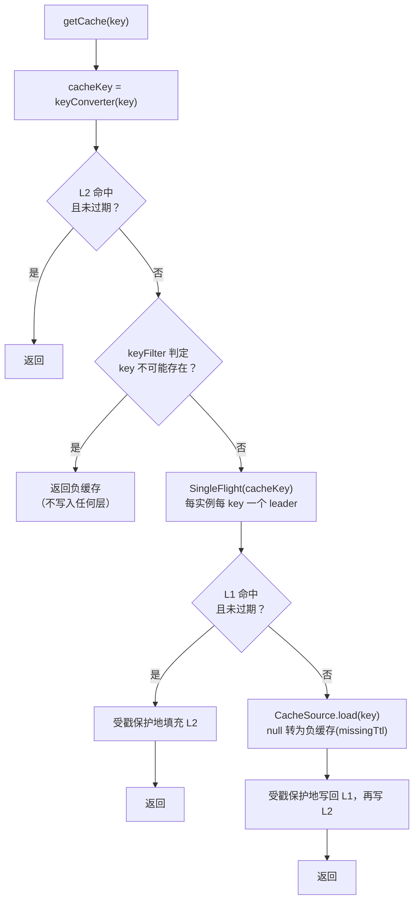

# 一致性

本页描述读、写、淘汰路径，以及它们为何不会丢失失效。规范性版本见 [`docs/architecture.md`](https://github.com/Ahoo-Wang/CoCache/blob/main/docs/architecture.md) 第 4–6 节。

## 读路径

- **合并加载。** 同一实例上同一 key 的并发未命中共享一次 L1 读取与回源。等待者得到 leader 的结果或其原始异常。若 `CacheSource` 在同一线程内再次读取自己的 key，会快速失败而不是死锁。
- **L1 未命中绝不等于“不存在”。** key 不存在、读取途中被删除、载荷无法解码，都会回源。只有存储中确有负缓存记录才表示“不存在”。损坏的载荷不会在读取时删除，而是被回源后的写回覆盖。
- **回源成功不广播。** L1 为空时，其它实例 L2 中的副本必然已过期（L2 复制 L1 的 `ttlAt`），或已被淘汰事件清除。
- **Redis 一次往返。** 一个 Lua 脚本原子地返回剩余 TTL 与值。

## 写入与淘汰路径

| 操作 | 步骤 |
|------|------|
| `setCache(key, value)` | 推进失效戳 → 写 L1 → 写 L2 → 发布淘汰事件 |
| `evict(key)` | 推进失效戳 → 淘汰 L2 → 淘汰 L1 → 发布淘汰事件 |
| 其它实例收到事件 | 推进失效戳 → 淘汰 L2（忽略来自自身 `clientId` 的事件） |
| 通道（重新）订阅（`onReset`） | 推进全部失效戳 → 清空 L2 |

**调用方必须先更新数据源、再淘汰缓存。** 先淘汰的话，并发读取可能在更新提交前重新加载旧数据。

## 失效戳

加载需要时间，失效可能在加载途中到达。没有保护时，下面的序列会留下陈旧值：

1. 读取方 A 未命中并开始加载，读到旧数据。
2. 写入方 B 更新数据并淘汰该 key。
3. A 完成加载，在 B 淘汰之后把旧数据写入缓存。

`InvalidationStamps` 是按 key 分段（4,096 段）的计数器，用来堵住这个缺口：

- **失效方**（本地 `evict`/`setCache`、其它实例的事件、`onReset`）在删除副本*之前*推进戳。
- **写回方**（L1 → L2 填充、回源 → L1 + L2）在加载前读取戳，写入前再检查一次，写入后再复核一次。
  - 写入前戳已变化：放弃写入。
  - 写入过程中戳变化：撤销写入。回源写回会淘汰 L1、L2 并广播；L1 → L2 填充只淘汰 L2。

无论两侧如何交错，总有一方会清除陈旧副本。两个 key 落在同一分段时，偶尔会白白放弃一次写回：浪费一点工作，但始终安全。

**读己之写。** 每次读取在开始时记录戳。若它加入的共享加载开始于本次读取已观察到的某次失效之前，读取方会丢弃该结果，再加载一次。即使同一线程刚淘汰该 key 后立即读取，也成立。这依赖 `SingleFlight` 在发布结果*之前*注销调用，从而保证重试一定开始一次新的加载。

## 淘汰事件通道

默认通道是 Redis Pub/Sub：

- 每个缓存一个频道，以缓存名命名。消息为 `key@@publisherId`，按最后一个 `@@` 切分。
- **至多一次投递。** 发布失败只记录日志并丢弃；实例断开期间发送的消息会丢失。
- **（重新）订阅即重置。** 监听容器每次（重新）订阅都会回调 `onReset`，每个已订阅的缓存清空自己的 L2，从而为丢失的事件兜底。在某个频道上注册新的监听者也会重新订阅该频道，进而重置该频道已有的监听者，这是无害的。

## 保证什么

| 性质 | 保证 |
|------|------|
| 陈旧度 | 值以 `ttl` 为上界，负缓存以 `missingTtl` 为上界 |
| 事件丢失 | 影响不会超过一次重连：重新订阅时清空 L2 |
| 加载与失效 | 若实例在加载进行中观察到失效，该加载的结果会被放弃或撤销 |
| `evict`/`set` 返回后的同一实例 | 不会再返回之前的值 |
| `evict`/`set` 之后的其它实例 | 事件到达时丢弃副本，通常为毫秒级 |

## 不保证什么 {#what-is-not-guaranteed}

**L1 中的 cache-aside 竞态。** 实例 A 从数据库读到旧数据；随后实例 B 更新数据、删除 L1 中的 key 并广播；A 在收到 B 的事件*之前*把旧数据写入 L1。事件到达后 A 会撤销自己的 L2 副本，但 L1 中的旧值会保留到过期。在此期间，任何 L2 未命中的实例都可能从 L1 复制它。所有 cache-aside 方案都有这个窗口。CoCache 用有限的 `ttl` 为它设定上界，这正是默认 `ttl` 为一小时而不是永久的原因。

**线性一致读。** 从 B 写入到事件到达之间，其它实例可能从 L2 返回之前的值。

**跨实例的加载互斥。** 各实例只合并自己的加载。N 个实例同时未命中同一 key 时，可能各加载一次。
