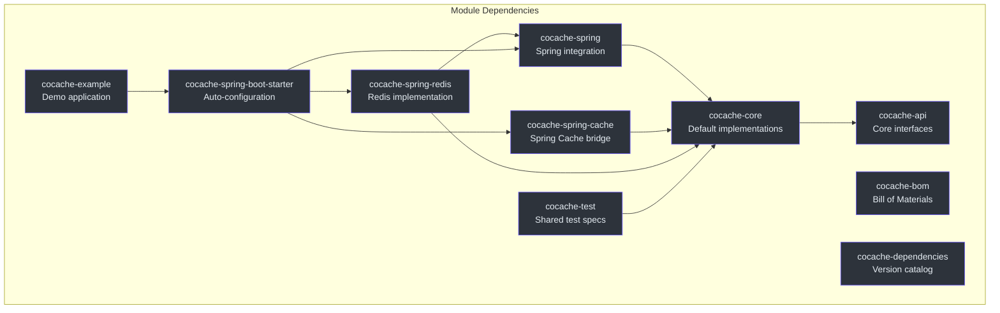
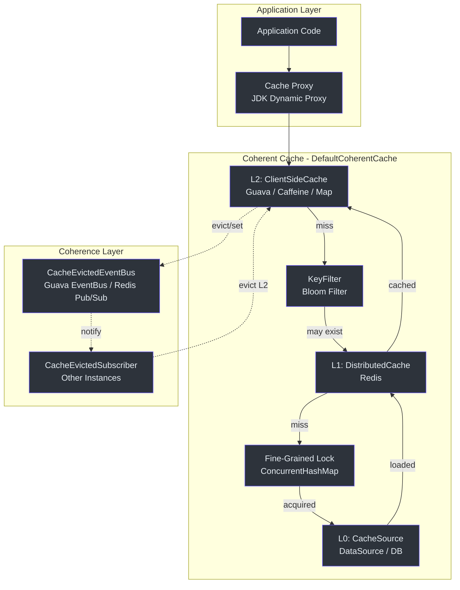
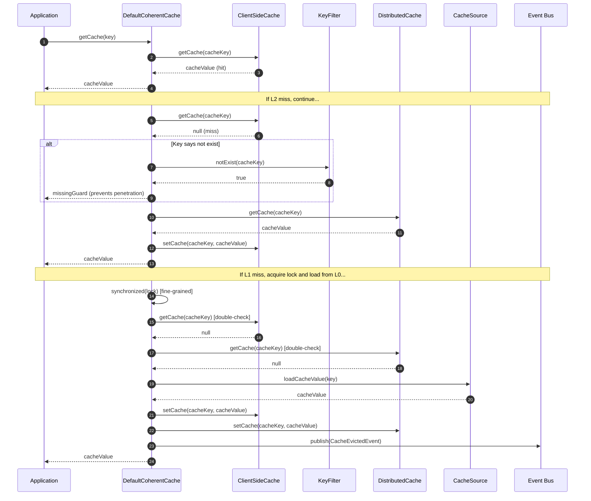

# 架构概览

CoCache 是一个面向 Java/Kotlin 的**二级分布式一致性缓存框架**。它实现了两级缓存架构，将快速的本地内存缓存（L2）与共享的分布式缓存（L1）以及上游数据源（L0）相结合。通过事件总线在缓存条目被修改时发布 `CacheEvictedEvent` 消息，维护跨应用实例的缓存一致性。

## 模块依赖关系图

项目组织为 10 个 Gradle 子模块，每个模块职责清晰：

依赖流严格分层：`cocache-api` 在底层定义接口，`cocache-core` 提供实现，`cocache-spring` 添加 Spring Framework 集成，`cocache-spring-redis` / `cocache-spring-boot-starter` 位于顶层用于生产使用。

## 高层系统架构

CoCache 将缓存组织为三个层级：

| 层级 | 名称 | 职责 | 接口 | 主要实现 |
|------|------|------|------|----------|
| L0 | CacheSource | 上游数据源（DataSource/DB） | [`CacheSource<K, V>`](https://github.com/Ahoo-Wang/CoCache/blob/main/cocache-api/src/main/kotlin/me/ahoo/cache/api/source/CacheSource.kt#L24) | `NoOpCacheSource`，自定义实现 |
| L1 | DistributedCache | 共享分布式缓存 | [`DistributedCache<V>`](https://github.com/Ahoo-Wang/CoCache/blob/main/cocache-core/src/main/kotlin/me/ahoo/cache/distributed/DistributedCache.kt#L22) | [`RedisDistributedCache`](https://github.com/Ahoo-Wang/CoCache/blob/main/cocache-spring-redis/src/main/kotlin/me/ahoo/cache/spring/redis/RedisDistributedCache.kt#L28) |
| L2 | ClientSideCache | 本地内存缓存 | [`ClientSideCache<V>`](https://github.com/Ahoo-Wang/CoCache/blob/main/cocache-api/src/main/kotlin/me/ahoo/cache/api/client/ClientSideCache.kt#L22) | `MapClientSideCache`、`GuavaClientSideCache`、`CaffeineClientSideCache` |

## 缓存读取路径

读取路径按照 L2 -> KeyFilter -> L1 -> Lock -> L0 流转，配合多种优化策略：

## 关键设计决策

### 1. 细粒度锁

CoCache 不对整个缓存实例进行同步，而是使用存储在 [`ConcurrentHashMap<String, Any>`](https://github.com/Ahoo-Wang/CoCache/blob/main/cocache-core/src/main/kotlin/me/ahoo/cache/consistency/DefaultCoherentCache.kt#L47) 中的逐键锁。这可以防止缓存击穿（"惊群效应"问题），同时允许对不同键的并发访问。

### 2. Missing Guard（缓存穿透防护）

当缓存源返回 `null`（键在数据库中不存在）时，CoCache 存储一个特殊的 `missingGuard` 缓存值，而不是让键保持空缺。这防止了对不存在键的重复数据库查询 -- 即广为人知的缓存穿透问题。`KeyFilter` 接口（布隆过滤器适配器）通过在任何缓存查找之前拒绝已知不存在的键，提供了额外的防御层。

### 3. 事件驱动一致性

CoCache 不依赖 TTL 过期来最终同步各实例间的缓存，而是通过 `CacheEvictedEventBus` 主动发布 `CacheEvictedEvent`。每个 `DefaultCoherentCache` 订阅这些事件，当对等实例修改了相同键时驱逐其本地 L2 缓存。自发布事件会被过滤掉以避免冗余的本地驱逐。详情请参见[缓存一致性](./coherence.md)。

### 4. 基于代理的声明式缓存

缓存接口被声明为带有 `@CoCache` 注解的 Kotlin/Java 接口。在应用启动时，`EnableCoCacheRegistrar` 解析这些注解，构建 `CoCacheMetadata`，并创建由 `DefaultCoherentCache` 实例支撑的 JDK 动态代理。这使得缓存配置完全声明式。详情请参见[代理与注解](./proxy.md)。

### 5. 带振幅的 TTL

每个缓存条目都带有 TTL 加上一个随机的 `ttlAmplitude` 偏移。这种抖动可以防止大量条目同时过期（"缓存雪崩"问题）。振幅以 `[-ttlAmplitude, +ttlAmplitude]` 范围内的随机值添加。

## 源码参考

| 文件 | 行号 | 说明 |
|------|------|------|
| [`settings.gradle.kts`](https://github.com/Ahoo-Wang/CoCache/blob/main/settings.gradle.kts#L1) | 1-11 | 模块声明 |
| [`build.gradle.kts`](https://github.com/Ahoo-Wang/CoCache/blob/main/build.gradle.kts#L1) | 1-219 | 根构建配置，JDK 17，Kotlin 编译器标志 |
| [`cocache-api/build.gradle.kts`](https://github.com/Ahoo-Wang/CoCache/blob/main/cocache-api/build.gradle.kts#L1) | 1 | 无外部依赖（纯接口） |
| [`cocache-core/build.gradle.kts`](https://github.com/Ahoo-Wang/CoCache/blob/main/cocache-core/build.gradle.kts#L1) | 1-12 | 依赖 `cocache-api`、Guava、Caffeine（compile-only） |
| [`cocache-spring/build.gradle.kts`](https://github.com/Ahoo-Wang/CoCache/blob/main/cocache-spring/build.gradle.kts#L1) | 1-3 | 依赖 `cocache-core`、Spring Context |
| [`cocache-spring-redis/build.gradle.kts`](https://github.com/Ahoo-Wang/CoCache/blob/main/cocache-spring-redis/build.gradle.kts#L1) | 1-10 | 依赖 `cocache-core`、`cocache-spring`、Jackson、Spring Data Redis |
| [`cocache-spring-boot-starter/build.gradle.kts`](https://github.com/Ahoo-Wang/CoCache/blob/main/cocache-spring-boot-starter/build.gradle.kts#L1) | 1-30 | 依赖 `cocache-spring`、`cocache-spring-cache`、`cocache-spring-redis`、Spring Boot |
| [`DefaultCoherentCache.kt`](https://github.com/Ahoo-Wang/CoCache/blob/main/cocache-core/src/main/kotlin/me/ahoo/cache/consistency/DefaultCoherentCache.kt#L30) | 30-186 | 核心一致性缓存实现 |
| [`CoherentCache.kt`](https://github.com/Ahoo-Wang/CoCache/blob/main/cocache-core/src/main/kotlin/me/ahoo/cache/consistency/CoherentCache.kt#L25) | 25-32 | CoherentCache 接口定义 |
| [`CoherentCacheConfiguration.kt`](https://github.com/Ahoo-Wang/CoCache/blob/main/cocache-core/src/main/kotlin/me/ahoo/cache/consistency/CoherentCacheConfiguration.kt#L26) | 26-34 | 带默认值的配置数据类 |

## 相关页面

- [缓存层级详解](./cache-layers.md) -- L0、L1、L2 层级详情和读取/写入/驱逐路径
- [缓存一致性与事件总线](./coherence.md) -- 通过 CacheEvictedEventBus 实现分布式失效
- [代理与注解](./proxy.md) -- 使用 @CoCache 和 JDK 动态代理的声明式缓存
