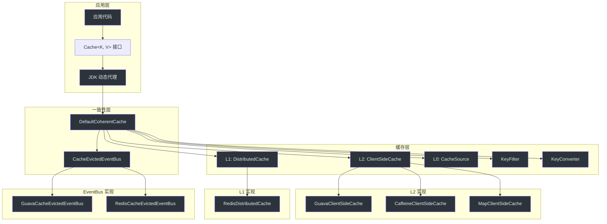
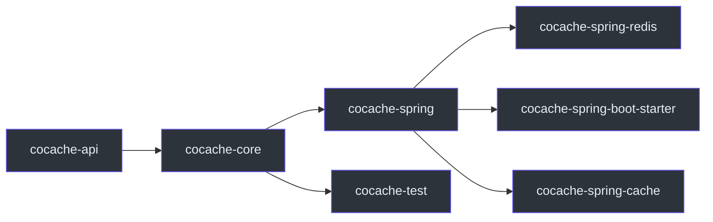

# 架构概览

CoCache 采用二级缓存架构（L2 -> L1 -> L0），通过事件总线实现跨实例的缓存一致性。本页面介绍系统的整体架构设计。

## 系统架构

## 模块依赖关系

| 模块 | 职责 |
|------|------|
| **cocache-api** | 核心接口定义（`Cache`, `CacheValue`, `ClientSideCache`, `CacheSource`, `JoinCache`） |
| **cocache-core** | 默认实现（`DefaultCoherentCache`、代理机制、事件总线、键转换器） |
| **cocache-spring** | Spring 集成（`@EnableCoCache`、FactoryBean、Spring 工厂） |
| **cocache-spring-redis** | Redis 实现（`RedisDistributedCache`、`RedisCacheEvictedEventBus`） |
| **cocache-spring-boot-starter** | Spring Boot 自动配置、Actuator 端点 |
| **cocache-spring-cache** | Spring Cache 抽象桥接（`CoCacheManager`） |
| **cocache-test** | 共享测试规范（`CacheSpec`、`DistributedCacheSpec` 等） |

## 三级缓存层级

### L0 - 数据源层（CacheSource）

`CacheSource<K, V>` 接口代表最终数据来源，通常是数据库或其他持久化存储。当 L1 和 L2 均未命中时，框架通过 `CacheSource.loadCacheValue()` 加载数据。

- 通过 `MissingGuard` 机制防止缓存穿透（缓存空值）
- 通过 `KeyFilter`（布隆过滤器）预过滤不存在的键

**源码参考**：[`cocache-api/.../source/CacheSource.kt`](https://github.com/Ahoo-Wang/CoCache/blob/main/cocache-api/src/main/kotlin/me/ahoo/cache/api/source/CacheSource.kt)

### L1 - 分布式缓存层（DistributedCache）

`DistributedCache<V>` 接口代表跨实例共享的缓存层。默认实现为 `RedisDistributedCache`，使用 Redis 作为存储。

- 支持 TTL 和 TTL 抖动
- 通过 `CodecExecutor` 支持多种序列化格式（JSON、Hash、Set 等）

**源码参考**：[`cocache-core/.../distributed/DistributedCache.kt`](https://github.com/Ahoo-Wang/CoCache/blob/main/cocache-core/src/main/kotlin/me/ahoo/cache/distributed/DistributedCache.kt)

### L2 - 客户端缓存层（ClientSideCache）

`ClientSideCache<V>` 接口代表本地内存缓存，提供最快的访问速度。

| 实现 | 说明 |
|------|------|
| `GuavaClientSideCache` | 基于 Google Guava Cache |
| `CaffeineClientSideCache` | 基于 Caffeine Cache（高性能） |
| `MapClientSideCache` | 基于 ConcurrentHashMap（轻量级） |

**源码参考**：[`cocache-api/.../client/ClientSideCache.kt`](https://github.com/Ahoo-Wang/CoCache/blob/main/cocache-api/src/main/kotlin/me/ahoo/cache/api/client/ClientSideCache.kt)

## 关键设计决策

### 1. 接口驱动设计

所有缓存层级均通过接口定义，支持多种实现的灵活替换。核心接口位于 `cocache-api` 模块，与具体实现解耦。

### 2. 代理模式

通过 JDK 动态代理为缓存接口创建实现，开发者只需定义接口和注解，框架自动生成完整的缓存管理逻辑。

### 3. 事件驱动一致性

使用观察者模式（EventBus）实现跨实例缓存失效。当一个实例修改缓存时，通过 `CacheEvictedEventBus` 发布事件，其他实例订阅事件后自动失效本地缓存。

### 4. 细粒度锁

`DefaultCoherentCache` 使用 `ConcurrentHashMap<String, Any>` 实现逐键锁，避免全局锁导致的性能瓶颈。只有在缓存未命中时才加锁，并使用双重检查模式。

### 5. 缓存穿透防护

- **MissingGuard**：缓存特殊空值标记（`_nil_`），防止对同一不存在的键反复查询数据源
- **KeyFilter**：布隆过滤器预判键是否存在，完全避免对数据源的无效访问

## 相关页面

- [缓存层级](./cache-layers.md) - L0/L1/L2 详细说明
- [一致性与事件总线](./coherence.md) - 缓存一致性机制
- [代理与注解](./proxy.md) - 代理创建流程
- [模块概览](../modules/index.md) - 各模块详细说明
