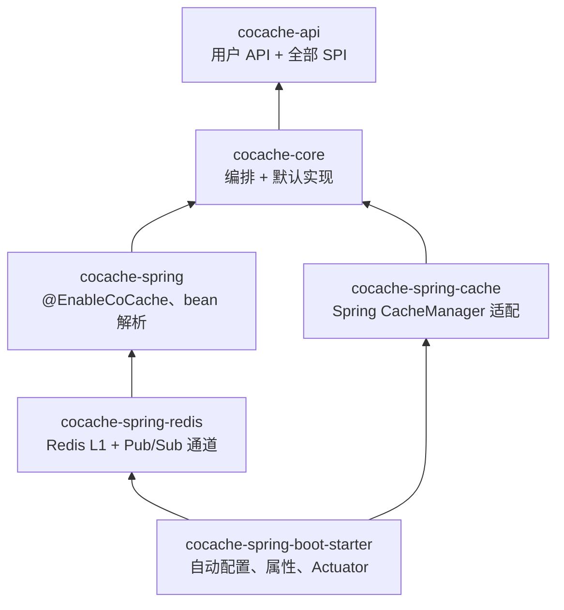
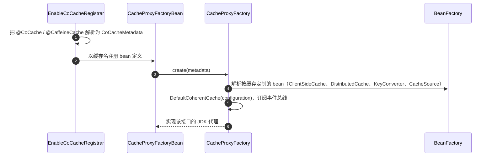

# 架构

本页说明 CoCache 的整体构成。规范性的描述，即任何改动都必须保持的全部不变量，见仓库中的 [`docs/architecture.md`](https://github.com/Ahoo-Wang/CoCache/blob/main/docs/architecture.md)。两者不一致时，以该文档为准。

## 设计目标

二级缓存用陈旧度换取延迟。所有设计决策服务于三个目标：

| 目标 | 手段 |
|------|------|
| **G1 陈旧度有上界**：任何不一致都在有限时间内自愈 | 有限的默认 TTL；负缓存使用独立的短 TTL；淘汰事件通道（重新）订阅时清空 L2 |
| **G2 失效不被吞没**：并发加载、事件丢失或乱序都不会把旧值写回 | 失效戳保护每一次写回；L1 未命中绝不推断为“不存在” |
| **G3 命中路径够便宜**：L2 命中近零开销且随线程扩展，L1 命中一次往返 | 有界 Caffeine，不用条目级过期策略；缓存时钟；每次 L1 查找一个 Lua 读；按 key 合并加载 |

**非目标：** 线性一致读；跨实例的加载互斥。各实例只合并自己的加载，重复的加载由 L1 吸收。

## 模块


```mermaid
flowchart BT
    api["cocache-api<br>用户 API + 全部 SPI"]
    core["cocache-core<br>编排 + 默认实现"]
    spring["cocache-spring<br>@EnableCoCache、bean 解析"]
    redis["cocache-spring-redis<br>Redis L1 + Pub/Sub 通道"]
    scache["cocache-spring-cache<br>Spring CacheManager 适配"]
    starter["cocache-spring-boot-starter<br>自动配置、属性、Actuator"]
    core --> api
    spring --> core
    redis --> spring
    scache --> core
    starter --> redis
    starter --> scache
```

| 模块 | 内容 |
|------|------|
| `cocache-api` | `Cache`、密封的 `CacheValue`、`TtlAt`/`CacheClock`，以及 SPI：`CacheStore` → `ClientSideCache` / `DistributedCache`、`CacheSource`、`KeyConverter`、`KeyFilter`、`CacheEvictedEventBus`、`JoinCache`；还有注解。无运行时依赖 |
| `cocache-core` | `DefaultCoherentCache`、`TtlPolicy`、`SingleFlight`、`InvalidationStamps`、Caffeine/Map L2、内存 L1、本地/空事件总线、代理、`SimpleJoinCache` |
| `cocache-spring` | `@EnableCoCache`、各 `FactoryBean`、按 bean 名解析组件 |
| `cocache-spring-redis` | `RedisDistributedCache`、编码器、`RedisCacheEvictedEventBus` |
| `cocache-spring-cache` | `CoCacheManager` / `CoSpringCache` |
| `cocache-spring-boot-starter` | 自动配置、`CoCacheProperties`、Actuator 端点 |
| `cocache-test` | 供新实现使用的契约测试套件（TCK） |
| `cocache-bom` | 上述模块的版本对齐 |

依赖单向；starter 也依赖 `cocache-spring`。新的存储或事件通道只需依赖 `cocache-api`，并用 `cocache-test` 验证。

## 职责划分

- **存储层只存储。** `CacheStore` 按字符串 key 存取 `CacheValue`，不了解 TTL 或负缓存。写入已过期的条目等同于淘汰。
- **策略在存储层之上。** `TtlPolicy` 把 `ttl ± ttlAmplitude`（值）或 `missingTtl`（负缓存）换算为绝对到期时间 `ttlAt`。存储层只看到 `ttlAt`。
- **编排层**（`DefaultCoherentCache`）逐级读取、合并加载、保护写回、广播失效。
- **通道**（`CacheEvictedEventBus`）尽力而为地广播失效，并在订阅（重新）建立时回调 `onReset`。

## 数据模型

```kotlin
sealed interface CacheValue<out V> : TtlAt      // ttlAt：绝对到期时间，纪元秒
data class PresentValue<V>(val value: V, val ttlAt: Long) : CacheValue<V>
data class MissingValue(val ttlAt: Long) : CacheValue<Nothing>   // 显式负缓存
```

- 负缓存是一个**类型**，而不是魔法值，任何业务值都不会被误认作负缓存。Redis 哨兵 `_nil_` 只存在于 Redis 的存储格式中。
- `CacheValue.of(null, ttlAt)` 得到 `MissingValue`。`TtlAt.FOREVER`（`Long.MAX_VALUE`）永不过期。
- 当前时间取自 `CacheClock`：守护线程每 100 ms 刷新的 volatile 秒计数。在命中路径上它比 `System.currentTimeMillis()` 更便宜，后者在部分平台上无法随线程数扩展。

## 从接口到实例


```mermaid
sequenceDiagram
    autonumber
    participant R as EnableCoCacheRegistrar
    participant FB as CacheProxyFactoryBean
    participant PF as CacheProxyFactory
    participant B as BeanFactory
    R->>R: 把 @CoCache / @CaffeineCache 解析为 CoCacheMetadata
    R->>FB: 以缓存名注册 bean 定义
    FB->>PF: create(metadata)
    PF->>B: 解析按缓存定制的 bean（ClientSideCache、DistributedCache、KeyConverter、CacheSource）
    PF->>PF: DefaultCoherentCache(configuration)，订阅事件总线
    PF-->>FB: 实现该接口的 JDK 代理
```

代理同时实现你的接口以及 `CoherentCache`、`CacheDelegated`、`CacheMetadataCapable`，调用由 `CacheInvocationHandler` 分派：

- `Cache` 方法转发给 `DefaultCoherentCache`，并解包 `InvocationTargetException`，调用方收到原始异常。
- 接口自身声明的默认方法按原样执行，因此可以在缓存接口中添加辅助方法。
- `equals`、`hashCode`、`toString` 使用代理自身的标识。

Spring 容器关闭时，`CacheProxyFactoryBean` 关闭其缓存：取消订阅并关闭 L1。JoinCache 不持有组成缓存的生命周期，关闭它不会关闭组成缓存。

## 下一步

- [一致性](./consistency.md)：读、写、淘汰路径及其保证。
- [扩展 CoCache](./extending.md)：实现存储、通道或数据源。
