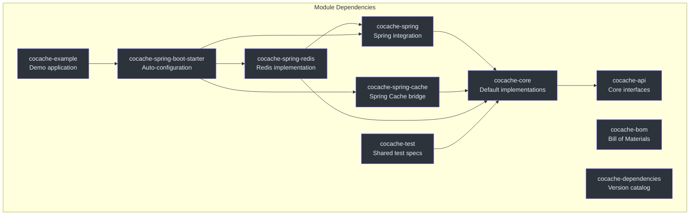
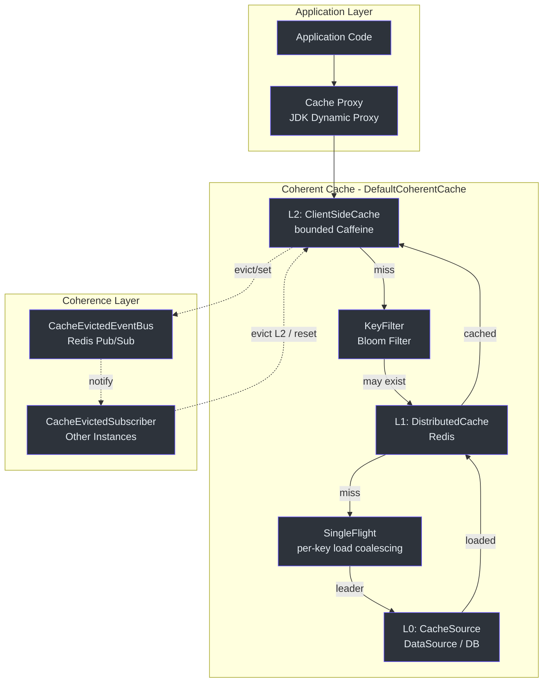
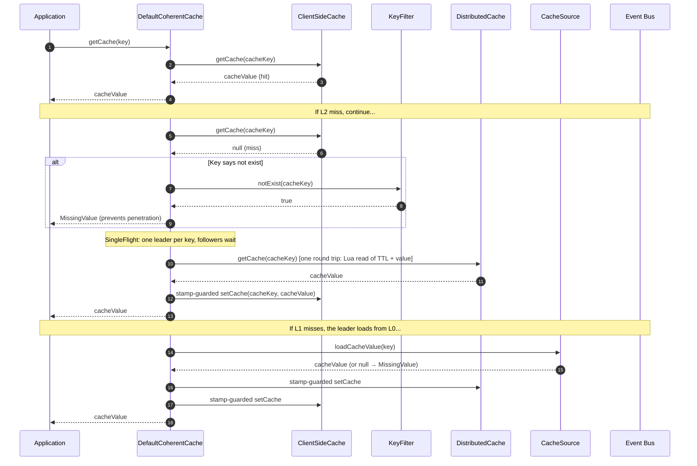

# 架构概览

CoCache 是一个面向 Java/Kotlin 的**二级分布式一致性缓存框架**。它实现了两级缓存架构，将快速的本地内存缓存（L2）与共享的分布式缓存（L1）以及上游数据源（L0）相结合。通过事件总线在缓存条目被修改时发布 `CacheEvictedEvent` 消息，维护跨应用实例的缓存一致性。

## 模块依赖关系图

项目组织为 10 个 Gradle 子模块，每个模块职责清晰：

```mermaid
graph TD
    subgraph sg_10 ["Module Dependencies"]

        api["cocache-api<br>Core interfaces"]
        core["cocache-core<br>Default implementations"]
        spring["cocache-spring<br>Spring integration"]
        springCache["cocache-spring-cache<br>Spring Cache bridge"]
        springRedis["cocache-spring-redis<br>Redis implementation"]
        springBoot["cocache-spring-boot-starter<br>Auto-configuration"]
        test["cocache-test<br>Shared test specs"]
        bom["cocache-bom<br>Bill of Materials"]
        deps["cocache-dependencies<br>Version catalog"]
        example["cocache-example<br>Demo application"]
    end

    core --> api
    spring --> core
    springCache --> core
    springRedis --> core
    springRedis --> spring
    springBoot --> spring
    springBoot --> springCache
    springBoot --> springRedis
    test --> core
    example --> springBoot

    style api fill:#2d333b,stroke:#6d5dfc,color:#e6edf3
    style core fill:#2d333b,stroke:#6d5dfc,color:#e6edf3
    style spring fill:#2d333b,stroke:#6d5dfc,color:#e6edf3
    style springCache fill:#2d333b,stroke:#6d5dfc,color:#e6edf3
    style springRedis fill:#2d333b,stroke:#6d5dfc,color:#e6edf3
    style springBoot fill:#2d333b,stroke:#6d5dfc,color:#e6edf3
    style test fill:#2d333b,stroke:#6d5dfc,color:#e6edf3
    style bom fill:#2d333b,stroke:#6d5dfc,color:#e6edf3
    style deps fill:#2d333b,stroke:#6d5dfc,color:#e6edf3
    style example fill:#2d333b,stroke:#6d5dfc,color:#e6edf3

```

依赖流严格分层：`cocache-api` 在底层定义接口，`cocache-core` 提供实现，`cocache-spring` 添加 Spring Framework 集成，`cocache-spring-redis` / `cocache-spring-boot-starter` 位于顶层用于生产使用。

## 高层系统架构

CoCache 将缓存组织为三个层级：

```mermaid
graph TB
    subgraph sg_11 ["Application Layer"]

        App["Application Code"]
        Proxy["Cache Proxy<br>JDK Dynamic Proxy"]
    end

    subgraph sg_12 ["Coherent Cache - DefaultCoherentCache"]

        L2["L2: ClientSideCache<br>bounded Caffeine"]
        KF["KeyFilter<br>Bloom Filter"]
        L1["L1: DistributedCache<br>Redis"]
        Lock["SingleFlight<br>per-key load coalescing"]
        L0["L0: CacheSource<br>DataSource / DB"]
    end

    subgraph sg_13 ["Coherence Layer"]

        EventBus["CacheEvictedEventBus<br>Redis Pub/Sub"]
        Subscriber["CacheEvictedSubscriber<br>Other Instances"]
    end

    App --> Proxy
    Proxy --> L2
    L2 -->|miss| KF
    KF -->|may exist| L1
    L1 -->|miss| Lock
    Lock -->|leader| L0
    L0 -->|loaded| L1
    L1 -->|cached| L2

    L2 -.->|evict/set| EventBus
    EventBus -.->|notify| Subscriber
    Subscriber -.->|"evict L2 / reset"| L2

    style App fill:#2d333b,stroke:#6d5dfc,color:#e6edf3
    style Proxy fill:#2d333b,stroke:#6d5dfc,color:#e6edf3
    style L2 fill:#2d333b,stroke:#6d5dfc,color:#e6edf3
    style KF fill:#2d333b,stroke:#6d5dfc,color:#e6edf3
    style L1 fill:#2d333b,stroke:#6d5dfc,color:#e6edf3
    style Lock fill:#2d333b,stroke:#6d5dfc,color:#e6edf3
    style L0 fill:#2d333b,stroke:#6d5dfc,color:#e6edf3
    style EventBus fill:#2d333b,stroke:#6d5dfc,color:#e6edf3
    style Subscriber fill:#2d333b,stroke:#6d5dfc,color:#e6edf3

```

| 层级 | 名称 | 职责 | 接口 | 主要实现 |
|------|------|------|------|----------|
| L0 | CacheSource | 上游数据源（DataSource/DB） | [`CacheSource<K, V>`](https://github.com/Ahoo-Wang/CoCache/blob/main/cocache-api/src/main/kotlin/me/ahoo/cache/api/source/CacheSource.kt) | `CacheSource.noOp()`，自定义实现 |
| L1 | DistributedCache | 共享分布式存储 | [`DistributedCache<V>`](https://github.com/Ahoo-Wang/CoCache/blob/main/cocache-api/src/main/kotlin/me/ahoo/cache/api/distributed/DistributedCache.kt) | [`RedisDistributedCache`](https://github.com/Ahoo-Wang/CoCache/blob/main/cocache-spring-redis/src/main/kotlin/me/ahoo/cache/spring/redis/RedisDistributedCache.kt)、`InMemoryDistributedCache` |
| L2 | ClientSideCache | 本地内存存储 | [`ClientSideCache<V>`](https://github.com/Ahoo-Wang/CoCache/blob/main/cocache-api/src/main/kotlin/me/ahoo/cache/api/client/ClientSideCache.kt) | `CaffeineClientSideCache`（默认）、`MapClientSideCache` |

## 缓存读取路径

读取路径按照 L2 -> KeyFilter -> SingleFlight { L1 -> L0 } 流转：

```mermaid
sequenceDiagram
autonumber
    participant App as Application
    participant CC as DefaultCoherentCache
    participant L2 as ClientSideCache
    participant KF as KeyFilter
    participant L1 as DistributedCache
    participant L0 as CacheSource
    participant EB as Event Bus

    App->>CC: getCache(key)
    CC->>L2: getCache(cacheKey)
    L2-->>CC: cacheValue (hit)
    CC-->>App: cacheValue

    Note over App,EB: If L2 miss, continue...
    CC->>L2: getCache(cacheKey)
    L2-->>CC: null (miss)

    alt Key says not exist
        CC->>KF: notExist(cacheKey)
        KF-->>CC: true
        CC-->>App: MissingValue (prevents penetration)
    end

    Note over CC: SingleFlight: one leader per key, followers wait
    CC->>L1: getCache(cacheKey) [one round trip: Lua read of TTL + value]
    L1-->>CC: cacheValue
    CC->>L2: stamp-guarded setCache(cacheKey, cacheValue)
    CC-->>App: cacheValue

    Note over App,EB: If L1 misses, the leader loads from L0...
    CC->>L0: loadCacheValue(key)
    L0-->>CC: cacheValue (or null → MissingValue)
    CC->>L1: stamp-guarded setCache
    CC->>L2: stamp-guarded setCache
    CC-->>App: cacheValue
```

## 关键设计决策

### 1. 按 key 合并回源

`SingleFlight` 保证每个 key 只有一个线程读取 L1 并回源，并发调用者共享其结果或原始异常。与分段锁不同，无关的 key 永不互相阻塞。这可以防止缓存击穿（"惊群效应"问题）。

### 2. 显式负缓存（缓存穿透防护）

当缓存源返回 `null` 时，CoCache 写入一个带独立短 TTL（`missingTtl`，默认 60 秒）的 `MissingValue`。不存在的键因此不再反复查询数据库，新建的数据也不会长期不可见。`CacheValue` 是密封类型（`PresentValue` | `MissingValue`），任何业务值都不会被误判为负缓存；L1 未命中也绝不视为负缓存。`KeyFilter` 接口（布隆过滤器适配器）在任何查找之前拒绝已知不存在的键。

### 3. 事件驱动一致性

CoCache 通过 `CacheEvictedEventBus` 主动发布 `CacheEvictedEvent`，对等实例据此淘汰该键的 L2。每一次写回都受失效戳保护，并发失效（本地或远端）永远不会被陈旧值覆盖；通道每次（重新）订阅都会清空 L2，丢失的消息不会留下陈旧副本。详情请参见[缓存一致性](./coherence.md)。

### 4. 基于代理的声明式缓存

缓存接口被声明为带有 `@CoCache` 注解的 Kotlin/Java 接口。在应用启动时，`EnableCoCacheRegistrar` 解析这些注解，构建 `CoCacheMetadata`，并创建由 `DefaultCoherentCache` 实例支撑的 JDK 动态代理。这使得缓存配置完全声明式。详情请参见[代理与注解](./proxy.md)。

### 5. 带振幅的 TTL

每个命中值都带有 TTL（默认 3600 秒，保持有限以便任何残留不一致都能自愈），外加 `[-ttlAmplitude, +ttlAmplitude]` 范围内的随机偏移（默认 60 秒）。这种抖动可以防止大量条目同时过期（"缓存雪崩"问题）。策略由 `TtlPolicy` 持有，存储层只看到计算后的绝对 `ttlAt`。

## 源码参考

| 文件 | 行号 | 说明 |
|------|------|------|
| [`settings.gradle.kts`](https://github.com/Ahoo-Wang/CoCache/blob/main/settings.gradle.kts#L1) | 1-11 | 模块声明 |
| [`build.gradle.kts`](https://github.com/Ahoo-Wang/CoCache/blob/main/build.gradle.kts#L1) | 1-219 | 根构建配置，JDK 17，Kotlin 编译器标志 |
| [`cocache-api/build.gradle.kts`](https://github.com/Ahoo-Wang/CoCache/blob/main/cocache-api/build.gradle.kts#L1) | 1 | 无外部依赖（纯接口） |
| [`cocache-core/build.gradle.kts`](https://github.com/Ahoo-Wang/CoCache/blob/main/cocache-core/build.gradle.kts#L1) | 1-12 | 依赖 `cocache-api`、Caffeine、Spring Expression；Guava 为 compile-only（BloomKeyFilter） |
| [`cocache-spring/build.gradle.kts`](https://github.com/Ahoo-Wang/CoCache/blob/main/cocache-spring/build.gradle.kts#L1) | 1-3 | 依赖 `cocache-core`、Spring Context |
| [`cocache-spring-redis/build.gradle.kts`](https://github.com/Ahoo-Wang/CoCache/blob/main/cocache-spring-redis/build.gradle.kts#L1) | 1-10 | 依赖 `cocache-core`、`cocache-spring`、Jackson、Spring Data Redis |
| [`cocache-spring-boot-starter/build.gradle.kts`](https://github.com/Ahoo-Wang/CoCache/blob/main/cocache-spring-boot-starter/build.gradle.kts#L1) | 1-30 | 依赖 `cocache-spring`、`cocache-spring-cache`、`cocache-spring-redis`、Spring Boot |
| [`DefaultCoherentCache.kt`](https://github.com/Ahoo-Wang/CoCache/blob/main/cocache-core/src/main/kotlin/me/ahoo/cache/consistency/DefaultCoherentCache.kt#L30) | 30-186 | 核心一致性缓存实现 |
| [`CoherentCache.kt`](https://github.com/Ahoo-Wang/CoCache/blob/main/cocache-core/src/main/kotlin/me/ahoo/cache/consistency/CoherentCache.kt#L25) | 25-32 | CoherentCache 接口定义 |
| [`CoherentCacheConfiguration.kt`](https://github.com/Ahoo-Wang/CoCache/blob/main/cocache-core/src/main/kotlin/me/ahoo/cache/consistency/CoherentCacheConfiguration.kt#L26) | 26-34 | 带默认值的配置数据类 |

## 相关页面

- [缓存层级详解](./cache-layers.md) -- L0、L1、L2 层级详情和读取/写入/驱逐路径
- [缓存一致性与事件总线](./coherence.md) -- 通过 CacheEvictedEventBus 实现分布式失效
- [代理与注解](./proxy.md) -- 使用 @CoCache 和 JDK 动态代理的声明式缓存
