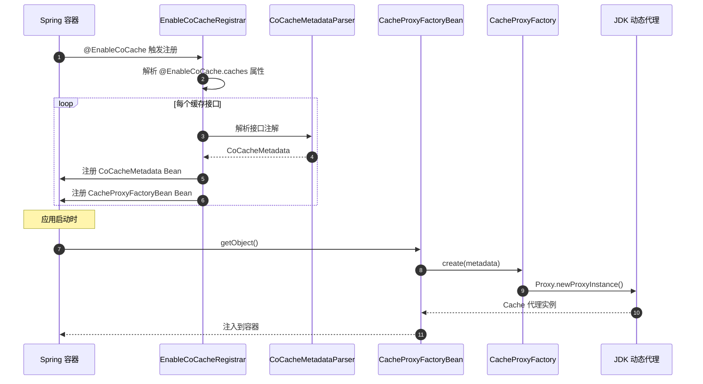
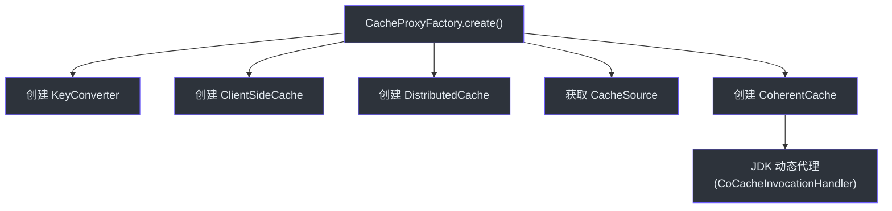

# 代理与注解

CoCache 使用 JDK 动态代理为缓存接口创建实现。开发者只需定义接口并添加注解，框架自动完成代理创建和缓存管理逻辑的注入。

## 注册流程



## @EnableCoCache 触发注册

`@EnableCoCache` 注解通过 `@Import(EnableCoCacheRegistrar::class)` 引入 `ImportBeanDefinitionRegistrar` 实现：

```kotlin
@Import(EnableCoCacheRegistrar::class)
@Target(AnnotationTarget.CLASS)
annotation class EnableCoCache(
    val caches: Array<KClass<out Cache<*, *>>> = []
)
```

**源码参考**：[`cocache-spring/.../EnableCoCache.kt`](https://github.com/Ahoo-Wang/CoCache/blob/main/cocache-spring/src/main/kotlin/me/ahoo/cache/spring/EnableCoCache.kt)

## EnableCoCacheRegistrar

`EnableCoCacheRegistrar` 实现了 `ImportBeanDefinitionRegistrar` 接口，在 Spring 容器初始化时解析缓存接口并注册 Bean 定义。

核心逻辑：

```kotlin
class EnableCoCacheRegistrar : ImportBeanDefinitionRegistrar {
    override fun registerBeanDefinitions(
        importingClassMetadata: AnnotationMetadata,
        registry: BeanDefinitionRegistry
    ) {
        // 1. 解析所有缓存接口（非 JoinCache）
        val cacheMetadataList = resolveCacheMetadataList(importingClassMetadata)
        cacheMetadataList.forEach { cacheMetadata ->
            // 2. 注册 CoCacheMetadata Bean
            registry.registerCacheMetadata(cacheMetadata)
            // 3. 注册 CacheProxyFactoryBean
            val builder = BeanDefinitionBuilder.genericBeanDefinition(CacheProxyFactoryBean::class.java)
            builder.addConstructorArgValue(cacheMetadata)
            builder.setPrimary(true)
            registry.registerBeanDefinition(cacheMetadata.cacheName, builder.beanDefinition)
        }
        // 4. 解析并注册 JoinCache
        val joinCacheMetadataList = resolveJoinCacheMetadataList(importingClassMetadata)
        joinCacheMetadataList.forEach { cacheMetadata ->
            val builder = BeanDefinitionBuilder.genericBeanDefinition(JoinCacheProxyFactoryBean::class.java)
            builder.addConstructorArgValue(cacheMetadata)
            builder.setPrimary(true)
            registry.registerBeanDefinition(cacheMetadata.cacheName, builder.beanDefinition)
        }
    }
}
```

**源码参考**：[`cocache-spring/.../EnableCoCacheRegistrar.kt`](https://github.com/Ahoo-Wang/CoCache/blob/main/cocache-spring/src/main/kotlin/me/ahoo/cache/spring/EnableCoCacheRegistrar.kt)

## CoCacheMetadata 解析

`CoCacheMetadataParser`（或 `KClass.toCoCacheMetadata()` 扩展函数）从缓存接口的注解中提取配置信息：

```kotlin
data class CoCacheMetadata(
    val proxyInterface: KClass<*>,     // 缓存接口类
    val cacheName: String,             // 缓存名称
    val keyPrefix: String,             // 键前缀
    val keyExpression: String,         // SpEL 键表达式
    val ttl: Long,                     // TTL（秒）
    val ttlAmplitude: Long,            // TTL 抖动幅度
    // GuavaCache / CaffeineCache 配置...
)
```

解析规则：
1. `cacheName`：优先取 `@CoCache.name`，默认取接口简单类名
2. `keyPrefix`：取 `@CoCache.keyPrefix`
3. `keyExpression`：取 `@CoCache.keyExpression`
4. `ttl`/`ttlAmplitude`：取 `@CoCache.ttl`/`@CoCache.ttlAmplitude`
5. Guava/Caffeine 配置：从 `@GuavaCache`/`@CaffeineCache` 注解读取

**源码参考**：[`cocache-core/.../CoCacheMetadata.kt`](https://github.com/Ahoo-Wang/CoCache/blob/main/cocache-core/src/main/kotlin/me/ahoo/cache/annotation/CoCacheMetadata.kt)

## CacheProxyFactoryBean

`CacheProxyFactoryBean` 是 Spring `FactoryBean`，负责创建缓存代理实例：

```kotlin
class CacheProxyFactoryBean(private val cacheMetadata: CoCacheMetadata) :
    FactoryBean<Cache<Any, Any>>, ApplicationContextAware {

    override fun getObject(): Cache<Any, Any> {
        val cacheProxyFactory = appContext.getBean(CacheProxyFactory::class.java)
        return cacheProxyFactory.create(cacheMetadata)
    }

    override fun getObjectType(): Class<*> {
        return cacheMetadata.proxyInterface.java
    }
}
```

**源码参考**：[`cocache-spring/.../CacheProxyFactoryBean.kt`](https://github.com/Ahoo-Wang/CoCache/blob/main/cocache-spring/src/main/kotlin/me/ahoo/cache/spring/proxy/CacheProxyFactoryBean.kt)

## JDK 动态代理

`DefaultCacheProxyFactory.create()` 创建 JDK 动态代理：

1. **创建组件**：
   - `KeyConverter`：根据 `keyPrefix` 和 `keyExpression` 创建
   - `ClientSideCache`：根据 `@GuavaCache`/`@CaffeineCache` 注解创建
   - `DistributedCache`：通过 `DistributedCacheFactory` 创建
   - `CacheSource`：通过 `CacheSourceFactory` 获取（可选）
   - `CoherentCache`：组装以上组件

2. **创建代理**：
   - 使用 `Proxy.newProxyInstance()` 创建 JDK 动态代理
   - 代理处理器为 `CoCacheInvocationHandler`



## CoCacheInvocationHandler

代理调用处理器，将方法调用委托给 `CoherentCache`：

```kotlin
class CoCacheInvocationHandler<DELEGATE>(
    override val cacheMetadata: CoCacheMetadata,
    override val delegate: DELEGATE
) : CoCacheProxy<DELEGATE>() where DELEGATE : Cache<*, *>, DELEGATE : NamedCache {

    override fun invoke(proxy: Any, method: Method, args: Array<out Any>?): Any? {
        // 特殊方法处理
        if (DElegateMethodSign == method.name) return delegate
        if (CacheMetadataMethodSign == method.name) return cacheMetadata
        // 其他方法委托给 CoherentCache
        return super.invoke(proxy, method, args)
    }
}
```

**源码参考**：[`cocache-core/.../CoCacheInvocationHandler.kt`](https://github.com/Ahoo-Wang/CoCache/blob/main/cocache-core/src/main/kotlin/me/ahoo/cache/proxy/CoCacheInvocationHandler.kt)

## JoinCache 代理

JoinCache 的代理创建流程类似，但使用 `JoinCacheMetadata` 和 `JoinCacheProxyFactoryBean`：

1. `@JoinCacheable` 注解被解析为 `JoinCacheMetadata`
2. `JoinCacheProxyFactoryBean` 创建 JoinCache 代理
3. 代理内部管理两个缓存（firstCache 和 joinCache）以及 `JoinKeyExtractor`

**源码参考**：[`cocache-core/.../join/proxy/`](https://github.com/Ahoo-Wang/CoCache/tree/main/cocache-core/src/main/kotlin/me/ahoo/cache/join/proxy)

## Bean 命名规则

| 组件 | Bean 名称 |
|------|-----------|
| 缓存代理 | `cacheName`（如 `UserCache`） |
| CacheMetadata | `cacheName.CacheMetadata`（如 `UserCache.CacheMetadata`） |
| ClientSideCache | 可自定义，需匹配 `cacheName` |
| CacheSource | 可自定义，需匹配 `cacheName` |

自定义 `ClientSideCache` 或 `CacheSource` Bean 时，Bean 名称应与缓存接口名称匹配（首字母小写 + `Source`/`ClientSideCache` 后缀），或通过 `@Qualifier` 注解指定。

## 相关页面

- [架构概览](./index.md) - 整体架构
- [注解参考](../api/annotations.md) - 所有注解详解
- [cocache-spring](../modules/cocache-spring.md) - Spring 集成模块
- [cocache-core](../modules/cocache-core.md) - 核心实现模块
