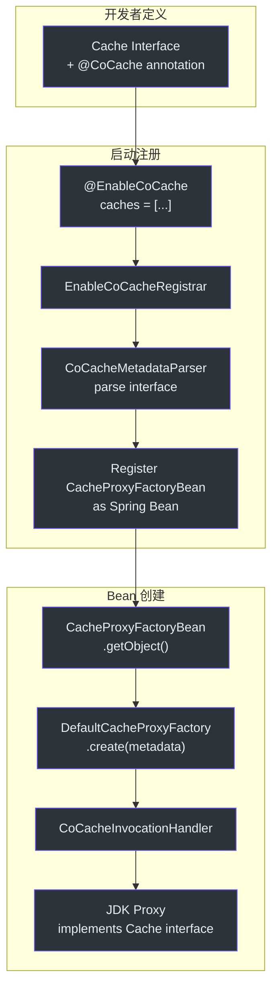
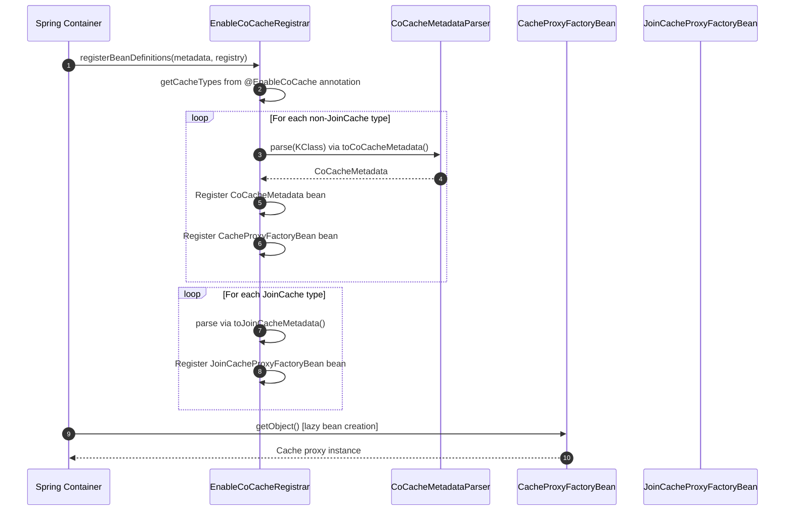
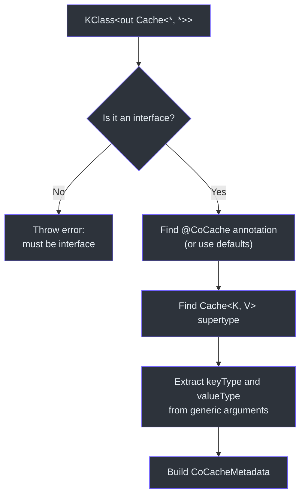
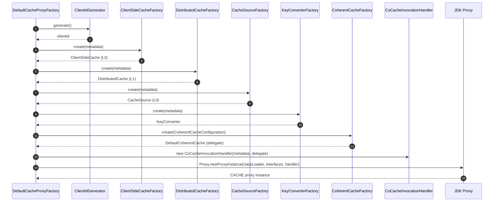
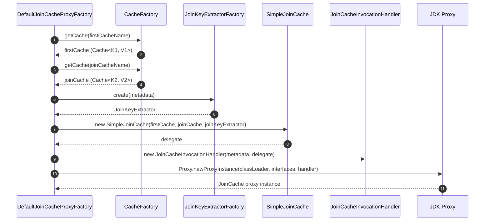
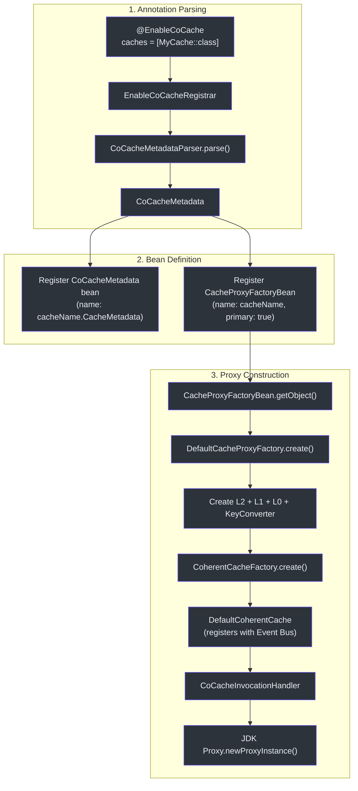

# 代理与注解系统

CoCache 使用声明式、注解驱动的方式进行缓存配置。开发者只需定义带有 `@CoCache` 注解的缓存接口，框架会自动创建由 `DefaultCoherentCache` 支撑的 JDK 动态代理实现。这种系统消除了繁琐的缓存连接代码，使缓存行为完全通过注解进行配置。

## 概览



## @EnableCoCache 注解

入口是 [`@EnableCoCache`](https://github.com/Ahoo-Wang/CoCache/blob/main/cocache-spring/src/main/kotlin/me/ahoo/cache/spring/EnableCoCache.kt#L20)，一个通过 `@Import` 触发注册流程的 Spring 注解：

```kotlin
@Import(EnableCoCacheRegistrar::class)
@Target(AnnotationTarget.CLASS)
annotation class EnableCoCache(
    val caches: Array<KClass<out Cache<*, *>>> = []
)
```

在 Spring 配置类中的使用方式：

```kotlin
@EnableCoCache(caches = [UserProfileCache::class, ProductCache::class])
class CacheConfiguration
```

## EnableCoCacheRegistrar -- Bean 定义注册

[`EnableCoCacheRegistrar`](https://github.com/Ahoo-Wang/CoCache/blob/main/cocache-spring/src/main/kotlin/me/ahoo/cache/spring/EnableCoCacheRegistrar.kt#L31) 实现了 Spring 的 `ImportBeanDefinitionRegistrar` 接口。在应用启动时，它：

1. 从 `@EnableCoCache` 注解中读取 `caches` 数组
2. 将 `JoinCache` 类型与普通 `Cache` 类型分开
3. 将每个接口解析为 `CoCacheMetadata` 或 `JoinCacheMetadata`
4. 为每个缓存注册 Spring `FactoryBean` 定义



`registerBeanDefinitions()` 的核心逻辑位于[第 45 行](https://github.com/Ahoo-Wang/CoCache/blob/main/cocache-spring/src/main/kotlin/me/ahoo/cache/spring/EnableCoCacheRegistrar.kt#L45)：

```kotlin
override fun registerBeanDefinitions(importingClassMetadata: AnnotationMetadata, registry: BeanDefinitionRegistry) {
    val cacheMetadataList = resolveCacheMetadataList(importingClassMetadata)
    cacheMetadataList.forEach { cacheMetadata ->
        registry.registerCacheMetadata(cacheMetadata)
        val beanDefinitionBuilder = BeanDefinitionBuilder.genericBeanDefinition(CacheProxyFactoryBean::class.java)
        beanDefinitionBuilder.addConstructorArgValue(cacheMetadata)
        beanDefinitionBuilder.setPrimary(true)
        registry.registerBeanDefinition(cacheMetadata.cacheName, beanDefinitionBuilder.beanDefinition)
    }
    val joinCacheMetadataList = resolveJoinCacheMetadataList(importingClassMetadata)
    joinCacheMetadataList.forEach { cacheMetadata ->
        val beanDefinitionBuilder = BeanDefinitionBuilder.genericBeanDefinition(JoinCacheProxyFactoryBean::class.java)
        beanDefinitionBuilder.addConstructorArgValue(cacheMetadata)
        beanDefinitionBuilder.setPrimary(true)
        registry.registerBeanDefinition(cacheMetadata.cacheName, beanDefinitionBuilder.beanDefinition)
    }
}
```

## CoCacheMetadata 和 CoCacheMetadataParser

### CoCacheMetadata

[`CoCacheMetadata`](https://github.com/Ahoo-Wang/CoCache/blob/main/cocache-core/src/main/kotlin/me/ahoo/cache/annotation/CoCacheMetadata.kt#L20) 是一个数据类，保存从缓存接口中解析出的所有配置：

```kotlin
data class CoCacheMetadata(
    override val proxyInterface: KClass<*>,
    override val name: String,
    val keyPrefix: String,
    val keyExpression: String,
    override val ttl: Long,
    override val ttlAmplitude: Long,
    val keyType: KType,
    val valueType: KType
) : ComputedNamedCache, TtlConfiguration {
    override val cacheName: String = name.ifBlank {
        proxyInterface.simpleName!!
    }
}
```

如果 `name` 为空，`cacheName` 默认使用接口的简单类名。

### CoCacheMetadataParser

[`CoCacheMetadataParser`](https://github.com/Ahoo-Wang/CoCache/blob/main/cocache-core/src/main/kotlin/me/ahoo/cache/annotation/CoCacheMetadataParser.kt#L24) 在[第 30 行](https://github.com/Ahoo-Wang/CoCache/blob/main/cocache-core/src/main/kotlin/me/ahoo/cache/annotation/CoCacheMetadataParser.kt#L30)将 `KClass` 解析为 `CoCacheMetadata`：



解析器强制要求目标必须是接口。它读取 `@CoCache` 注解（如果没有则使用默认值），从 `Cache<K, V>` 父类型中提取泛型参数，并生成 `CoCacheMetadata` 实例。

## JDK 动态代理创建

### CoCacheProxy -- 抽象 InvocationHandler

[`CoCacheProxy`](https://github.com/Ahoo-Wang/CoCache/blob/main/cocache-core/src/main/kotlin/me/ahoo/cache/proxy/CoCacheProxy.kt#L20) 是一个抽象的 `InvocationHandler`，提供核心委托逻辑：

```kotlin
abstract class CoCacheProxy<DELEGATE> : InvocationHandler, CacheDelegated<DELEGATE>
    where DELEGATE : Cache<*, *> {

    abstract val proxyInterface: Class<*>

    private val declaredDefaultMethods by lazy {
        proxyInterface.declaredMethods.filter { it.isDefault }
    }

    override fun invoke(proxy: Any, method: Method, args: Array<out Any>?): Any? {
        val methodArgs = args ?: EMPTY_ARGS
        if (method.isDefault && declaredDefaultMethods.contains(method)) {
            return InvocationHandler.invokeDefault(proxy, method, *methodArgs)
        }
        return method.invoke(delegate, *methodArgs)
    }
}
```

代理区分两种方法：
- **默认方法**（在接口本身上声明并带有方法体） -- 通过 `InvocationHandler.invokeDefault()` 调用
- **抽象方法**（来自 `Cache<K, V>` 及其父接口） -- 委托给 `DefaultCoherentCache` 实例

### CoCacheInvocationHandler -- 具体处理器

[`CoCacheInvocationHandler`](https://github.com/Ahoo-Wang/CoCache/blob/main/cocache-core/src/main/kotlin/me/ahoo/cache/proxy/CoCacheInvocationHandler.kt#L22) 继承 `CoCacheProxy`，增加了对 `delegate` 和 `cacheMetadata` 访问器方法的特殊处理：

```kotlin
class CoCacheInvocationHandler<DELEGATE>(
    override val cacheMetadata: CoCacheMetadata,
    override val delegate: DELEGATE
) : CacheDelegated<DELEGATE>, CacheMetadataCapable, CoCacheProxy<DELEGATE>()
    where DELEGATE : Cache<*, *>, DELEGATE : NamedCache {

    override fun invoke(proxy: Any, method: Method, args: Array<out Any>?): Any? {
        if (DELEGATE_METHOD_SIGN == method.name) return delegate
        if (CACHE_METADATA_METHOD_SIGN == method.name) return cacheMetadata
        return super.invoke(proxy, method, args)
    }
}
```

这允许调用者从代理访问底层的 `delegate`（即 `DefaultCoherentCache`）和 `cacheMetadata`，无需强制类型转换即可进行内省。

### DefaultCacheProxyFactory -- 工厂

[`DefaultCacheProxyFactory`](https://github.com/Ahoo-Wang/CoCache/blob/main/cocache-core/src/main/kotlin/me/ahoo/cache/proxy/DefaultCacheProxyFactory.kt#L30) 在[第 40 行](https://github.com/Ahoo-Wang/CoCache/blob/main/cocache-core/src/main/kotlin/me/ahoo/cache/proxy/DefaultCacheProxyFactory.kt#L40)编排缓存代理的创建：



代理同时实现四个接口：
1. 用户的缓存接口（如 `UserProfileCache`）
2. `CoherentCache<K, V>` -- 完整的一致性缓存 API
3. `CacheDelegated` -- 访问底层委托
4. `CacheMetadataCapable` -- 访问解析的元数据

### CacheProxyFactoryBean -- Spring 集成

[`CacheProxyFactoryBean`](https://github.com/Ahoo-Wang/CoCache/blob/main/cocache-spring/src/main/kotlin/me/ahoo/cache/spring/proxy/CacheProxyFactoryBean.kt#L23) 将 Spring `FactoryBean` 契约与代理工厂桥接起来：

```kotlin
class CacheProxyFactoryBean(private val cacheMetadata: CoCacheMetadata) :
    FactoryBean<Cache<Any, Any>>, ApplicationContextAware {

    override fun getObject(): Cache<Any, Any> {
        val cacheProxyFactory = appContext.getBean(CacheProxyFactory::class.java)
        return cacheProxyFactory.create(cacheMetadata)
    }

    override fun getObjectType(): Class<*> {
        return cacheMetadata.proxyInterface.java
    }
}
```

它在首次调用 `getObject()` 时从 Spring `ApplicationContext` 中延迟解析 `CacheProxyFactory`。

## JoinCache 代理流程

对于 `JoinCache` 接口（用于组合两个缓存值），存在一个并行的注册路径，通过 [`JoinCacheProxyFactoryBean`](https://github.com/Ahoo-Wang/CoCache/blob/main/cocache-spring/src/main/kotlin/me/ahoo/cache/spring/join/JoinCacheProxyFactoryBean.kt#L23) 和 [`DefaultJoinCacheProxyFactory`](https://github.com/Ahoo-Wang/CoCache/blob/main/cocache-core/src/main/kotlin/me/ahoo/cache/join/proxy/DefaultJoinCacheProxyFactory.kt#L25) 实现。



`DefaultJoinCacheProxyFactory.create()` 位于[第 30 行](https://github.com/Ahoo-Wang/CoCache/blob/main/cocache-core/src/main/kotlin/me/ahoo/cache/join/proxy/DefaultJoinCacheProxyFactory.kt#L30)：
1. 通过 `firstCacheName` 查找**主缓存**（如果名称为空则按类型查找）
2. 通过 `joinCacheName` 查找**关联缓存**（或按类型查找）
3. 创建 `JoinKeyExtractor`，从主缓存值中提取关联键
4. 将它们包装在 `SimpleJoinCache` 委托中
5. 创建实现用户 `JoinCache` 接口的 JDK 代理

## 完整注册流程图



## 关键类关系

| 类/接口 | 职责 | 模块 | 源码 |
|---------|------|------|------|
| [`@EnableCoCache`](https://github.com/Ahoo-Wang/CoCache/blob/main/cocache-spring/src/main/kotlin/me/ahoo/cache/spring/EnableCoCache.kt#L20) | 通过 `@Import` 触发注册 | cocache-spring | [EnableCoCache.kt](https://github.com/Ahoo-Wang/CoCache/blob/main/cocache-spring/src/main/kotlin/me/ahoo/cache/spring/EnableCoCache.kt#L20) |
| [`EnableCoCacheRegistrar`](https://github.com/Ahoo-Wang/CoCache/blob/main/cocache-spring/src/main/kotlin/me/ahoo/cache/spring/EnableCoCacheRegistrar.kt#L31) | 解析注解，注册 Bean 定义 | cocache-spring | [EnableCoCacheRegistrar.kt](https://github.com/Ahoo-Wang/CoCache/blob/main/cocache-spring/src/main/kotlin/me/ahoo/cache/spring/EnableCoCacheRegistrar.kt#L31) |
| [`CoCacheMetadata`](https://github.com/Ahoo-Wang/CoCache/blob/main/cocache-core/src/main/kotlin/me/ahoo/cache/annotation/CoCacheMetadata.kt#L20) | 解析后的缓存配置 | cocache-core | [CoCacheMetadata.kt](https://github.com/Ahoo-Wang/CoCache/blob/main/cocache-core/src/main/kotlin/me/ahoo/cache/annotation/CoCacheMetadata.kt#L20) |
| [`CoCacheMetadataParser`](https://github.com/Ahoo-Wang/CoCache/blob/main/cocache-core/src/main/kotlin/me/ahoo/cache/annotation/CoCacheMetadataParser.kt#L24) | 基于反射的接口解析器 | cocache-core | [CoCacheMetadataParser.kt](https://github.com/Ahoo-Wang/CoCache/blob/main/cocache-core/src/main/kotlin/me/ahoo/cache/annotation/CoCacheMetadataParser.kt#L24) |
| [`CoCacheProxy`](https://github.com/Ahoo-Wang/CoCache/blob/main/cocache-core/src/main/kotlin/me/ahoo/cache/proxy/CoCacheProxy.kt#L20) | 支持默认方法的抽象 InvocationHandler | cocache-core | [CoCacheProxy.kt](https://github.com/Ahoo-Wang/CoCache/blob/main/cocache-core/src/main/kotlin/me/ahoo/cache/proxy/CoCacheProxy.kt#L20) |
| [`CoCacheInvocationHandler`](https://github.com/Ahoo-Wang/CoCache/blob/main/cocache-core/src/main/kotlin/me/ahoo/cache/proxy/CoCacheInvocationHandler.kt#L22) | 带有 delegate/metadata 访问的具体处理器 | cocache-core | [CoCacheInvocationHandler.kt](https://github.com/Ahoo-Wang/CoCache/blob/main/cocache-core/src/main/kotlin/me/ahoo/cache/proxy/CoCacheInvocationHandler.kt#L22) |
| [`DefaultCacheProxyFactory`](https://github.com/Ahoo-Wang/CoCache/blob/main/cocache-core/src/main/kotlin/me/ahoo/cache/proxy/DefaultCacheProxyFactory.kt#L30) | 组装所有组件并创建代理 | cocache-core | [DefaultCacheProxyFactory.kt](https://github.com/Ahoo-Wang/CoCache/blob/main/cocache-core/src/main/kotlin/me/ahoo/cache/proxy/DefaultCacheProxyFactory.kt#L30) |
| [`CacheProxyFactoryBean`](https://github.com/Ahoo-Wang/CoCache/blob/main/cocache-spring/src/main/kotlin/me/ahoo/cache/spring/proxy/CacheProxyFactoryBean.kt#L23) | Spring FactoryBean 桥接 | cocache-spring | [CacheProxyFactoryBean.kt](https://github.com/Ahoo-Wang/CoCache/blob/main/cocache-spring/src/main/kotlin/me/ahoo/cache/spring/proxy/CacheProxyFactoryBean.kt#L23) |
| [`JoinCacheProxyFactoryBean`](https://github.com/Ahoo-Wang/CoCache/blob/main/cocache-spring/src/main/kotlin/me/ahoo/cache/spring/join/JoinCacheProxyFactoryBean.kt#L23) | JoinCache 的 Spring FactoryBean | cocache-spring | [JoinCacheProxyFactoryBean.kt](https://github.com/Ahoo-Wang/CoCache/blob/main/cocache-spring/src/main/kotlin/me/ahoo/cache/spring/join/JoinCacheProxyFactoryBean.kt#L23) |
| [`DefaultJoinCacheProxyFactory`](https://github.com/Ahoo-Wang/CoCache/blob/main/cocache-core/src/main/kotlin/me/ahoo/cache/join/proxy/DefaultJoinCacheProxyFactory.kt#L25) | 创建带有两个缓存组合的 JoinCache 代理 | cocache-core | [DefaultJoinCacheProxyFactory.kt](https://github.com/Ahoo-Wang/CoCache/blob/main/cocache-core/src/main/kotlin/me/ahoo/cache/join/proxy/DefaultJoinCacheProxyFactory.kt#L25) |

## 源码参考

| 文件 | 行号 | 说明 |
|------|------|------|
| [`EnableCoCache.kt`](https://github.com/Ahoo-Wang/CoCache/blob/main/cocache-spring/src/main/kotlin/me/ahoo/cache/spring/EnableCoCache.kt#L20) | 20-24 | @EnableCoCache 注解定义 |
| [`EnableCoCacheRegistrar.kt`](https://github.com/Ahoo-Wang/CoCache/blob/main/cocache-spring/src/main/kotlin/me/ahoo/cache/spring/EnableCoCacheRegistrar.kt#L31) | 31-98 | Bean 定义注册器 |
| [`CoCacheMetadata.kt`](https://github.com/Ahoo-Wang/CoCache/blob/main/cocache-core/src/main/kotlin/me/ahoo/cache/annotation/CoCacheMetadata.kt#L20) | 20-33 | 解析后的元数据数据类 |
| [`CoCacheMetadataParser.kt`](https://github.com/Ahoo-Wang/CoCache/blob/main/cocache-core/src/main/kotlin/me/ahoo/cache/annotation/CoCacheMetadataParser.kt#L30) | 30-57 | 反射解析器 |
| [`CoCacheProxy.kt`](https://github.com/Ahoo-Wang/CoCache/blob/main/cocache-core/src/main/kotlin/me/ahoo/cache/proxy/CoCacheProxy.kt#L34) | 34-41 | 抽象 InvocationHandler |
| [`CoCacheInvocationHandler.kt`](https://github.com/Ahoo-Wang/CoCache/blob/main/cocache-core/src/main/kotlin/me/ahoo/cache/proxy/CoCacheInvocationHandler.kt#L37) | 37-46 | 具体调用处理器 |
| [`DefaultCacheProxyFactory.kt`](https://github.com/Ahoo-Wang/CoCache/blob/main/cocache-core/src/main/kotlin/me/ahoo/cache/proxy/DefaultCacheProxyFactory.kt#L40) | 40-68 | 组装所有组件的代理工厂 |
| [`CacheProxyFactoryBean.kt`](https://github.com/Ahoo-Wang/CoCache/blob/main/cocache-spring/src/main/kotlin/me/ahoo/cache/spring/proxy/CacheProxyFactoryBean.kt#L23) | 23-39 | Spring FactoryBean |
| [`JoinCacheProxyFactoryBean.kt`](https://github.com/Ahoo-Wang/CoCache/blob/main/cocache-spring/src/main/kotlin/me/ahoo/cache/spring/join/JoinCacheProxyFactoryBean.kt#L23) | 23-39 | JoinCache FactoryBean |
| [`DefaultJoinCacheProxyFactory.kt`](https://github.com/Ahoo-Wang/CoCache/blob/main/cocache-core/src/main/kotlin/me/ahoo/cache/join/proxy/DefaultJoinCacheProxyFactory.kt#L30) | 30-65 | JoinCache 代理工厂 |

## 相关页面

- [架构概览](./index.md) -- 高层系统架构与模块图
- [缓存层级详解](./cache-layers.md) -- L0/L1/L2 层级详情
- [缓存一致性与事件总线](./coherence.md) -- 分布式失效机制
