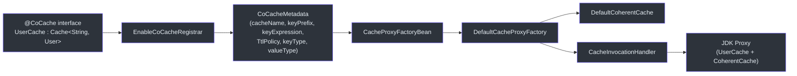
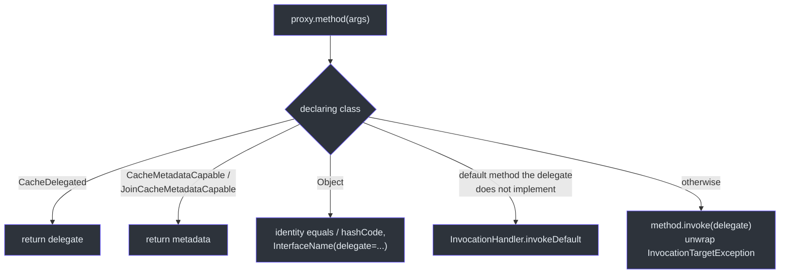
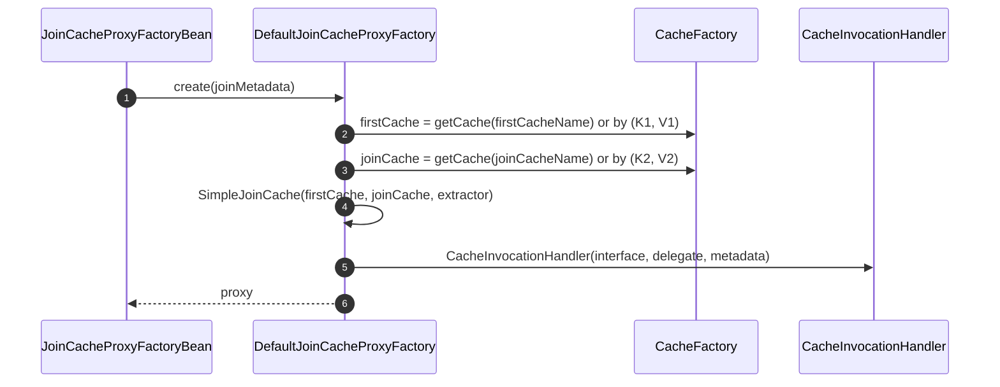

# 代理与注解体系

缓存以接口的形式声明。CoCache 把注解解析为元数据，组装出 `DefaultCoherentCache`（或 `SimpleJoinCache`），再通过实现了该接口的 JDK 动态代理对外暴露。

## 概览

```mermaid
graph LR
    I["@CoCache interface<br>UserCache : Cache&lt;String, User&gt;"] --> R["EnableCoCacheRegistrar"]
    R --> M["CoCacheMetadata<br>(cacheName, keyPrefix, keyExpression,<br>TtlPolicy, keyType, valueType)"]
    M --> FB["CacheProxyFactoryBean"]
    FB --> PF["DefaultCacheProxyFactory"]
    PF --> CC["DefaultCoherentCache"]
    PF --> H["CacheInvocationHandler"]
    H --> P["JDK Proxy<br>(UserCache + CoherentCache)"]

    style I fill:#2d333b,stroke:#6d5dfc,color:#e6edf3
    style R fill:#2d333b,stroke:#6d5dfc,color:#e6edf3
    style M fill:#2d333b,stroke:#6d5dfc,color:#e6edf3
    style FB fill:#2d333b,stroke:#6d5dfc,color:#e6edf3
    style PF fill:#2d333b,stroke:#6d5dfc,color:#e6edf3
    style CC fill:#2d333b,stroke:#6d5dfc,color:#e6edf3
    style H fill:#2d333b,stroke:#6d5dfc,color:#e6edf3
    style P fill:#2d333b,stroke:#6d5dfc,color:#e6edf3
```

## 注册

`@EnableCoCache(caches = [...])` 导入 `EnableCoCacheRegistrar`。对每个列出的接口：

- **普通缓存**（`Cache<K, V>`）：解析 `CoCacheMetadata`，注册为 `{cacheName}.CacheMetadata`，并以 `cacheName` 注册一个 primary 的 `CacheProxyFactoryBean`。
- **Join 缓存**（`JoinCache<K1, V1, K2, V2>`）：解析 `JoinCacheMetadata`，注册 `JoinCacheProxyFactoryBean`。

`CoCacheMetadataParser` 从接口的 `Cache` 超类型中解析 `K`/`V`，继承层级任意深度都可以。`cacheName` 默认取接口简单类名。

## 组件装配

`DefaultCacheProxyFactory.create(metadata)` 通过可替换的工厂构建 `CoherentCacheConfiguration`：

| 组件 | Spring 工厂 | 按 bean 名覆盖 | 按类型回退 | 默认 |
|------|-------------|----------------|------------|------|
| `ClientSideCache` | `SpringClientSideCacheFactory` | `{cacheName}.ClientSideCache` | -- | 按 `@CaffeineCache` 构建 Caffeine |
| `DistributedCache` | `RedisDistributedCacheFactory` | `{cacheName}.DistributedCache` | -- | `RedisDistributedCache` + JSON codec |
| `KeyConverter` | `SpringKeyConverterFactory` | `{cacheName}.KeyConverter` | -- | 前缀 + `toString()` 或 SpEL |
| `CacheSource` | `SpringCacheSourceFactory` | `{cacheName}.CacheSource` | 唯一的 `CacheSource<K, V>` | `CacheSource.noOp()` |
| `JoinKeyExtractor` | `SpringJoinKeyExtractorFactory` | `{cacheName}.JoinKeyExtractor` | 唯一的 `JoinKeyExtractor<V1, K2>` | SpEL `joinKeyExpression` |

**有状态组件只按名称解析。** 如果按类型解析，值类型相同的所有缓存会共享同一个 L2（一个缓存 `clear()` 会清掉其它缓存）或同一个 key 前缀（key 冲突）。无状态的加载器可以按类型共享。

## CacheInvocationHandler

同一个处理器（[CacheInvocationHandler.kt](https://github.com/Ahoo-Wang/CoCache/blob/main/cocache-core/src/main/kotlin/me/ahoo/cache/proxy/CacheInvocationHandler.kt)）服务两类代理：

```mermaid
flowchart TD
    Call["proxy.method(args)"] --> D{"declaring class"}
    D -->|CacheDelegated| Del["return delegate"]
    D -->|"CacheMetadataCapable /<br>JoinCacheMetadataCapable"| Meta["return metadata"]
    D -->|Object| Obj["identity equals / hashCode,<br>InterfaceName(delegate=...)"]
    D -->|"default method the delegate<br>does not implement"| Def["InvocationHandler.invokeDefault"]
    D -->|otherwise| Inv["method.invoke(delegate)<br>unwrap InvocationTargetException"]

    style Call fill:#2d333b,stroke:#6d5dfc,color:#e6edf3
    style D fill:#2d333b,stroke:#6d5dfc,color:#e6edf3
    style Del fill:#2d333b,stroke:#6d5dfc,color:#e6edf3
    style Meta fill:#2d333b,stroke:#6d5dfc,color:#e6edf3
    style Obj fill:#2d333b,stroke:#6d5dfc,color:#e6edf3
    style Def fill:#2d333b,stroke:#6d5dfc,color:#e6edf3
    style Inv fill:#2d333b,stroke:#6d5dfc,color:#e6edf3
```

委托对象抛出的异常（例如来自 `CacheSource`，或严格模式下来自 Redis）会以**原样**到达调用方。

普通缓存的代理实现了用户接口、`CoherentCache`、`CacheDelegated` 和 `CacheMetadataCapable`，因此可以转型为 `CoherentCache` 读取 `configuration`（actuator 端点就是这样做的）。

## JoinCache 代理流程

```mermaid
sequenceDiagram
autonumber
    participant FB as JoinCacheProxyFactoryBean
    participant F as DefaultJoinCacheProxyFactory
    participant CF as CacheFactory
    participant H as CacheInvocationHandler

    FB->>F: create(joinMetadata)
    F->>CF: firstCache = getCache(firstCacheName) or by (K1, V1)
    F->>CF: joinCache = getCache(joinCacheName) or by (K2, V2)
    F->>F: SimpleJoinCache(firstCache, joinCache, extractor)
    F->>H: CacheInvocationHandler(interface, delegate, metadata)
    F-->>FB: proxy
```

组件缓存缺失时会快速失败，错误信息同时给出缓存名和类型。Join 代理**不**持有组件缓存的生命周期，组件缓存由各自的 FactoryBean 关闭。

## 源码参考

| 类 | 模块 | 源码 |
|----|------|------|
| `EnableCoCacheRegistrar` | cocache-spring | [EnableCoCacheRegistrar.kt](https://github.com/Ahoo-Wang/CoCache/blob/main/cocache-spring/src/main/kotlin/me/ahoo/cache/spring/EnableCoCacheRegistrar.kt) |
| `CoCacheMetadataParser` | cocache-core | [CoCacheMetadataParser.kt](https://github.com/Ahoo-Wang/CoCache/blob/main/cocache-core/src/main/kotlin/me/ahoo/cache/annotation/CoCacheMetadataParser.kt) |
| `DefaultCacheProxyFactory` | cocache-core | [DefaultCacheProxyFactory.kt](https://github.com/Ahoo-Wang/CoCache/blob/main/cocache-core/src/main/kotlin/me/ahoo/cache/proxy/DefaultCacheProxyFactory.kt) |
| `CacheInvocationHandler` | cocache-core | [CacheInvocationHandler.kt](https://github.com/Ahoo-Wang/CoCache/blob/main/cocache-core/src/main/kotlin/me/ahoo/cache/proxy/CacheInvocationHandler.kt) |
| `AbstractCacheFactory` | cocache-spring | [AbstractCacheFactory.kt](https://github.com/Ahoo-Wang/CoCache/blob/main/cocache-spring/src/main/kotlin/me/ahoo/cache/spring/AbstractCacheFactory.kt) |
| `DefaultJoinCacheProxyFactory` | cocache-core | [DefaultJoinCacheProxyFactory.kt](https://github.com/Ahoo-Wang/CoCache/blob/main/cocache-core/src/main/kotlin/me/ahoo/cache/join/proxy/DefaultJoinCacheProxyFactory.kt) |

## 相关页面

- [架构概览](./index.md)
- [缓存层级详解](./cache-layers.md)
- [注解](../api/annotations.md)
