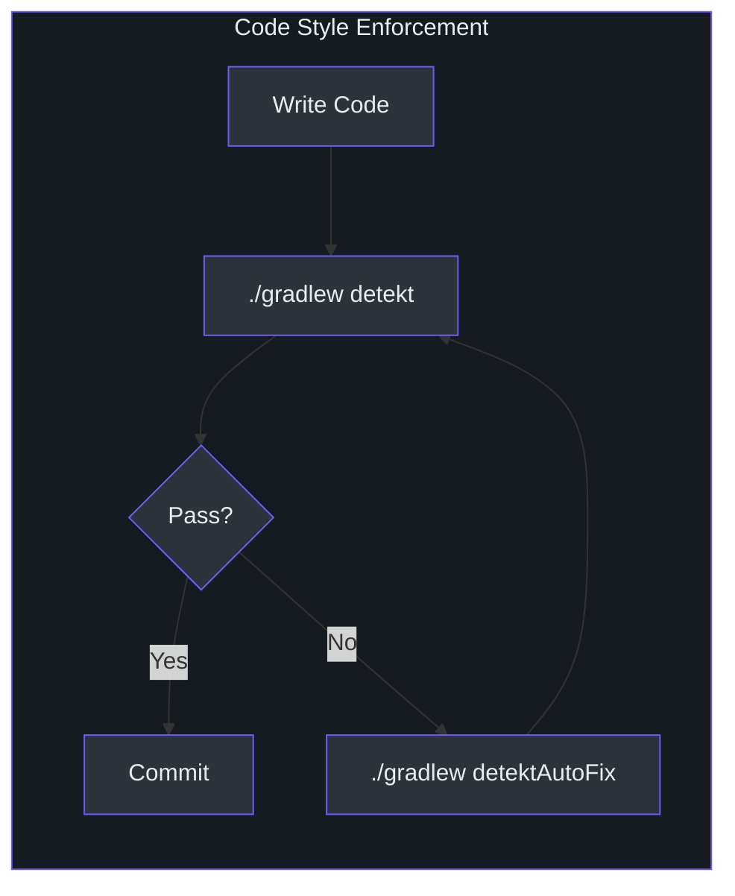
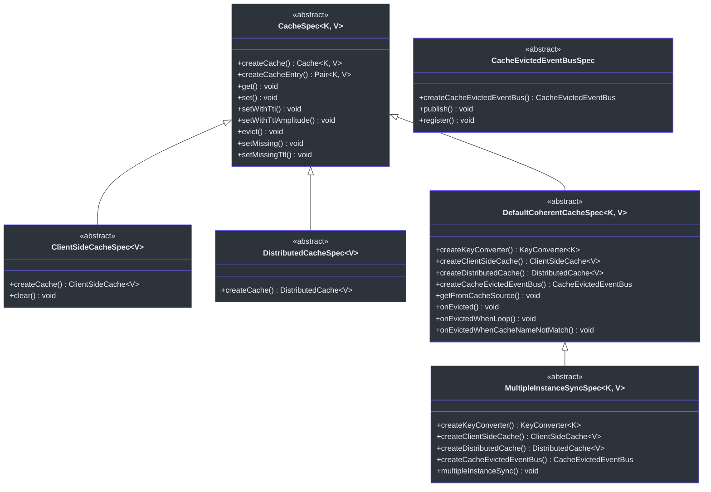
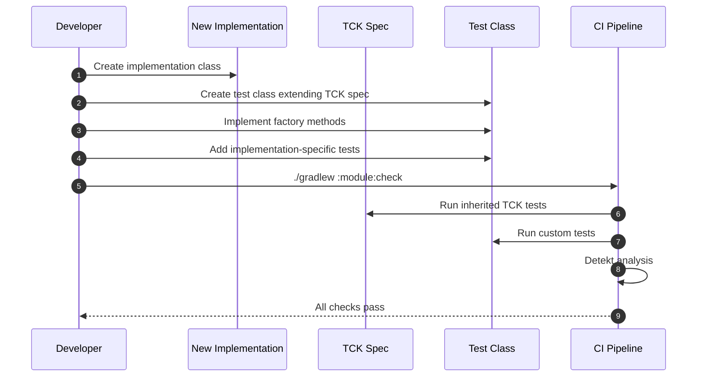
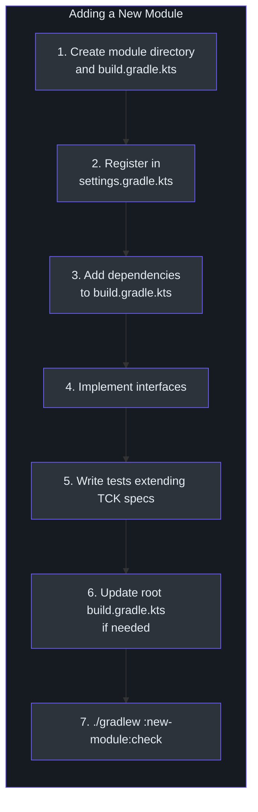
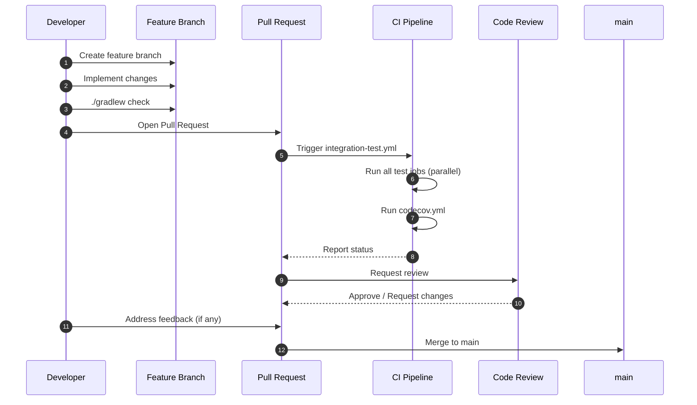

# 贡献指南

本指南涵盖了为 CoCache 贡献代码所需了解的一切：代码风格强制执行、测试要求、Pull Request 工作流以及如何添加新的缓存实现或模块。

## 代码风格

CoCache 通过 **Detekt** 强制执行代码风格，支持自动纠正。配置文件位于 [`config/detekt/detekt.yml`](https://github.com/Ahoo-Wang/CoCache/blob/main/config/detekt/detekt.yml)，并应用于所有项目。



### Detekt 配置

项目覆盖了多条默认 Detekt 规则，以允许务实的编码模式。主要覆盖规则：

| 类别 | 规则 | 设置 | 原因 | 来源 |
|------|------|------|------|------|
| complexity | `LongParameterList` | 禁用 | 缓存配置对象天然具有大量参数 | [`detekt.yml:3`](https://github.com/Ahoo-Wang/CoCache/blob/main/config/detekt/detekt.yml#L3) |
| complexity | `TooManyFunctions` | 禁用 | 缓存接口组合了多种操作类型 | [`detekt.yml:5`](https://github.com/Ahoo-Wang/CoCache/blob/main/config/detekt/detekt.yml#L5) |
| complexity | `NestedBlockDepth` | 禁用 | 缓存逻辑中深层嵌套是可以接受的 | [`detekt.yml:4`](https://github.com/Ahoo-Wang/CoCache/blob/main/config/detekt/detekt.yml#L4) |
| style | `MaxLineLength` | 300 | 以容纳流式链式调用和注解 | [`detekt.yml:10`](https://github.com/Ahoo-Wang/CoCache/blob/main/config/detekt/detekt.yml#L10) |
| style | `ReturnCount` | 禁用 | 在缓存 get/set 逻辑中，多个提前返回可提高可读性 | [`detekt.yml:12`](https://github.com/Ahoo-Wang/CoCache/blob/main/config/detekt/detekt.yml#L12) |
| style | `MagicNumber` | 禁用 | TTL 值和缓存大小是领域特定的 | [`detekt.yml:18`](https://github.com/Ahoo-Wang/CoCache/blob/main/config/detekt/detekt.yml#L18) |
| style | `UnusedPrivateMember` | 禁用 | 某些成员通过反射使用 | [`detekt.yml:15`](https://github.com/Ahoo-Wang/CoCache/blob/main/config/detekt/detekt.yml#L15) |
| style | `WildcardImport` | 允许 `java.util.*` | 常见的 Java 集合导入 | [`detekt.yml:21-24`](https://github.com/Ahoo-Wang/CoCache/blob/main/config/detekt/detekt.yml#L21-L24) |
| naming | `MemberNameEqualsClassName` | 禁用 | 缓存接口方法天然与类名匹配 | [`detekt.yml:30`](https://github.com/Ahoo-Wang/CoCache/blob/main/config/detekt/detekt.yml#L30) |
| naming | `MatchingDeclarationName` | 禁用 | 测试和工具类灵活命名 | [`detekt.yml:31`](https://github.com/Ahoo-Wang/CoCache/blob/main/config/detekt/detekt.yml#L31) |
| exceptions | `SwallowedException` | 禁用 | 缓存回退路径中的异常处理 | [`detekt.yml:34`](https://github.com/Ahoo-Wang/CoCache/blob/main/config/detekt/detekt.yml#L34) |
| performance | `SpreadOperator` | 禁用 | 在 vararg API 中使用展开运算符 | [`detekt.yml:40`](https://github.com/Ahoo-Wang/CoCache/blob/main/config/detekt/detekt.yml#L40) |
| formatting | `NoWildcardImports` | 允许 `java.util.*,org.assertj.core.api.Assertions.*` | 统一的导入风格 | [`detekt.yml:43-44`](https://github.com/Ahoo-Wang/CoCache/blob/main/config/detekt/detekt.yml#L43-L44) |

`detekt-formatting` 插件通过 `cocache-dependencies` 与核心 Detekt 插件一起应用，并且在项目级别启用了 `autoCorrect = true`（[`build.gradle.kts:58`](https://github.com/Ahoo-Wang/CoCache/blob/main/build.gradle.kts#L58)）。

### 检查风格

```bash
# 运行 Detekt 分析
./gradlew detekt

# 运行 Detekt 并自动格式化修正
./gradlew detektAutoFix
```

Detekt 作为 `./gradlew check` 的一部分自动运行。提交前务必运行 `detekt` 以尽早发现问题。

## 测试要求

所有贡献必须包含适当的测试。CoCache 使用 **JUnit 5 (Jupiter)** 作为测试框架，**mockk** 用于模拟，**fluent-assert** 用于断言。

### 测试技术栈

| 工具 | 用途 | 版本 | 来源 |
|------|------|------|------|
| JUnit 5 Jupiter | 测试框架和参数化测试 | 6.1.1 | [`libs.versions.toml:9`](https://github.com/Ahoo-Wang/CoCache/blob/main/gradle/libs.versions.toml#L9) |
| mockk | Kotlin 原生模拟框架 | 1.14.11 | [`libs.versions.toml:11`](https://github.com/Ahoo-Wang/CoCache/blob/main/gradle/libs.versions.toml#L11) |
| fluent-assert | Kotlin 流式断言库（封装 AssertJ） | 1.0.0 | [`libs.versions.toml:10`](https://github.com/Ahoo-Wang/CoCache/blob/main/gradle/libs.versions.toml#L10) |

### 断言风格

CoCache 要求所有测试断言使用 **fluent-assert** 库。禁止直接使用 AssertJ 的 `assertThat()`。

```kotlin
// 正确 -- fluent-assert 扩展
import me.ahoo.test.asserts.assert

cache[key].assert().isEqualTo(value)
result.assert().isNotNull()
count.assert().isOne()

// 错误 -- 不要直接使用 AssertJ
assertThat(cache[key]).isEqualTo(value)  // 不允许
```

fluent-assert 模式提供了 null 安全断言和更符合 Kotlin 习惯的语法。

### TCK（技术兼容性套件）规范

[`cocache-test`](https://github.com/Ahoo-Wang/CoCache/blob/main/cocache-test) 模块提供了抽象规范类，定义了所有缓存实现的预期行为。新的实现**必须**继承这些规范。



| 规范类 | 测试内容 | 工厂方法 | 来源 |
|--------|----------|----------|------|
| `CacheSpec<K, V>` | 基本缓存操作（get、set、evict、TTL） | `createCache()`、`createCacheEntry()` | [`cocache-test/.../CacheSpec.kt`](https://github.com/Ahoo-Wang/CoCache/blob/main/cocache-test/src/main/kotlin/me/ahoo/cache/test/CacheSpec.kt) |
| `ClientSideCacheSpec<V>` | L2 客户端缓存 + 清除操作 | `createCache()`（返回 `ClientSideCache<V>`） | [`cocache-test/.../ClientSideCacheSpec.kt`](https://github.com/Ahoo-Wang/CoCache/blob/main/cocache-test/src/main/kotlin/me/ahoo/cache/test/ClientSideCacheSpec.kt) |
| `DistributedCacheSpec<V>` | L1 分布式缓存行为 | `createCache()`（返回 `DistributedCache<V>`） | [`cocache-test/.../DistributedCacheSpec.kt`](https://github.com/Ahoo-Wang/CoCache/blob/main/cocache-test/src/main/kotlin/me/ahoo/cache/test/DistributedCacheSpec.kt) |
| `DefaultCoherentCacheSpec<K, V>` | 包含缓存源、驱逐事件、缓存击穿防护的完整一致性缓存 | `createKeyConverter()`、`createClientSideCache()`、`createDistributedCache()`、`createCacheEvictedEventBus()`、`createCacheName()` | [`cocache-test/.../DefaultCoherentCacheSpec.kt`](https://github.com/Ahoo-Wang/CoCache/blob/main/cocache-test/src/main/kotlin/me/ahoo/cache/test/DefaultCoherentCacheSpec.kt) |
| `MultipleInstanceSyncSpec<K, V>` | 通过事件总线实现跨实例缓存一致性 | 与 `DefaultCoherentCacheSpec` 相同 | [`cocache-test/.../MultipleInstanceSyncSpec.kt`](https://github.com/Ahoo-Wang/CoCache/blob/main/cocache-test/src/main/kotlin/me/ahoo/cache/test/MultipleInstanceSyncSpec.kt) |
| `CacheEvictedEventBusSpec` | 事件总线的发布和订阅行为 | `createCacheEvictedEventBus()` | [`cocache-test/.../CacheEvictedEventBusSpec.kt`](https://github.com/Ahoo-Wang/CoCache/blob/main/cocache-test/src/main/kotlin/me/ahoo/cache/test/consistency/CacheEvictedEventBusSpec.kt) |

## 如何添加新的缓存实现

添加新的 `ClientSideCache`、`DistributedCache` 或 `CacheEvictedEventBus` 实现时，请遵循以下步骤：



### 第 1 步：实现接口

在相应的模块中创建你的实现。例如，一个新的 `ClientSideCache`：

```kotlin
// cocache-core/src/main/kotlin/me/ahoo/cache/client/MyClientSideCache.kt
class MyClientSideCache<V> : ClientSideCache<V> {
    // 实现所有接口方法
}
```

### 第 2 步：创建继承 TCK 规范的测试类

```kotlin
// cocache-core/src/test/kotlin/me/ahoo/cache/client/MyClientSideCacheTest.kt
class MyClientSideCacheTest : ClientSideCacheSpec<String>() {
    override fun createCache(): ClientSideCache<String> {
        return MyClientSideCache()
    }

    override fun createCacheEntry(): Pair<String, String> {
        return "test-key" to "test-value"
    }

    // 在此添加针对具体实现的测试
}
```

### 第 3 步：运行测试

```bash
./gradlew :cocache-core:test --tests "me.ahoo.cache.client.MyClientSideCacheTest"
```

继承的 TCK 测试会自动验证所有标准缓存行为。请添加自定义测试来覆盖具体实现的特性。

## 如何添加新模块

要添加一个全新的模块（例如新的分布式缓存后端）：



### 第 1 步：创建模块目录

```
cocache-my-backend/
  build.gradle.kts
  src/
    main/kotlin/me/ahoo/cache/mybackend/...
    test/kotlin/me/ahoo/cache/mybackend/...
```

### 第 2 步：在 `settings.gradle.kts` 中注册

将模块添加到 [`settings.gradle.kts`](https://github.com/Ahoo-Wang/CoCache/blob/main/settings.gradle.kts)：

```kotlin
include(":cocache-my-backend")
```

### 第 3 步：配置 `build.gradle.kts`

```kotlin
// cocache-my-backend/build.gradle.kts
dependencies {
    api(project(":cocache-core"))
    // 或 api(project(":cocache-spring")) 用于 Spring 集成
    // 添加后端特定的依赖
    testImplementation(project(":cocache-test"))
}
```

该模块将自动继承以下配置：
- JDK 17 工具链
- Kotlin 编译器标志（`-Xjsr305=strict`、`-Xjvm-default=all-compatibility`）
- Detekt 配置
- JUnit 5 测试配置
- 通用测试依赖（mockk、fluent-assert、logback）
- Maven 发布配置

### 第 4 步：编写测试

继承 `cocache-test` 中相应的 TCK 规范，并添加针对具体实现的测试。

### 第 5 步：更新根构建脚本（如需要）

如果新模块应该包含在聚合覆盖率报告中，无需进行任何更改 -- [`code-coverage-report`](https://github.com/Ahoo-Wang/CoCache/blob/main/code-coverage-report/build.gradle.kts) 会自动包含所有 `libraryProjects`。

如果该模块是一个应用程序（如 `cocache-example`），请将其添加到根 [`build.gradle.kts`](https://github.com/Ahoo-Wang/CoCache/blob/main/build.gradle.kts) 的 `serverProjects` 中：

```kotlin
// [build.gradle.kts:34-36](https://github.com/Ahoo-Wang/CoCache/blob/main/build.gradle.kts#L34-L36)
val serverProjects = setOf(
    project(":cocache-example"),
    project(":cocache-my-backend"), // 如果是应用程序则添加在此
)
```

## 分支命名

遵循统一的分支命名规范：

| 模式 | 用途 | 示例 |
|------|------|------|
| `feature/<描述>` | 新功能 | `feature/redisson-distributed-cache` |
| `fix/<描述>` | Bug 修复 | `fix/ttl-amplitude-calculation` |
| `refactor/<描述>` | 代码重构 | `refactor/extract-cache-source` |
| `docs/<描述>` | 文档变更 | `docs/update-api-reference` |
| `chore/<描述>` | 构建、CI、依赖更新 | `chore/upgrade-spring-boot` |

## 提交信息格式

使用约定式提交格式：

```
<type>(<scope>): <description>

[可选正文]
```

| 类型 | 用途 | 示例 |
|------|------|------|
| `feat` | 新功能 | `feat(core): add CaffeineCache implementation` |
| `fix` | Bug 修复 | `fix(spring-redis): handle null cache values` |
| `refactor` | 代码重构 | `refactor(api): extract CacheGetter interface` |
| `test` | 添加或更新测试 | `test(core): add concurrent access spec` |
| `docs` | 文档 | `docs(wiki): add publishing guide` |
| `chore` | 构建、CI、依赖 | `chore(deps): upgrade Kotlin to 2.4.0` |
| `ci` | CI/CD 变更 | `ci: add CodeQL analysis workflow` |

## Pull Request 工作流



### PR 检查清单

提交 Pull Request 之前，请确保：

1. **所有测试通过**：`./gradlew check` 在本地成功运行
2. **Detekt 检查通过**：`./gradlew detekt` 通过（或先运行 `detektAutoFix`）
3. **TCK 规范已继承**：新实现继承了 `cocache-test` 中相应的规范类
4. **覆盖率维持**：新代码包含测试覆盖（Codecov 目标：60%）
5. **无密钥提交**：代码中没有凭据、令牌或特定环境的值
6. **API 兼容性**：公共 API 变更保持向后兼容，或标记为破坏性变更并记录

## 相关页面

- [构建与 CI 概览](/building/) -- 构建系统、Gradle 配置和 CI/CD 流水线
- [发布与发布管理](/building/publishing) -- Maven Central 发布和发布工作流
- [测试](/testing/) -- 测试规范、模式和共享测试基础设施
- [架构](/architecture/) -- 系统架构和设计决策
