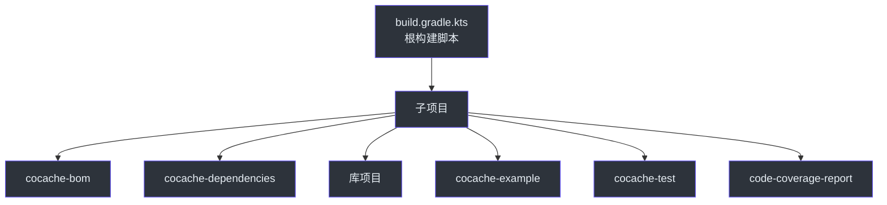

# 构建与 CI

CoCache 使用 Gradle 构建系统，配合 GitHub Actions 实现持续集成和持续部署。

## 构建环境

| 工具 | 版本 | 说明 |
|------|------|------|
| JDK | 17+ | 通过 `jvmToolchain` 在 `build.gradle.kts` 中配置 |
| Gradle | 9.4.1 | 使用 Gradle Wrapper |
| Kotlin | 最新稳定版 | 编译器标志：`-Xjsr305=strict`, `-Xjvm-default=all-compatibility` |

## Gradle 构建命令

### 完整构建

```bash
# 构建（跳过测试）
./gradlew build -x test

# 完整检查（测试 + Detekt + Dokka）
./gradlew check
./gradlew clean check  # CI 中推荐使用 clean
```

### 测试

```bash
# 运行所有测试
./gradlew test

# 运行特定模块测试
./gradlew :cocache-core:test
./gradlew :cocache-spring:test

# 运行单个测试类
./gradlew :cocache-core:test --tests "me.ahoo.cache.proxy.ProxyCacheTest"

# 运行集成测试（需要 Redis）
./gradlew :cocache-spring-redis:check
./gradlew :cocache-spring-boot-starter:check
```

### 代码质量

```bash
# 运行 Detekt 静态分析
./gradlew detekt

# 自动修复 Detekt 问题
./gradlew detektAutoFix
```

### 发布

```bash
# 发布到本地 Maven
./gradlew publishToMavenLocal
```

## Detekt 代码质量

CoCache 使用 Detekt 进行 Kotlin 静态代码分析。

### 配置文件

Detekt 配置位于 `config/detekt/detekt.yml`。

### 关键配置覆盖

| 规则 | 配置 | 说明 |
|------|------|------|
| `LongParameterList` | 禁用 | 允许长参数列表 |
| `TooManyFunctions` | 禁用 | 允许类包含多个函数 |
| `ReturnCount` | 禁用 | 允许多个 return 语句 |
| `MagicNumber` | 禁用 | 允许魔法数字 |
| `UnusedPrivateMember` | 禁用 | 允许未使用的私有成员 |
| `MaxLineLength` | 300 | 最大行长度 300 字符 |
| `WildcardImport` | 允许 | 允许 `java.util.*` 通配符导入 |

### Suppression 注解

代码中使用 `@Suppress` 注解绕过特定规则：

```kotlin
@Suppress("LongParameterList")
@Suppress("ReturnCount")
@Suppress("SpreadOperator")
```

## CI/CD 工作流

### 集成测试（integration-test.yml）

运行集成测试，使用 Redis Service Container：

```yaml
services:
  redis:
    image: redis:7
    ports:
      - 6379:6379
    options: >-
      --health-cmd "redis-cli ping"
      --health-interval 10s
      --health-timeout 5s
      --health-retries 5
```

### 包发布（package-deploy.yml）

发布到 Maven Central 的工作流。

### CodeQL 分析（codeql-analysis.yml）

GitHub CodeQL 安全扫描。

### 代码覆盖率

使用 JaCoCo 生成代码覆盖率报告，通过 `code-coverage-report` 模块聚合所有模块的覆盖率数据。

### Codecov 集成

```yaml
# codecov.yml
coverage:
  status:
    project:
      default:
        target: auto
```

## 项目结构



## Kotlin 编译器标志

| 标志 | 说明 |
|------|------|
| `-Xjsr305=strict` | 严格 null 安全检查（针对 JSR-305 注解） |
| `-Xjvm-default=all-compatibility` | 为接口默认方法生成兼容 Java 的字节码 |

## 相关页面

- [贡献指南](./contributing.md) - 贡献代码指南
- [发布](./publishing.md) - 发布流程
- [测试概览](../testing/index.md) - 测试策略
