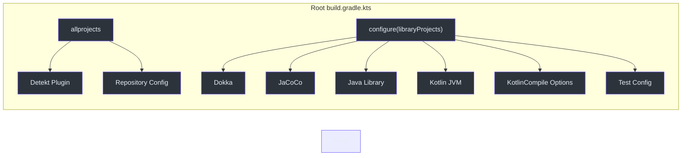
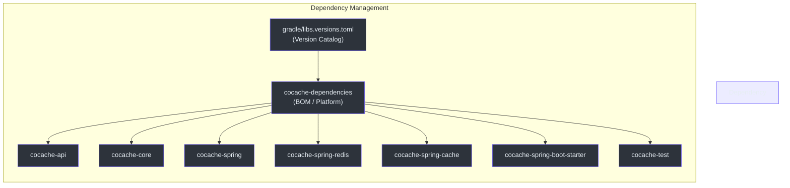
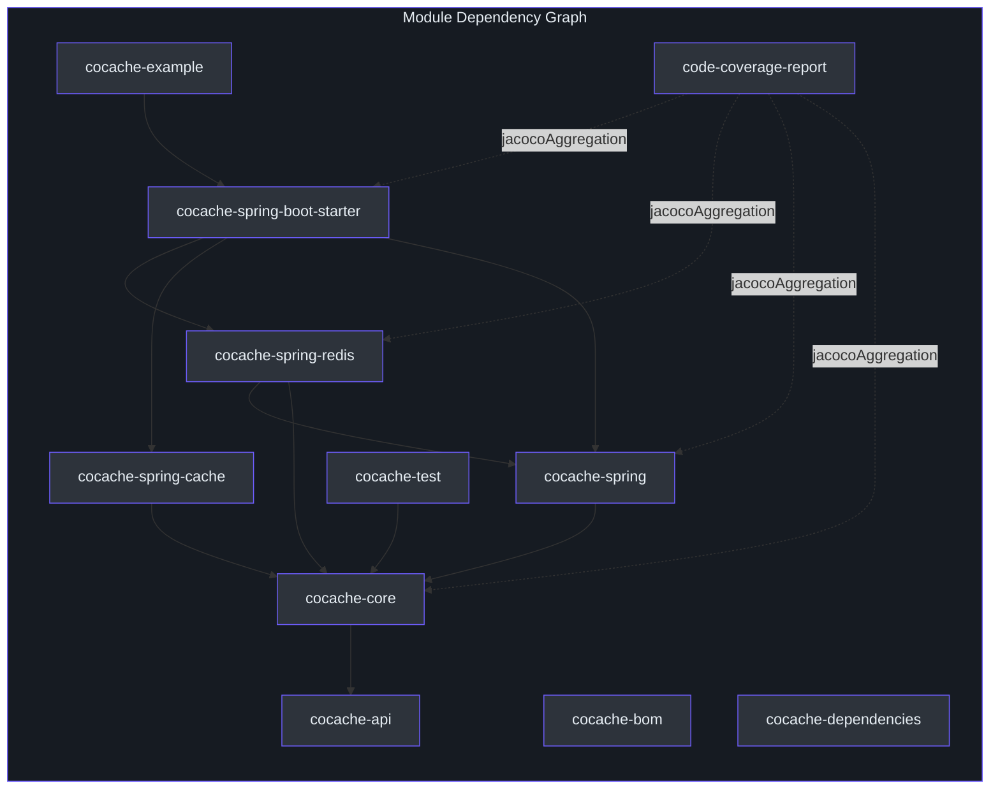
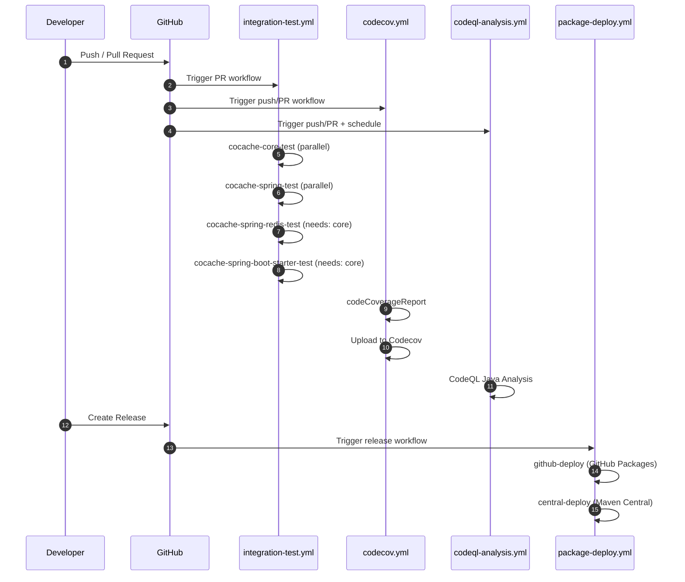
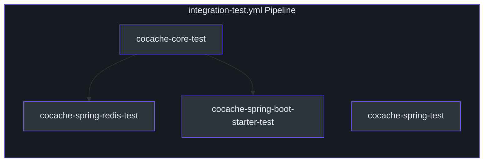

# 构建与 CI 概览

CoCache 使用 **Gradle 9.6.1** 的 Kotlin DSL，所有库模块均面向 **JDK 17+**。构建流水线集成了 Detekt 进行静态分析、Dokka 生成 API 文档、JaCoCo 进行代码覆盖率统计，以及 GitHub Actions 实现持续集成和部署。

## Gradle 配置

根 [`build.gradle.kts`](https://github.com/Ahoo-Wang/CoCache/blob/main/build.gradle.kts) 通过 `allprojects` 和 `configure` 块将共享配置应用于所有子项目。[Gradle 版本目录](https://github.com/Ahoo-Wang/CoCache/blob/main/gradle/libs.versions.toml)集中管理依赖版本。



### JDK 17 工具链

所有库模块通过根构建脚本中的 Kotlin JVM 工具链配置强制使用 JDK 17：

```kotlin
// [build.gradle.kts:88-91](https://github.com/Ahoo-Wang/CoCache/blob/main/build.gradle.kts#L88-L91)
configure<KotlinJvmProjectExtension> {
    jvmToolchain {
        languageVersion.set(JavaLanguageVersion.of(17))
    }
}
```

[`cocache-example`](https://github.com/Ahoo-Wang/CoCache/blob/main/cocache-example/build.gradle.kts) 模块也显式声明了自己的 JDK 17 工具链。

### Kotlin 编译器标志

两个关键的 Kotlin 编译器标志应用于所有库模块：

| 标志 | 用途 | 来源 |
|------|------|------|
| `-Xjsr305=strict` | 对 JSR-305 注解的 API（如 Spring、Guava）强制执行严格的空安全检查 | [`build.gradle.kts:95`](https://github.com/Ahoo-Wang/CoCache/blob/main/build.gradle.kts#L95) |
| `-Xjvm-default=all-compatibility` | 为接口生成默认方法实现，以实现 Java 互操作性 | [`build.gradle.kts:95`](https://github.com/Ahoo-Wang/CoCache/blob/main/build.gradle.kts#L95) |
| `javaParameters = true` | 在字节码中存储方法参数名称，供基于反射的工具使用 | [`build.gradle.kts:96`](https://github.com/Ahoo-Wang/CoCache/blob/main/build.gradle.kts#L96) |

Java 编译也传递 `-parameters` 以保持一致的参数名保留：

```kotlin
// [build.gradle.kts:99-101](https://github.com/Ahoo-Wang/CoCache/blob/main/build.gradle.kts#L99-L101)
tasks.withType<JavaCompile> {
    options.compilerArgs.addAll(listOf("-parameters"))
}
```

## 依赖管理

CoCache 使用两层依赖管理策略：



| 构件 | 角色 | 来源 |
|------|------|------|
| `cocache-dependencies` | 聚合 Spring Boot、CoSid、fluent-assert 和库约束的平台 BOM | [`cocache-dependencies/build.gradle.kts`](https://github.com/Ahoo-Wang/CoCache/blob/main/cocache-dependencies/build.gradle.kts) |
| `cocache-bom` | 发布的 BOM，将所有库模块作为依赖约束对外暴露 | [`cocache-bom/build.gradle.kts`](https://github.com/Ahoo-Wang/CoCache/blob/main/cocache-bom/build.gradle.kts) |
| `gradle/libs.versions.toml` | 版本目录，定义所有库和插件的版本 | [`gradle/libs.versions.toml`](https://github.com/Ahoo-Wang/CoCache/blob/main/gradle/libs.versions.toml) |

所有库模块通过以下方式导入平台：

```kotlin
// [build.gradle.kts:111](https://github.com/Ahoo-Wang/CoCache/blob/main/build.gradle.kts#L111)
api(platform(dependenciesProject))
```

### 关键依赖版本

| 依赖 | 版本 | 来源 |
|------|------|------|
| Kotlin | 2.4.0 | [`libs.versions.toml:15`](https://github.com/Ahoo-Wang/CoCache/blob/main/gradle/libs.versions.toml#L15) |
| Spring Boot | 4.1.0 | [`libs.versions.toml:3`](https://github.com/Ahoo-Wang/CoCache/blob/main/gradle/libs.versions.toml#L3) |
| CoSid | 3.2.0 | [`libs.versions.toml:4`](https://github.com/Ahoo-Wang/CoCache/blob/main/gradle/libs.versions.toml#L4) |
| Detekt | 1.23.8 | [`libs.versions.toml:13`](https://github.com/Ahoo-Wang/CoCache/blob/main/gradle/libs.versions.toml#L13) |
| Dokka | 2.2.0 | [`libs.versions.toml:14`](https://github.com/Ahoo-Wang/CoCache/blob/main/gradle/libs.versions.toml#L14) |
| JUnit | 6.1.1 | [`libs.versions.toml:9`](https://github.com/Ahoo-Wang/CoCache/blob/main/gradle/libs.versions.toml#L9) |
| fluent-assert | 1.0.0 | [`libs.versions.toml:10`](https://github.com/Ahoo-Wang/CoCache/blob/main/gradle/libs.versions.toml#L10) |
| mockk | 1.14.11 | [`libs.versions.toml:11`](https://github.com/Ahoo-Wang/CoCache/blob/main/gradle/libs.versions.toml#L11) |

## 模块构建图

下图展示了模块间的依赖关系：



根构建脚本将项目分为逻辑组进行配置：

| 分组 | 项目 | 用途 | 来源 |
|------|------|------|------|
| `bomProjects` | `cocache-bom`、`cocache-dependencies` | Java Platform（BOM）模块 | [`build.gradle.kts:29-32`](https://github.com/Ahoo-Wang/CoCache/blob/main/build.gradle.kts#L29-L32) |
| `serverProjects` | `cocache-example` | 不发布的应用模块 | [`build.gradle.kts:34-36`](https://github.com/Ahoo-Wang/CoCache/blob/main/build.gradle.kts#L34-L36) |
| `libraryProjects` | 除 BOM 和 server 之外的所有模块 | 包含 Dokka、JaCoCo 和发布配置的已发布库模块 | [`build.gradle.kts:44-46`](https://github.com/Ahoo-Wang/CoCache/blob/main/build.gradle.kts#L44-L46) |

## 质量工具

### Detekt（静态分析）

Detekt 通过 `allprojects` 块应用于**所有项目**（包括 BOM 和 server 模块）。配置集中于 [`config/detekt/detekt.yml`](https://github.com/Ahoo-Wang/CoCache/blob/main/config/detekt/detekt.yml)。

```kotlin
// [build.gradle.kts:54-59](https://github.com/Ahoo-Wang/CoCache/blob/main/build.gradle.kts#L54-L59)
allprojects {
    apply<DetektPlugin>()
    configure<DetektExtension> {
        config.setFrom(files("${rootProject.rootDir}/config/detekt/detekt.yml"))
        buildUponDefaultConfig = true
        autoCorrect = true
    }
}
```

关键 Detekt 配置覆盖：

| 规则 | 设置 | 来源 |
|------|------|------|
| `LongParameterList` | 禁用 | [`detekt.yml:3`](https://github.com/Ahoo-Wang/CoCache/blob/main/config/detekt/detekt.yml#L3) |
| `TooManyFunctions` | 禁用 | [`detekt.yml:5`](https://github.com/Ahoo-Wang/CoCache/blob/main/config/detekt/detekt.yml#L5) |
| `MaxLineLength` | 300 | [`detekt.yml:10`](https://github.com/Ahoo-Wang/CoCache/blob/main/config/detekt/detekt.yml#L10) |
| `ReturnCount` | 禁用 | [`detekt.yml:12`](https://github.com/Ahoo-Wang/CoCache/blob/main/config/detekt/detekt.yml#L12) |
| `MagicNumber` | 禁用 | [`detekt.yml:18`](https://github.com/Ahoo-Wang/CoCache/blob/main/config/detekt/detekt.yml#L18) |
| `UnusedPrivateMember` | 禁用 | [`detekt.yml:15`](https://github.com/Ahoo-Wang/CoCache/blob/main/config/detekt/detekt.yml#L15) |
| `WildcardImport` | 允许 `java.util.*` | [`detekt.yml:21-24`](https://github.com/Ahoo-Wang/CoCache/blob/main/config/detekt/detekt.yml#L21-L24) |

`detekt-formatting` 插件（来自 [`cocache-dependencies`](https://github.com/Ahoo-Wang/CoCache/blob/main/cocache-dependencies/build.gradle.kts)）也应用于所有项目，以强制执行统一的代码格式。

### Dokka（API 文档）

Dokka 应用于所有库项目，用于生成 Kotlin/Java API 文档：

```kotlin
// [build.gradle.kts:80](https://github.com/Ahoo-Wang/CoCache/blob/main/build.gradle.kts#L80)
apply<DokkaPlugin>()
```

所有库模块还生成 `javadocJar` 和 `sourcesJar` 用于 Maven 发布：

```kotlin
// [build.gradle.kts:83-86](https://github.com/Ahoo-Wang/CoCache/blob/main/build.gradle.kts#L83-L86)
configure<JavaPluginExtension> {
    withJavadocJar()
    withSourcesJar()
}
```

### JaCoCo（代码覆盖率）

JaCoCo 应用于所有库项目，用于各模块的覆盖率统计。[`code-coverage-report`](https://github.com/Ahoo-Wang/CoCache/blob/main/code-coverage-report/build.gradle.kts) 模块使用 `jacoco-report-aggregation` 生成所有库模块的聚合覆盖率报告。

```kotlin
// [code-coverage-report/build.gradle.kts:20-26](https://github.com/Ahoo-Wang/CoCache/blob/main/code-coverage-report/build.gradle.kts#L20-L26)
val libraryProjects = rootProject.ext.get("libraryProjects") as Iterable<Project>
dependencies {
    libraryProjects.forEach {
        jacocoAggregation(it)
    }
}
```

自定义 Logback 配置（[`config/logback.xml`](https://github.com/Ahoo-Wang/CoCache/blob/main/config/logback.xml)）被注入到所有测试任务中，以确保 JaCoCo 正确捕获所有日志输出：

```kotlin
// [build.gradle.kts:108](https://github.com/Ahoo-Wang/CoCache/blob/main/build.gradle.kts#L108)
jvmArgs = listOf("-Dlogback.configurationFile=${rootProject.rootDir}/config/logback.xml")
```

[`codecov.yml`](https://github.com/Ahoo-Wang/CoCache/blob/main/codecov.yml) 配置的目标覆盖率为 60%，patch 和 project 指标均有 1% 的阈值容差，忽略 `cocache-test` 和 `cocache-example` 模块。

## 构建命令

| 命令 | 用途 | 备注 |
|------|------|------|
| `./gradlew build -x test` | 跳过测试的完整构建 | 快速编译检查 |
| `./gradlew check` | 完整检查：测试 + Detekt + Dokka | CI 中用于可重复验证 |
| `./gradlew clean check` | 清理后完整检查 | CI 中推荐使用以确保可重复性 |
| `./gradlew test` | 运行所有测试 | 通过 Jupiter 引擎运行 JUnit 5 |
| `./gradlew :cocache-core:test` | 测试特定模块 | 前缀 `:` 用于模块定向 |
| `./gradlew :cocache-core:test --tests "me.ahoo.cache.proxy.ProxyCacheTest"` | 运行单个测试类 | 完全限定类名 |
| `./gradlew detekt` | 仅运行 Detekt 分析 | 无构建的静态分析 |
| `./gradlew detektAutoFix` | 运行 Detekt 并自动修正 | 应用安全的格式化修正 |
| `./gradlew codeCoverageReport` | 生成聚合 JaCoCo 报告 | Codecov 工作流使用 |
| `./gradlew publishToMavenLocal` | 发布到本地 Maven 仓库 | 用于本地集成测试 |

## 测试配置

所有库模块配置 JUnit 5 (Jupiter) 作为测试平台，并启用完整的异常日志记录：

```kotlin
// [build.gradle.kts:102-109](https://github.com/Ahoo-Wang/CoCache/blob/main/build.gradle.kts#L102-L109)
tasks.withType<Test> {
    useJUnitPlatform()
    testLogging {
        exceptionFormat = TestExceptionFormat.FULL
    }
    jvmArgs = listOf("-Dlogback.configurationFile=${rootProject.rootDir}/config/logback.xml")
}
```

注入到所有库模块的测试依赖：

| 依赖 | 用途 | 来源 |
|------|------|------|
| `junit-jupiter-api` | JUnit 5 测试 API | [`build.gradle.kts:116`](https://github.com/Ahoo-Wang/CoCache/blob/main/build.gradle.kts#L116) |
| `junit-jupiter-params` | 参数化测试支持 | [`build.gradle.kts:117`](https://github.com/Ahoo-Wang/CoCache/blob/main/build.gradle.kts#L117) |
| `fluent-assert-core` | Kotlin 流式断言 DSL | [`build.gradle.kts:118`](https://github.com/Ahoo-Wang/CoCache/blob/main/build.gradle.kts#L118) |
| `mockk` | Kotlin 模拟框架 | [`build.gradle.kts:119`](https://github.com/Ahoo-Wang/CoCache/blob/main/build.gradle.kts#L119) |
| `logback-classic` | 测试日志实现 | [`build.gradle.kts:115`](https://github.com/Ahoo-Wang/CoCache/blob/main/build.gradle.kts#L115) |
| `junit-platform-launcher` | JUnit 运行时启动器 | [`build.gradle.kts:122`](https://github.com/Ahoo-Wang/CoCache/blob/main/build.gradle.kts#L122) |
| `junit-jupiter-engine` | JUnit 测试引擎 | [`build.gradle.kts:123`](https://github.com/Ahoo-Wang/CoCache/blob/main/build.gradle.kts#L123) |

## CI/CD 流水线

所有工作流定义在 [`.github/workflows/`](https://github.com/Ahoo-Wang/CoCache/blob/main/.github/workflows/) 中。



### 集成测试（integration-test.yml）

在每个 Pull Request 上触发。运行四个并行任务，并带有依赖排序：

| 任务 | 依赖 | Redis 服务 | 来源 |
|------|------|------------|------|
| `cocache-core-test` | -- | 否 | [`integration-test.yml:17-32`](https://github.com/Ahoo-Wang/CoCache/blob/main/.github/workflows/integration-test.yml#L17-L32) |
| `cocache-spring-test` | -- | 否 | [`integration-test.yml:33-49`](https://github.com/Ahoo-Wang/CoCache/blob/main/.github/workflows/integration-test.yml#L33-L49) |
| `cocache-spring-redis-test` | `cocache-core-test` | 是（端口 6379） | [`integration-test.yml:51-78`](https://github.com/Ahoo-Wang/CoCache/blob/main/.github/workflows/integration-test.yml#L51-L78) |
| `cocache-spring-boot-starter-test` | `cocache-core-test` | 是（端口 6379） | [`integration-test.yml:80-107`](https://github.com/Ahoo-Wang/CoCache/blob/main/.github/workflows/integration-test.yml#L80-L107) |



依赖 Redis 的测试使用带健康检查的 GitHub Actions 服务容器：

```yaml
# [integration-test.yml:56-65](https://github.com/Ahoo-Wang/CoCache/blob/main/.github/workflows/integration-test.yml#L56-L65)
services:
  redis:
    image: redis
    options: >-
      --health-cmd "redis-cli ping"
      --health-interval 10s
      --health-timeout 5s
      --health-retries 5
    ports:
      - 6379:6379
```

### Codecov（codecov.yml）

在 push 和 pull request 时触发。运行完整的 `codeCoverageReport` 任务（带 Redis 服务），然后将聚合的 JaCoCo XML 报告上传到 Codecov。

| 步骤 | 详情 | 来源 |
|------|------|------|
| 构建 | `./gradlew codeCoverageReport --stacktrace` | [`codecov.yml:30`](https://github.com/Ahoo-Wang/CoCache/blob/main/.github/workflows/codecov.yml#L30) |
| 上传 | `codecov/codecov-action@v6`，使用 `CODECOV_TOKEN` | [`codecov.yml:33`](https://github.com/Ahoo-Wang/CoCache/blob/main/.github/workflows/codecov.yml#L33) |
| 报告路径 | `./code-coverage-report/build/reports/jacoco/codeCoverageReport/codeCoverageReport.xml` | [`codecov.yml:41`](https://github.com/Ahoo-Wang/CoCache/blob/main/.github/workflows/codecov.yml#L41) |

### CodeQL 分析（codeql-analysis.yml）

在 push/PR 到 `main` 分支以及每周定期（UTC 时间周五 09:17）时触发。使用 GitHub CodeQL 对 Java 执行静态安全分析。

| 触发条件 | 时间计划 | 来源 |
|----------|----------|------|
| Push 到 `main` | 立即 | [`codeql-analysis.yml:15`](https://github.com/Ahoo-Wang/CoCache/blob/main/.github/workflows/codeql-analysis.yml#L15) |
| PR 到 `main` | 立即 | [`codeql-analysis.yml:17`](https://github.com/Ahoo-Wang/CoCache/blob/main/.github/workflows/codeql-analysis.yml#L17) |
| 定时 | `17 9 * * 5`（周五） | [`codeql-analysis.yml:20`](https://github.com/Ahoo-Wang/CoCache/blob/main/.github/workflows/codeql-analysis.yml#L20) |

### 包发布（package-deploy.yml）

在 GitHub Release 创建时触发。运行两个并行任务：

| 任务 | 目标 | 命令 | 来源 |
|------|------|------|------|
| `github-deploy` | GitHub Packages | `./gradlew publishAllPublicationsToGitHubPackagesRepository` | [`package-deploy.yml:37`](https://github.com/Ahoo-Wang/CoCache/blob/main/.github/workflows/package-deploy.yml#L37) |
| `central-deploy` | Maven Central（Sonatype） | `./gradlew publishToSonatype closeAndReleaseSonatypeStagingRepository` | [`package-deploy.yml:59`](https://github.com/Ahoo-Wang/CoCache/blob/main/.github/workflows/package-deploy.yml#L59) |

两个任务均需要 JDK 17（Temurin），并使用 CI 注入的密钥进行 PGP 签名。

## 其他配置

Gradle Wrapper 固定为 Gradle 9.6.1：

```properties
# [gradle-wrapper.properties:3](https://github.com/Ahoo-Wang/CoCache/blob/main/gradle/wrapper/gradle-wrapper.properties#L3)
distributionUrl=https\://services.gradle.org/distributions/gradle-9.6.1-bin.zip
```

[`settings.gradle.kts`](https://github.com/Ahoo-Wang/CoCache/blob/main/settings.gradle.kts) 使用 `foojay-resolver-convention` 插件（v1.0.0）来自动解析 JDK 工具链。

## 相关页面

- [贡献指南](/building/contributing) -- 代码风格、测试要求和 PR 工作流
- [发布与发布管理](/building/publishing) -- Maven Central 发布和发布流水线
- [测试](/testing/) -- 测试规范和模式
- [架构](/architecture/) -- 系统架构概览
