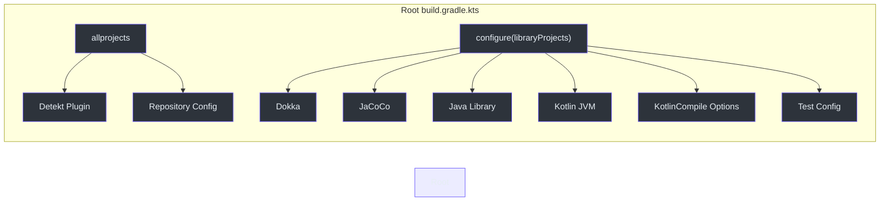
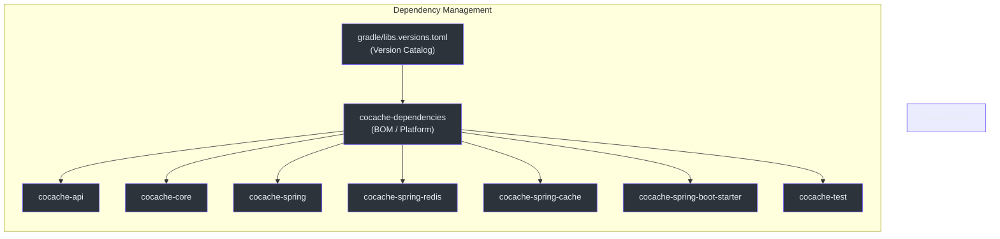
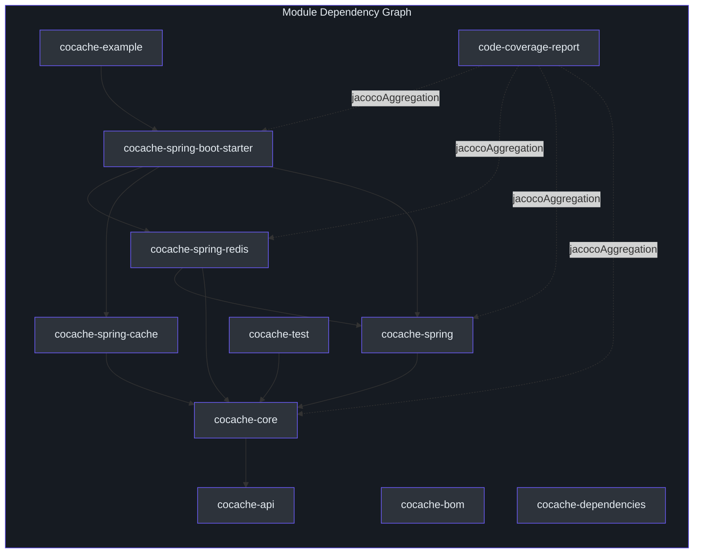
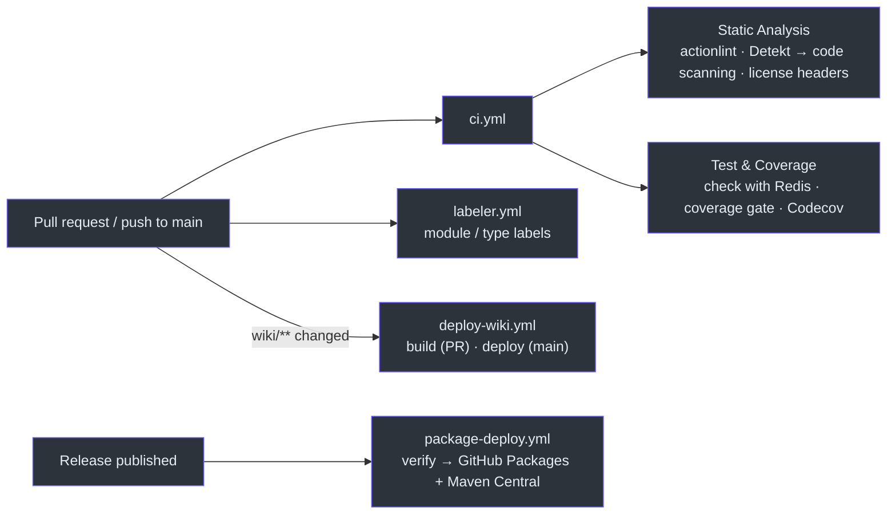

# 构建与 CI 概览

CoCache 使用 **Gradle 9.8.1** 的 Kotlin DSL，所有库模块均面向 **JDK 17+**。构建流水线集成了 Detekt 进行静态分析、Dokka 生成 API 文档、JaCoCo 进行代码覆盖率统计，以及 GitHub Actions 实现持续集成和部署。

## Gradle 配置

根 [`build.gradle.kts`](https://github.com/Ahoo-Wang/CoCache/blob/main/build.gradle.kts) 通过 `allprojects` 和 `configure` 块将共享配置应用于所有子项目。[Gradle 版本目录](https://github.com/Ahoo-Wang/CoCache/blob/main/gradle/libs.versions.toml)集中管理依赖版本。


```mermaid
graph LR
    subgraph Root Build["Root build.gradle.kts"]
        direction TB
        A["allprojects"] --> B["Detekt Plugin"]
        A --> C["Repository Config"]
        D["configure(libraryProjects)"] --> E["Dokka"]
        D --> F["JaCoCo"]
        D --> G["Java Library"]
        D --> H["Kotlin JVM"]
        D --> I["KotlinCompile Options"]
        D --> J["Test Config"]
    end
    style Root Build fill:#161b22,stroke:#6d5dfc,color:#e6edf3
    style A fill:#2d333b,stroke:#6d5dfc,color:#e6edf3
    style B fill:#2d333b,stroke:#6d5dfc,color:#e6edf3
    style C fill:#2d333b,stroke:#6d5dfc,color:#e6edf3
    style D fill:#2d333b,stroke:#6d5dfc,color:#e6edf3
    style E fill:#2d333b,stroke:#6d5dfc,color:#e6edf3
    style F fill:#2d333b,stroke:#6d5dfc,color:#e6edf3
    style G fill:#2d333b,stroke:#6d5dfc,color:#e6edf3
    style H fill:#2d333b,stroke:#6d5dfc,color:#e6edf3
    style I fill:#2d333b,stroke:#6d5dfc,color:#e6edf3
    style J fill:#2d333b,stroke:#6d5dfc,color:#e6edf3
```

### JDK 17 工具链

所有库模块通过根构建脚本中的 Kotlin JVM 工具链配置强制使用 JDK 17：

```kotlin
// [build.gradle.kts:88-91](https://github.com/Ahoo-Wang/CoCache/blob/main/build.gradle.kts#L88-L91)
configure<KotlinJvmProjectExtension> {
    jvmToolchain {
        languageVersion.set(JavaLanguageVersion.of(17))
    }
}
```

[`cocache-example`](https://github.com/Ahoo-Wang/CoCache/blob/main/cocache-example/build.gradle.kts) 模块也显式声明了自己的 JDK 17 工具链。

### Kotlin 编译器标志

两个关键的 Kotlin 编译器标志应用于所有库模块：

| 标志 | 用途 | 来源 |
|------|------|------|
| `-Xjsr305=strict` | 对 JSR-305 注解的 API（如 Spring、Guava）强制执行严格的空安全检查 | [`build.gradle.kts:95`](https://github.com/Ahoo-Wang/CoCache/blob/main/build.gradle.kts#L95) |
| `-Xjvm-default=all-compatibility` | 为接口生成默认方法实现，以实现 Java 互操作性 | [`build.gradle.kts:95`](https://github.com/Ahoo-Wang/CoCache/blob/main/build.gradle.kts#L95) |
| `javaParameters = true` | 在字节码中存储方法参数名称，供基于反射的工具使用 | [`build.gradle.kts:96`](https://github.com/Ahoo-Wang/CoCache/blob/main/build.gradle.kts#L96) |

Java 编译也传递 `-parameters` 以保持一致的参数名保留：

```kotlin
// [build.gradle.kts:99-101](https://github.com/Ahoo-Wang/CoCache/blob/main/build.gradle.kts#L99-L101)
tasks.withType<JavaCompile> {
    options.compilerArgs.addAll(listOf("-parameters"))
}
```

## 依赖管理

CoCache 使用两层依赖管理策略：


```mermaid
graph TD
    subgraph Dependency Strategy["Dependency Management"]
        direction TB
        BOM["cocache-dependencies<br>(BOM / Platform)"] --> API["cocache-api"]
        BOM --> CORE["cocache-core"]
        BOM --> SPRING["cocache-spring"]
        BOM --> SPRING_REDIS["cocache-spring-redis"]
        BOM --> SPRING_CACHE["cocache-spring-cache"]
        BOM --> SPRING_BOOT["cocache-spring-boot-starter"]
        BOM --> TEST["cocache-test"]
        CATALOG["gradle/libs.versions.toml<br>(Version Catalog)"] --> BOM
    end
    style Dependency Strategy fill:#161b22,stroke:#6d5dfc,color:#e6edf3
    style BOM fill:#2d333b,stroke:#6d5dfc,color:#e6edf3
    style CATALOG fill:#2d333b,stroke:#6d5dfc,color:#e6edf3
    style API fill:#2d333b,stroke:#6d5dfc,color:#e6edf3
    style CORE fill:#2d333b,stroke:#6d5dfc,color:#e6edf3
    style SPRING fill:#2d333b,stroke:#6d5dfc,color:#e6edf3
    style SPRING_REDIS fill:#2d333b,stroke:#6d5dfc,color:#e6edf3
    style SPRING_CACHE fill:#2d333b,stroke:#6d5dfc,color:#e6edf3
    style SPRING_BOOT fill:#2d333b,stroke:#6d5dfc,color:#e6edf3
    style TEST fill:#2d333b,stroke:#6d5dfc,color:#e6edf3
```

| 构件 | 角色 | 来源 |
|------|------|------|
| `cocache-dependencies` | 聚合 Spring Boot、CoSid、fluent-assert 和库约束的平台 BOM | [`cocache-dependencies/build.gradle.kts`](https://github.com/Ahoo-Wang/CoCache/blob/main/cocache-dependencies/build.gradle.kts) |
| `cocache-bom` | 发布的 BOM，将所有库模块作为依赖约束对外暴露 | [`cocache-bom/build.gradle.kts`](https://github.com/Ahoo-Wang/CoCache/blob/main/cocache-bom/build.gradle.kts) |
| `gradle/libs.versions.toml` | 版本目录，定义所有库和插件的版本 | [`gradle/libs.versions.toml`](https://github.com/Ahoo-Wang/CoCache/blob/main/gradle/libs.versions.toml) |

所有库模块通过以下方式导入平台：

```kotlin
// [build.gradle.kts:111](https://github.com/Ahoo-Wang/CoCache/blob/main/build.gradle.kts#L111)
api(platform(dependenciesProject))
```

### 关键依赖版本

| 依赖 | 版本 | 来源 |
|------|------|------|
| Kotlin | 2.4.0 | [`libs.versions.toml:15`](https://github.com/Ahoo-Wang/CoCache/blob/main/gradle/libs.versions.toml#L15) |
| Spring Boot | 4.1.0 | [`libs.versions.toml:3`](https://github.com/Ahoo-Wang/CoCache/blob/main/gradle/libs.versions.toml#L3) |
| CoSid | 3.2.0 | [`libs.versions.toml:4`](https://github.com/Ahoo-Wang/CoCache/blob/main/gradle/libs.versions.toml#L4) |
| Detekt | 1.23.8 | [`libs.versions.toml:13`](https://github.com/Ahoo-Wang/CoCache/blob/main/gradle/libs.versions.toml#L13) |
| Dokka | 2.2.0 | [`libs.versions.toml:14`](https://github.com/Ahoo-Wang/CoCache/blob/main/gradle/libs.versions.toml#L14) |
| JUnit | 6.1.1 | [`libs.versions.toml:9`](https://github.com/Ahoo-Wang/CoCache/blob/main/gradle/libs.versions.toml#L9) |
| fluent-assert | 1.0.0 | [`libs.versions.toml:10`](https://github.com/Ahoo-Wang/CoCache/blob/main/gradle/libs.versions.toml#L10) |
| mockk | 1.14.11 | [`libs.versions.toml:11`](https://github.com/Ahoo-Wang/CoCache/blob/main/gradle/libs.versions.toml#L11) |

## 模块构建图

下图展示了模块间的依赖关系：


```mermaid
graph TD
    subgraph Modules["Module Dependency Graph"]
        direction TB
        API["cocache-api"]
        CORE["cocache-core"]
        SPRING["cocache-spring"]
        SPRING_CACHE["cocache-spring-cache"]
        SPRING_REDIS["cocache-spring-redis"]
        SPRING_BOOT["cocache-spring-boot-starter"]
        TEST["cocache-test"]
        BOM["cocache-bom"]
        DEPS["cocache-dependencies"]
        EXAMPLE["cocache-example"]
        COVERAGE["code-coverage-report"]

        CORE --> API
        SPRING --> CORE
        SPRING_CACHE --> CORE
        SPRING_REDIS --> CORE
        SPRING_REDIS --> SPRING
        SPRING_BOOT --> SPRING
        SPRING_BOOT --> SPRING_CACHE
        SPRING_BOOT --> SPRING_REDIS
        TEST --> CORE
        EXAMPLE --> SPRING_BOOT
        COVERAGE -.->|jacocoAggregation| CORE
        COVERAGE -.->|jacocoAggregation| SPRING
        COVERAGE -.->|jacocoAggregation| SPRING_REDIS
        COVERAGE -.->|jacocoAggregation| SPRING_BOOT
    end
    style Modules fill:#161b22,stroke:#6d5dfc,color:#e6edf3
    style API fill:#2d333b,stroke:#6d5dfc,color:#e6edf3
    style CORE fill:#2d333b,stroke:#6d5dfc,color:#e6edf3
    style SPRING fill:#2d333b,stroke:#6d5dfc,color:#e6edf3
    style SPRING_CACHE fill:#2d333b,stroke:#6d5dfc,color:#e6edf3
    style SPRING_REDIS fill:#2d333b,stroke:#6d5dfc,color:#e6edf3
    style SPRING_BOOT fill:#2d333b,stroke:#6d5dfc,color:#e6edf3
    style TEST fill:#2d333b,stroke:#6d5dfc,color:#e6edf3
    style BOM fill:#2d333b,stroke:#6d5dfc,color:#e6edf3
    style DEPS fill:#2d333b,stroke:#6d5dfc,color:#e6edf3
    style EXAMPLE fill:#2d333b,stroke:#6d5dfc,color:#e6edf3
    style COVERAGE fill:#2d333b,stroke:#6d5dfc,color:#e6edf3
```

根构建脚本将项目分为逻辑组进行配置：

| 分组 | 项目 | 用途 | 来源 |
|------|------|------|------|
| `bomProjects` | `cocache-bom`、`cocache-dependencies` | Java Platform（BOM）模块 | [`build.gradle.kts:29-32`](https://github.com/Ahoo-Wang/CoCache/blob/main/build.gradle.kts#L29-L32) |
| `serverProjects` | `cocache-example` | 不发布的应用模块 | [`build.gradle.kts:34-36`](https://github.com/Ahoo-Wang/CoCache/blob/main/build.gradle.kts#L34-L36) |
| `libraryProjects` | 除 BOM 和 server 之外的所有模块 | 包含 Dokka、JaCoCo 和发布配置的已发布库模块 | [`build.gradle.kts:44-46`](https://github.com/Ahoo-Wang/CoCache/blob/main/build.gradle.kts#L44-L46) |

## 质量工具

### Detekt（静态分析）

Detekt 通过 `allprojects` 块应用于**所有项目**（包括 BOM 和 server 模块）。配置集中于 [`config/detekt/detekt.yml`](https://github.com/Ahoo-Wang/CoCache/blob/main/config/detekt/detekt.yml)。

```kotlin
// [build.gradle.kts:54-59](https://github.com/Ahoo-Wang/CoCache/blob/main/build.gradle.kts#L54-L59)
allprojects {
    apply<DetektPlugin>()
    configure<DetektExtension> {
        config.setFrom(files("${rootProject.rootDir}/config/detekt/detekt.yml"))
        buildUponDefaultConfig = true
        autoCorrect = true
    }
}
```

关键 Detekt 配置覆盖：

| 规则 | 设置 | 来源 |
|------|------|------|
| `LongParameterList` | 禁用 | [`detekt.yml:3`](https://github.com/Ahoo-Wang/CoCache/blob/main/config/detekt/detekt.yml#L3) |
| `TooManyFunctions` | 禁用 | [`detekt.yml:5`](https://github.com/Ahoo-Wang/CoCache/blob/main/config/detekt/detekt.yml#L5) |
| `MaxLineLength` | 300 | [`detekt.yml:10`](https://github.com/Ahoo-Wang/CoCache/blob/main/config/detekt/detekt.yml#L10) |
| `ReturnCount` | 禁用 | [`detekt.yml:12`](https://github.com/Ahoo-Wang/CoCache/blob/main/config/detekt/detekt.yml#L12) |
| `MagicNumber` | 禁用 | [`detekt.yml:18`](https://github.com/Ahoo-Wang/CoCache/blob/main/config/detekt/detekt.yml#L18) |
| `UnusedPrivateMember` | 禁用 | [`detekt.yml:15`](https://github.com/Ahoo-Wang/CoCache/blob/main/config/detekt/detekt.yml#L15) |
| `WildcardImport` | 允许 `java.util.*` | [`detekt.yml:21-24`](https://github.com/Ahoo-Wang/CoCache/blob/main/config/detekt/detekt.yml#L21-L24) |

`detekt-formatting` 插件（来自 [`cocache-dependencies`](https://github.com/Ahoo-Wang/CoCache/blob/main/cocache-dependencies/build.gradle.kts)）也应用于所有项目，以强制执行统一的代码格式。

### Dokka（API 文档）

Dokka 应用于所有库项目，用于生成 Kotlin/Java API 文档：

```kotlin
// [build.gradle.kts:80](https://github.com/Ahoo-Wang/CoCache/blob/main/build.gradle.kts#L80)
apply<DokkaPlugin>()
```

所有库模块还生成 `javadocJar` 和 `sourcesJar` 用于 Maven 发布：

```kotlin
// [build.gradle.kts:83-86](https://github.com/Ahoo-Wang/CoCache/blob/main/build.gradle.kts#L83-L86)
configure<JavaPluginExtension> {
    withJavadocJar()
    withSourcesJar()
}
```

### JaCoCo（代码覆盖率）

JaCoCo 应用于所有库项目，用于各模块的覆盖率统计。[`code-coverage-report`](https://github.com/Ahoo-Wang/CoCache/blob/main/code-coverage-report/build.gradle.kts) 模块使用 `jacoco-report-aggregation` 生成所有库模块的聚合覆盖率报告。

```kotlin
// [code-coverage-report/build.gradle.kts:20-26](https://github.com/Ahoo-Wang/CoCache/blob/main/code-coverage-report/build.gradle.kts#L20-L26)
val libraryProjects = rootProject.ext.get("libraryProjects") as Iterable<Project>
dependencies {
    libraryProjects.forEach {
        jacocoAggregation(it)
    }
}
```

自定义 Logback 配置（[`config/logback.xml`](https://github.com/Ahoo-Wang/CoCache/blob/main/config/logback.xml)）被注入到所有测试任务中，以确保 JaCoCo 正确捕获所有日志输出：

```kotlin
// [build.gradle.kts:108](https://github.com/Ahoo-Wang/CoCache/blob/main/build.gradle.kts#L108)
jvmArgs = listOf("-Dlogback.configurationFile=${rootProject.rootDir}/config/logback.xml")
```

覆盖率有两道门禁：Gradle 任务 `codeCoverageVerification`（属于 `check`）在行覆盖率低于 90% 或分支覆盖率低于 80% 时使构建失败；[`codecov.yml`](https://github.com/Ahoo-Wang/CoCache/blob/main/codecov.yml) 要求 PR 的整体覆盖率 ≥ 90%、增量覆盖率 ≥ 80%（容差 1%）。`cocache-test` 与 `cocache-example` 不计入。

## 构建命令

| 命令 | 用途 | 备注 |
|------|------|------|
| `./gradlew build -x test` | 跳过测试的完整构建 | 快速编译检查 |
| `./gradlew check` | 完整检查：测试 + Detekt + Dokka + 许可证头 + 覆盖率门禁 | 需要 `localhost:6379` 的 Redis；CI 即运行此任务 |
| `./gradlew clean check` | 清理后完整检查 | CI 中推荐使用以确保可重复性 |
| `./gradlew test` | 运行所有测试 | 通过 Jupiter 引擎运行 JUnit 5 |
| `./gradlew :cocache-core:test` | 测试特定模块 | 前缀 `:` 用于模块定向 |
| `./gradlew :cocache-core:test --tests "me.ahoo.cache.proxy.ProxyCacheTest"` | 运行单个测试类 | 完全限定类名 |
| `./gradlew detekt` | 仅运行 Detekt 分析 | 无构建的静态分析 |
| `./gradlew detektAutoFix` | 运行 Detekt 并自动修正 | 应用安全的格式化修正 |
| `./gradlew codeCoverageReport` | 生成聚合 JaCoCo 报告 | 由 CI 上传到 Codecov |
| `./gradlew codeCoverageVerification` | 覆盖率门禁 | 行 ≥ 90%、分支 ≥ 80% |
| `./gradlew checkLicenseHeader` | 校验 Apache-2.0 许可证头 | 属于 `check` |
| `./gradlew publishToMavenLocal` | 发布到本地 Maven 仓库 | 用于本地集成测试 |

## 测试配置

所有库模块配置 JUnit 5 (Jupiter) 作为测试平台，并启用完整的异常日志记录：

```kotlin
// [build.gradle.kts:102-109](https://github.com/Ahoo-Wang/CoCache/blob/main/build.gradle.kts#L102-L109)
tasks.withType<Test> {
    useJUnitPlatform()
    testLogging {
        exceptionFormat = TestExceptionFormat.FULL
    }
    jvmArgs = listOf("-Dlogback.configurationFile=${rootProject.rootDir}/config/logback.xml")
}
```

注入到所有库模块的测试依赖：

| 依赖 | 用途 | 来源 |
|------|------|------|
| `junit-jupiter-api` | JUnit 5 测试 API | [`build.gradle.kts:116`](https://github.com/Ahoo-Wang/CoCache/blob/main/build.gradle.kts#L116) |
| `junit-jupiter-params` | 参数化测试支持 | [`build.gradle.kts:117`](https://github.com/Ahoo-Wang/CoCache/blob/main/build.gradle.kts#L117) |
| `fluent-assert-core` | Kotlin 流式断言 DSL | [`build.gradle.kts:118`](https://github.com/Ahoo-Wang/CoCache/blob/main/build.gradle.kts#L118) |
| `mockk` | Kotlin 模拟框架 | [`build.gradle.kts:119`](https://github.com/Ahoo-Wang/CoCache/blob/main/build.gradle.kts#L119) |
| `logback-classic` | 测试日志实现 | [`build.gradle.kts:115`](https://github.com/Ahoo-Wang/CoCache/blob/main/build.gradle.kts#L115) |
| `junit-platform-launcher` | JUnit 运行时启动器 | [`build.gradle.kts:122`](https://github.com/Ahoo-Wang/CoCache/blob/main/build.gradle.kts#L122) |
| `junit-jupiter-engine` | JUnit 测试引擎 | [`build.gradle.kts:123`](https://github.com/Ahoo-Wang/CoCache/blob/main/build.gradle.kts#L123) |

## CI/CD 流水线

所有工作流位于 [`.github/workflows/`](https://github.com/Ahoo-Wang/CoCache/tree/main/.github/workflows)。每个工作流都声明最小权限 `permissions`，每个作业设置 `timeout-minutes`，并通过 `actions/setup-java`（`cache: gradle`）缓存 Gradle。


```mermaid
graph LR
    PR["Pull request / push to main"] --> CI["ci.yml"]
    CI --> SA["Static Analysis<br>actionlint · Detekt → code scanning · license headers"]
    CI --> TC["Test & Coverage<br>check with Redis · coverage gate · Codecov"]
    PR --> LB["labeler.yml<br>module / type labels"]
    PR -->|wiki/** changed| WK["deploy-wiki.yml<br>build (PR) · deploy (main)"]
    REL["Release published"] --> DEP["package-deploy.yml<br>verify → GitHub Packages + Maven Central"]

    style PR fill:#2d333b,stroke:#6d5dfc,color:#e6edf3
    style CI fill:#2d333b,stroke:#6d5dfc,color:#e6edf3
    style SA fill:#2d333b,stroke:#6d5dfc,color:#e6edf3
    style TC fill:#2d333b,stroke:#6d5dfc,color:#e6edf3
    style LB fill:#2d333b,stroke:#6d5dfc,color:#e6edf3
    style WK fill:#2d333b,stroke:#6d5dfc,color:#e6edf3
    style REL fill:#2d333b,stroke:#6d5dfc,color:#e6edf3
    style DEP fill:#2d333b,stroke:#6d5dfc,color:#e6edf3
```

| 工作流 | 触发 | 内容 |
|--------|------|------|
| `ci.yml` | push 到 `main`、Pull Request | **Static Analysis**：actionlint、全模块 Detekt（合并后的 SARIF 上传到 GitHub code scanning）、`checkLicenseHeader`。**Test & Coverage**：在 `redis:7-alpine` 服务下运行 `./gradlew check`（全部测试、Dokka、JMH 编译、JaCoCo 门禁：行 ≥ 90%、分支 ≥ 80%），并上传 Codecov。**Test (JDK 25)**：在最新 LTS 运行时上运行同一套测试（`-PtestJavaVersion=25`；产物仍按 JDK 17 编译）。失败时上传测试报告。被新提交取代的 PR 运行会被取消。 |
| `labeler.yml` | Pull Request（`pull_request_target`，不检出代码） | 按模块、变更路径和分支前缀为 PR 打标签；标签决定发布说明分类（`.github/release.yml`）。 |
| `deploy-wiki.yml` | `wiki/**` 变更 | PR 中构建 VitePress 站点；`main` 上构建并部署到 GitHub Pages。 |
| `package-deploy.yml` | Release **published** | 重新运行 `clean check`，然后把签名构件发布到 GitHub Packages 与 Maven Central。每个 tag 只运行一次，不会被取消。 |
| `renovate.yml` | 每天 | 自托管 Renovate 依赖更新。 |
| `gitee-sync.yml` | push 到 `main`、`v*` tag、每天 | 镜像仓库到 Gitee。 |

来自 fork 的 PR 会跳过需要仓库 secrets 或写权限的两步（SARIF 上传、Codecov 上传），而不是失败。

## 其他配置

Gradle Wrapper 固定为 Gradle 9.8.1：

```properties
# [gradle-wrapper.properties:3](https://github.com/Ahoo-Wang/CoCache/blob/main/gradle/wrapper/gradle-wrapper.properties#L3)
distributionUrl=https\://services.gradle.org/distributions/gradle-9.8.1-bin.zip
```

[`settings.gradle.kts`](https://github.com/Ahoo-Wang/CoCache/blob/main/settings.gradle.kts) 使用 `foojay-resolver-convention` 插件（v1.0.0）来自动解析 JDK 工具链。

## 相关页面

- [贡献指南](/building/contributing) -- 代码风格、测试要求和 PR 工作流
- [发布与发布管理](/building/publishing) -- Maven Central 发布和发布流水线
- [测试](/testing/) -- 测试规范和模式
- [架构](/architecture/) -- 系统架构概览
