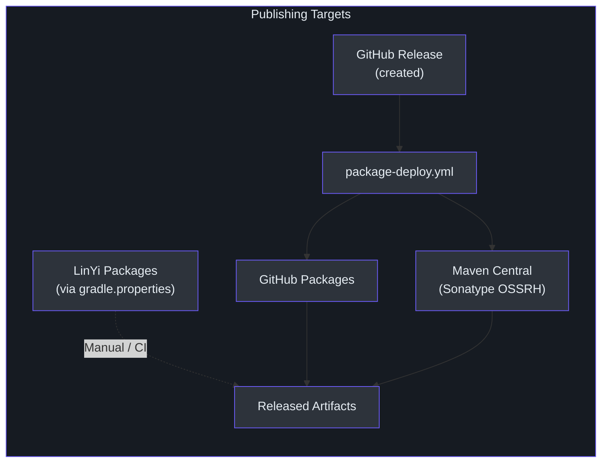
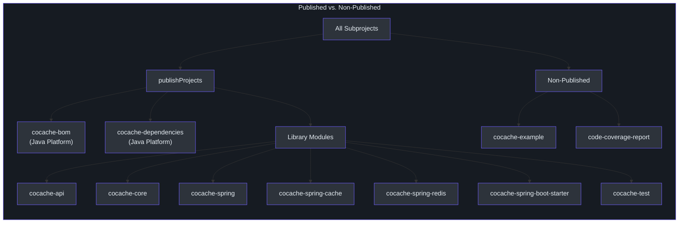
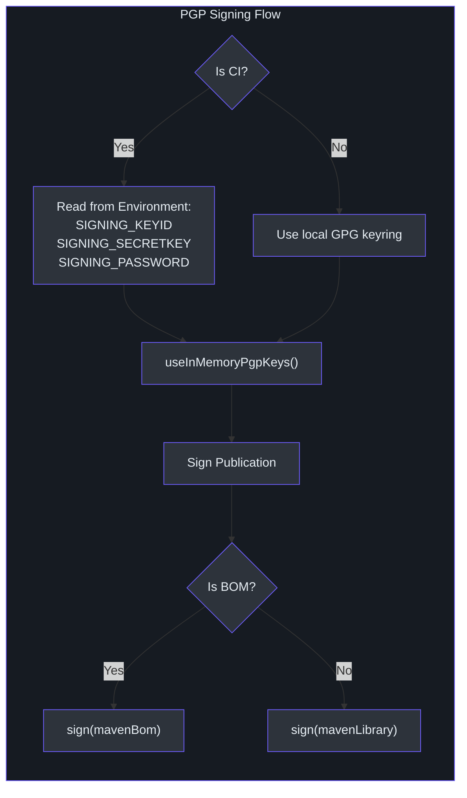
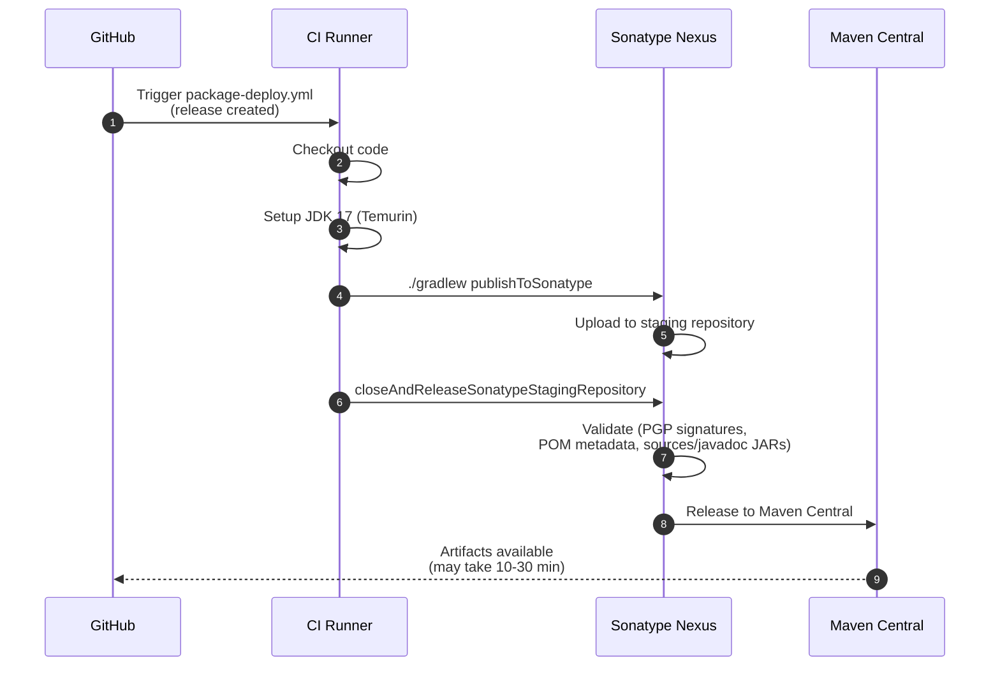
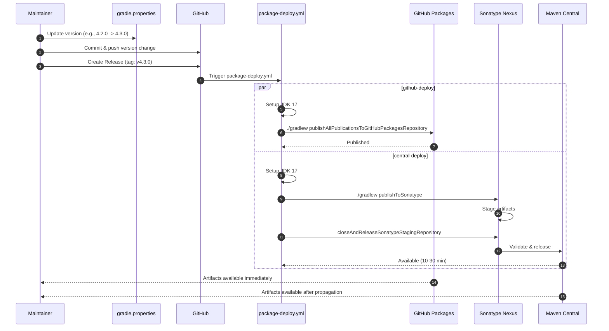

# 发布与发布管理

CoCache 发布到三个 Maven 仓库：**Maven Central**（通过 Sonatype）、**GitHub Packages** 和 **LinYi Packages**。发布过程通过 [`package-deploy.yml`](https://github.com/Ahoo-Wang/CoCache/blob/main/.github/workflows/package-deploy.yml) GitHub Actions 工作流自动完成，当创建 GitHub Release 时自动触发。

## 发布目标



| 仓库 | URL | 认证方式 | 来源 |
|------|-----|----------|------|
| GitHub Packages | `https://maven.pkg.github.com/Ahoo-Wang/CoCache` | `GITHUB_ACTOR` + `GITHUB_TOKEN` | [`build.gradle.kts:138-144`](https://github.com/Ahoo-Wang/CoCache/blob/main/build.gradle.kts#L138-L144) |
| Maven Central | `https://ossrh-staging-api.central.sonatype.com/service/local/` | `SONATYPE_USERNAME` + `SONATYPE_PASSWORD` | [`build.gradle.kts:208-215`](https://github.com/Ahoo-Wang/CoCache/blob/main/build.gradle.kts#L208-L215) |
| LinYi Packages | 从 `linyiPackageReleaseUrl` 属性读取 | `linyiPackageUsername` + `linyiPackagePwd` | [`build.gradle.kts:145-152`](https://github.com/Ahoo-Wang/CoCache/blob/main/build.gradle.kts#L145-L152) |

## 已发布模块

除 `cocache-example` 和 `code-coverage-report` 之外，所有模块都会被发布。根构建脚本定义了此分区：

```kotlin
// [build.gradle.kts:44](https://github.com/Ahoo-Wang/CoCache/blob/main/build.gradle.kts#L44)
val publishProjects = subprojects - serverProjects - codeCoverageReportProject
```



已发布模块包含 `javadocJar` 和 `sourcesJar` 构件，这是 Maven Central 的要求：

```kotlin
// [build.gradle.kts:83-86](https://github.com/Ahoo-Wang/CoCache/blob/main/build.gradle.kts#L83-L86)
configure<JavaPluginExtension> {
    withJavadocJar()
    withSourcesJar()
}
```

## Maven 发布结构

每个已发布模块根据其性质创建两种发布类型之一：

| 模块类型 | 发布名称 | 组件 | 来源 |
|----------|----------|------|------|
| BOM（Platform） | `mavenBom` | `javaPlatform` | [`build.gradle.kts:155-156`](https://github.com/Ahoo-Wang/CoCache/blob/main/build.gradle.kts#L155-L156) |
| 库 | `mavenLibrary` | `java` | [`build.gradle.kts:155-156`](https://github.com/Ahoo-Wang/CoCache/blob/main/build.gradle.kts#L155-L156) |

所有发布都包含标准化的 POM 元数据：

```kotlin
// [build.gradle.kts:157-189](https://github.com/Ahoo-Wang/CoCache/blob/main/build.gradle.kts#L157-L189)
pom {
    name.set(rootProject.name)
    description.set(getPropertyOf("description"))
    url.set(getPropertyOf("website"))
    // ... 许可证、开发者、SCM 元数据来自 gradle.properties
}
```

POM 属性来源于 [`gradle.properties`](https://github.com/Ahoo-Wang/CoCache/blob/main/gradle.properties)：

| 属性 | 值 | 来源 |
|------|-----|------|
| `group` | `me.ahoo.cocache` | [`gradle.properties:14`](https://github.com/Ahoo-Wang/CoCache/blob/main/gradle.properties#L14) |
| `version` | `4.2.0` | [`gradle.properties:15`](https://github.com/Ahoo-Wang/CoCache/blob/main/gradle.properties#L15) |
| `description` | `Level 2 Distributed Coherence Cache Framework` | [`gradle.properties:17`](https://github.com/Ahoo-Wang/CoCache/blob/main/gradle.properties#L17) |
| `website` | `https://github.com/Ahoo-Wang/CoCache` | [`gradle.properties:18`](https://github.com/Ahoo-Wang/CoCache/blob/main/gradle.properties#L18) |
| `license_name` | `The Apache Software License, Version 2.0` | [`gradle.properties:22`](https://github.com/Ahoo-Wang/CoCache/blob/main/gradle.properties#L22) |

## 版本管理

项目版本在 [`gradle.properties`](https://github.com/Ahoo-Wang/CoCache/blob/main/gradle.properties) 中集中定义：

```properties
# [gradle.properties:15](https://github.com/Ahoo-Wang/CoCache/blob/main/gradle.properties#L15)
version=4.2.0
```

所有已发布构件共享此版本。准备发布时：

1. 在 `gradle.properties` 中更新 `version` 属性
2. 提交版本变更
3. 创建一个带有对应标签的 GitHub Release（例如 `v4.2.0`）

版本号会自动写入 JAR 清单：

```kotlin
// [build.gradle.kts:65-68](https://github.com/Ahoo-Wang/CoCache/blob/main/build.gradle.kts#L65-L68)
tasks.withType<Jar> {
    manifest {
        attributes["Implementation-Title"] = project.name
        attributes["Implementation-Version"] = project.version
    }
}
```

## PGP 签名

所有已发布构件均经过 PGP 签名。签名配置在本地开发和 CI 环境之间自动适配：

```kotlin
// [build.gradle.kts:192-205](https://github.com/Ahoo-Wang/CoCache/blob/main/build.gradle.kts#L192-L205)
configure<SigningExtension> {
    val isInCI = null != System.getenv("CI")
    if (isInCI) {
        val signingKeyId = System.getenv("SIGNING_KEYID")
        val signingKey = System.getenv("SIGNING_SECRETKEY")
        val signingPassword = System.getenv("SIGNING_PASSWORD")
        useInMemoryPgpKeys(signingKeyId, signingKey, signingPassword)
    }
    if (isBom) {
        sign(publishing.publications.get("mavenBom"))
    } else {
        sign(publishing.publications.get("mavenLibrary"))
    }
}
```



### CI 所需的密钥

| 密钥 | 用途 | 使用者 |
|------|------|--------|
| `SIGNING_KEYID` | PGP 密钥标识符 | `github-deploy` 和 `central-deploy` 两个任务 |
| `SIGNING_SECRETKEY` | PGP 私钥（ASCII 装甲格式） | `github-deploy` 和 `central-deploy` 两个任务 |
| `SIGNING_PASSWORD` | PGP 密钥口令 | `github-deploy` 和 `central-deploy` 两个任务 |
| `SONATYPE_USERNAME` | Sonatype OSSRH 用户名 | 仅 `central-deploy` 任务 |
| `SONATYPE_PASSWORD` | Sonatype OSSRH 密码 | 仅 `central-deploy` 任务 |
| `GITHUB_TOKEN` | GitHub Packages 访问令牌 | `github-deploy` 任务（自动提供） |

## Nexus 发布（Maven Central）

CoCache 使用 [`io.github.gradle-nexus.publish-plugin`](https://github.com/Ahoo-Wang/CoCache/blob/main/gradle/libs.versions.toml#L16)（v2.0.0）通过 Sonatype 的 OSSRH 暂存 API 发布到 Maven Central。

```kotlin
// [build.gradle.kts:208-216](https://github.com/Ahoo-Wang/CoCache/blob/main/build.gradle.kts#L208-L216)
nexusPublishing {
    repositories {
        sonatype {
            nexusUrl.set(uri("https://ossrh-staging-api.central.sonatype.com/service/local/"))
            username.set(System.getenv("SONATYPE_USERNAME"))
            password.set(System.getenv("SONATYPE_PASSWORD"))
        }
    }
}
```

Maven Central 发布过程涉及暂存工作流：



### Maven Central 要求

Maven Central 执行严格的要求，CoCache 满足以下所有条件：

| 要求 | CoCache 的满足方式 | 来源 |
|------|-------------------|------|
| PGP 签名 | 所有发布通过 `SigningExtension` 签名 | [`build.gradle.kts:192-205`](https://github.com/Ahoo-Wang/CoCache/blob/main/build.gradle.kts#L192-L205) |
| 源码 JAR | 所有库模块启用 `withSourcesJar()` | [`build.gradle.kts:84`](https://github.com/Ahoo-Wang/CoCache/blob/main/build.gradle.kts#L84) |
| 文档 JAR | 所有库模块启用 `withJavadocJar()`（Dokka 生成 Kotlin 文档） | [`build.gradle.kts:85`](https://github.com/Ahoo-Wang/CoCache/blob/main/build.gradle.kts#L85) |
| POM 元数据 | 包含 `name`、`description`、`url`、`licenses`、`developers`、`scm` | [`build.gradle.kts:159-188`](https://github.com/Ahoo-Wang/CoCache/blob/main/build.gradle.kts#L159-L188) |
| Group ID 所有权 | `me.ahoo.cocache` 已通过 Sonatype 命名空间验证 | [`gradle.properties:14`](https://github.com/Ahoo-Wang/CoCache/blob/main/gradle.properties#L14) |

## GitHub Packages

GitHub Packages 提供了次要分发渠道，与 GitHub 仓库紧密集成。

```kotlin
// [build.gradle.kts:138-144](https://github.com/Ahoo-Wang/CoCache/blob/main/build.gradle.kts#L138-L144)
maven {
    name = "GitHubPackages"
    url = uri("https://maven.pkg.github.com/Ahoo-Wang/CoCache")
    credentials {
        username = System.getenv("GITHUB_ACTOR")
        password = System.getenv("GITHUB_TOKEN")
    }
}
```

`github-deploy` 任务发布所有构件：

```yaml
# [package-deploy.yml:37-38](https://github.com/Ahoo-Wang/CoCache/blob/main/.github/workflows/package-deploy.yml#L37-L38)
- name: Publish package
  run: ./gradlew publishAllPublicationsToGitHubPackagesRepository
```

### 从 GitHub Packages 消费

```kotlin
// build.gradle.kts（消费方项目）
repositories {
    maven {
        url = uri("https://maven.pkg.github.com/Ahoo-Wang/CoCache")
        credentials {
            username = project.findProperty("gpr.user") as String? ?: System.getenv("GITHUB_ACTOR")
            password = project.findProperty("gpr.key") as String? ?: System.getenv("GITHUB_TOKEN")
        }
    }
}
```

## LinYi Packages

LinYi Packages 是一个私有 Maven 仓库。配置从 `gradle.properties` 中读取（不提交到仓库中）：

```kotlin
// [build.gradle.kts:145-152](https://github.com/Ahoo-Wang/CoCache/blob/main/build.gradle.kts#L145-L152)
maven {
    name = "LinYiPackages"
    url = uri(project.properties["linyiPackageReleaseUrl"].toString())
    credentials {
        username = project.properties["linyiPackageUsername"]?.toString()
        password = project.properties["linyiPackagePwd"]?.toString()
    }
}
```

这些属性应在开发者本地的 `~/.gradle/gradle.properties` 中定义，或通过环境变量设置：

| 属性 | 描述 |
|------|------|
| `linyiPackageReleaseUrl` | 仓库 URL |
| `linyiPackageUsername` | 仓库用户名 |
| `linyiPackagePwd` | 仓库密码 |

## 发布工作流

从版本更新到构件可用的完整发布生命周期：



### 逐步发布流程

1. 在 [`gradle.properties`](https://github.com/Ahoo-Wang/CoCache/blob/main/gradle.properties) 中**更新版本号**：
   ```properties
   version=4.1.0
   ```
2. **提交**版本变更并推送到 `main` 分支
3. **创建 GitHub Release**，标签格式为 `v<版本号>`（例如 `v4.1.0`）
4. **等待 CI**：`package-deploy.yml` 工作流会自动触发
5. **验证**构件是否出现在 GitHub Packages 和 Maven Central 上

## 本地发布

用于本地开发和测试，将构件发布到本地 Maven 仓库：

```bash
# 将所有模块发布到 ~/.m2/repository
./gradlew publishToMavenLocal
```

这会将 `gradle.properties` 中指定版本的构件发布到 `~/.m2/repository`，允许其他本地项目无需正式发布即可消费最新的 CoCache 构件。

### 项目构建仓库

还配置了一个本地构建目录仓库，用于构建时的构件交换：

```kotlin
// [build.gradle.kts:133-136](https://github.com/Ahoo-Wang/CoCache/blob/main/build.gradle.kts#L133-L136)
maven {
    name = "projectBuildRepo"
    url = uri(layout.buildDirectory.dir("repos"))
}
```

发布到此仓库：

```bash
./gradlew publishAllPublicationsToProjectBuildRepoRepository
```

## 相关页面

- [构建与 CI 概览](/building/) -- 构建系统、Gradle 配置和质量工具
- [贡献指南](/building/contributing) -- 代码风格、测试和 PR 工作流
- [模块](/modules/) -- 模块架构和职责
- [架构](/architecture/) -- 系统架构概览
