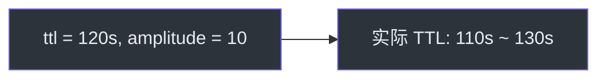

# 配置指南

本页面详细介绍 CoCache 的所有配置选项，包括注解参数和 Spring Boot 自动配置属性。

## @CoCache 注解

`@CoCache` 是核心配置注解，标记在缓存接口上，用于声明缓存的基本属性。

```kotlin
@CoCache(keyPrefix = "user:", ttl = 120, ttlAmplitude = 10)
interface UserCache : Cache<String, User>
```

| 参数 | 类型 | 说明 | 默认值 |
|------|------|------|--------|
| `name` | `String` | 缓存名称，默认取接口简单类名 | `""` |
| `keyPrefix` | `String` | 缓存键前缀，会自动拼接到键前面 | `""` |
| `keyExpression` | `String` | SpEL 表达式，用于动态生成缓存键 | `""` |
| `ttl` | `Long` | 缓存生存时间（秒），`Long.MAX_VALUE` 表示永不过期 | `Long.MAX_VALUE` |
| `ttlAmplitude` | `Long` | TTL 抖动幅度（秒），用于缓存雪崩防护 | `10` |

**源码参考**：[`cocache-api/.../annotation/CoCache.kt`](https://github.com/Ahoo-Wang/CoCache/blob/main/cocache-api/src/main/kotlin/me/ahoo/cache/api/annotation/CoCache.kt)

### TTL 抖动机制

`ttlAmplitude` 参数在缓存实际 TTL 基础上添加一个 `[-amplitude, +amplitude]` 范围内的随机偏移，防止大量缓存条目同时过期。



## @GuavaCache 注解

配置 Guava 作为 L2 客户端缓存。

```kotlin
@GuavaCache(
    maximumSize = 1_000_000,
    expireAfterAccess = 120,
    expireUnit = TimeUnit.SECONDS
)
```

| 参数 | 类型 | 说明 | 默认值 |
|------|------|------|--------|
| `initialCapacity` | `Int` | 初始容量 | `-1`（未设置） |
| `concurrencyLevel` | `Int` | 并发级别 | `-1`（未设置） |
| `maximumSize` | `Long` | 最大条目数 | `-1`（未设置） |
| `expireAfterWrite` | `Long` | 写入后过期时间 | `-1`（未设置） |
| `expireAfterAccess` | `Long` | 访问后过期时间 | `-1`（未设置） |
| `expireUnit` | `TimeUnit` | 时间单位 | `TimeUnit.SECONDS` |

**源码参考**：[`cocache-api/.../annotation/GuavaCache.kt`](https://github.com/Ahoo-Wang/CoCache/blob/main/cocache-api/src/main/kotlin/me/ahoo/cache/api/annotation/GuavaCache.kt)

## @CaffeineCache 注解

配置 Caffeine 作为 L2 客户端缓存。

```kotlin
@CaffeineCache(
    maximumSize = 1_000_000,
    expireAfterAccess = 120,
    expireUnit = TimeUnit.SECONDS
)
```

| 参数 | 类型 | 说明 | 默认值 |
|------|------|------|--------|
| `initialCapacity` | `Int` | 初始容量 | `-1`（未设置） |
| `maximumSize` | `Long` | 最大条目数 | `-1`（未设置） |
| `expireAfterWrite` | `Long` | 写入后过期时间 | `-1`（未设置） |
| `expireAfterAccess` | `Long` | 访问后过期时间 | `-1`（未设置） |
| `expireUnit` | `TimeUnit` | 时间单位 | `TimeUnit.SECONDS` |

**源码参考**：[`cocache-api/.../annotation/CaffeineCache.kt`](https://github.com/Ahoo-Wang/CoCache/blob/main/cocache-api/src/main/kotlin/me/ahoo/cache/api/annotation/CaffeineCache.kt)

## @JoinCacheable 注解

配置 JoinCache，用于跨缓存组合查询。

```kotlin
@JoinCacheable(
    firstCacheName = "UserExtendInfoCache",
    joinCacheName = "UserCache",
    joinKeyExpression = "#{#root.userId}"
)
interface UserExtendInfoJoinCache : JoinCache<String, UserExtendInfo, String, User>
```

| 参数 | 类型 | 说明 | 默认值 |
|------|------|------|--------|
| `name` | `String` | JoinCache 名称 | `""` |
| `firstCacheName` | `String` | 主缓存名称 | `""` |
| `joinCacheName` | `String` | 关联缓存名称 | `""` |
| `joinKeyExpression` | `String` | SpEL 表达式，从主值中提取关联键 | `""` |

**源码参考**：[`cocache-api/.../annotation/JoinCacheable.kt`](https://github.com/Ahoo-Wang/CoCache/blob/main/cocache-api/src/main/kotlin/me/ahoo/cache/api/annotation/JoinCacheable.kt)

## @EnableCoCache 注解

在 Spring 配置类上使用，注册缓存代理 Bean。

```kotlin
@EnableCoCache(caches = [UserCache::class, OrderCache::class])
@Configuration
class CacheConfiguration
```

| 参数 | 类型 | 说明 |
|------|------|------|
| `caches` | `Array<KClass<out Cache<*, *>>>` | 需要注册的缓存接口列表 |

## Spring Boot 自动配置

### CoCacheProperties

Spring Boot 自动配置通过 `CoCacheProperties` 提供全局配置：

```yaml
cocache:
  enabled: true  # 是否启用 CoCache，默认 true
```

**源码参考**：[`cocache-spring-boot-starter/.../CoCacheProperties.kt`](https://github.com/Ahoo-Wang/CoCache/blob/main/cocache-spring-boot-starter/src/main/kotlin/me/ahoo/cache/spring/boot/starter/CoCacheProperties.kt)

### @ConditionalOnCoCacheEnabled

当 `cocache.enabled=true` 时（默认），自动配置类生效。可通过设置 `cocache.enabled=false` 禁用 CoCache。

### 自动注册的 Bean

Spring Boot Starter 自动注册以下 Bean：

| Bean | 说明 |
|------|------|
| `CacheFactory` | 缓存工厂，管理缓存实例的创建和获取 |
| `CoherentCacheFactory` | 一致性缓存工厂 |
| `CacheEvictedEventBus` | 基于 Redis Pub/Sub 的缓存失效事件总线 |
| `ClientSideCacheFactory` | 客户端缓存工厂 |
| `DistributedCacheFactory` | 分布式缓存工厂（Redis） |
| `CacheSourceFactory` | 数据源工厂 |
| `KeyConverterFactory` | 键转换器工厂 |
| `CacheProxyFactory` | 缓存代理工厂 |
| `JoinCacheProxyFactory` | JoinCache 代理工厂 |
| `CoCacheManager` | Spring Cache 集成管理器 |
| `ClientIdGenerator` | 客户端 ID 生成器（默认使用主机名） |

## 配置示例

### 基础配置

```yaml
spring:
  data:
    redis:
      host: localhost
      port: 6379

cocache:
  enabled: true

logging:
  level:
    me.ahoo: debug
```

### Actuator 端点配置

```yaml
management:
  endpoints:
    web:
      exposure:
        include:
          - cocache
          - cocacheClient
```

### 完整缓存接口示例

```kotlin
// 使用 Guava 作为 L2 缓存
@CoCache(keyPrefix = "user:", ttl = 120, ttlAmplitude = 10)
@GuavaCache(
    maximumSize = 1_000_000,
    expireUnit = TimeUnit.SECONDS,
    expireAfterAccess = 120
)
interface UserCache : Cache<String, User>

// 使用 Caffeine 作为 L2 缓存
@CoCache(keyPrefix = "order:", ttl = 300, ttlAmplitude = 20)
@CaffeineCache(
    maximumSize = 500_000,
    expireUnit = TimeUnit.SECONDS,
    expireAfterWrite = 300
)
interface OrderCache : Cache<String, Order>
```

## 相关页面

- [介绍](./index.md) - CoCache 概述
- [快速上手](./quick-start.md) - 从零搭建项目
- [缓存层级](../architecture/cache-layers.md) - 理解 L0/L1/L2 架构
- [注解参考](../api/annotations.md) - 所有注解详解
