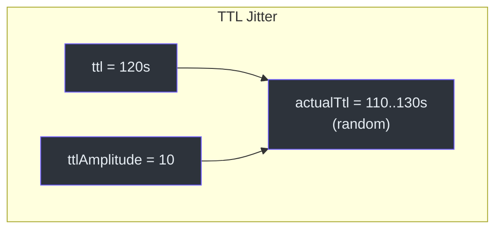
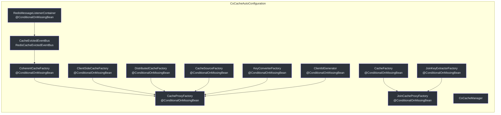
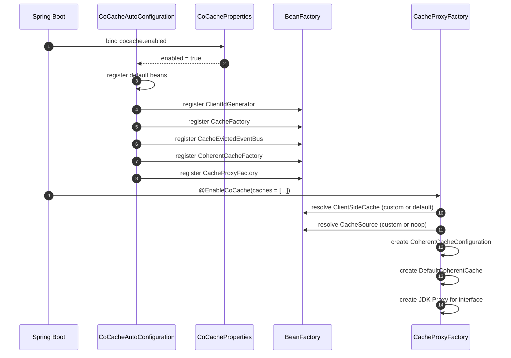

# 配置参考

本页面涵盖 CoCache 中所有可用的配置选项，包括注解参数、Spring Boot 属性和自定义 Bean 覆盖。

## @CoCache 注解

`@CoCache` 注解标记缓存接口用于基于代理的实现。它配置分布式缓存层的行为。

| 参数 | 类型 | 默认值 | 说明 | 源码 |
|------|------|--------|------|------|
| `name` | `String` | `""`（接口名） | 缓存名称，用于事件匹配和 Bean 命名 | [CoCache.kt:30](https://github.com/Ahoo-Wang/CoCache/blob/main/cocache-api/src/main/kotlin/me/ahoo/cache/api/annotation/CoCache.kt#L30) |
| `keyPrefix` | `String` | `""` | 在分布式层中预置到所有缓存键的前缀 | [CoCache.kt:31](https://github.com/Ahoo-Wang/CoCache/blob/main/cocache-api/src/main/kotlin/me/ahoo/cache/api/annotation/CoCache.kt#L31) |
| `keyExpression` | `String` | `""` | 用于键派生的 SpEL 表达式 | [CoCache.kt:33](https://github.com/Ahoo-Wang/CoCache/blob/main/cocache-api/src/main/kotlin/me/ahoo/cache/api/annotation/CoCache.kt#L33) |
| `ttl` | `Long` | `Long.MAX_VALUE` | 生存时间，单位由缓存实现指定（Redis 为秒） | [CoCache.kt:35](https://github.com/Ahoo-Wang/CoCache/blob/main/cocache-api/src/main/kotlin/me/ahoo/cache/api/annotation/CoCache.kt#L35) |
| `ttlAmplitude` | `Long` | `10` | 从 TTL 中加减的随机抖动范围，防止缓存雪崩 | [CoCache.kt:36](https://github.com/Ahoo-Wang/CoCache/blob/main/cocache-api/src/main/kotlin/me/ahoo/cache/api/annotation/CoCache.kt#L36) |

### TTL 抖动机制

`ttlAmplitude` 参数通过随机化实际 TTL 来防止缓存雪崩（大量键同时过期）：

```
actualTtl = ttl + random(-ttlAmplitude, +ttlAmplitude)
```



源码：[ComputedTtlAt.kt:49-56](https://github.com/Ahoo-Wang/CoCache/blob/main/cocache-core/src/main/kotlin/me/ahoo/cache/ComputedTtlAt.kt#L49-L56)

### 示例

```kotlin
@CoCache(keyPrefix = "user:", ttl = 120, ttlAmplitude = 10)
interface UserCache : Cache<String, User>
```

## @GuavaCache 注解

配置基于 Guava 的 `ClientSideCache`（L2 本地缓存）。

| 参数 | 类型 | 默认值 | 说明 | 源码 |
|------|------|--------|------|------|
| `initialCapacity` | `Int` | `-1`（未设置） | Guava 缓存的初始容量 | [GuavaCache.kt:30](https://github.com/Ahoo-Wang/CoCache/blob/main/cocache-api/src/main/kotlin/me/ahoo/cache/api/annotation/GuavaCache.kt#L30) |
| `concurrencyLevel` | `Int` | `-1`（未设置） | 缓存可处理的并发更新数 | [GuavaCache.kt:31](https://github.com/Ahoo-Wang/CoCache/blob/main/cocache-api/src/main/kotlin/me/ahoo/cache/api/annotation/GuavaCache.kt#L31) |
| `maximumSize` | `Long` | `-1`（未设置） | 缓存可容纳的最大条目数 | [GuavaCache.kt:32](https://github.com/Ahoo-Wang/CoCache/blob/main/cocache-api/src/main/kotlin/me/ahoo/cache/api/annotation/GuavaCache.kt#L32) |
| `expireUnit` | `TimeUnit` | `TimeUnit.SECONDS` | `expireAfterWrite` 和 `expireAfterAccess` 的时间单位 | [GuavaCache.kt:33](https://github.com/Ahoo-Wang/CoCache/blob/main/cocache-api/src/main/kotlin/me/ahoo/cache/api/annotation/GuavaCache.kt#L33) |
| `expireAfterWrite` | `Long` | `-1`（未设置） | 写入后条目过期的时间 | [GuavaCache.kt:34](https://github.com/Ahoo-Wang/CoCache/blob/main/cocache-api/src/main/kotlin/me/ahoo/cache/api/annotation/GuavaCache.kt#L34) |
| `expireAfterAccess` | `Long` | `-1`（未设置） | 最后一次访问后条目过期的时间 | [GuavaCache.kt:35](https://github.com/Ahoo-Wang/CoCache/blob/main/cocache-api/src/main/kotlin/me/ahoo/cache/api/annotation/GuavaCache.kt#L35) |

## @CaffeineCache 注解

配置基于 Caffeine 的 `ClientSideCache`（L2 本地缓存）。

| 参数 | 类型 | 默认值 | 说明 | 源码 |
|------|------|--------|------|------|
| `initialCapacity` | `Int` | `-1`（未设置） | Caffeine 缓存的初始容量 | [CaffeineCache.kt:31](https://github.com/Ahoo-Wang/CoCache/blob/main/cocache-api/src/main/kotlin/me/ahoo/cache/api/annotation/CaffeineCache.kt#L31) |
| `maximumSize` | `Long` | `-1`（未设置） | 缓存可容纳的最大条目数 | [CaffeineCache.kt:32](https://github.com/Ahoo-Wang/CoCache/blob/main/cocache-api/src/main/kotlin/me/ahoo/cache/api/annotation/CaffeineCache.kt#L32) |
| `expireUnit` | `TimeUnit` | `TimeUnit.SECONDS` | 过期设置的时间单位 | [CaffeineCache.kt:33](https://github.com/Ahoo-Wang/CoCache/blob/main/cocache-api/src/main/kotlin/me/ahoo/cache/api/annotation/CaffeineCache.kt#L33) |
| `expireAfterWrite` | `Long` | `-1`（未设置） | 写入后条目过期的时间 | [CaffeineCache.kt:34](https://github.com/Ahoo-Wang/CoCache/blob/main/cocache-api/src/main/kotlin/me/ahoo/cache/api/annotation/CaffeineCache.kt#L34) |
| `expireAfterAccess` | `Long` | `-1`（未设置） | 最后一次访问后条目过期的时间 | [CaffeineCache.kt:35](https://github.com/Ahoo-Wang/CoCache/blob/main/cocache-api/src/main/kotlin/me/ahoo/cache/api/annotation/CaffeineCache.kt#L35) |

## @JoinCacheable 注解

将缓存接口标记为 `JoinCache`，用于组合两个缓存值。

| 参数 | 类型 | 默认值 | 说明 | 源码 |
|------|------|--------|------|------|
| `firstCacheName` | `String` | `""` | 用于获取第一个值的主缓存名称 | [JoinCacheable.kt](https://github.com/Ahoo-Wang/CoCache/blob/main/cocache-api/src/main/kotlin/me/ahoo/cache/api/annotation/JoinCacheable.kt) |
| `joinCacheName` | `String` | `""` | 用于获取关联值的辅助缓存名称 | [JoinCacheable.kt](https://github.com/Ahoo-Wang/CoCache/blob/main/cocache-api/src/main/kotlin/me/ahoo/cache/api/annotation/JoinCacheable.kt) |
| `joinKeyExpression` | `String` | `""` | 从第一个值中提取关联键的 SpEL 表达式 | [JoinCacheable.kt](https://github.com/Ahoo-Wang/CoCache/blob/main/cocache-api/src/main/kotlin/me/ahoo/cache/api/annotation/JoinCacheable.kt) |

```kotlin
@JoinCacheable(
    firstCacheName = "UserExtendInfoCache",
    joinCacheName = "UserCache",
    joinKeyExpression = "#{#root.userId}"
)
interface UserExtendInfoJoinCache : JoinCache<String, UserExtendInfo, String, User>
```

源码：[cocache-example/.../cache/UserExtendInfoJoinCache.kt](https://github.com/Ahoo-Wang/CoCache/blob/main/cocache-example/src/main/kotlin/me/ahoo/cache/example/cache/UserExtendInfoJoinCache.kt)

## Spring Boot 属性

### CoCacheProperties

| 属性 | 类型 | 默认值 | 说明 | 源码 |
|------|------|--------|------|------|
| `cocache.enabled` | `Boolean` | `true` | 启用或禁用整个 CoCache 自动配置 | [CoCacheProperties.kt](https://github.com/Ahoo-Wang/CoCache/blob/main/cocache-spring-boot-starter/src/main/kotlin/me/ahoo/cache/spring/boot/starter/CoCacheProperties.kt) |

```yaml
# application.yml
cocache:
  enabled: true
```

当 `cocache.enabled` 为 `false` 时，所有 CoCache Bean 都会被跳过。条件化由 `@ConditionalOnCoCacheEnabled` 处理。

源码：[ConditionalOnCoCacheEnabled.kt](https://github.com/Ahoo-Wang/CoCache/blob/main/cocache-spring-boot-starter/src/main/kotlin/me/ahoo/cache/spring/boot/starter/ConditionalOnCoCacheEnabled.kt)

## 自动配置 Bean 注册表

`CoCacheAutoConfiguration` 类注册所有必需的 Bean。每个 Bean 都使用 `@ConditionalOnMissingBean`，意味着你可以通过声明自己的 Bean 来覆盖任何 Bean。



源码：[CoCacheAutoConfiguration.kt:61-186](https://github.com/Ahoo-Wang/CoCache/blob/main/cocache-spring-boot-starter/src/main/kotlin/me/ahoo/cache/spring/boot/starter/CoCacheAutoConfiguration.kt#L61-L186)

### 自动配置 Bean 参考

| Bean | 类型 | 条件 | 说明 |
|------|------|------|------|
| `defaultHostClientIdGenerator` | `ClientIdGenerator` | `@ConditionalOnMissingBean` | 基于主机地址生成客户端 ID |
| `cacheFactory` | `CacheFactory` | `@ConditionalOnMissingBean` | 从 Bean 工厂解析缓存实例 |
| `coCacheManager` | `CoCacheManager` | -- | 集成 Spring Cache 抽象 |
| `cocacheRedisMessageListenerContainer` | `RedisMessageListenerContainer` | `@ConditionalOnMissingBean` + `@ConditionalOnSingleCandidate` | 监听 Redis Pub/Sub 消息 |
| `cacheEvictedEventBus` | `CacheEvictedEventBus` | `@ConditionalOnMissingBean` | 通过 Redis 发布和订阅缓存失效事件 |
| `coherentCacheFactory` | `CoherentCacheFactory` | `@ConditionalOnMissingBean` | 创建 `DefaultCoherentCache` 实例 |
| `cacheSourceFactory` | `CacheSourceFactory` | `@ConditionalOnMissingBean` | 按名称解析 `CacheSource` Bean |
| `clientSideCacheFactory` | `ClientSideCacheFactory` | `@ConditionalOnMissingBean` | 从注解创建 `ClientSideCache` 实例 |
| `distributedCacheFactory` | `DistributedCacheFactory` | `@ConditionalOnMissingBean` | 创建 `RedisDistributedCache` 实例 |
| `keyConverterFactory` | `KeyConverterFactory` | `@ConditionalOnMissingBean` | 使用 SpEL 表达式转换缓存键 |
| `cacheProxyFactory` | `CacheProxyFactory` | `@ConditionalOnMissingBean` | 创建缓存接口的代理实现 |
| `joinKeyExtractorFactory` | `JoinKeyExtractorFactory` | `@ConditionalOnMissingBean` | 从 SpEL 表达式解析关联键提取器 |
| `joinCacheProxyFactory` | `JoinCacheProxyFactory` | `@ConditionalOnMissingBean` | 创建 JoinCache 接口的代理实现 |

## 自定义 Bean 覆盖

### 自定义 ClientSideCache

通过声明 Bean 来覆盖特定缓存接口的 L2 缓存：

```kotlin
@Configuration
class UserCacheConfiguration {
    @Bean
    fun customizeUserClientSideCache(): ClientSideCache<User> {
        return MapClientSideCache(ttl = 120, ttlAmplitude = 10)
    }
}
```

自动配置使用 `SpringClientSideCacheFactory`，它从 Spring `BeanFactory` 解析 Bean。如果存在匹配的 `ClientSideCache` Bean，它优先于基于注解的 Guava/Caffeine 默认值。

### 自定义 CacheSource

为特定缓存提供数据源加载器：

```kotlin
@Configuration
class UserCacheConfiguration {
    @Bean
    fun customizeUserCacheSource(): CacheSource<String, User> {
        return object : CacheSource<String, User> {
            override fun loadCacheValue(key: String): CacheValue<User>? {
                // 从数据库加载
                return database.findById(key)?.let {
                    DefaultCacheValue.forever(it)
                }
            }
        }
    }
}
```

如果没有提供 `CacheSource` Bean，缓存使用 `CacheSource.noOp()`，它始终返回 `null`。

### 自定义 DistributedCache

覆盖分布式缓存实现：

```kotlin
@Bean
fun customDistributedCache(redisTemplate: StringRedisTemplate): DistributedCache<User> {
    val codec = ObjectToJsonCodecExecutor<User>(
        User::class.java, redisTemplate, ObjectMapper()
    )
    return RedisDistributedCache(redisTemplate, codec)
}
```

### 自定义 CacheEvictedEventBus

用自定义实现替换基于 Redis 的事件总线：

```kotlin
@Bean
fun customEventBus(): CacheEvictedEventBus {
    // 自定义事件总线（例如 Kafka、RabbitMQ）
    return MyCustomEventBus()
}
```

## 配置流程



## CosID 集成

当 CosId 库位于类路径上且存在 `HostAddressSupplier` Bean 时，自动配置会注册一个 `HostClientIdGenerator`，使用 CosId 的主机地址进行客户端 ID 生成。

```kotlin
@Configuration
@ConditionalOnClass(HostAddressSupplier::class)
class CosIdHostAddressSupplierAutoConfiguration {
    @Bean
    @ConditionalOnBean(HostAddressSupplier::class)
    fun inetUtilsHostClientIdGenerator(
        hostAddressSupplier: HostAddressSupplier
    ): ClientIdGenerator {
        return HostClientIdGenerator {
            hostAddressSupplier.hostAddress
        }
    }
}
```

源码：[CoCacheAutoConfiguration.kt:175-185](https://github.com/Ahoo-Wang/CoCache/blob/main/cocache-spring-boot-starter/src/main/kotlin/me/ahoo/cache/spring/boot/starter/CoCacheAutoConfiguration.kt#L175-L185)

## 相关页面

- [介绍](./index.md) -- 架构概览和核心特性
- [快速上手](./quick-start.md) -- 几分钟内完成配置并创建第一个缓存
- [测试概览](../testing/index.md) -- TCK 测试规范与测试模式
- [性能模式](../testing/performance-patterns.md) -- TTL 抖动和缓存击穿详情
