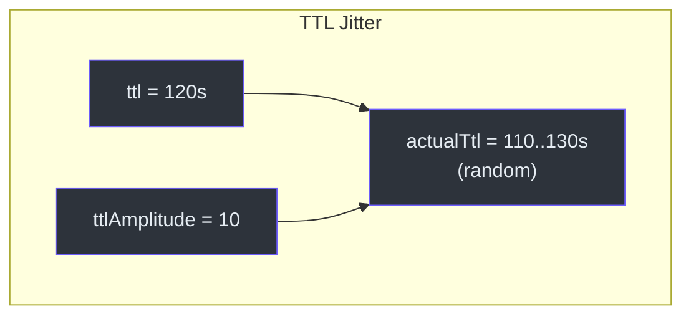
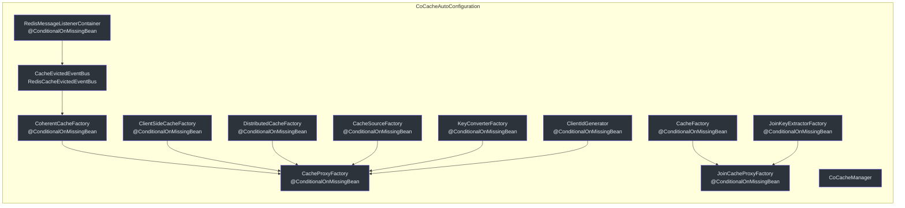
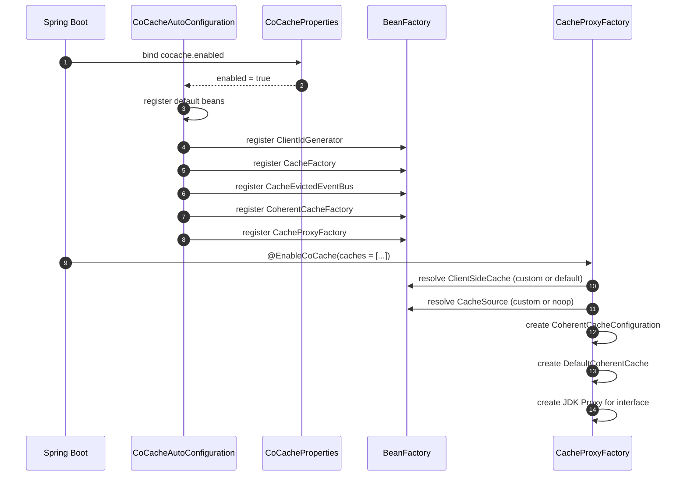

# 配置参考

本页面涵盖 CoCache 中所有可用的配置选项，包括注解参数、Spring Boot 属性和自定义 Bean 覆盖。

## @CoCache 注解

`@CoCache` 注解标记缓存接口用于基于代理的实现。它配置分布式缓存层的行为。

| 参数 | 类型 | 默认值 | 说明 | 源码 |
|------|------|--------|------|------|
| `name` | `String` | `""`（接口名） | 缓存名称，用于事件频道和 Bean 命名 | [CoCache.kt](https://github.com/Ahoo-Wang/CoCache/blob/main/cocache-api/src/main/kotlin/me/ahoo/cache/api/annotation/CoCache.kt) |
| `keyPrefix` | `String` | `""`（→ `cocache:{cacheName}:`） | 所有存储 key 的前缀；支持 Spring 占位符 | [CoCache.kt](https://github.com/Ahoo-Wang/CoCache/blob/main/cocache-api/src/main/kotlin/me/ahoo/cache/api/annotation/CoCache.kt) |
| `keyExpression` | `String` | `""` | 用于派生 key 的 SpEL 模板 | [CoCache.kt](https://github.com/Ahoo-Wang/CoCache/blob/main/cocache-api/src/main/kotlin/me/ahoo/cache/api/annotation/CoCache.kt) |
| `ttl` | `Long` | `3600` | 命中值 TTL（秒），`TtlAt.FOREVER` 表示永不过期 | [CoCache.kt](https://github.com/Ahoo-Wang/CoCache/blob/main/cocache-api/src/main/kotlin/me/ahoo/cache/api/annotation/CoCache.kt) |
| `ttlAmplitude` | `Long` | `60` | 命中值 TTL 的随机抖动（± 秒），防止缓存雪崩 | [CoCache.kt](https://github.com/Ahoo-Wang/CoCache/blob/main/cocache-api/src/main/kotlin/me/ahoo/cache/api/annotation/CoCache.kt) |
| `missingTtl` | `Long` | `60` | 负缓存 TTL（秒，`CacheSource` 返回 `null` 时） | [CoCache.kt](https://github.com/Ahoo-Wang/CoCache/blob/main/cocache-api/src/main/kotlin/me/ahoo/cache/api/annotation/CoCache.kt) |

### 如何选择 TTL

- `ttl` 决定残留不一致最多能存活多久。cache-aside 竞态（慢回源覆盖了 L1 中的并发更新）只能靠过期修复。除非每个写入方都可靠地调用 `evict`，否则请保持 `ttl` 有限。
- `missingTtl` 决定一次“不存在”查询被缓存后，新建数据最多多久不可见。请保持它较短。

### TTL 抖动机制

`ttlAmplitude` 参数通过随机化实际 TTL 来防止缓存雪崩（大量键同时过期）：

```
actualTtl = ttl + random(-ttlAmplitude, +ttlAmplitude)
```


```mermaid
graph LR
    subgraph ttl_jitter ["TTL Jitter"]
        direction LR
        TTL["ttl = 120s"]
        Amp["ttlAmplitude = 10"]
        Result["actualTtl = 110..130s<br>(random)"]
    end

    TTL --> Result
    Amp --> Result

    style TTL fill:#2d333b,stroke:#6d5dfc,color:#e6edf3
    style Amp fill:#2d333b,stroke:#6d5dfc,color:#e6edf3
    style Result fill:#2d333b,stroke:#6d5dfc,color:#e6edf3
```

源码：[TtlAt.kt](https://github.com/Ahoo-Wang/CoCache/blob/main/cocache-api/src/main/kotlin/me/ahoo/cache/api/TtlAt.kt)、[TtlPolicy.kt](https://github.com/Ahoo-Wang/CoCache/blob/main/cocache-core/src/main/kotlin/me/ahoo/cache/TtlPolicy.kt)

### 示例

```kotlin
@CoCache(keyPrefix = "user:", ttl = 120, ttlAmplitude = 10)
interface UserCache : Cache<String, User>
```

## @CaffeineCache 注解

配置默认 L2（`CaffeineClientSideCache`）。该注解可选，不标注时使用下列默认值。条目在自身 `ttlAt` 到期。

| 参数 | 类型 | 默认值 | 说明 | 源码 |
|------|------|--------|------|------|
| `initialCapacity` | `Int` | `-1`（未设置） | 初始容量 | [CaffeineCache.kt](https://github.com/Ahoo-Wang/CoCache/blob/main/cocache-api/src/main/kotlin/me/ahoo/cache/api/annotation/CaffeineCache.kt) |
| `maximumSize` | `Long` | `10000` | 最大条目数（L2 始终有界） | [CaffeineCache.kt](https://github.com/Ahoo-Wang/CoCache/blob/main/cocache-api/src/main/kotlin/me/ahoo/cache/api/annotation/CaffeineCache.kt) |
| `expireAfterAccess` | `Long` | `0`（不启用） | 自最近一次访问起的空闲淘汰 | [CaffeineCache.kt](https://github.com/Ahoo-Wang/CoCache/blob/main/cocache-api/src/main/kotlin/me/ahoo/cache/api/annotation/CaffeineCache.kt) |
| `expireUnit` | `TimeUnit` | `SECONDS` | `expireAfterAccess` 的单位 | [CaffeineCache.kt](https://github.com/Ahoo-Wang/CoCache/blob/main/cocache-api/src/main/kotlin/me/ahoo/cache/api/annotation/CaffeineCache.kt) |

## @JoinCacheable 注解

将缓存接口标记为 `JoinCache`，用于组合两个缓存值。

| 参数 | 类型 | 默认值 | 说明 | 源码 |
|------|------|--------|------|------|
| `firstCacheName` | `String` | `""` | 用于获取第一个值的主缓存名称 | [JoinCacheable.kt](https://github.com/Ahoo-Wang/CoCache/blob/main/cocache-api/src/main/kotlin/me/ahoo/cache/api/annotation/JoinCacheable.kt) |
| `joinCacheName` | `String` | `""` | 用于获取关联值的辅助缓存名称 | [JoinCacheable.kt](https://github.com/Ahoo-Wang/CoCache/blob/main/cocache-api/src/main/kotlin/me/ahoo/cache/api/annotation/JoinCacheable.kt) |
| `joinKeyExpression` | `String` | `""` | 从第一个值中提取关联键的 SpEL 表达式 | [JoinCacheable.kt](https://github.com/Ahoo-Wang/CoCache/blob/main/cocache-api/src/main/kotlin/me/ahoo/cache/api/annotation/JoinCacheable.kt) |

```kotlin
@JoinCacheable(
    firstCacheName = "UserExtendInfoCache",
    joinCacheName = "UserCache",
    joinKeyExpression = "#{#root.userId}"
)
interface UserExtendInfoJoinCache : JoinCache<String, UserExtendInfo, String, User>
```

源码：[cocache-example/.../cache/UserExtendInfoJoinCache.kt](https://github.com/Ahoo-Wang/CoCache/blob/main/cocache-example/src/main/kotlin/me/ahoo/cache/example/cache/UserExtendInfoJoinCache.kt)

## Spring Boot 属性

### CoCacheProperties

| 属性 | 类型 | 默认值 | 说明 | 源码 |
|------|------|--------|------|------|
| `cocache.enabled` | `Boolean` | `true` | 启用或禁用整个 CoCache 自动配置 | [CoCacheProperties.kt](https://github.com/Ahoo-Wang/CoCache/blob/main/cocache-spring-boot-starter/src/main/kotlin/me/ahoo/cache/spring/boot/starter/CoCacheProperties.kt) |
| `cocache.redis.strict-failure` | `Boolean` | `false` | Redis 故障策略：`false` = 降级（读回源、写仅告警）；`true` = 重抛 `DataAccessException` | [CoCacheProperties.kt](https://github.com/Ahoo-Wang/CoCache/blob/main/cocache-spring-boot-starter/src/main/kotlin/me/ahoo/cache/spring/boot/starter/CoCacheProperties.kt) |
| `cocache.redis.missing-guard-sentinel` | `String` | `"_nil_"` | 自定义 Redis codec 负缓存哨兵值（约束见下文） | [CoCacheProperties.kt](https://github.com/Ahoo-Wang/CoCache/blob/main/cocache-spring-boot-starter/src/main/kotlin/me/ahoo/cache/spring/boot/starter/CoCacheProperties.kt) |

```yaml
# application.yml
cocache:
  enabled: true
  redis:
    strict-failure: false
    missing-guard-sentinel: "_nil_"
```

当 `cocache.enabled` 为 `false` 时，所有 CoCache Bean 都会被跳过。条件化由 `@ConditionalOnCoCacheEnabled` 处理。

源码：[ConditionalOnCoCacheEnabled.kt](https://github.com/Ahoo-Wang/CoCache/blob/main/cocache-spring-boot-starter/src/main/kotlin/me/ahoo/cache/spring/boot/starter/ConditionalOnCoCacheEnabled.kt)

#### Redis 故障降级

`RedisDistributedCache` 对 Redis 故障降级处理，不向业务调用方传播异常：

- **读失败** → 按缓存未命中处理：一致性缓存回退到数据源回源，Redis 故障或主从切换期间业务调用不受影响。
- **写 / evict 失败** → 记录 `WARN` 后吞掉——缓存写入失败不会阻断业务写路径。
- 失效事件发布路径（`RedisCacheEvictedEventBus`）同样降级（pub/sub 本就是 fire-and-forget）。

设置 `cocache.redis.strict-failure=true` 改为传播异常。注意：降级启用时，故障期间本地 L2 未命中的 key 每进程每客户端 TTL 窗口至多回源一次——请据此规划数据源容量。这两个属性仅作用于自动装配（fallback）创建的缓存；自定义 `DistributedCache` Bean 自行管理其策略。

#### 负缓存哨兵

Redis codec 用哨兵值 `"_nil_"` 标记负缓存条目。若业务数据可能合法地等于哨兵（外部写入者写入的精确 `"_nil_"` 字符串、单元素 `{"_nil_"}` 集合或单 `"_nil_"` 键的 Map），可配置自定义哨兵：

```yaml
cocache:
  redis:
    missing-guard-sentinel: "\u0000myapp:nil"
```

约束：

- 自定义哨兵与默认哨兵**互不识别**——切换需全集群同时变更（滚动升级期间旧实例会把新哨兵误读为真实值）。
- 取值不得等于任何合法的业务序列化值，且不得为空白（绑定时 fail-fast）。
- 进程内的负缓存是显式的 `MissingValue` 类型，哨兵只存在于 Redis 中。

## 自动配置 Bean 注册表

`CoCacheAutoConfiguration` 类注册所有必需的 Bean。每个 Bean 都使用 `@ConditionalOnMissingBean`，意味着你可以通过声明自己的 Bean 来覆盖任何 Bean。


```mermaid
graph TB
    subgraph autoconfig ["CoCacheAutoConfiguration"]
        direction TB
        ClientId["ClientIdGenerator<br>@ConditionalOnMissingBean"]
        CacheFact["CacheFactory<br>@ConditionalOnMissingBean"]
        CoCacheMgr["CoCacheManager"]
        RedisContainer["RedisMessageListenerContainer<br>@ConditionalOnMissingBean"]
        EventBus["CacheEvictedEventBus<br>RedisCacheEvictedEventBus"]
        CoherentFact["CoherentCacheFactory<br>@ConditionalOnMissingBean"]
        CacheSrcFact["CacheSourceFactory<br>@ConditionalOnMissingBean"]
        CSCFact["ClientSideCacheFactory<br>@ConditionalOnMissingBean"]
        DistFact["DistributedCacheFactory<br>@ConditionalOnMissingBean"]
        KeyConvFact["KeyConverterFactory<br>@ConditionalOnMissingBean"]
        ProxyFact["CacheProxyFactory<br>@ConditionalOnMissingBean"]
        JoinKeyFact["JoinKeyExtractorFactory<br>@ConditionalOnMissingBean"]
        JoinProxyFact["JoinCacheProxyFactory<br>@ConditionalOnMissingBean"]
    end

    RedisContainer --> EventBus
    EventBus --> CoherentFact
    CoherentFact --> ProxyFact
    CSCFact --> ProxyFact
    DistFact --> ProxyFact
    CacheSrcFact --> ProxyFact
    KeyConvFact --> ProxyFact
    ClientId --> ProxyFact
    CacheFact --> JoinProxyFact
    JoinKeyFact --> JoinProxyFact

    style ClientId fill:#2d333b,stroke:#6d5dfc,color:#e6edf3
    style CacheFact fill:#2d333b,stroke:#6d5dfc,color:#e6edf3
    style CoCacheMgr fill:#2d333b,stroke:#6d5dfc,color:#e6edf3
    style RedisContainer fill:#2d333b,stroke:#6d5dfc,color:#e6edf3
    style EventBus fill:#2d333b,stroke:#6d5dfc,color:#e6edf3
    style CoherentFact fill:#2d333b,stroke:#6d5dfc,color:#e6edf3
    style CacheSrcFact fill:#2d333b,stroke:#6d5dfc,color:#e6edf3
    style CSCFact fill:#2d333b,stroke:#6d5dfc,color:#e6edf3
    style DistFact fill:#2d333b,stroke:#6d5dfc,color:#e6edf3
    style KeyConvFact fill:#2d333b,stroke:#6d5dfc,color:#e6edf3
    style ProxyFact fill:#2d333b,stroke:#6d5dfc,color:#e6edf3
    style JoinKeyFact fill:#2d333b,stroke:#6d5dfc,color:#e6edf3
    style JoinProxyFact fill:#2d333b,stroke:#6d5dfc,color:#e6edf3
```

源码：[CoCacheAutoConfiguration.kt:61-186](https://github.com/Ahoo-Wang/CoCache/blob/main/cocache-spring-boot-starter/src/main/kotlin/me/ahoo/cache/spring/boot/starter/CoCacheAutoConfiguration.kt#L61-L186)

### 自动配置 Bean 参考

| Bean | 类型 | 条件 | 说明 |
|------|------|------|------|
| `defaultHostClientIdGenerator` | `ClientIdGenerator` | `@ConditionalOnMissingBean` | 基于主机地址生成客户端 ID |
| `cacheFactory` | `CacheFactory` | `@ConditionalOnMissingBean` | 从 Bean 工厂解析缓存实例 |
| `coCacheManager` | `CoCacheManager` | -- | 集成 Spring Cache 抽象 |
| `cocacheRedisMessageListenerContainer` | `RedisMessageListenerContainer` | `@ConditionalOnMissingBean` + `@ConditionalOnSingleCandidate` | 监听 Redis Pub/Sub 消息 |
| `cacheEvictedEventBus` | `CacheEvictedEventBus` | `@ConditionalOnMissingBean` | 通过 Redis 发布和订阅缓存失效事件 |
| `coherentCacheFactory` | `CoherentCacheFactory` | `@ConditionalOnMissingBean` | 创建 `DefaultCoherentCache` 实例 |
| `cacheSourceFactory` | `CacheSourceFactory` | `@ConditionalOnMissingBean` | 先按名称、再按唯一类型解析 `CacheSource` Bean |
| `clientSideCacheFactory` | `ClientSideCacheFactory` | `@ConditionalOnMissingBean` | 解析 `{cacheName}.ClientSideCache`，或按 `@CaffeineCache` 构建 Caffeine |
| `distributedCacheFactory` | `DistributedCacheFactory` | `@ConditionalOnMissingBean` | 创建 `RedisDistributedCache` 实例 |
| `keyConverterFactory` | `KeyConverterFactory` | `@ConditionalOnMissingBean` | 使用 SpEL 表达式转换缓存键 |
| `cacheProxyFactory` | `CacheProxyFactory` | `@ConditionalOnMissingBean` | 创建缓存接口的代理实现 |
| `joinKeyExtractorFactory` | `JoinKeyExtractorFactory` | `@ConditionalOnMissingBean` | 从 SpEL 表达式解析关联键提取器 |
| `joinCacheProxyFactory` | `JoinCacheProxyFactory` | `@ConditionalOnMissingBean` | 创建 JoinCache 接口的代理实现 |

## 自定义 Bean 覆盖

### 自定义 ClientSideCache

声明名为 `{cacheName}.ClientSideCache` 的 Bean，覆盖特定缓存接口的 L2：

```kotlin
@Configuration
class UserCacheConfiguration {
    @Bean("UserCache.ClientSideCache")
    fun userClientSideCache(): ClientSideCache<User> {
        return CaffeineClientSideCache.build(maximumSize = 100_000, expireAfterAccess = Duration.ofMinutes(10))
    }
}
```

有状态组件（`ClientSideCache`、`DistributedCache`、`KeyConverter`）**只按 Bean 名称解析**。如果按类型匹配，值类型相同的所有缓存会共享同一个 Bean：一个缓存 `clear()` 会清掉其它缓存，key 前缀也会冲突。

### 自定义 CacheSource

为特定缓存提供数据源加载器：

```kotlin
@Configuration
class UserCacheConfiguration {
    @Bean
    fun customizeUserCacheSource(): CacheSource<String, User> {
        // 返回 null → 以 missingTtl 写入负缓存
        return CacheSource { key -> database.findById(key)?.let { CacheValue.forever(it) } }
    }
}
```

`CacheSource` 先按名称 `{cacheName}.CacheSource` 解析，再按唯一的 `CacheSource<K, V>` 类型 Bean 解析（数据源无状态，可以安全共享）；都没有时使用 `CacheSource.noOp()`。

### 自定义 DistributedCache

声明名为 `{cacheName}.DistributedCache` 的 Bean，覆盖分布式缓存实现：

```kotlin
@Bean("UserCache.DistributedCache")
fun customDistributedCache(redisTemplate: StringRedisTemplate): DistributedCache<User> {
    val codec = ObjectToJsonCodecExecutor<User>(
        User::class.java, redisTemplate, ObjectMapper()
    )
    return RedisDistributedCache(redisTemplate, codec)
}
```

### 自定义 CacheEvictedEventBus

用自定义实现替换基于 Redis 的事件总线。实现必须在每次（重新）建立订阅时调用 `CacheEvictedSubscriber.onReset()`，因为未订阅期间发送的事件已经丢失：

```kotlin
@Bean
fun customEventBus(): CacheEvictedEventBus {
    // 自定义事件总线（例如 Kafka、RabbitMQ）
    return MyCustomEventBus()
}
```

## 配置流程


```mermaid
sequenceDiagram
autonumber
    participant App as Spring Boot
    participant Auto as CoCacheAutoConfiguration
    participant Prop as CoCacheProperties
    participant Bean as BeanFactory
    participant Proxy as CacheProxyFactory

    App->>Prop: bind cocache.enabled
    Prop-->>Auto: enabled = true
    Auto->>Auto: register default beans
    Auto->>Bean: register ClientIdGenerator
    Auto->>Bean: register CacheFactory
    Auto->>Bean: register CacheEvictedEventBus
    Auto->>Bean: register CoherentCacheFactory
    Auto->>Bean: register CacheProxyFactory
    App->>Proxy: @EnableCoCache(caches = [...])
    Proxy->>Bean: resolve ClientSideCache (custom or default)
    Proxy->>Bean: resolve CacheSource (custom or noop)
    Proxy->>Proxy: create CoherentCacheConfiguration
    Proxy->>Proxy: create DefaultCoherentCache
    Proxy->>Proxy: create JDK Proxy for interface

```

## CosID 集成

当 CosId 库位于类路径上且存在 `HostAddressSupplier` Bean 时，自动配置会注册一个 `HostClientIdGenerator`，使用 CosId 的主机地址进行客户端 ID 生成。

```kotlin
@Configuration
@ConditionalOnClass(HostAddressSupplier::class)
class CosIdHostAddressSupplierAutoConfiguration {
    @Bean
    @ConditionalOnBean(HostAddressSupplier::class)
    fun inetUtilsHostClientIdGenerator(
        hostAddressSupplier: HostAddressSupplier
    ): ClientIdGenerator {
        return HostClientIdGenerator {
            hostAddressSupplier.hostAddress
        }
    }
}
```

源码：[CoCacheAutoConfiguration.kt:175-185](https://github.com/Ahoo-Wang/CoCache/blob/main/cocache-spring-boot-starter/src/main/kotlin/me/ahoo/cache/spring/boot/starter/CoCacheAutoConfiguration.kt#L175-L185)

## 相关页面

- [介绍](./index.md) -- 架构概览和核心特性
- [快速上手](./quick-start.md) -- 几分钟内完成配置并创建第一个缓存
- [测试概览](../testing/index.md) -- TCK 测试规范与测试模式
- [性能模式](../testing/performance-patterns.md) -- TTL 抖动和缓存击穿详情
