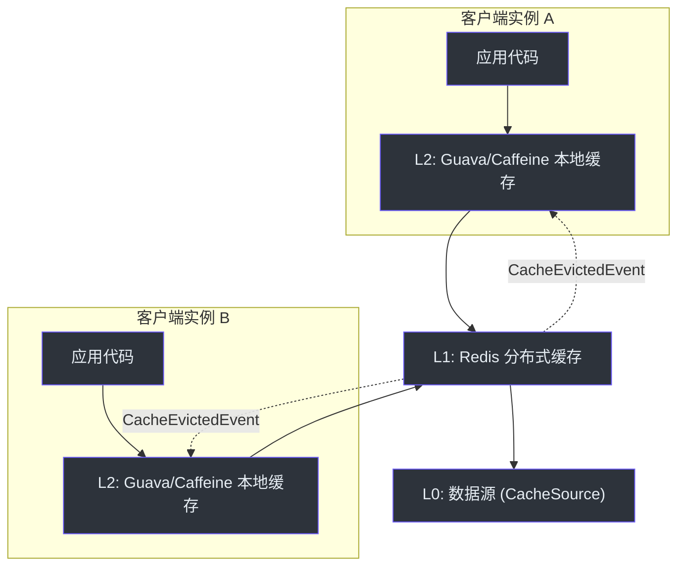

# CoCache 介绍

CoCache 是一个**二级分布式一致性缓存框架**（Level 2 Distributed Coherence Cache），专为 Java/Kotlin 设计。它将本地内存缓存与分布式缓存相结合，通过事件驱动机制实现跨实例的缓存一致性。

## 核心理念

在现代分布式系统中，单一缓存层级难以同时满足低延迟和数据一致性要求。CoCache 通过二级缓存架构解决这一矛盾：

- **L2 客户端缓存**：本地内存（Guava / Caffeine / Map），提供微秒级访问延迟
- **L1 分布式缓存**：Redis 等共享缓存层，提供跨实例数据共享
- **L0 数据源**：数据库或其他持久化存储（`CacheSource`），作为最终数据来源



## 主要特性

### 二级缓存架构

自动管理 L2（本地）和 L1（分布式）两层缓存的数据流转。读取时依次查询 L2 -> L1 -> L0（数据源），写入时同时更新两层。

### 事件驱动一致性

通过 `CacheEvictedEventBus` 发布 `CacheEvictedEvent`，当某个实例修改缓存时，所有其他实例自动失效其本地缓存条目。

### 注解驱动配置

使用 `@CoCache`、`@GuavaCache`、`@CaffeineCache`、`@JoinCacheable` 等注解声明式配置缓存行为，无需手动编写缓存管理代码。

### 缓存击穿防护

细粒度的逐键锁（per-key locking）配合双重检查模式，在缓存未命中时防止惊群效应（thundering herd）。

### TTL 抖动

通过 `ttlAmplitude` 参数自动对 TTL 添加随机偏移，防止大量缓存条目同时过期导致的缓存雪崩。

### 缓存穿透防护

`MissingGuard` 机制缓存空值，`KeyFilter`（支持布隆过滤器）预先过滤不存在的键，防止对数据源的无效查询。

### JoinCache

支持跨缓存的组合查询——从一个缓存获取主值，提取关联键后从另一个缓存获取关联值，组合成 `JoinValue` 返回。

## 快速概览

```kotlin
// 1. 定义缓存接口
@CoCache(keyPrefix = "user:", ttl = 120)
@GuavaCache(maximumSize = 1000_000, expireAfterAccess = 120)
interface UserCache : Cache<String, User>

// 2. 启用 CoCache
@EnableCoCache(caches = [UserCache::class])
@SpringBootApplication
class AppServer

// 3. 注入使用
@Autowired
lateinit var userCache: UserCache

fun getUser(userId: String): User? {
    return userCache[userId]
}
```

## 相关页面

- [快速上手](./quick-start.md) - 从零开始搭建 CoCache 项目
- [配置指南](./configuration.md) - 详细的配置参数说明
- [架构概览](../architecture/index.md) - 深入了解系统架构
- [API 概览](../api/index.md) - 核心接口与注解参考
