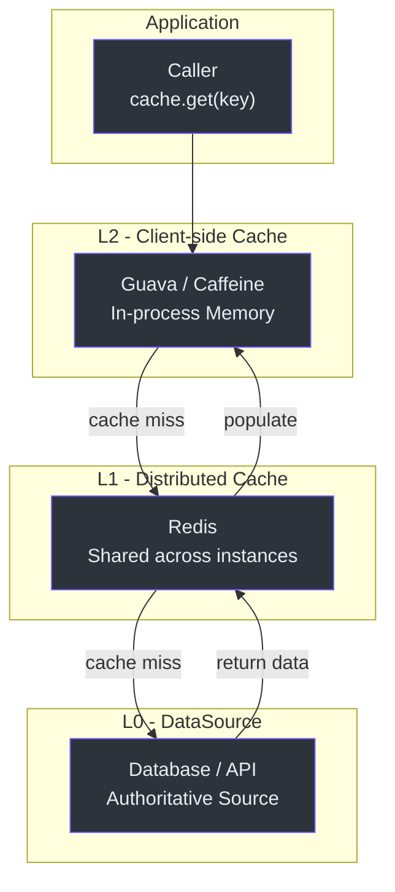
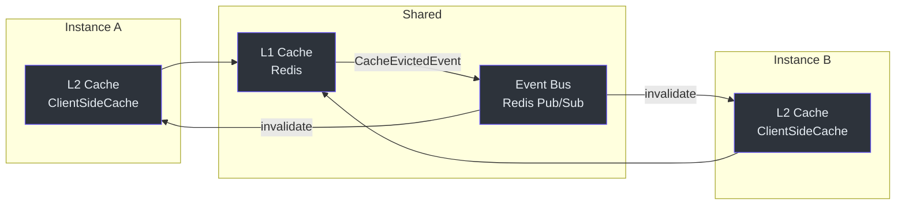
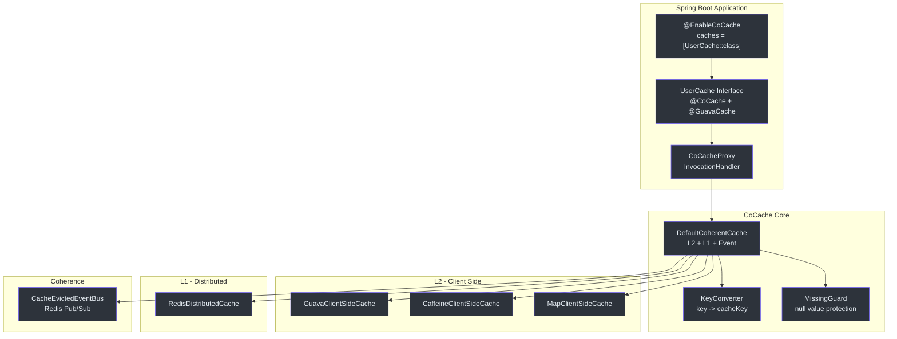
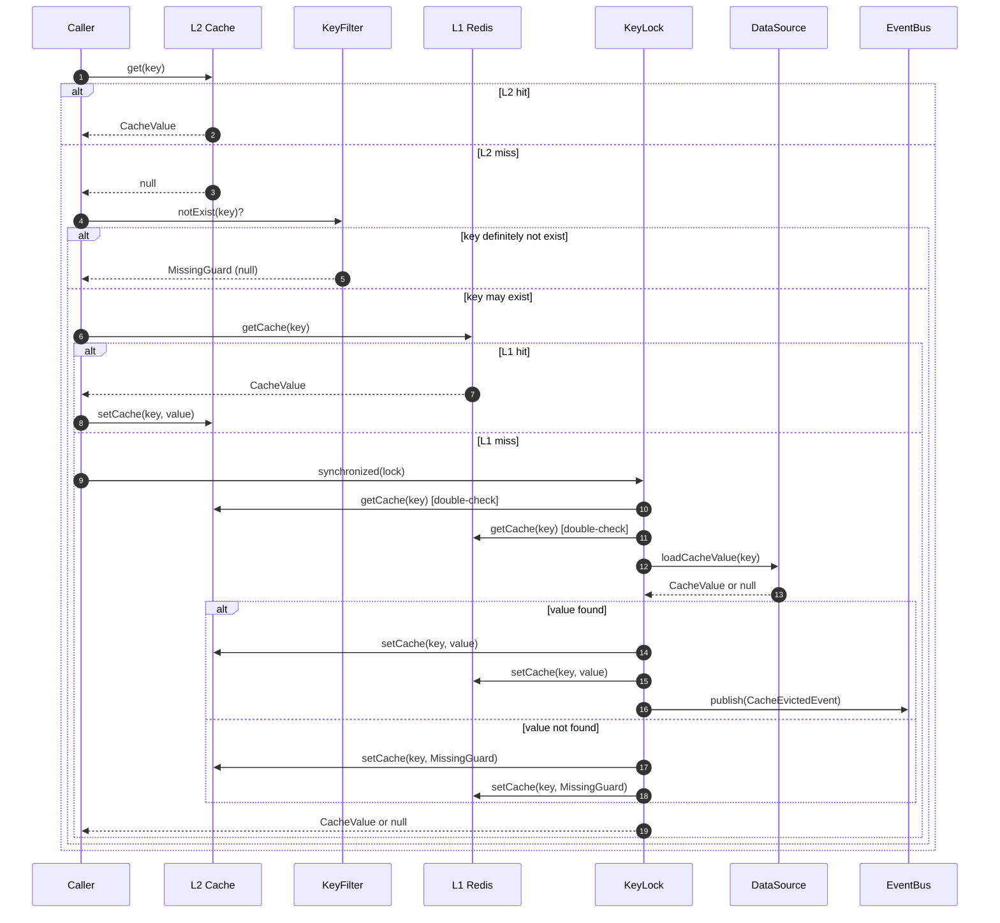

# CoCache 介绍

**CoCache** 是一个面向 Java/Kotlin 的**二级分布式一致性缓存框架**，提供基于事件驱动一致性的两级缓存架构。它以 `me.ahoo.cocache` 为组织标识发布，当前版本为 **4.0.2**。

CoCache 位于应用与数据源之间，增加两层缓存 -- 本地内存 L2 缓存（Guava 或 Caffeine）和共享的分布式 L1 缓存（Redis） -- 同时通过事件总线保持所有实例间的缓存一致性。

## 三级缓存概念

CoCache 实现了三级数据访问模型：

| 层级 | 名称 | 位置 | 用途 | 源码 |
|------|------|------|------|------|
| L2 | 客户端缓存 | 进程内（Guava / Caffeine） | 最快访问，每实例独立 | [cocache-api/.../client/ClientSideCache.kt](https://github.com/Ahoo-Wang/CoCache/blob/main/cocache-api/src/main/kotlin/me/ahoo/cache/api/client/ClientSideCache.kt) |
| L1 | 分布式缓存 | 共享（Redis） | 跨实例一致性 | [cocache-api/.../distributed/DistributedCache.kt](https://github.com/Ahoo-Wang/CoCache/blob/main/cocache-api/src/main/kotlin/me/ahoo/cache/api/distributed/DistributedCache.kt) |
| L0 | 数据源 | 原始数据（数据库、API） | 权威数据来源 | [cocache-api/.../source/CacheSource.kt](https://github.com/Ahoo-Wang/CoCache/blob/main/cocache-api/src/main/kotlin/me/ahoo/cache/api/source/CacheSource.kt) |





## 核心特性

| 特性 | 说明 | 源码 |
|------|------|------|
| 二级缓存 | L2（本地）+ L1（分布式），配合细粒度锁 | [DefaultCoherentCache.kt:89-135](https://github.com/Ahoo-Wang/CoCache/blob/main/cocache-core/src/main/kotlin/me/ahoo/cache/consistency/DefaultCoherentCache.kt#L89-L135) |
| 事件驱动一致性 | `CacheEvictedEventBus` 实现分布式缓存失效 | [CacheEvictedEventBus.kt](https://github.com/Ahoo-Wang/CoCache/blob/main/cocache-core/src/main/kotlin/me/ahoo/cache/consistency/CacheEvictedEventBus.kt) |
| 注解驱动配置 | `@CoCache`、`@GuavaCache`、`@CaffeineCache`、`@JoinCacheable` | [cocache-api/.../annotation/](https://github.com/Ahoo-Wang/CoCache/blob/main/cocache-api/src/main/kotlin/me/ahoo/cache/api/annotation/) |
| JoinCache | 将多个缓存值组合为单一结果 | [JoinCache.kt](https://github.com/Ahoo-Wang/CoCache/blob/main/cocache-api/src/main/kotlin/me/ahoo/cache/api/join/JoinCache.kt) |
| 缓存击穿防护 | 逐键同步锁防止惊群效应 | [DefaultCoherentCache.kt:78-86](https://github.com/Ahoo-Wang/CoCache/blob/main/cocache-core/src/main/kotlin/me/ahoo/cache/consistency/DefaultCoherentCache.kt#L78-L86) |
| 缓存穿透防护 | `MissingGuard` 缓存空值，防止重复击穿数据库 | [MissingGuard.kt](https://github.com/Ahoo-Wang/CoCache/blob/main/cocache-core/src/main/kotlin/me/ahoo/cache/MissingGuard.kt) |
| 布隆过滤器 | 可选的布隆过滤器阻止对不存在键的查询 | [BloomKeyFilter.kt](https://github.com/Ahoo-Wang/CoCache/blob/main/cocache-core/src/main/kotlin/me/ahoo/cache/filter/BloomKeyFilter.kt) |
| TTL 抖动 | 随机 TTL 幅度防止缓存雪崩 | [ComputedTtlAt.kt:49-56](https://github.com/Ahoo-Wang/CoCache/blob/main/cocache-core/src/main/kotlin/me/ahoo/cache/ComputedTtlAt.kt#L49-L56) |
| 代理式缓存 | 运行时通过动态代理实现缓存接口 | [CoCacheProxy.kt](https://github.com/Ahoo-Wang/CoCache/blob/main/cocache-core/src/main/kotlin/me/ahoo/cache/proxy/CoCacheProxy.kt) |
| Spring Boot Starter | 自动配置与条件化 Bean 注册 | [CoCacheAutoConfiguration.kt:61-186](https://github.com/Ahoo-Wang/CoCache/blob/main/cocache-spring-boot-starter/src/main/kotlin/me/ahoo/cache/spring/boot/starter/CoCacheAutoConfiguration.kt#L61-L186) |

## 架构概览



## 缓存流转



## 模块架构

| 模块 | 说明 | 源码 |
|------|------|------|
| `cocache-api` | 核心接口（`Cache`、`CacheValue`、`ClientSideCache`、`CacheSource`） | [cocache-api/](https://github.com/Ahoo-Wang/CoCache/tree/main/cocache-api) |
| `cocache-core` | 默认实现（`DefaultCoherentCache`、代理式缓存） | [cocache-core/](https://github.com/Ahoo-Wang/CoCache/tree/main/cocache-core) |
| `cocache-spring` | Spring 集成（`@EnableCoCache`、FactoryBean） | [cocache-spring/](https://github.com/Ahoo-Wang/CoCache/tree/main/cocache-spring) |
| `cocache-spring-redis` | Redis 分布式缓存实现 | [cocache-spring-redis/](https://github.com/Ahoo-Wang/CoCache/tree/main/cocache-spring-redis) |
| `cocache-spring-cache` | Spring Cache 抽象桥接 | [cocache-spring-cache/](https://github.com/Ahoo-Wang/CoCache/tree/main/cocache-spring-cache) |
| `cocache-spring-boot-starter` | Spring Boot 自动配置 | [cocache-spring-boot-starter/](https://github.com/Ahoo-Wang/CoCache/tree/main/cocache-spring-boot-starter) |
| `cocache-test` | 共享测试规范（TCK） | [cocache-test/](https://github.com/Ahoo-Wang/CoCache/tree/main/cocache-test) |
| `cocache-example` | 示例应用 | [cocache-example/](https://github.com/Ahoo-Wang/CoCache/tree/main/cocache-example) |
| `cocache-bom` | Bill of Materials | [cocache-bom/](https://github.com/Ahoo-Wang/CoCache/tree/main/cocache-bom) |
| `cocache-dependencies` | 集中式版本目录 | [cocache-dependencies/](https://github.com/Ahoo-Wang/CoCache/tree/main/cocache-dependencies) |

## 项目信息

| 属性 | 值 | 源码 |
|------|-----|------|
| Group | `me.ahoo.cocache` | [gradle.properties:14](https://github.com/Ahoo-Wang/CoCache/blob/main/gradle.properties#L14) |
| Version | `4.0.2` | [gradle.properties:15](https://github.com/Ahoo-Wang/CoCache/blob/main/gradle.properties#L15) |
| License | Apache License 2.0 | [gradle.properties:23](https://github.com/Ahoo-Wang/CoCache/blob/main/gradle.properties#L23) |
| JDK | 17+（通过 `jvmToolchain`） | [build.gradle.kts](https://github.com/Ahoo-Wang/CoCache/blob/main/build.gradle.kts) |
| Gradle | 9.4.1（wrapper） | [gradle/wrapper/gradle-wrapper.properties](https://github.com/Ahoo-Wang/CoCache/blob/main/gradle/wrapper/gradle-wrapper.properties) |

## 快速示例

```kotlin
// 1. 定义缓存接口
@CoCache(keyPrefix = "user:", ttl = 120)
@GuavaCache(
    maximumSize = 1_000_000,
    expireUnit = TimeUnit.SECONDS,
    expireAfterAccess = 120
)
interface UserCache : Cache<String, User>

// 2. 启用缓存
@EnableCoCache(caches = [UserCache::class])
@SpringBootApplication
class AppServer

// 3. 使用缓存
@RestController
class UserController(private val userCache: UserCache) {
    @GetMapping("{id}")
    fun get(@PathVariable id: String): User? = userCache[id]
}
```

## 相关页面

- [快速上手](./quick-start.md) -- 几分钟内完成配置并创建第一个缓存
- [配置参考](./configuration.md) -- 所有注解参数和配置属性
- [测试概览](../testing/index.md) -- TCK 测试规范与测试模式
- [性能模式](../testing/performance-patterns.md) -- 缓存击穿、穿透和雪崩防护
