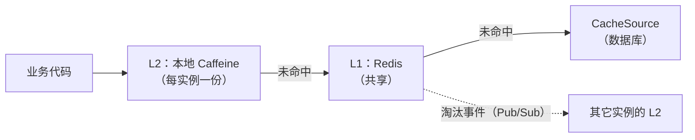

# 介绍

CoCache 是面向 Spring Boot 上 Java/Kotlin 应用的二级一致性缓存。你把缓存声明为一个接口，CoCache 生成实现，并让进程内副本（L2）与共享的 Redis 副本（L1）在服务的所有实例间保持一致。

## 要解决的问题

进程内缓存读取最快，但每个实例各有一份副本：一个实例修改数据后，其它实例仍在返回旧值。Redis 这样的共享缓存解决了这个问题，代价是每次读取一次网络往返。

CoCache 两者兼用，并把它们连接起来：

```mermaid
flowchart LR
    App["业务代码"] --> L2["L2：本地 Caffeine<br>（每实例一份）"]
    L2 -- 未命中 --> L1["L1：Redis<br>（共享）"]
    L1 -- 未命中 --> Src["CacheSource<br>（数据库）"]
    L1 -. "淘汰事件（Pub/Sub）" .-> Peers["其它实例的 L2"]
```

- 读取依次尝试 L2、L1、`CacheSource`；每一级未命中都会回填上一级。
- 任一实例的写入或淘汰会发布事件，其它实例随即丢弃各自的 L2 副本。
- 同一 key 的并发未命中共享一次加载，热点 key 过期时不会击穿数据库。

## 能得到什么

| 关注点 | CoCache 的做法 |
|--------|----------------|
| 读取延迟 | L2 命中是一次进程内查找；L1 命中是一次 Redis 往返 |
| 跨实例的陈旧副本 | 写入与淘汰广播淘汰事件，其它实例丢弃 L2 副本 |
| 事件丢失（Redis 重连） | 事件通道每次（重新）订阅都清空 L2 |
| 缓存击穿 | 同一 key 的并发未命中在每个实例内合并为一次加载 |
| 缓存穿透（查询不存在的 key） | `CacheSource` 返回 `null` 时写入负缓存，保留 `missingTtl` 秒 |
| 缓存雪崩（大量 key 同时过期） | 每个 TTL 带 `±ttlAmplitude` 秒的随机抖动 |
| Redis 故障 | 默认读取回源、写入仅告警 |

## 一致性保证

CoCache 用有限的陈旧度换取延迟，并明确说明上限：

- **陈旧度有上界。** 每个值在 `ttl`（默认 1 小时）后过期，负缓存在 `missingTtl`（默认 60 秒）后过期。这就是任何不一致的持续上限。
- **失效不会因竞态丢失。** 在淘汰之前开始的慢加载，无法在淘汰之后把旧值写回。每次写回都会检查加载期间是否发生过失效。
- **本实例读己之写。** `evict(key)` 或 `set(key, …)` 返回后，同一实例不会再返回之前的值。

CoCache **不**提供跨实例的强一致（线性一致）读：其它实例在淘汰事件到达后（通常为毫秒级）才看到变化。还有一个所有 cache-aside 方案共有的竞态：更新前读到数据库的加载，可能在更新的淘汰之后才写入 Redis。有限的 `ttl` 会修复它。精确模型见[一致性](../architecture/consistency.md)。

## 何时使用

适合使用 CoCache 的场景：

- 服务有多个实例，访问共享数据；
- 读远多于写；
- 写入后其它实例晚几毫秒看到变化是可以接受的。

不适合的场景：

- 每次读取都必须看到最新提交的写入（直接读数据库或加锁）；
- 数据几乎每次读取都在变化，缓存收益很小；
- 值太大，无法在每个实例的内存中各存一份。

## 下一步

- [快速上手](./quick-start.md)：五步把 CoCache 接入应用。
- [配置](./configuration.md)：TTL、L2 容量、按缓存定制组件与属性。
- [架构](../architecture/index.md)：CoCache 的内部构成。
