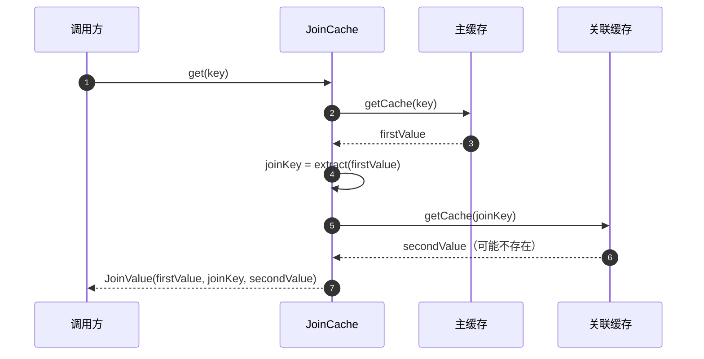

# JoinCache

`JoinCache` 先从一个缓存读值，从中取出 key，再用这个 key 读第二个缓存，一次调用返回两者。典型场景如“订单 + 其客户”“扩展资料 + 其用户”。两个缓存各自保留生命周期、TTL 与失效。



## 声明

两个组成缓存都必须是普通的 CoCache 缓存。三个接口都要列入 `@EnableCoCache`：

```kotlin
data class UserExtendInfo(val id: String, val userId: String)

@CoCache(keyPrefix = "userExtendInfo:")
interface UserExtendInfoCache : Cache<String, UserExtendInfo>

@CoCache(keyPrefix = "user:")
interface UserCache : Cache<String, User>

@JoinCacheable(
    firstCacheName = "UserExtendInfoCache",
    joinCacheName = "UserCache",
    joinKeyExpression = "#{#root.userId}",   // 以主值为根对象求值
)
interface UserExtendInfoJoinCache : JoinCache<String, UserExtendInfo, String, User>

@EnableCoCache(caches = [UserExtendInfoCache::class, UserCache::class, UserExtendInfoJoinCache::class])
```

`joinKeyExpression` 是 SpEL 模板，仅当关联 key 类型为 `String` 时可用。其它 key 类型请留空，并提供一个 `JoinKeyExtractor<V1, K2>` bean：命名为 `{name}.JoinKeyExtractor`（`{name}` 是 JoinCache 自身的名称），或让它成为该泛型类型的唯一 bean。

```kotlin
@Bean("UserExtendInfoJoinCache.JoinKeyExtractor")
fun userIdExtractor() = JoinKeyExtractor<UserExtendInfo, String> { it.userId }
```

## 语义

| 操作 | 行为 |
|------|------|
| `get(key)` / `getCache(key)` | 读主缓存（未命中时由其数据源加载）。主值为负缓存时，结果也是负缓存；否则读关联缓存。关联值缺失时 `secondValue = null` |
| 结果的 `ttlAt` | 两个值中较早的到期时间 |
| `set(key, joinValue)` | 写入主值，以及存在时的关联值，各自使用所属缓存的 TTL 策略 |
| `evict(key)` | **只**淘汰主缓存。关联值被其它条目共享，由它自己的写入方负责 |
| `evict(firstKey, joinKey)` | 两者都淘汰 |

JoinCache 本身不增加一致性逻辑，失效经由两个组成缓存传递。`User` 变化时，从 `UserCache` 中淘汰它，所有读取它的组合在下次调用时都会看到新值。
