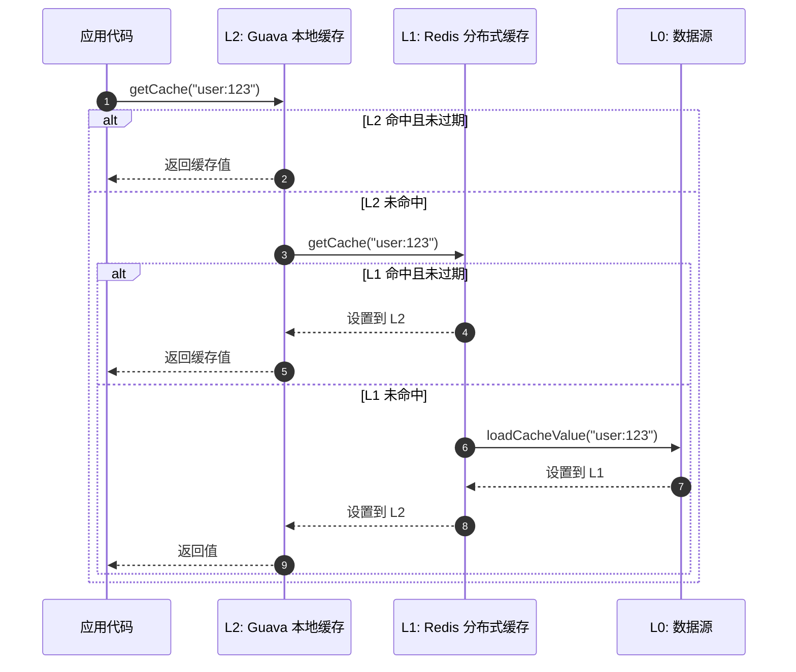

# 快速上手

本指南帮助你从零开始在项目中集成 CoCache 二级分布式缓存框架。

## 前置要求

- **JDK 17+**
- **Gradle 9.4.1+**（或 Maven 3.9+）
- **Redis** 实例（用于 L1 分布式缓存）
- **Spring Boot 3.x**（使用 Spring Boot Starter 时）

## 添加依赖

### Gradle (Kotlin DSL)

使用 BOM 统一管理版本：

```kotlin
dependencies {
    implementation(platform("me.ahoo.cococache:cocache-bom:latest.version"))
    implementation("me.ahoo.cococache:cocache-spring-boot-starter")
}
```

### Maven

```xml
<dependencyManagement>
    <dependencies>
        <dependency>
            <groupId>me.ahoo.cococache</groupId>
            <artifactId>cocache-bom</artifactId>
            <version>latest.version</version>
            <type>pom</type>
            <scope>import</scope>
        </dependency>
    </dependencies>
</dependencyManagement>

<dependencies>
    <dependency>
        <groupId>me.ahoo.cococache</groupId>
        <artifactId>cocache-spring-boot-starter</artifactId>
    </dependency>
</dependencies>
```

## 配置 Redis

在 `application.yaml` 中配置 Redis 连接：

```yaml
spring:
  data:
    redis:
      host: localhost
      port: 6379

cocache:
  enabled: true
```

## 定义缓存接口

创建一个继承 `Cache<K, V>` 的接口，并使用 `@CoCache` 注解标记：

```kotlin
import me.ahoo.cache.api.Cache
import me.ahoo.cache.api.annotation.CoCache
import me.ahoo.cache.api.annotation.GuavaCache
import java.util.concurrent.TimeUnit

@CoCache(keyPrefix = "user:", ttl = 120)
@GuavaCache(
    maximumSize = 1_000_000,
    expireUnit = TimeUnit.SECONDS,
    expireAfterAccess = 120
)
interface UserCache : Cache<String, User>
```

`@CoCache` 注解参数说明：

| 参数 | 说明 | 默认值 |
|------|------|--------|
| `name` | 缓存名称（默认取接口名） | `""` |
| `keyPrefix` | 缓存键前缀 | `""` |
| `keyExpression` | SpEL 键表达式 | `""` |
| `ttl` | 生存时间（秒） | `Long.MAX_VALUE` |
| `ttlAmplitude` | TTL 随机抖动幅度（秒） | `10` |

`@GuavaCache` 注解参数说明：

| 参数 | 说明 | 默认值 |
|------|------|--------|
| `initialCapacity` | 初始容量 | `-1`（未设置） |
| `maximumSize` | 最大条目数 | `-1`（未设置） |
| `expireAfterAccess` | 访问后过期时间 | `-1`（未设置） |
| `expireAfterWrite` | 写入后过期时间 | `-1`（未设置） |
| `expireUnit` | 时间单位 | `TimeUnit.SECONDS` |

## 启用 CoCache

在 Spring Boot 应用上使用 `@EnableCoCache` 注解：

```kotlin
import me.ahoo.cache.spring.EnableCoCache
import org.springframework.boot.autoconfigure.SpringBootApplication
import org.springframework.boot.runApplication

@EnableCoCache(caches = [UserCache::class])
@SpringBootApplication
class AppServer

fun main(args: Array<String>) {
    runApplication<AppServer>(*args)
}
```

## 使用缓存

注入缓存接口后即可直接使用：

```kotlin
import org.springframework.stereotype.Service

@Service
class UserService(
    private val userCache: UserCache
) {
    fun getUser(userId: String): User? {
        // 读取缓存：L2 -> L1 -> 数据源
        return userCache[userId]
    }

    fun setUser(userId: String, user: User) {
        // 写入缓存：同时写入 L2 和 L1
        userCache[userId] = user
    }

    fun evictUser(userId: String) {
        // 驱逐缓存：清除 L2 和 L1，并发布 CacheEvictedEvent
        userCache.evict(userId)
    }
}
```

## 自定义数据源

如果需要从数据库加载缓存值，可以自定义 `CacheSource` Bean：

```kotlin
import me.ahoo.cache.api.source.CacheSource
import me.ahoo.cache.api.CacheValue
import me.ahoo.cache.DefaultCacheValue
import org.springframework.context.annotation.Bean
import org.springframework.context.annotation.Configuration

@Configuration
class UserCacheConfiguration {

    @Bean
    fun userCacheSource(userRepository: UserRepository): CacheSource<String, User> {
        return CacheSource { key ->
            val user = userRepository.findById(key).orElse(null)
            user?.let { DefaultCacheValue.forever(it) }
        }
    }
}
```

Bean 名称需要与缓存接口名称匹配（例如 `UserCache` 对应 Bean 名称为 `userCacheSource`）。

## 自定义客户端缓存

可以通过定义 `ClientSideCache` Bean 来替换默认的客户端缓存实现：

```kotlin
import me.ahoo.cache.api.client.ClientSideCache
import me.ahoo.cache.client.MapClientSideCache
import me.ahoo.cache.annotation.CoCacheMetadata
import org.springframework.beans.factory.annotation.Qualifier
import org.springframework.context.annotation.Bean
import org.springframework.context.annotation.Configuration

@Configuration
class UserCacheConfiguration {

    @Bean
    fun customizeUserClientSideCache(
        @Qualifier("UserCache.CacheMetadata")
        cacheMetadata: CoCacheMetadata
    ): ClientSideCache<User> {
        return MapClientSideCache(
            ttl = cacheMetadata.ttl,
            ttlAmplitude = cacheMetadata.ttlAmplitude
        )
    }
}
```

## 运行效果

应用启动后，CoCache 自动完成以下工作：

1. 为 `UserCache` 接口创建 JDK 动态代理
2. 初始化 Guava 本地缓存（L2）
3. 初始化 Redis 分布式缓存（L1）
4. 注册 Redis Pub/Sub 监听器用于缓存一致性



## 相关页面

- [介绍](./index.md) - CoCache 概述
- [配置指南](./configuration.md) - 详细配置参数
- [核心接口](../api/core-interfaces.md) - 接口参考
- [注解参考](../api/annotations.md) - 注解详解
