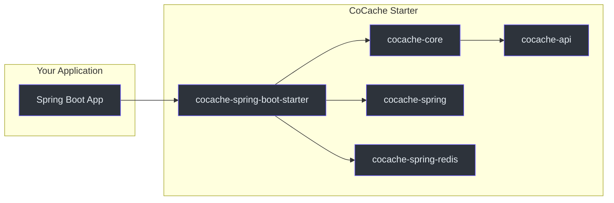
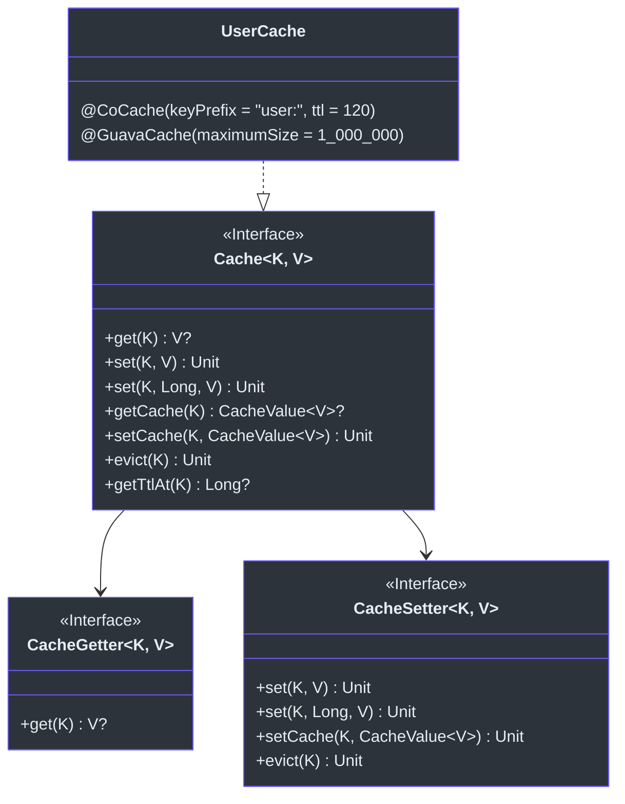
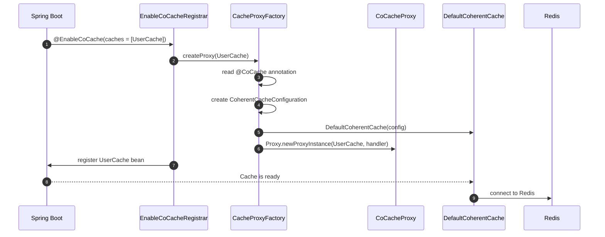
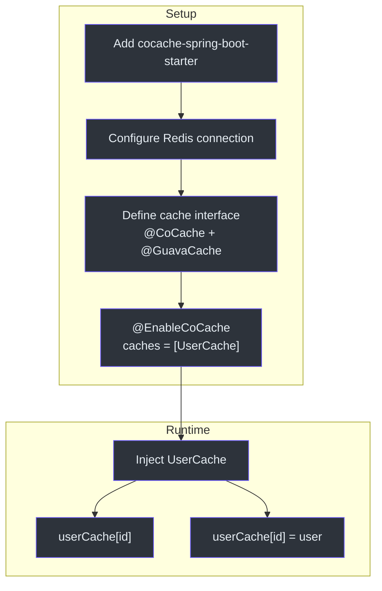

# 快速上手

本指南将帮助你在 Spring Boot 应用中添加 CoCache、定义缓存接口并连接到 Redis。

## 前置要求

- JDK 17 或更高版本
- Spring Boot 3.x 项目
- 运行中的 Redis 实例（用于分布式缓存层）

## 第一步：添加依赖

### Gradle (Kotlin DSL)

```kotlin
// build.gradle.kts
dependencies {
    implementation("me.ahoo.cocache:cocache-spring-boot-starter:4.0.2")
    implementation("org.springframework.boot:spring-boot-starter-data-redis")
}
```

### Gradle (Groovy DSL)

```groovy
dependencies {
    implementation 'me.ahoo.cocache:cocache-spring-boot-starter:4.0.2'
    implementation 'org.springframework.boot:spring-boot-starter-data-redis'
}
```

### Maven

```xml
<dependency>
    <groupId>me.ahoo.cocache</groupId>
    <artifactId>cocache-spring-boot-starter</artifactId>
    <version>4.0.2</version>
</dependency>
<dependency>
    <groupId>org.springframework.boot</groupId>
    <artifactId>spring-boot-starter-data-redis</artifactId>
</dependency>
```

`cocache-spring-boot-starter` 会传递性地引入 `cocache-core`、`cocache-spring` 和 `cocache-spring-redis`。



## 第二步：配置 Redis

在 `application.yml` 中设置 Redis 连接属性：

```yaml
spring:
  data:
    redis:
      host: localhost
      port: 6379
      # password: your-password
      # database: 0
```

## 第三步：定义缓存接口

创建一个继承 `Cache<K, V>` 的 Kotlin 接口并使用 `@CoCache` 注解标记。注解参数配置分布式缓存行为。



### 基本缓存接口

```kotlin
import me.ahoo.cache.api.Cache
import me.ahoo.cache.api.annotation.CoCache
import me.ahoo.cache.api.annotation.GuavaCache
import java.util.concurrent.TimeUnit

@CoCache(keyPrefix = "user:", ttl = 120)
@GuavaCache(
    maximumSize = 1_000_000,
    expireUnit = TimeUnit.SECONDS,
    expireAfterAccess = 120
)
interface UserCache : Cache<String, User>
```

源码：[cocache-example/.../cache/UserCache.kt](https://github.com/Ahoo-Wang/CoCache/blob/main/cocache-example/src/main/kotlin/me/ahoo/cache/example/cache/UserCache.kt)

缓存接口在运行时由 `CoCacheProxy` 通过动态代理自动实现。你不需要编写任何实现代码。

### 模型类

```kotlin
data class User(val id: String, val name: String)
```

源码：[cocache-example/.../model/User.kt](https://github.com/Ahoo-Wang/CoCache/blob/main/cocache-example/src/main/kotlin/me/ahoo/cache/example/model/User.kt)

## 第四步：启用 CoCache

在 Spring Boot 应用类上添加 `@EnableCoCache` 注解并列出要注册的缓存接口：

```kotlin
import me.ahoo.cache.spring.EnableCoCache
import org.springframework.boot.autoconfigure.SpringBootApplication
import org.springframework.boot.runApplication

@EnableCoCache(caches = [UserCache::class])
@SpringBootApplication
class AppServer

fun main(args: Array<String>) {
    runApplication<AppServer>(*args)
}
```

源码：[cocache-example/.../AppServer.kt](https://github.com/Ahoo-Wang/CoCache/blob/main/cocache-example/src/main/kotlin/me/ahoo/cache/example/AppServer.kt)



## 第五步：使用缓存

将缓存接口注入到任何 Spring 管理的 Bean 中并直接使用：

```kotlin
@RestController
@RequestMapping("test")
class TestController(private val userCache: UserCache) {

    @GetMapping("{id}")
    fun get(@PathVariable id: String): User? {
        return userCache[id]
    }

    @PostMapping("{id}")
    fun set(@PathVariable id: String): String {
        val user = User(id, UUID.randomUUID().toString())
        userCache[user.id] = user
        return user.id
    }
}
```

源码：[cocache-example/.../controller/TestController.kt](https://github.com/Ahoo-Wang/CoCache/blob/main/cocache-example/src/main/kotlin/me/ahoo/cache/example/controller/TestController.kt)

## 第六步（可选）：自定义 ClientSideCache 和 CacheSource

你可以通过声明匹配名称的 Bean 来为每个缓存接口自定义 L2 缓存和数据源：

```kotlin
@Configuration
class UserCacheConfiguration {
    @Bean
    fun customizeUserClientSideCache(): ClientSideCache<User> {
        return MapClientSideCache(ttl = 120, ttlAmplitude = 10)
    }

    @Bean
    fun customizeUserCacheSource(): CacheSource<String, User> {
        return CacheSource.noOp()  // 无数据源回退
    }
}
```

源码：[cocache-example/.../config/UserCacheConfiguration.kt](https://github.com/Ahoo-Wang/CoCache/blob/main/cocache-example/src/main/kotlin/me/ahoo/cache/example/config/UserCacheConfiguration.kt)

如果不提供自定义 Bean，自动配置使用默认值：
- **ClientSideCache**：基于 Guava（如果存在 `@GuavaCache`）或基于 Caffeine（如果存在 `@CaffeineCache`）
- **CacheSource**：需要一个 `CacheSource` Bean，否则回退到 `CacheSource.noOp()`

## 第七步（可选）：编程式 CoherentCache

对于高级用例，你可以通过编程方式创建 `CoherentCache` 实例：

```kotlin
@Configuration
class ClassDefinedCacheConfiguration {
    @Bean("userCache")
    fun userCache(
        redisTemplate: StringRedisTemplate,
        coherentCacheFactory: CoherentCacheFactory,
        objectMapper: ObjectMapper,
        clientIdGenerator: ClientIdGenerator
    ): CoherentCache<String, User> {
        val codecExecutor = ObjectToJsonCodecExecutor<User>(
            User::class.java, redisTemplate, objectMapper
        )
        val distributedCache: DistributedCache<User> =
            RedisDistributedCache(redisTemplate, codecExecutor)

        return coherentCacheFactory.create(
            CoherentCacheConfiguration(
                cacheName = "userCache",
                clientId = clientIdGenerator.generate(),
                keyConverter = ToStringKeyConverter("user:"),
                distributedCache = distributedCache,
                clientSideCache = GuavaClientSideCache(
                    CacheBuilder.newBuilder()
                        .expireAfterAccess(Duration.ofHours(1))
                        .build<String, CacheValue<User>>()
                )
            )
        )
    }
}
```

源码：[cocache-example/.../config/ClassDefinedCacheConfiguration.kt](https://github.com/Ahoo-Wang/CoCache/blob/main/cocache-example/src/main/kotlin/me/ahoo/cache/example/config/ClassDefinedCacheConfiguration.kt)

## 完整流程图



## 可用缓存操作

| 操作 | 方法 | 说明 | 源码 |
|------|------|------|------|
| 读取 | `cache[key]` | 通过 L2 -> L1 -> DataSource 获取值 | [CacheGetter.kt](https://github.com/Ahoo-Wang/CoCache/blob/main/cocache-api/src/main/kotlin/me/ahoo/cache/api/CacheGetter.kt) |
| 写入 | `cache[key] = value` | 同时写入 L2 和 L1，发布驱逐事件 | [CacheSetter.kt](https://github.com/Ahoo-Wang/CoCache/blob/main/cocache-api/src/main/kotlin/me/ahoo/cache/api/CacheSetter.kt) |
| 带 TTL 写入 | `cache[key, ttl] = value` | 使用自定义 TTL 和可选幅度设置 | [CacheSetter.kt](https://github.com/Ahoo-Wang/CoCache/blob/main/cocache-api/src/main/kotlin/me/ahoo/cache/api/CacheSetter.kt) |
| 驱逐 | `cache.evict(key)` | 从 L2 和 L1 中移除，发布驱逐事件 | [DefaultCoherentCache.kt:151-156](https://github.com/Ahoo-Wang/CoCache/blob/main/cocache-core/src/main/kotlin/me/ahoo/cache/consistency/DefaultCoherentCache.kt#L151-L156) |
| 获取 TTL | `cache.getTtlAt(key)` | 返回该键的过期时间戳 | [CacheGetter.kt](https://github.com/Ahoo-Wang/CoCache/blob/main/cocache-api/src/main/kotlin/me/ahoo/cache/api/CacheGetter.kt) |

## 相关页面

- [介绍](./index.md) -- 架构概览和核心特性
- [配置参考](./configuration.md) -- 所有注解参数和配置属性
- [测试概览](../testing/index.md) -- TCK 测试规范
- [单元测试](../testing/unit-testing.md) -- 使用缓存规范基类编写测试
