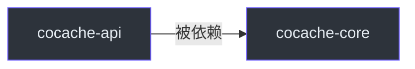

# cocache-api

`cocache-api` 是 CoCache 的最底层模块，定义了所有核心接口和注解。此模块不包含任何实现代码，仅定义契约。

## 依赖关系



此模块零外部依赖，仅依赖 Kotlin 标准库和 JDK。

## 包结构

```
me.ahoo.cache.api
├── Cache.kt                 # 基础缓存接口
├── CacheGetter.kt           # 缓存读取接口
├── CacheSetter.kt           # 缓存写入接口
├── CacheValue.kt            # 缓存值包装接口
├── TtlAt.kt                 # TTL 管理接口
├── NamedCache.kt            # 命名缓存接口
├── annotation/
│   ├── CoCache.kt           # @CoCache 注解
│   ├── GuavaCache.kt        # @GuavaCache 注解
│   ├── CaffeineCache.kt     # @CaffeineCache 注解
│   └── JoinCacheable.kt     # @JoinCacheable 注解
├── client/
│   └── ClientSideCache.kt   # L2 客户端缓存接口
├── join/
│   ├── JoinCache.kt         # 组合缓存接口
│   ├── JoinKeyExtractor.kt  # 关联键提取器
│   └── JoinValue.kt         # 组合值接口
└── source/
    ├── CacheSource.kt       # L0 数据源接口
    └── NoOpCacheSource.kt   # 空操作数据源
```

## 核心接口

### Cache&lt;K, V&gt;

基础缓存接口，是所有缓存接口的根。

```kotlin
interface Cache<K, V> : CacheGetter<K, V>, CacheSetter<K, V>
```

**源码参考**：[`cocache-api/.../Cache.kt`](https://github.com/Ahoo-Wang/CoCache/blob/main/cocache-api/src/main/kotlin/me/ahoo/cache/api/Cache.kt)

### CacheValue&lt;V&gt;

缓存值包装，包含值、TTL 和缺失守卫标记。

```kotlin
interface CacheValue<V> : TtlAt {
    val value: V
    val isMissingGuard: Boolean
}
```

**源码参考**：[`cocache-api/.../CacheValue.kt`](https://github.com/Ahoo-Wang/CoCache/blob/main/cocache-api/src/main/kotlin/me/ahoo/cache/api/CacheValue.kt)

### ClientSideCache&lt;V&gt;

L2 客户端缓存接口。

```kotlin
interface ClientSideCache<V> : Cache<String, V> {
    val size: Long
    fun clear()
}
```

**源码参考**：[`cocache-api/.../client/ClientSideCache.kt`](https://github.com/Ahoo-Wang/CoCache/blob/main/cocache-api/src/main/kotlin/me/ahoo/cache/api/client/ClientSideCache.kt)

### CacheSource&lt;K, V&gt;

L0 数据源接口。

```kotlin
interface CacheSource<K, V> {
    fun loadCacheValue(key: K): CacheValue<V>?
}
```

**源码参考**：[`cocache-api/.../source/CacheSource.kt`](https://github.com/Ahoo-Wang/CoCache/blob/main/cocache-api/src/main/kotlin/me/ahoo/cache/api/source/CacheSource.kt)

### JoinCache&lt;K1, V1, K2, V2&gt;

组合缓存接口。

```kotlin
interface JoinCache<K1, V1, K2, V2> : Cache<K1, JoinValue<V1, K2, V2>> {
    val joinKeyExtractor: JoinKeyExtractor<V1, K2>
    fun evict(firstKey: K1, joinKey: K2)
}
```

**源码参考**：[`cocache-api/.../join/JoinCache.kt`](https://github.com/Ahoo-Wang/CoCache/blob/main/cocache-api/src/main/kotlin/me/ahoo/cache/api/join/JoinCache.kt)

## 注解

| 注解 | 说明 |
|------|------|
| `@CoCache` | 标记缓存接口，配置名称、前缀、TTL |
| `@GuavaCache` | 配置 Guava 客户端缓存参数 |
| `@CaffeineCache` | 配置 Caffeine 客户端缓存参数 |
| `@JoinCacheable` | 标记 JoinCache 接口 |

详细说明参阅 [注解参考](../api/annotations.md)。

## 相关页面

- [核心接口](../api/core-interfaces.md) - 接口详解
- [注解参考](../api/annotations.md) - 注解详解
- [cocache-core](./cocache-core.md) - 核心实现模块
