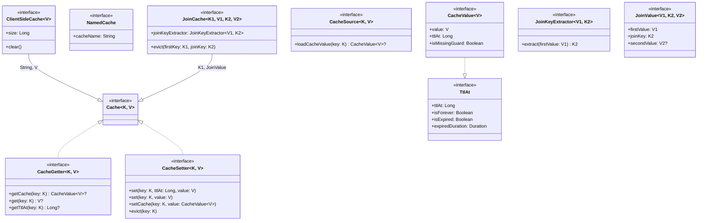
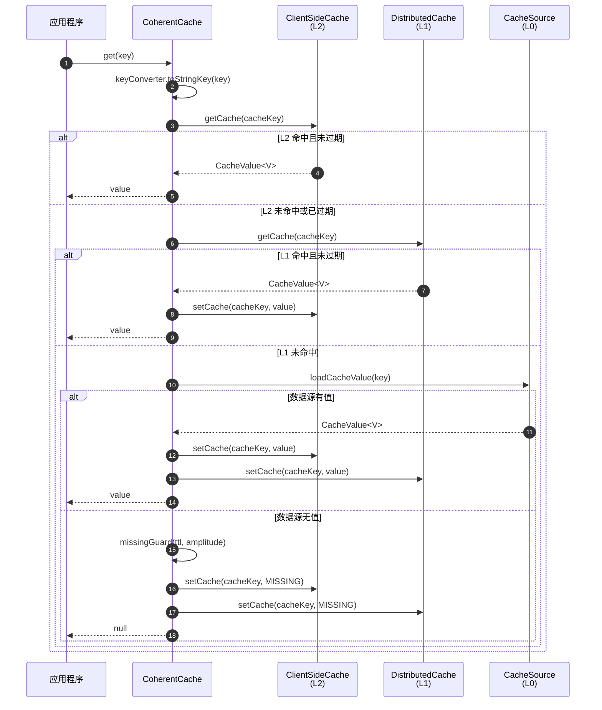
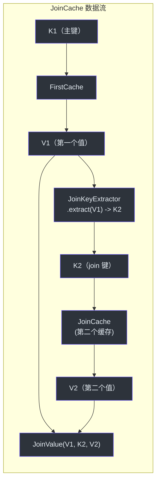
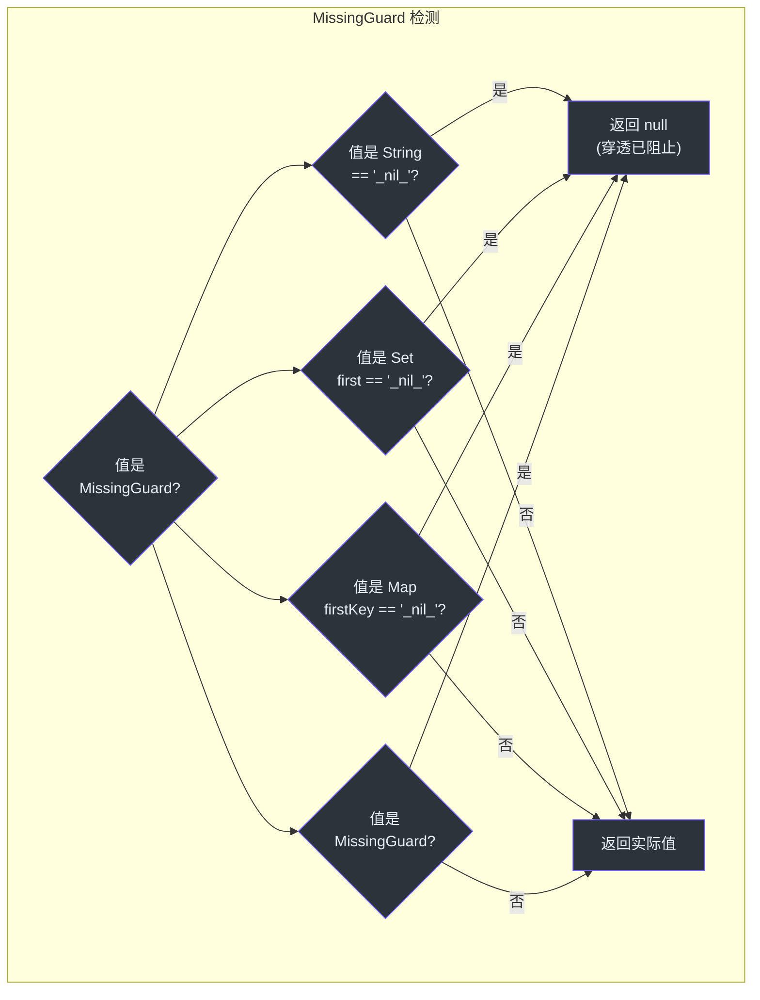

# cocache-api 模块

`cocache-api` 模块是 CoCache 的基础。它定义了下游模块实现的所有接口、数据契约和注解。由于没有实现依赖，任何项目都可以依赖 `cocache-api` 来基于 CoCache 契约编程，而无需引入 Guava、Caffeine、Redis 或 Spring。

## 接口层次结构



## 源文件

本模块包含恰好 **16 个源文件**，组织为 4 个包。

### 核心接口（6 个文件）

| 接口 | 文件 | 说明 |
|------|------|------|
| `Cache<K, V>` | [Cache.kt](https://github.com/Ahoo-Wang/CoCache/blob/main/cocache-api/src/main/kotlin/me/ahoo/cache/api/Cache.kt#L21) | 顶层缓存接口，组合了 `CacheGetter` 和 `CacheSetter`。所有缓存操作由此开始。 |
| `CacheGetter<K, V>` | [CacheGetter.kt](https://github.com/Ahoo-Wang/CoCache/blob/main/cocache-api/src/main/kotlin/me/ahoo/cache/api/CacheGetter.kt#L20) | 只读缓存操作：`getCache()` 返回带有 TTL 元数据的 `CacheValue`，`get()` 返回原始值，`getTtlAt()` 返回过期时间戳。 |
| `CacheSetter<K, V>` | [CacheSetter.kt](https://github.com/Ahoo-Wang/CoCache/blob/main/cocache-api/src/main/kotlin/me/ahoo/cache/api/CacheSetter.kt#L16) | 写入缓存操作：带/不带显式 TTL 的 `set()`、带预构建 `CacheValue` 的 `setCache()`，以及 `evict()`。 |
| `CacheValue<V>` | [CacheValue.kt](https://github.com/Ahoo-Wang/CoCache/blob/main/cocache-api/src/main/kotlin/me/ahoo/cache/api/CacheValue.kt#L20) | 包装缓存值及其 TTL 时间戳（`ttlAt`）和 `isMissingGuard` 标志，用于缓存穿透防护。继承 `TtlAt`。 |
| `TtlAt` | [TtlAt.kt](https://github.com/Ahoo-Wang/CoCache/blob/main/cocache-api/src/main/kotlin/me/ahoo/cache/api/TtlAt.kt#L22) | 存活时间契约：`ttlAt`（绝对纪元秒时间戳）、`isForever`、`isExpired`、`expiredDuration`。 |
| `NamedCache` | [NamedCache.kt](https://github.com/Ahoo-Wang/CoCache/blob/main/cocache-api/src/main/kotlin/me/ahoo/cache/api/NamedCache.kt#L20) | 提供 `cacheName: String`，用于在事件总线和监控中标识缓存。 |

### 客户端缓存（1 个文件）

| 接口 | 文件 | 说明 |
|------|------|------|
| `ClientSideCache<V>` | [ClientSideCache.kt](https://github.com/Ahoo-Wang/CoCache/blob/main/cocache-api/src/main/kotlin/me/ahoo/cache/api/client/ClientSideCache.kt#L22) | L2 本地内存缓存契约。继承 `Cache<String, V>`，增加 `size` 和 `clear()`。实现包括 Map、Guava 和 Caffeine。 |

### 缓存数据源（2 个文件）

| 接口 | 文件 | 说明 |
|------|------|------|
| `CacheSource<K, V>` | [CacheSource.kt](https://github.com/Ahoo-Wang/CoCache/blob/main/cocache-api/src/main/kotlin/me/ahoo/cache/api/source/CacheSource.kt#L24) | L0 数据源加载器。当 L2（客户端缓存）和 L1（分布式缓存）都未命中时调用。返回 `CacheValue` 以填充缓存。`loadCacheValue()` 在失败时抛出 `TimeoutException`。 |
| `NoOpCacheSource` | [NoOpCacheSource.kt](https://github.com/Ahoo-Wang/CoCache/blob/main/cocache-api/src/main/kotlin/me/ahoo/cache/api/source/NoOpCacheSource.kt#L22) | 单例 `object`，`loadCacheValue()` 始终返回 `null`。用作未配置缓存数据源时的默认值。可通过 `CacheSource.noOp()` 访问。 |

### JoinCache（3 个文件）

| 接口 | 文件 | 说明 |
|------|------|------|
| `JoinCache<K1, V1, K2, V2>` | [JoinCache.kt](https://github.com/Ahoo-Wang/CoCache/blob/main/cocache-api/src/main/kotlin/me/ahoo/cache/api/join/JoinCache.kt#L23) | 组合两个缓存值。继承 `Cache<K1, JoinValue<V1, K2, V2>>`。包含 `joinKeyExtractor` 用于从主值派生次级键，以及双键 `evict(firstKey, joinKey)`。 |
| `JoinKeyExtractor<V1, K2>` | [JoinKeyExtractor.kt](https://github.com/Ahoo-Wang/CoCache/blob/main/cocache-api/src/main/kotlin/me/ahoo/cache/api/join/JoinKeyExtractor.kt#L8) | 函数式接口（`fun interface`），从第一个值中提取 join/次级键。 |
| `JoinValue<V1, K2, V2>` | [JoinValue.kt](https://github.com/Ahoo-Wang/CoCache/blob/main/cocache-api/src/main/kotlin/me/ahoo/cache/api/join/JoinValue.kt#L16) | 结果类型，组合 `firstValue: V1`、`joinKey: K2` 和可选的 `secondValue: V2?`。 |

### 注解（4 个文件）

| 注解 | 文件 | 说明 |
|------|------|------|
| `@CoCache` | [CoCache.kt](https://github.com/Ahoo-Wang/CoCache/blob/main/cocache-api/src/main/kotlin/me/ahoo/cache/api/annotation/CoCache.kt#L29) | 标记缓存接口。参数：`name`（缓存名称，默认为接口简单名称）、`keyPrefix`、`keyExpression`（SpEL）、`ttl`（默认 `Long.MAX_VALUE` = 永不过期）、`ttlAmplitude`（默认 10 秒，用于抖动）。 |
| `@GuavaCache` | [GuavaCache.kt](https://github.com/Ahoo-Wang/CoCache/blob/main/cocache-api/src/main/kotlin/me/ahoo/cache/api/annotation/GuavaCache.kt#L28) | 配置 Guava 作为 L2 客户端缓存。参数：`initialCapacity`、`concurrencyLevel`、`maximumSize`、`expireUnit`、`expireAfterWrite`、`expireAfterAccess`。 |
| `@CaffeineCache` | [CaffeineCache.kt](https://github.com/Ahoo-Wang/CoCache/blob/main/cocache-api/src/main/kotlin/me/ahoo/cache/api/annotation/CaffeineCache.kt#L30) | 配置 Caffeine 作为 L2 客户端缓存。参数：`initialCapacity`、`maximumSize`、`expireUnit`、`expireAfterWrite`、`expireAfterAccess`。 |
| `@JoinCacheable` | [JoinCacheable.kt](https://github.com/Ahoo-Wang/CoCache/blob/main/cocache-api/src/main/kotlin/me/ahoo/cache/api/annotation/JoinCacheable.kt#L24) | 标记缓存接口为 JoinCache。参数：`name`、`firstCacheName`、`joinCacheName`、`joinKeyExpression`。 |

## CacheValue 数据流

以下图展示了 `CacheValue` 如何在系统中从数据源流向客户端：



## JoinCache 组合



## MissingGuard 机制

`MissingGuard` 模式防止缓存穿透（也称为缓存空值/nil 攻击）。当 `CacheSource` 对数据库中不存在的键返回 `null` 时，CoCache 会存储一个哨兵值（`"_nil_"`）。后续对同一键的查找会找到哨兵值并返回 `null`，而无需查询数据库。



哨兵检测逻辑位于 [MissingGuard](https://github.com/Ahoo-Wang/CoCache/blob/main/cocache-core/src/main/kotlin/me/ahoo/cache/MissingGuard.kt#L17) 伴生对象中，在 `String`、`Set`、`Map` 和实现 `MissingGuard` 标记接口的对象之间进行多态处理。

## 使用示例

```kotlin
// 1. 定义缓存接口
@CoCache(name = "userCache", keyPrefix = "user:", ttl = 3600, ttlAmplitude = 30)
@GuavaCache(maximumSize = 10000, expireAfterWrite = 600)
interface UserCache : Cache<String, User>

// 2. 在应用代码中使用
class UserService(private val userCache: UserCache) {
    fun getUser(userId: String): User? = userCache[userId]
    fun updateUser(userId: String, user: User) {
        userCache[userId] = user   // 设置 L2 + L1 + 发布事件
    }
    fun deleteUser(userId: String) {
        userCache.evict(userId)    // 驱逐 L2 + L1 + 发布事件
    }
}
```

## 相关页面

- [模块概览](./index.md) -- 依赖关系图和模块说明
- [cocache-core](./cocache-core.md) -- 所有 API 接口的默认实现
- [cocache-spring](./cocache-spring.md) -- Spring 集成和 `@EnableCoCache`
- [cocache-spring-boot-starter](./cocache-spring-boot-starter.md) -- 自动配置
