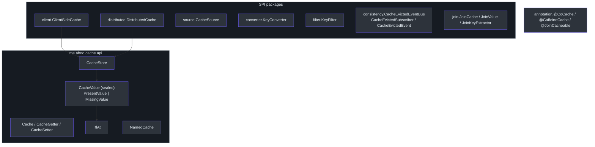
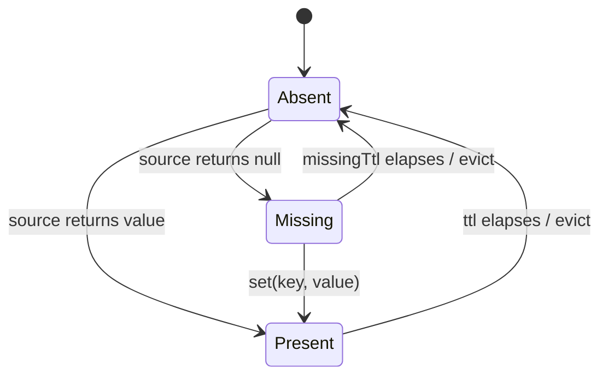
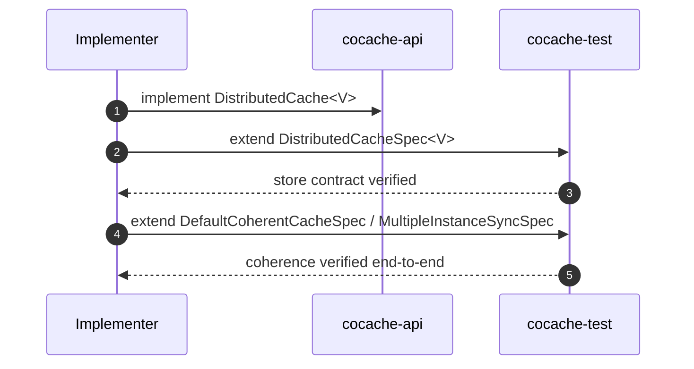

# cocache-api

`cocache-api` 定义了 CoCache 的全部契约：应用调用的 API，以及存储和通道实现需要提供的 SPI。除 Kotlin 标准库外没有运行时依赖。因此，新的 L1 存储或事件通道只需依赖本模块，再用 `cocache-test` 跑一遍 TCK 验证即可。

## 包结构

```mermaid
graph TB
    subgraph api ["me.ahoo.cache.api"]
        Cache["Cache / CacheGetter / CacheSetter"]
        CV["CacheValue (sealed)<br>PresentValue | MissingValue"]
        TtlAt["TtlAt"]
        Store["CacheStore"]
        Named["NamedCache"]
    end
    subgraph spi ["SPI packages"]
        Client["client.ClientSideCache"]
        Dist["distributed.DistributedCache"]
        Src["source.CacheSource"]
        Conv["converter.KeyConverter"]
        Filt["filter.KeyFilter"]
        Cons["consistency.CacheEvictedEventBus<br>CacheEvictedSubscriber / CacheEvictedEvent"]
        Join["join.JoinCache / JoinValue / JoinKeyExtractor"]
    end
    Ann["annotation.@CoCache / @CaffeineCache / @JoinCacheable"]

    Client --> Store
    Dist --> Store
    Store --> CV
    CV --> TtlAt

    style Cache fill:#2d333b,stroke:#6d5dfc,color:#e6edf3
    style CV fill:#2d333b,stroke:#6d5dfc,color:#e6edf3
    style TtlAt fill:#2d333b,stroke:#6d5dfc,color:#e6edf3
    style Store fill:#2d333b,stroke:#6d5dfc,color:#e6edf3
    style Named fill:#2d333b,stroke:#6d5dfc,color:#e6edf3
    style Client fill:#2d333b,stroke:#6d5dfc,color:#e6edf3
    style Dist fill:#2d333b,stroke:#6d5dfc,color:#e6edf3
    style Src fill:#2d333b,stroke:#6d5dfc,color:#e6edf3
    style Conv fill:#2d333b,stroke:#6d5dfc,color:#e6edf3
    style Filt fill:#2d333b,stroke:#6d5dfc,color:#e6edf3
    style Cons fill:#2d333b,stroke:#6d5dfc,color:#e6edf3
    style Join fill:#2d333b,stroke:#6d5dfc,color:#e6edf3
    style Ann fill:#2d333b,stroke:#6d5dfc,color:#e6edf3
    style api fill:#161b22,stroke:#8b949e,color:#e6edf3
    style spi fill:#161b22,stroke:#8b949e,color:#e6edf3
```

## 契约

| 类型 | 类别 | 契约 | 源码 |
|------|------|------|------|
| `Cache<K, V>` | API | `getCache`、`get`、`getTtlAt`、`setCache`、`set`、`evict` | [Cache.kt](https://github.com/Ahoo-Wang/CoCache/blob/main/cocache-api/src/main/kotlin/me/ahoo/cache/api/Cache.kt) |
| `CacheValue<V>` | 值 | 密封：`PresentValue(value, ttlAt)` / `MissingValue(ttlAt)`；`of(null, …)` 为负缓存 | [CacheValue.kt](https://github.com/Ahoo-Wang/CoCache/blob/main/cocache-api/src/main/kotlin/me/ahoo/cache/api/CacheValue.kt) |
| `TtlAt` | 值 | 绝对纪元秒到期时间、`FOREVER`、`at(ttl, amplitude)` | [TtlAt.kt](https://github.com/Ahoo-Wang/CoCache/blob/main/cocache-api/src/main/kotlin/me/ahoo/cache/api/TtlAt.kt) |
| `CacheStore<V>` | SPI | 按字符串 key 存取 `CacheValue` 的纯存储；无策略 | [CacheStore.kt](https://github.com/Ahoo-Wang/CoCache/blob/main/cocache-api/src/main/kotlin/me/ahoo/cache/api/CacheStore.kt) |
| `ClientSideCache<V>` | SPI | L2 存储 + `size`、`clear()` | [ClientSideCache.kt](https://github.com/Ahoo-Wang/CoCache/blob/main/cocache-api/src/main/kotlin/me/ahoo/cache/api/client/ClientSideCache.kt) |
| `DistributedCache<V>` | SPI | L1 存储 + `close()`；`getCache` 返回 `null` 表示未命中 | [DistributedCache.kt](https://github.com/Ahoo-Wang/CoCache/blob/main/cocache-api/src/main/kotlin/me/ahoo/cache/api/distributed/DistributedCache.kt) |
| `CacheSource<K, V>` | SPI | `loadCacheValue(key)`；`null` → 负缓存 | [CacheSource.kt](https://github.com/Ahoo-Wang/CoCache/blob/main/cocache-api/src/main/kotlin/me/ahoo/cache/api/source/CacheSource.kt) |
| `KeyConverter<K>` | SPI | 业务 key → 存储 key | [KeyConverter.kt](https://github.com/Ahoo-Wang/CoCache/blob/main/cocache-api/src/main/kotlin/me/ahoo/cache/api/converter/KeyConverter.kt) |
| `KeyFilter` | SPI | `notExist(key)` 直接短路为负结果 | [KeyFilter.kt](https://github.com/Ahoo-Wang/CoCache/blob/main/cocache-api/src/main/kotlin/me/ahoo/cache/api/filter/KeyFilter.kt) |
| `CacheEvictedEventBus` | SPI | `publish` / `register` / `unregister`；（重新）订阅时必须调用 `onReset` | [CacheEvictedEventBus.kt](https://github.com/Ahoo-Wang/CoCache/blob/main/cocache-api/src/main/kotlin/me/ahoo/cache/api/consistency/CacheEvictedEventBus.kt) |
| `CacheEvictedSubscriber` | SPI | `onEvicted(event)`、`onReset()` | [CacheEvictedSubscriber.kt](https://github.com/Ahoo-Wang/CoCache/blob/main/cocache-api/src/main/kotlin/me/ahoo/cache/api/consistency/CacheEvictedSubscriber.kt) |
| `JoinCache` / `JoinValue` / `JoinKeyExtractor` | API | 两个缓存的组合 | [join/](https://github.com/Ahoo-Wang/CoCache/tree/main/cocache-api/src/main/kotlin/me/ahoo/cache/api/join) |

## 负缓存

```mermaid
stateDiagram-v2
    [*] --> Absent
    Absent --> Present: source returns value
    Absent --> Missing: source returns null
    Missing --> Absent: missingTtl elapses / evict
    Present --> Absent: ttl elapses / evict
    Missing --> Present: set(key, value)
```

负缓存是显式类型，不会与业务数据冲突：`CacheValue.forever("_nil_").isMissing` 为 `false`。Redis 哨兵（默认 `_nil_`）只是 Redis codec 内部的线格式编码。

## 注解

| 注解 | 用途 | 源码 |
|------|------|------|
| `@CoCache` | `name`、`keyPrefix`、`keyExpression`、`ttl`（3600）、`ttlAmplitude`（60）、`missingTtl`（60） | [CoCache.kt](https://github.com/Ahoo-Wang/CoCache/blob/main/cocache-api/src/main/kotlin/me/ahoo/cache/api/annotation/CoCache.kt) |
| `@CaffeineCache` | L2 的 `maximumSize`（10000）、`initialCapacity`、`expireAfterAccess` | [CaffeineCache.kt](https://github.com/Ahoo-Wang/CoCache/blob/main/cocache-api/src/main/kotlin/me/ahoo/cache/api/annotation/CaffeineCache.kt) |
| `@JoinCacheable` | `firstCacheName`、`joinCacheName`、`joinKeyExpression` | [JoinCacheable.kt](https://github.com/Ahoo-Wang/CoCache/blob/main/cocache-api/src/main/kotlin/me/ahoo/cache/api/annotation/JoinCacheable.kt) |

## 实现 SPI

```mermaid
sequenceDiagram
autonumber
    participant Dev as Implementer
    participant API as cocache-api
    participant TCK as cocache-test
    Dev->>API: implement DistributedCache<V>
    Dev->>TCK: extend DistributedCacheSpec<V>
    TCK-->>Dev: store contract verified
    Dev->>TCK: extend DefaultCoherentCacheSpec / MultipleInstanceSyncSpec
    TCK-->>Dev: coherence verified end-to-end
```

## 相关页面

- [核心接口参考](../api/core-interfaces.md)
- [cocache-core](./cocache-core.md)
- [测试概览](../testing/index.md)
