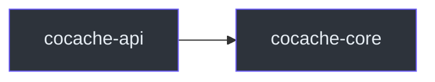

# cocache-core

`cocache-core` 是 CoCache 的核心实现模块，包含 `cocache-api` 中定义的所有接口的默认实现。

## 依赖关系



主要依赖：
- `cocache-api`
- Google Guava（用于 `GuavaClientSideCache`、`BloomKeyFilter`、`GuavaCacheEvictedEventBus`）
- Caffeine（用于 `CaffeineClientSideCache`）

## 包结构

```
me.ahoo.cache
├── ComputedCache.kt              # 计算缓存接口
├── DefaultCacheValue.kt          # CacheValue 默认实现
├── MissingGuard.kt               # 缺失守卫接口
├── KeyFilter.kt                  # 键过滤器接口
├── TtlConfiguration.kt           # TTL 配置接口
├── annotation/
│   ├── CoCacheMetadata.kt        # @CoCache 解析后的元数据
│   ├── CoCacheMetadataParser.kt  # 元数据解析器
│   ├── JoinCacheMetadata.kt      # @JoinCacheable 解析后的元数据
│   └── JoinCacheMetadataParser.kt
├── client/
│   ├── GuavaClientSideCache.kt   # Guava L2 实现
│   ├── CaffeineClientSideCache.kt # Caffeine L2 实现
│   ├── MapClientSideCache.kt     # Map L2 实现
│   └── ClientSideCacheFactory.kt # L2 工厂
├── consistency/
│   ├── CoherentCache.kt          # 一致性缓存接口
│   ├── DefaultCoherentCache.kt   # 一致性缓存默认实现
│   ├── CacheEvictedEvent.kt      # 缓存失效事件
│   ├── CacheEvictedEventBus.kt   # 事件总线接口
│   ├── GuavaCacheEvictedEventBus.kt # 进程内事件总线
│   └── NoOpCacheEvictedEventBus.kt
├── converter/
│   ├── KeyConverter.kt           # 键转换器接口
│   ├── ToStringKeyConverter.kt   # toString 实现
│   └── ExpKeyConverter.kt        # SpEL 实现
├── distributed/
│   ├── DistributedCache.kt       # L1 分布式缓存接口
│   └── mock/MockDistributedCache.kt
├── filter/
│   ├── BloomKeyFilter.kt         # 布隆过滤器实现
│   └── NoOpKeyFilter.kt          # 空操作实现
├── join/
│   ├── SimpleJoinCache.kt        # JoinCache 实现
│   └── proxy/
│       ├── JoinCacheInvocationHandler.kt
│       └── JoinCacheProxyFactory.kt
├── proxy/
│   ├── CoCacheProxy.kt           # 代理基类
│   ├── CoCacheInvocationHandler.kt # 调用处理器
│   ├── CacheProxyFactory.kt      # 代理工厂接口
│   └── DefaultCacheProxyFactory.kt
└── source/
    └── CacheSourceFactory.kt     # 数据源工厂
```

## 关键实现

### DefaultCoherentCache

二级一致性缓存的核心实现，管理 L2、L1、L0 的完整读写流程。

**核心职责：**
- L2 -> L1 -> L0 读取路径
- 逐键锁防止缓存击穿
- MissingGuard 防止缓存穿透
- 事件发布和订阅
- TTL 管理和抖动

**源码参考**：[`cocache-core/.../DefaultCoherentCache.kt`](https://github.com/Ahoo-Wang/CoCache/blob/main/cocache-core/src/main/kotlin/me/ahoo/cache/consistency/DefaultCoherentCache.kt)

### 代理机制

- `CoCacheInvocationHandler`：JDK 动态代理调用处理器
- `DefaultCacheProxyFactory`：创建 `CoherentCache` 和 JDK 动态代理
- `JoinCacheInvocationHandler`：JoinCache 代理调用处理器

**源码参考**：[`cocache-core/.../proxy/`](https://github.com/Ahoo-Wang/CoCache/tree/main/cocache-core/src/main/kotlin/me/ahoo/cache/proxy)

### 客户端缓存

| 实现 | 基础数据结构 | 特点 |
|------|------------|------|
| `GuavaClientSideCache` | `com.google.common.cache.Cache` | 成熟稳定 |
| `CaffeineClientSideCache` | `com.github.benmanes.caffeine.cache.Cache` | 高性能 |
| `MapClientSideCache` | `ConcurrentHashMap` | 轻量级 |

**源码参考**：[`cocache-core/.../client/`](https://github.com/Ahoo-Wang/CoCache/tree/main/cocache-core/src/main/kotlin/me/ahoo/cache/client)

### 事件总线

- `GuavaCacheEvictedEventBus`：基于 Guava `EventBus`，进程内事件分发
- `NoOpCacheEvictedEventBus`：空操作实现

**源码参考**：[`cocache-core/.../consistency/`](https://github.com/Ahoo-Wang/CoCache/tree/main/cocache-core/src/main/kotlin/me/ahoo/cache/consistency)

### KeyConverter

- `ToStringKeyConverter`：`keyPrefix + key.toString()`
- `ExpKeyConverter`：支持 SpEL 表达式

**源码参考**：[`cocache-core/.../converter/`](https://github.com/Ahoo-Wang/CoCache/tree/main/cocache-core/src/main/kotlin/me/ahoo/cache/converter)

## 相关页面

- [cocache-api](./cocache-api.md) - 接口定义模块
- [cocache-spring](./cocache-spring.md) - Spring 集成模块
- [架构概览](../architecture/index.md) - 系统架构
- [核心接口](../api/core-interfaces.md) - 接口详解
