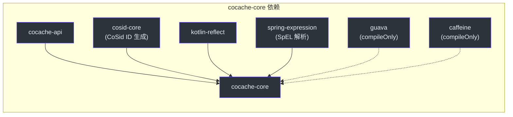
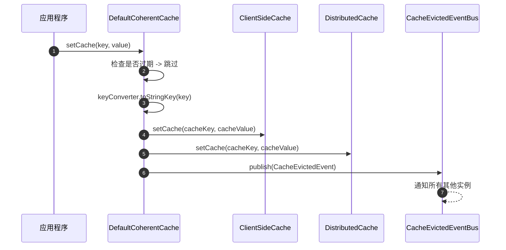
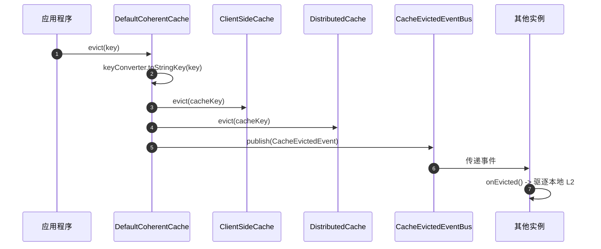
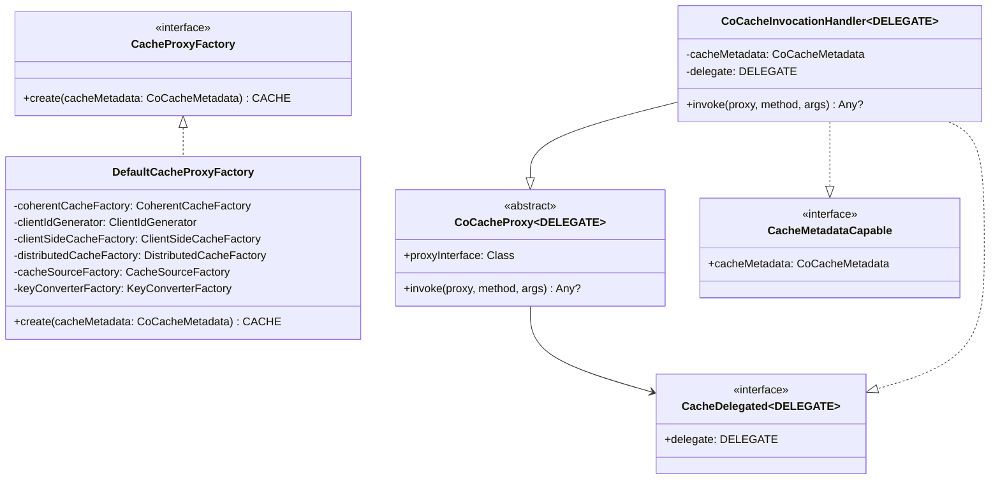
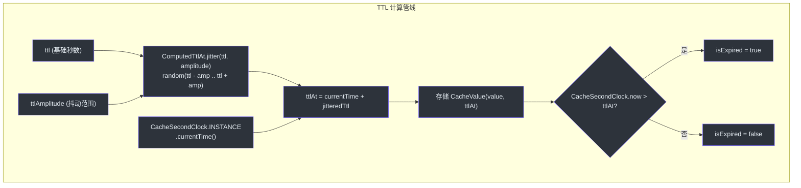
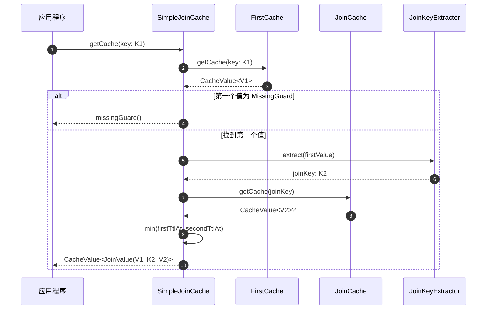

# cocache-core 模块

`cocache-core` 模块是 CoCache 的引擎。它包含 `cocache-api` 中定义的所有接口的默认实现，以及基于代理的缓存机制、带抖动的 TTL 计算、键过滤、JoinCache 系统和进程内事件总线。

## 模块依赖

## DefaultCoherentCache -- CoCache 的核心

[DefaultCoherentCache](https://github.com/Ahoo-Wang/CoCache/blob/main/cocache-core/src/main/kotlin/me/ahoo/cache/consistency/DefaultCoherentCache.kt#L30) 负责编排两级缓存策略。它持有客户端缓存（L2）、分布式缓存（L1）、缓存数据源（L0）、键过滤器、键转换器和事件总线的引用。

### 读取路径（getCache）

```mermaid
flowchart TB
    subgraph sg_38 ["DefaultCoherentCache.getCache(key)"]

        start["getCache(key)"]
        style start fill:#2d333b,stroke:#6d5dfc,color:#e6edf3

        convert["keyConverter.toStringKey(key)"]
        style convert fill:#2d333b,stroke:#6d5dfc,color:#e6edf3

        l2["检查 L2 (clientSideCache)"]
        style l2 fill:#2d333b,stroke:#6d5dfc,color:#e6edf3

        l2_hit{"L2 命中<br>且未过期?"}
        style l2_hit fill:#2d333b,stroke:#6d5dfc,color:#e6edf3

        l2_evict["驱逐已过期的 L2 条目"]
        style l2_evict fill:#2d333b,stroke:#6d5dfc,color:#e6edf3

        filter{"keyFilter.notExist(key)?"}
        style filter fill:#2d333b,stroke:#6d5dfc,color:#e6edf3

        missing["返回 missingGuard"]
        style missing fill:#2d333b,stroke:#6d5dfc,color:#e6edf3

        l1["检查 L1 (distributedCache)"]
        style l1 fill:#2d333b,stroke:#6d5dfc,color:#e6edf3

        l1_hit{"L1 命中<br>且未过期?"}
        style l1_hit fill:#2d333b,stroke:#6d5dfc,color:#e6edf3

        l1_populate["从 L1 填充 L2"]
        style l1_populate fill:#2d333b,stroke:#6d5dfc,color:#e6edf3

        lock["获取细粒度<br>锁 (cacheKey)"]
        style lock fill:#2d333b,stroke:#6d5dfc,color:#e6edf3

        recheck["重新检查 L2 + L1<br>(双重检查)"]
        style recheck fill:#2d333b,stroke:#6d5dfc,color:#e6edf3

        source["cacheSource.loadCacheValue(key)"]
        style source fill:#2d333b,stroke:#6d5dfc,color:#e6edf3

        source_hit{"数据源有值?"}
        style source_hit fill:#2d333b,stroke:#6d5dfc,color:#e6edf3

        set_both["设置 L2 + L1<br>发布 CacheEvictedEvent"]
        style set_both fill:#2d333b,stroke:#6d5dfc,color:#e6edf3

        set_missing["在 L2 + L1 中<br>设置缺失守卫"]
        style set_missing fill:#2d333b,stroke:#6d5dfc,color:#e6edf3

        release["释放锁"]
        style release fill:#2d333b,stroke:#6d5dfc,color:#e6edf3

        start --> convert --> l2 --> l2_hit
        l2_hit -->|是| start
        l2_hit -->|否| l2_evict --> filter
        filter -->|是| missing
        filter -->|否| l1 --> l1_hit
        l1_hit -->|是| l1_populate --> start
        l1_hit -->|否| lock --> recheck --> source --> source_hit
        source_hit -->|是| set_both --> release
        source_hit -->|否| set_missing --> release
    end

```

细粒度锁使用 `ConcurrentHashMap<String, Any>` 存储每个键的锁对象，以防止缓存击穿（cache breakdown）——多个线程请求同一个缺失的键时会在同一把锁上同步，因此只有一个线程会执行昂贵的 `loadCacheValue()` 调用。

### 写入路径（setCache）

### 驱逐路径

### 事件驱动一致性

当 `CacheEvictedEvent` 到达时，[DefaultCoherentCache.kt:159](https://github.com/Ahoo-Wang/CoCache/blob/main/cocache-core/src/main/kotlin/me/ahoo/cache/consistency/DefaultCoherentCache.kt#L159) 中的 `onEvicted()` 处理器会执行两项检查：

1. **缓存名称匹配**：忽略不同缓存的事件。
2. **自身发布检查**：忽略由同一 `clientId` 发布的事件，以避免重复驱逐。

只有匹配缓存名称的跨实例事件才会触发本地 L2 驱逐。

## CoherentCacheConfiguration

[CoherentCacheConfiguration](https://github.com/Ahoo-Wang/CoCache/blob/main/cocache-core/src/main/kotlin/me/ahoo/cache/consistency/CoherentCacheConfiguration.kt#L26) 是一个数据类，用于打包创建 `CoherentCache` 所需的所有组件：

| 字段 | 类型 | 默认值 | 用途 |
|------|------|--------|------|
| `cacheName` | `String` | （必填） | 缓存标识符，用于事件总线路由 |
| `clientId` | `String` | （必填） | 唯一客户端标识符，用于一致性过滤 |
| `keyConverter` | `KeyConverter<K>` | （必填） | 将类型化键转换为字符串缓存键 |
| `distributedCache` | `DistributedCache<V>` | （必填） | L1 共享缓存 |
| `clientSideCache` | `ClientSideCache<V>` | `MapClientSideCache()` | L2 本地缓存 |
| `cacheSource` | `CacheSource<K, V>` | `CacheSource.noOp()` | L0 数据源 |
| `keyFilter` | `KeyFilter` | `NoOpKeyFilter` | 布隆过滤器，用于键存在性检查 |

## 代理系统

CoCache 使用 JDK 动态代理从带有 `@CoCache` 注解的接口创建缓存实现。

### 代理创建流程

在 [DefaultCacheProxyFactory.create()](https://github.com/Ahoo-Wang/CoCache/blob/main/cocache-core/src/main/kotlin/me/ahoo/cache/proxy/DefaultCacheProxyFactory.kt#L40) 中：

1. 通过 `ClientIdGenerator` 生成唯一的 `clientId`。
2. 从工厂创建 `ClientSideCache`（L2）。
3. 从工厂创建 `DistributedCache`（L1）。
4. 从工厂创建 `CacheSource`（L0）。
5. 从工厂创建 `KeyConverter`。
6. 通过 `CoherentCacheFactory` 构建 `CoherentCache`，同时将其注册到事件总线。
7. 包装到 `CoCacheInvocationHandler` 中，并创建实现用户接口、`CoherentCache`、`CacheDelegated` 和 `CacheMetadataCapable` 的 JDK `Proxy`。

### 方法分发

[CoCacheProxy.invoke()](https://github.com/Ahoo-Wang/CoCache/blob/main/cocache-core/src/main/kotlin/me/ahoo/cache/proxy/CoCacheProxy.kt#L34) 处理两种情况：

- 代理接口上的**默认方法**：委托给 `InvocationHandler.invokeDefault()` 进行正确的默认方法解析。
- **所有其他方法**：通过 `method.invoke(delegate, *args)` 直接委托给 `CoherentCache` 实现。

## 客户端缓存实现

提供了三种 `ClientSideCache<V>` 的实现：

| 实现 | 文件 | 底层存储 | 关键特性 |
|------|------|----------|----------|
| `MapClientSideCache` | [MapClientSideCache.kt](https://github.com/Ahoo-Wang/CoCache/blob/main/cocache-core/src/main/kotlin/me/ahoo/cache/client/MapClientSideCache.kt#L24) | `ConcurrentHashMap` | 最简单的实现，无驱逐策略，`CoherentCacheConfiguration` 的默认值 |
| `GuavaClientSideCache` | [GuavaClientSideCache.kt](https://github.com/Ahoo-Wang/CoCache/blob/main/cocache-core/src/main/kotlin/me/ahoo/cache/client/GuavaClientSideCache.kt#L26) | Guava `Cache` | 支持 `maximumSize`、`expireAfterWrite`、`expireAfterAccess`、`initialCapacity`、`concurrencyLevel`。通过 `@GuavaCache.toClientSideCache()` 构建 |
| `CaffeineClientSideCache` | [CaffeineClientSideCache.kt](https://github.com/Ahoo-Wang/CoCache/blob/main/cocache-core/src/main/kotlin/me/ahoo/cache/client/CaffeineClientSideCache.kt#L27) | Caffeine `Cache` | 与 Guava 相同的特性，但不包含 `concurrencyLevel`。通过 `@CaffeineCache.toClientSideCache()` 构建 |

三种实现都实现了 `ComputedClientSideCache<V>`，该接口同时继承了 `ClientSideCache<V>` 和 `ComputedCache<String, V>`，提供读取时自动驱逐过期条目的能力。

## TTL 系统

TTL 系统提供带抖动的存活时间计算，以防止缓存雪崩（所有条目同时过期）。

### 关键 TTL 类

| 类 | 文件 | 用途 |
|----|------|------|
| `ComputedTtlAt` | [ComputedTtlAt.kt](https://github.com/Ahoo-Wang/CoCache/blob/main/cocache-core/src/main/kotlin/me/ahoo/cache/ComputedTtlAt.kt#L20) | 计算 `isExpired`、`isForever`、`expiredDuration`。使用 `CacheSecondClock` 获取当前时间。`jitter()` 函数在振幅范围内随机化 TTL。 |
| `TtlConfiguration` | [TtlConfiguration.kt](https://github.com/Ahoo-Wang/CoCache/blob/main/cocache-core/src/main/kotlin/me/ahoo/cache/TtlConfiguration.kt#L19) | 携带 `ttl` 和 `ttlAmplitude` 的接口。由 `CoCacheMetadata` 和 `CoherentCacheConfiguration` 实现。 |
| `CacheSecondClock` | [CacheSecondClock.kt](https://github.com/Ahoo-Wang/CoCache/blob/main/cocache-core/src/main/kotlin/me/ahoo/cache/util/CacheSecondClock.kt#L23) | 单例守护线程，每秒从 `SystemSecondClock` 更新 `lastTime`。避免重复调用 `System.currentTimeMillis()`。 |
| `DefaultCacheValue` | [DefaultCacheValue.kt](https://github.com/Ahoo-Wang/CoCache/blob/main/cocache-core/src/main/kotlin/me/ahoo/cache/DefaultCacheValue.kt#L31) | 默认的 `CacheValue` 实现。工厂方法：`forever()`、`ttlAt()`、`missingGuard()`。 |

## 键转换器系统

键转换器将类型化的缓存键转换为 L1/L2 缓存使用的字符串键。

| 类 | 文件 | 策略 |
|----|------|------|
| `KeyConverter<K>` | [KeyConverter.kt](https://github.com/Ahoo-Wang/CoCache/blob/main/cocache-core/src/main/kotlin/me/ahoo/cache/converter/KeyConverter.kt#L8) | `fun interface`，包含 `toStringKey(sourceKey: K): String` |
| `ToStringKeyConverter<K>` | [ToStringKeyConverter.kt](https://github.com/Ahoo-Wang/CoCache/blob/main/cocache-core/src/main/kotlin/me/ahoo/cache/converter/ToStringKeyConverter.kt#L20) | `keyPrefix + sourceKey.toString()`。未配置 `keyExpression` 时的默认转换器。 |
| `ExpKeyConverter<K>` | [ExpKeyConverter.kt](https://github.com/Ahoo-Wang/CoCache/blob/main/cocache-core/src/main/kotlin/me/ahoo/cache/converter/ExpKeyConverter.kt#L24) | 使用 SpEL 表达式：`keyPrefix + expression.getValue(sourceKey)`。用于从复合对象中进行复杂的键派生。 |

示例：一个 `keyPrefix = "user:"`、键类型为 `String` 的 `UserCache` 会生成类似 `"user:123"` 的缓存键。如果 `keyExpression = "#{id}"`、键类型为 `User`，则会对 `User` 对象求值 SpEL 表达式以提取 ID。

## 键过滤器（布隆过滤器）

`KeyFilter` 接口通过检查键是否曾经出现过来防止缓存穿透。

| 实现 | 文件 | 行为 |
|------|------|------|
| `NoOpKeyFilter` | [NoOpKeyFilter.kt](https://github.com/Ahoo-Wang/CoCache/blob/main/cocache-core/src/main/kotlin/me/ahoo/cache/filter/NoOpKeyFilter.kt#L22) | 始终返回 `false`（所有键都被视为可能有效）。默认值。 |
| `BloomKeyFilter` | [BloomKeyFilter.kt](https://github.com/Ahoo-Wang/CoCache/blob/main/cocache-core/src/main/kotlin/me/ahoo/cache/filter/BloomKeyFilter.kt#L23) | 封装 Guava `BloomFilter<String>`。当键确定不在过滤器中时返回 `true`，从而短路 L0 查询。 |

## JoinCache 系统

### SimpleJoinCache

[SimpleJoinCache](https://github.com/Ahoo-Wang/CoCache/blob/main/cocache-core/src/main/kotlin/me/ahoo/cache/join/SimpleJoinCache.kt#L31) 组合两个缓存：

### Join 键提取

| 类 | 文件 | 策略 |
|----|------|------|
| `JoinKeyExtractor<V1, K2>` | [JoinKeyExtractor.kt](https://github.com/Ahoo-Wang/CoCache/blob/main/cocache-api/src/main/kotlin/me/ahoo/cache/api/join/JoinKeyExtractor.kt#L8) | 来自 `cocache-api` 的函数式接口 |
| `ExpJoinKeyExtractor<V1>` | [ExpJoinKeyExtractor.kt](https://github.com/Ahoo-Wang/CoCache/blob/main/cocache-core/src/main/kotlin/me/ahoo/cache/join/ExpJoinKeyExtractor.kt#L21) | 使用 SpEL `#{...}` 模板表达式从第一个值中提取字符串 join 键 |

### JoinCache 代理

| 类 | 文件 | 用途 |
|----|------|------|
| `JoinCacheProxyFactory` | [JoinCacheProxyFactory.kt](https://github.com/Ahoo-Wang/CoCache/blob/main/cocache-core/src/main/kotlin/me/ahoo/cache/join/proxy/JoinCacheProxyFactory.kt) | 创建 JoinCache 代理的接口 |
| `DefaultJoinCacheProxyFactory` | [DefaultJoinCacheProxyFactory.kt](https://github.com/Ahoo-Wang/CoCache/blob/main/cocache-core/src/main/kotlin/me/ahoo/cache/join/proxy/DefaultJoinCacheProxyFactory.kt) | 通过将两个 CoherentCache 实例与 JoinKeyExtractor 连接来创建 JoinCache 代理 |
| `JoinCacheInvocationHandler` | [JoinCacheInvocationHandler.kt](https://github.com/Ahoo-Wang/CoCache/blob/main/cocache-core/src/main/kotlin/me/ahoo/cache/join/proxy/JoinCacheInvocationHandler.kt) | JoinCache 代理实例的 InvocationHandler |

## CacheEvictedEventBus

事件总线在实例间分发缓存失效信号。

| 实现 | 文件 | 作用域 |
|------|------|--------|
| `GuavaCacheEvictedEventBus` | [GuavaCacheEvictedEventBus.kt](https://github.com/Ahoo-Wang/CoCache/blob/main/cocache-core/src/main/kotlin/me/ahoo/cache/consistency/GuavaCacheEvictedEventBus.kt#L25) | 仅进程内。使用 Guava `EventBus` 配合 `@Subscribe`。适用于单实例部署。 |
| `NoOpCacheEvictedEventBus` | [NoOpCacheEvictedEventBus.kt](https://github.com/Ahoo-Wang/CoCache/blob/main/cocache-core/src/main/kotlin/me/ahoo/cache/consistency/NoOpCacheEvictedEventBus.kt#L20) | 空操作单例。所有方法均为空操作。 |
| `RedisCacheEvictedEventBus` | （在 cocache-spring-redis 中） | 通过 Redis Pub/Sub 实现跨实例通信。参见 [cocache-spring-redis](./cocache-spring-redis.md)。 |

## 工厂接口

所有工厂都遵循统一的模式：接受 `CoCacheMetadata`，返回组件实例。

| 工厂 | 文件 | 创建内容 |
|------|------|----------|
| `CacheProxyFactory` | [CacheProxyFactory.kt](https://github.com/Ahoo-Wang/CoCache/blob/main/cocache-core/src/main/kotlin/me/ahoo/cache/proxy/CacheProxyFactory.kt#L19) | 从 `CoCacheMetadata` 创建缓存代理实例 |
| `CoherentCacheFactory` | [CoherentCacheFactory.kt](https://github.com/Ahoo-Wang/CoCache/blob/main/cocache-core/src/main/kotlin/me/ahoo/cache/consistency/CoherentCacheFactory.kt#L16) | 从 `CoherentCacheConfiguration` 创建 `CoherentCache` |
| `ClientSideCacheFactory` | [ClientSideCacheFactory.kt](https://github.com/Ahoo-Wang/CoCache/blob/main/cocache-core/src/main/kotlin/me/ahoo/cache/client/ClientSideCacheFactory.kt#L19) | 从 `CoCacheMetadata` 创建 `ClientSideCache` |
| `DistributedCacheFactory` | [DistributedCacheFactory.kt](https://github.com/Ahoo-Wang/CoCache/blob/main/cocache-core/src/main/kotlin/me/ahoo/cache/distributed/DistributedCacheFactory.kt#L18) | 从 `CoCacheMetadata` 创建 `DistributedCache` |
| `CacheSourceFactory` | [CacheSourceFactory.kt](https://github.com/Ahoo-Wang/CoCache/blob/main/cocache-core/src/main/kotlin/me/ahoo/cache/source/CacheSourceFactory.kt#L19) | 从 `CoCacheMetadata` 创建 `CacheSource` |
| `KeyConverterFactory` | [KeyConverterFactory.kt](https://github.com/Ahoo-Wang/CoCache/blob/main/cocache-core/src/main/kotlin/me/ahoo/cache/converter/KeyConverterFactory.kt) | 从 `CoCacheMetadata` 创建 `KeyConverter` |
| `JoinKeyExtractorFactory` | [JoinKeyExtractorFactory.kt](https://github.com/Ahoo-Wang/CoCache/blob/main/cocache-core/src/main/kotlin/me/ahoo/cache/join/JoinKeyExtractorFactory.kt#L19) | 从 `JoinCacheMetadata` 创建 `JoinKeyExtractor` |

## ClientIdGenerator

唯一的客户端标识符对于事件驱动一致性至关重要——每个实例必须能够过滤掉自身的事件。

| 实现 | 文件 | 策略 |
|------|------|------|
| `UUIDClientIdGenerator` | [ClientIdGenerator.kt](https://github.com/Ahoo-Wang/CoCache/blob/main/cocache-core/src/main/kotlin/me/ahoo/cache/util/ClientIdGenerator.kt#L32) | 随机 UUID（无连字符） |
| `HostClientIdGenerator` | [ClientIdGenerator.kt](https://github.com/Ahoo-Wang/CoCache/blob/main/cocache-core/src/main/kotlin/me/ahoo/cache/util/ClientIdGenerator.kt#L38) | `counter:processId@hostAddress`（生产环境默认值） |

## CacheFactory

[CacheFactory](https://github.com/Ahoo-Wang/CoCache/blob/main/cocache-core/src/main/kotlin/me/ahoo/cache/CacheFactory.kt#L19) 是一个注册中心，用于按名称或类型查找缓存实例。`cocache-spring` 模块提供了 `SpringCacheFactory`，它委托给 Spring 的 `BeanFactory`。

## 元数据解析

| 类 | 文件 | 用途 |
|----|------|------|
| `CoCacheMetadata` | [CoCacheMetadata.kt](https://github.com/Ahoo-Wang/CoCache/blob/main/cocache-core/src/main/kotlin/me/ahoo/cache/annotation/CoCacheMetadata.kt#L20) | 从 `@CoCache` 注解解析的数据类 |
| `CoCacheMetadataParser` | [CoCacheMetadataParser.kt](https://github.com/Ahoo-Wang/CoCache/blob/main/cocache-core/src/main/kotlin/me/ahoo/cache/annotation/CoCacheMetadataParser.kt) | 从 KClass 解析 `@CoCache` |
| `JoinCacheMetadata` | [JoinCacheMetadata.kt](https://github.com/Ahoo-Wang/CoCache/blob/main/cocache-core/src/main/kotlin/me/ahoo/cache/annotation/JoinCacheMetadata.kt#L19) | 从 `@JoinCacheable` 注解解析的数据类 |
| `JoinCacheMetadataParser` | [JoinCacheMetadataParser.kt](https://github.com/Ahoo-Wang/CoCache/blob/main/cocache-core/src/main/kotlin/me/ahoo/cache/annotation/JoinCacheMetadataParser.kt) | 从 KClass 解析 `@JoinCacheable` |

## 相关页面

- [模块概览](./index.md) -- 依赖关系图和模块说明
- [cocache-api](./cocache-api.md) -- 接口和注解
- [cocache-spring](./cocache-spring.md) -- Spring 集成和工厂 Bean
- [cocache-spring-redis](./cocache-spring-redis.md) -- Redis 分布式缓存和事件总线
